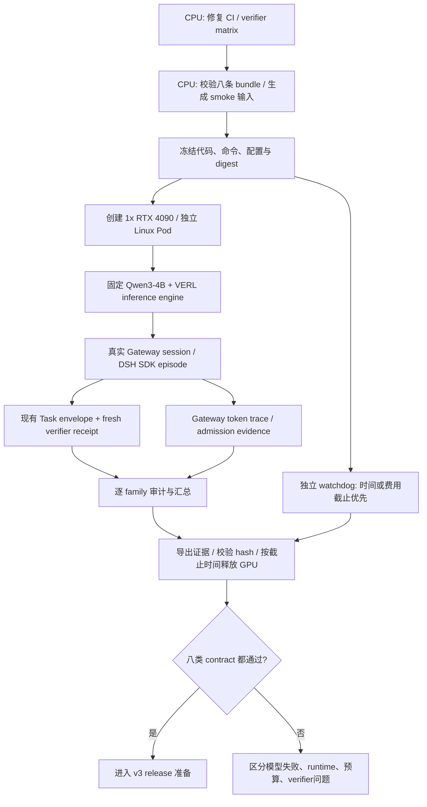

# 下一里程碑设计：CI 修复与八类真实 Gateway smoke

日期：2026-09-07（核查开始于 9 月 6 日晚）。状态：设计待用户确认；尚未修改实现、创建 worktree 或购买 GPU。
实现基线：`dsh-adapter / 00520c5`。全局目标仍由 [状态文档](project-status.md) 定义。

## 1. 目标和范围

M0 修复 Draft PR #1 的两个 CPU 兼容问题；M1 在固定 DSH / Qwen3-4B / VERL 下，
让八个 v3 family 各执行真实 episode，封存 envelope、SessionEvent trace、fresh
verifier receipt 和 Gateway token 关联。首次每类一次；失败保留证据并分类，
不自动重试到通过、不更改 verifier 换取成功。

M1 使用既有 `parallel_infer_verl.py` 推理路径，不执行 optimizer update。
通过后才准备 96 candidate、独立 32 holdout、24 demonstrations，以及后续校准、
训练预算和 GRPO/DAPO 对照。当前不把这些数据或 P5/P6 当作已完成。

## 2. 本次新增事实

| 核查 | 结果 | 影响 |
| --- | --- | --- |
| RunPod 控制面 | Pods、network volumes、serverless endpoints 均为 0；当前每小时支出 0 | 旧 Pod 已不能直接恢复；备份仍需另行核实 |
| CLI | 本机 2.12.0，与最新官方 release 一致 | 按本机 help 选择参数 |
| GPU 目录报价 | RTX 4090 24GB：Community $0.34/h、Secure $0.74/h；实际创建时重查，存储另计 | 准备完成后才创建单卡，无需大显存机型 |
| PR #1 Python 3.11 | 565 passed、1 skipped、3 failed | 三项失败均在 RLInsight test fixture |
| PR #1 pre-commit | Ruff import 分类失败；format/mypy/compileall 通过 | 本机 0.15.8 与 CI 0.12.2 对未声明 first-party 的分类不同 |
| PR #1 其他 | docs、secrets、metadata 通过；Python 3.12 cancelled | 不把 cancelled 记为通过 |
| 本机 SDK | 现有 macOS ARM64 runtime 已无模型初始化并关闭成功 | 只证明可启动，不是八类 smoke |
| 已有模型端点 | 模型列表可读；一次无副作用工具调用返回 `diagnostic_echo({text: ping})`，HTTP 200 | 端点可用，不等于 DSH/Gateway/token 路径已验证 |
| 历史 DSH pin / Linux runtime | 本机 Git 对象缺失，自有与官方 GitHub commit API 均返回 422；限定目录未找到 Linux 部署包 | 先恢复来源或明确冻结新 baseline，不能直接宣称按旧 pin 重建 |
| 停费机制 | CLI 与官方公开 API 未发现 Pod TTL；现有 teardown 只停进程 | 原设计的独立到期停费条件尚未满足，不创建 GPU |

head `55ed21f` 的 CI 已验证相同失败（Python 3.11 为 565/1/3；3.12 cancelled）。
详细来源、日志 hash、runtime 模式歧义及备份核查范围见
[审批前预检笔记](../../tasks/dsh-adapter/notes.md)。

最后一项探测使用现有 `gpt-5.6-luna-cpa` alias，消耗 363 input / 19 output tokens；
没有执行返回工具，不作为 Qwen3-4B、DSH 或模型能力证据。当前 key 可见模型列表
不包含旧记忆中的 GLM/MiniMax/Qwen alias，因此不据旧名称选择模型。

## 3. 路径选择

先在 CPU 修复 CI 并完成数据、命令和审计准备，再为 M1 短时创建单卡 RunPod。
复用现有 Gateway / Task / receipt / token capture，保留实际训练接口的信任边界。

CPU 直连 API 在技术上可行，但这次不新增该执行路径，原因来自代码核查：

- `DshAgent` 要求真实 session-scoped Gateway URL；`Task._task_result()` 要求
  真实 `gateway_session_id`。不能用伪造 ID 接普通 API。
- runner 只传递逐请求 `max_tokens`；直接使用 SDK 不继承 Gateway 的 token ledger。
  `max_turns` 与模型请求数不同；异步 notification 不能作为请求发出前的硬闸。
- 简单的 8 requests × 512 token 限制使部分既有 lifecycle/transfer 任务不可达。
- `sdk-minimal` 默认 `danger-full-access`；`fs-local.cwd` 不是隔离边界，
  Cordis `node:vm` 也不是 containment。临时本机目录不足以隔离模型生成代码。

为 CPU 直连另建预算 guard、receipt 适配与 OS 隔离会增加实现范围。
新 GPU Pod 本身提供独立 Linux 执行环境，并让模型请求留在该环境的本地 Gateway；
部署时不传入 GitHub、RunPod、现有模型代理的凭据，不挂载本机 home 或 Docker socket。

这个 Pod 边界隔离本机，不能自动隔离 Pod 内同 UID 的模型代码、verifier、fixture
和旧 episode 证据。现有 local Sandbox 与 `chmod 600` 不提供这种内部边界。
M1 每个 episode 使用全新任务目录，运行前后从控制端核对可信文件 digest，
发现 verifier/fixture 或历史证据异常立即停止并判为完整性失败。hash 检查只能发现
观测到的变化，不能证明没有发生过篡改；M1 不证明恶意候选 containment，P6 仍需
独立验证候选与 verifier/历史证据之间的权限隔离。

## 4. 架构

## 5. 文件变更计划

| 文件 | 变更 |
| --- | --- |
| `tests/uni_agent/test_rlinsight_adapter.py` | fixture 显式提供可选 trace API，保留 old-VERL 降级测试 |
| `pyproject.toml` | 将 `uni_agent` 加入 Ruff `known-first-party` |
| `tests/uni_agent/deployment/test_host_runtime.py` | 恢复 third-party / first-party import 分隔空行 |
| `examples/dsh/ops/run_v3_live_smoke.py`（新增） | 校验 bundle、准备八条推理输入/任务配置、生成受控命令、启动既有 CLI、收尾 manifest |
| `examples/dsh/ops/audit_v3_live_smoke.py`（新增） | 逐 family 校验结果、trace、receipt、运行身份和 digest，生成独立 smoke report |
| `tests/uni_agent/tasks/test_dsh_v3_live_smoke_ops.py`（新增） | 数据、启动、预算/超时、证据篡改与汇总判定测试 |
| `examples/dsh/ops/README.md` | CPU 准备、GPU 推理、审计、导出与停止入口 |
| `docs/<worktree>/`、`tasks/<worktree>/` | 审批后在隔离 worktree 内保存设计、计划、实际结果与 handoff |

优先复用现有 ops manifest / supervisor / audit 函数，不改变 DSH Agent 的 Gateway
要求，不重新实现 verifier 或 receipt。若现有 inference CLI 缺少必要 dump/admission
配置，则先给出具体最小差异及测试，再决定是否修改该文件。

## 6. CLI 与证据合同（拟新增，当前不可执行）

- `run_v3_live_smoke.py prepare --bundle-dir PATH --run-root NEW_PATH`：CPU-only；
  核对 manifest、八个唯一 family、scenario/fixture/verifier/patch digest；输出仅用于
  inference 的 8-row Parquet、固定 task config、无密钥命令和准备 manifest。
- `run_v3_live_smoke.py run --run-root PATH --model-path PATH --timeout-seconds N`：
  在 GPU 环境进行版本预检后调用既有 inference CLI；只跑 8 rows、每行 n=1、
  concurrency=1、一个 Gateway、单 GPU、TP=1、Hermes parser、require-reward-post。
- `audit_v3_live_smoke.py RUN_ROOT`：重新读取持久化证据，不能仅相信 CLI mean score。

根级 manifest 使用明确的 smoke schema；记录 code/runtime/model/tokenizer/verifier/
patch/scenario/config/data identity、命令、UTC 开始/结束、PID、退出码和 artifact digest。
每个 family 保存 `agent-result.json`、`session.jsonl`、`verifier-receipt.json`、
verifier output、Gateway trajectory 和受控日志。失败/timeout 也写最终状态并保留产物。
输入 bundle 的 blocked manifest 保持不可变，smoke report 通过 release ID 引用它。

汇总分开报告：

| 字段 | 判定 |
| --- | --- |
| `process_evidence_complete` | 八个真实 episode 的 envelope/trace/fresh receipt 可读取且 hash/identity 匹配 |
| `live_contract_passed` | 每个 family 均 finished、eligible、passed，且 rubric 所需观测来自真实事件 |
| `training_eligible` | M1 始终 false；还需正式 release、校准、累计训练预算等条件 |

八个 eligible/reward=0 不算 contract 通过；保留为策略失败，不降低 verifier 标准。
CLI 退出码拟定：0 表示全部 contract 通过；1 表示有效但未全通过；2 表示预检、
基础设施或证据完整性失败。任何状态都不代表 P5 capability uplift。

## 7. 预算、环境与 GPU 开启条件

GPU 创建前必须恢复可重建的 DSH 源与实际 Linux runtime，完成 M0、CPU matrix、八条输入/配置/hash 检查、命令 dry-run、
artifact 路径检查，以及可验证的计时停止/导出机制。它是一次新的 inference-only
G1 运行，需在本设计批准中明确允许；不沿用旧实验的环境 digest 或训练授权。

- 固定模型：`Qwen/Qwen3-4B`，revision `1cfa9a7208912126459214e8b04321603b3df60c`。
- VERL：`483b8a009ba3a97563edee3a19887e4862b8094a`。DSH 原 runbook 的
  `3b8fad1e32fd9d62acdfdb3ccbd8c8074c22d2ea` 目前不可取得；先恢复该来源，或明确
  冻结可重建的新 baseline 并单独验收，不默认用当前 HEAD 替代。Linux x64 CPU
  可以承担预构建；构建机尚未选定。原 runbook 实际设置 `DSH_RUNTIME_MODE=node`，
  因而须确认真实运行模式并校验 node closure 或 exe 的实际身份，不能只 hash 未执行的 exe。
- 单张 RTX 4090 24GB；优先比较可用 Community 报价，必要时 Secure。
  官方 `runpod-torch-v240` 是 Python 3.11 / Ubuntu 22.04 模板候选；host driver
  要求至少支持 CUDA 12.8，ML wheel 按既有兼容组合单独安装并实测，模板名称不等于预检通过。
- 初次 Pod 观察窗口最多 2 小时，拟议总费用上限 $2（含存储，创建前重新估算）；
  超额或报价不满足则不创建。代码、DSH 源与数据从本机无凭据打包传输。
- 每轮 512 tokens；沿用 live config 的 4096 与既有 Gateway 容量规则，准确记录
  prompt length、response length、max model length，不把配置名误写成实测总生成预算。
- 八条串行、n=1；episode 与整个批次有外部 wall-clock deadline，拒绝自动 refill。
  动态 schema 分链可能使单链容量不同于整 episode 总量；M1 必须记录请求/chain/usage，
  不能将其当作 DAPO 所需的累计预算实现。
- 正常结束时导出原始证据并验证 SHA-256，随后立即停止/删除本次 Pod；
  watchdog 截止时间优先于导出，传输卡住也必须停止 GPU。创建前预留磁盘保留与
  补导出的费用和明确截止时间，总支出仍在 $2 内；截止后删除本次资源，允许未导出
  证据丢失并据实将运行判为未完成，不能为保留证据突破预算。不建长期 network volume。
  模型配置/版本预检失败时立即结束，不继续花 GPU 时间调不相关问题。

当前 runpodctl 2.12.0 的 `pod create --help` 没有 skill 示例中的
`--terminate-after` / `--stop-after`，不得直接抄用。GPU 创建前验证独立的停止 watchdog；
如果无法保证时限，则保持未创建并报告，不把 workload timeout 冒充 GPU 停费。
官方存储/停止说明已通过 Context7 核对：停止保留 volume disk 且继续收存储费，
删除会丢失非 network-volume 数据。来源为 RunPod 官方 `pods/manage-pods.mdx`。
后续只读核查确认公开 API 也没有 Pod 到期字段，官方定时停止示例依赖客户端 sleep。
目前没有已验证的常驻可信控制器；原设计的独立停止条件尚未满足，不能开卡。

## 8. 测试计划

M0：在旧 VERL 下复现三项 fixture 失败；修复后四项 RLInsight 测试通过，
old-VERL 缺可选 API 的告警行为保持；分别用 Ruff 0.12.2 与本机版本验证三文件，
再跑全仓两项 Ruff 和 PR CI，不跳过失败用例或升级冻结 VERL。

M1：CPU 覆盖八 family 唯一性、bundle/fixture/config hash mismatch、拒绝已有 run root、
命令只进入 inference、n/concurrency/GPU 数约束、超时收尾、receipt freshness、
session replay、缺失 observation、eligible failure 不算 pass、完整 8/8 判定、
episode 目录重置和可信文件变动拒绝、导出卡住时仍按时停止及存储清理截止。
复用现有 24-case verifier matrix 和相关 DSH regression；新编排/审计分支 coverage ≥80%。
真实 GPU 执行前保存失败测试和通过测试证据；执行后按逐 family artifact 验收。

## 9. 工作区与确认要求

计划隔离目录：`.Codex/worktrees/dsh-v3-live-smoke`；从当前 `00520c5` 派生
`worktree-dsh-v3-live-smoke`。本会话没有 `EnterWorktree` / `ExitWorktree` 工具。
用户原规则禁止手工 `git worktree add`，因此需要明确允许这次等价的手工创建方式，
随后所有代码、测试及新里程碑文档都在该隔离目录内完成。

按用户提供的 AGENTS.md：

> Present the design to the user. Do NOT start implementation until explicit approval.

确认范围：批准 M0/M1；允许上述 worktree 替代方式；M0/CPU 预检通过后可进行
单卡、最多 2 小时、总费用不超过 $2 的 inference-only GPU smoke；不启动 optimizer。
每个 slice 独立 commit，按用户此前授权推送同名分支并记录 PR。
M0 验证后将其整合进 `dsh-adapter` 以刷新 PR #1；本任务不合并到 `main`。
