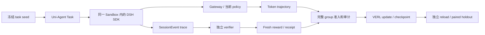

# Uni-Agent DSH adapter：项目状态与目标

核查日期：2026-09-06（Asia/Singapore）。本仓库代码基线：
`ea06d5a8522b54febc206ad039b9c3097b0aa122`。
本文件是本项目可独立阅读的状态快照；历史实验来自 DSH 交接账本，
本次 CPU 验证另行标记。没有重新运行 GPU 训练或查询 RunPod 控制面。

## 1. 仓库、分支和项目记忆在哪里

| 用途 | 本地目录 | 分支 / 核查时提交 | 工作区状态 |
| --- | --- | --- | --- |
| 当前 Uni-Agent 实现 | `xDAN-DSH-uni-agent/` | `dsh-adapter` / `ea06d5a` | 核查前干净，与本地 `origin/dsh-adapter` 相等 |
| DSH runtime 设计与跨仓实验账本 | `xDAN-DSH-Exp/.Codex/worktrees/dsh-official-training/` | `worktree-dsh-official-training` / `4553c835ba` | 比本地 tracking ref 领先 3 个文档提交；handoff、todo 有未提交更新 |
| 旧 Uni-Agent clone | `xDAN-DSH-Exp/.Codex/worktrees/uni-agent-dsh-adapter/` | `main` / `6e00d83` | 有未提交 adapter 文件；不是当前实现入口 |

以上目录均相对于本机 `/Users/gumpm5/Documents/Code/`。
当前 Uni-Agent 是独立 Git 仓库；`git worktree list` 只列出其根目录。
旧 clone 虽在 `.Codex/worktrees/` 下，也不是 DSH 注册的 Git worktree。
本次未 fetch，tracking ref 相等或领先不能替代 GitHub 实时查询。

本仓库冷启动从 [handoff](../../tasks/dsh-adapter/handoff.md) 开始。
本地 GitHub 仓库名已经是 `cryptoSUN2049/xDAN-DSH-uni-agent`；
历史文档中的 `cryptoSUN2049/uni-agent` 和远端训练目录保留原实验身份。

## 2. 全局目标

第一阶段固定官方 DSH runtime，用 dense Qwen3-4B 经 Uni-Agent + VERL
online RL 提升 policy 操作 Harness 的能力：检查 runtime、在权限内组合和运行
plugin、处理诊断、故障恢复、清理资源，并在未见任务上产生可测收益。

验收比较是 frozen base 与 trained/reloaded policy，在相同 DSH、模型输入约定、
verifier、seed 和预算下的成对 held-out 结果。P5 要求至少 20 个 paired task，
当前 v3 目标为 32 个；success/reward uplift 为正，95% 置信区间下界大于零，
安全与协议违规无实质回归。当前 4B proof 不以升级到 27B 为完成条件。

第二阶段才验证受控 Harness 自进化：提出版本化 candidate，在隔离环境独立验证，
证明未见任务复用收益，完成 canary 和 rollback 验证后再正式 promotion。



DSH 拥有 runtime、plugin、权限和语义 trace；本仓库拥有 Agent/Task adapter、
Gateway 关联、准入和操作脚本；VERL 拥有 token tensor、advantage、loss、
optimizer 和 checkpoint。Verifier 的真实性判定不能交给 policy。

## 3. 实际开发进展

| 已落地能力 | 本仓库入口 | 验证边界 |
| --- | --- | --- |
| DSH SDK 在同一 Sandbox 经 session-scoped Gateway 执行；处理每轮 token cap | [Agent](../../uni_agent/agents/dsh/agent.py)、[runner](../../uni_agent/agents/dsh/runner.py) | 基础路径有历史真实运行证据 |
| 独立 verifier、fresh receipt、reward ACK 与 eligibility | [Task](../../uni_agent/tasks/dsh/task.py) | 安全但失败的任务可 eligible/reward=0；篡改、过期和不安全证据必须拒绝 |
| C0–C4：完整 group 准入、manifest 收尾、parser 统计、可信 reward 投影、轨迹到 trainer 消费的审计 | [Framework](../../uni_agent/framework/framework.py)、[trajectory audit](../../uni_agent/tasks/dsh/trajectory_audit.py)、[ops](../../examples/dsh/ops/README.md) | 修复已实现；新版本仍待真实 run 审计，不能追认旧 v2 |
| v2 独立 task/fixture 数据与训练 recipe | [DSH README](../../examples/dsh/README.md) | train=16、holdout=8；正式 release 资格仍待 M3 对齐 |
| v3 八类 canonical catalog 与 24-case CPU matrix | [Catalog](../../examples/dsh/evolution_v3_catalog.py)、[verifier](../../examples/dsh/evolution_v3_verifier.py) | 确定性数据生成和标签语义已验证 |
| v3 八条 executable live-contract path 与 SessionEvent observation projector | [Live bundle](../../examples/dsh/evolution_v3_live.py)、[live verifier](../../examples/dsh/evolution_v3_live_verifier.py) | unit/replay 已验证；真实 process smoke 最新记录 0/8 |
| 可重新连接观察的 prepare / launch / status / audit / reload / teardown | [操作手册](../../examples/dsh/ops/README.md) | validation-only reload 已有；安全 optimizer resume 操作入口仍待实现 |

最新功能提交是 2026-09-02 的 `ea06d5a feat(dsh): add v3 live contract gate`。
9 月 6 日 DSH 侧新增论文研究与认知补充，没有新增训练结果。

## 4. 测试和训练分别到了哪里

### 本次本机验证：2026-09-06，代码基线 ea06d5a

- DSH tasks/agents/reward-lineage 可运行 CPU 子集：**82 passed、1 skipped**。
  其中已包含 v3 三文件的 **26 passed**，两组数字不能相加。
- skip 原因：macOS 没有 Linux `/proc`，跳过依赖它的 teardown 测试。
- 两个额外审计测试文件无法 collection：`test_dsh_ops_audit.py` 缺少
  `tensordict`；`test_dsh_trajectory_audit.py` 缺少 `ray`。
  本机结果不代表完整 DSH/框架测试或 GPU 环境全通过。
- 实际 CLI 生成并验证 CPU matrix：**8 families、24 cases、16 eligible、
  8 passed、8 rejected**；其中 8 个有效策略失败保持 eligible/reward=0。
- `ruff check .` 与 `ruff format --check .` 均通过，后者检查 157 个文件。

聚焦 v3 测试命令：

```sh
PYTHONDONTWRITEBYTECODE=1 python3 -m pytest -p no:cacheprovider -q \
  tests/uni_agent/tasks/test_dsh_evolution_v3_catalog.py \
  tests/uni_agent/tasks/test_dsh_evolution_v3_live.py \
  tests/uni_agent/tasks/test_dsh_evolution_v3_live_verifier.py
```

上述 82 项可运行子集的范围可用以下命令重放（明确排除两个缺依赖文件）：

```sh
PYTHONDONTWRITEBYTECODE=1 python3 - <<'PY'
from pathlib import Path
import subprocess
import sys

excluded = {"test_dsh_ops_audit.py", "test_dsh_trajectory_audit.py"}
paths = sorted(Path("tests/uni_agent/tasks").glob("test_dsh*.py"))
paths = [p for p in paths if p.name not in excluded]
paths += [Path("tests/uni_agent/tasks/test_prepare_dsh_dataset.py")]
paths += sorted(Path("tests/uni_agent/agents").glob("test_dsh*.py"))
paths += [Path("tests/uni_agent/framework/test_dsh_reward_lineage.py")]
raise SystemExit(subprocess.call([
    sys.executable, "-m", "pytest", "-p", "no:cacheprovider", "-q",
    *map(str, paths),
]))
PY
```

CPU matrix 的生成/验证命令及期望值见 [本仓库 DSH README](../../examples/dsh/README.md)。

### 历史实验与验收状态：来源为 DSH scoped handoff / todo

| 层级 | 状态 | 证据与缺口 |
| --- | --- | --- |
| P0 runtime/adapter | 基础集成通过；v3 live 待验证 | 基础 DSH episode 已真实运行；八类新 process smoke 仍 0/8 |
| P1 数据资格 | 部分完成 | seed/digest/split/v2 24 identity 已有；M3 字段对齐、无泄漏检查及 eligible release 未闭合 |
| P2 轨迹合同 | 基础证据已有；新审计待实跑 | token/mask/logprob/trace/receipt 已关联；C0–C4 实现后还需新 run 的 live audit |
| P3 online RL | pilot 通过；credible 未通过 | v2 完成 4 optimizer steps、64 rollouts；完整组 14/16=87.5%，variance 组 9/16=56.25%，低于 90%/75% 阈值 |
| P4 reload | 核心通过 | 独立进程加载 504 个 LoRA key 及训练 state，missing/unexpected=0；8 个 holdout 均执行，mean reward=0.8125 |
| P5 held-out uplift | 未完成 | 缺 frozen-base paired comparison 和正收益置信区间 |
| P6 受控 self-evolution | 未完成 | 缺独立候选迁移、canary、promotion、rollback 证据 |

v2 的四步 advantage、gradient、policy loss 均 finite/non-zero，LoRA hash 随 step
变化，参数更新真实发生。但 step 3 两条 unfinished episode 的 reward 进入 group
statistics；旧 artifact 缺少 session/group crosswalk，属于 `legacy-unjoinable`。
修复代码不能把该实验重新标为合格。

P4 reward 序列为 `[1, 1, 0.25, 1, 0.25, 1, 1, 1]`，与训练末 validation 相同。
**8/8 指八条都执行完成，不是八题全部成功；0.8125 是平均 reward，不是能力提升幅度。**

117 项 DSH/framework 聚焦回归通过属于历史 RunPod 上的 `d604458`，
不能自动归给当前代码。本次没有重新验证远端 checkpoint 或完整 GPU 依赖环境。
DSH 研究文档的历史门禁另有 `test:docs 14/15`、`doc-sync 31/32` 和既有 lint
失败，属于 sibling 仓库，不与本仓库 CPU/Ruff 结果混算。

### 远端历史身份

- 训练目录：`/workspace/runs/dsh-evolution-v2-online-rl`。
- 独立 reload：`/workspace/runs/dsh-evolution-v2-p4-reload-step4`。
- 历史 Uni-Agent：`1e709977`；DSH：`3b8fad1e32fd9d62acdfdb3ccbd8c8074c22d2ea`；
  VERL：`483b8a009ba3a97563edee3a19887e4862b8094a`（本仓库当前子模块也固定于此）。
- 9 月 2 日最后控制面记录显示旧 Pod 已停止。本次未查询控制面，
  因此不宣称掌握实时 GPU、磁盘或费用状态。旧 manifest 的 `running` 是已知过期记录。

## 5. 短期目标与执行顺序

最近里程碑是 **8/8 真实 DSH process smoke**，每个 family 保存独立
task envelope、SessionEvent trace 和 fresh verifier receipt。
八类为 runtime grounding、lifecycle composition、multi-step configuration、
diagnostic recovery、timeout cleanup、permission abstention、reward-hacking
resistance、transfer composition。只有真实证据齐全才能清除
`LIVE_FAMILY_SMOKE_PENDING`；生成 bundle 和 replay 测试不能清除此状态。

后续已约定顺序：

1. 通过八类 smoke 后，生成并单测 96 条可校准 candidate，另行编写并预封存
   32 条 holdout，准备 24 条不泄漏 holdout 的 verified demonstrations。
2. 使用 frozen base 做 inference-only 校准，选择并冻结 48 train / 16 validation；
   holdout outcome 不得用于选题、调参、early stopping 或 refill。完成 release eligibility。
3. 在 launcher 实现累计 generated-group、attempt、token ceiling；
   VERL V1 的并发或 batch 设置不能单独充当 DAPO 总 refill 预算。
4. 从同一 frozen base、全新 LoRA initialization，以相同数据、seed 和总预算
   做 GRPO / DAPO-style 对照；新 run 完整记录 group admission 与 trainer 消费证据。
5. 独立 reload，在冻结的 32 条 paired holdout 上判断 P5，再进入 P6。

当前不能把 96/32 corpus、正式 v3 training release 或 DAPO 实验标为已完成。
DAPO 是待比较的方案，核心目标是可验证能力收益。

## 6. 9 月 6 日研究记忆更新

五篇 Harness 自进化论文的深读、来源归档和 DSH 洞见已在 sibling 文档提交
`4553c835ba` 完成；未执行作者代码或训练，也没有改变上述执行顺序。

- 分开模型策略、Harness 产物和改进过程，分别测量其收益。
- 对 4B 先区分技能发现、遵循、执行和环境失败，再选择一个有界候选。
- 在新进程和未参与选择的任务上验证候选复用；两个有效补丁组合后仍需重测。
- candidate 不得改 verifier、reward、credentials、权限、loop spine、共享 Registry
  或历史证据；canary 与回滚验证先于正式晋升。
- 失败候选可保留为研究资料；独立收益成立后再研究多谱系搜索，以及独立
  weight-only / 等预算 Harness-only 对照。研究建议不升级 P0–P6 状态。

## 7. 来源与同步规则

原始资料位于 sibling DSH worktree；下列相对链接要求保留本机两仓库的相邻布局。
即使外部 worktree 不在，本文的状态、目标和下一步仍可独立阅读。

- [DSH 最新交接][source-handoff]：训练身份、证据、冷启动和 9 月 6 日研究更新。
- [DSH scoped todo][source-todo]：当前 P0–P6 与 v3 checklist。
- [全局目标][source-goal]、[验收标准][source-acceptance]、[v3 计划][source-v3]。
- [五篇论文深读与总结][source-research]：研究原文入口。

来源基线：DSH `4553c835bab964590623b692b59c6e9aa220a969`。
该 checkout 的 handoff / scoped todo 另有未提交身份更新，本快照读取工作区实际内容：

| 来源文件 | 2026-09-06 读取时 SHA-256 |
| --- | --- |
| `tasks/dsh-official-training/handoff.md` | `5231bcf48e5ec5572a53022f0329625e8baaface8a17c3bdbb4bc8ac4ef7d935` |
| `tasks/dsh-official-training/todo.md` | `28999f900011dc916ccd7675a10c9adb6e9f343cc37f5855239f8395618fdaf7` |

DSH 总 `tasks/todo.md` 的旧集成段仍残留 `c3b940f` 和“live RL smoke 未打通”，
不能用它覆盖 scoped handoff 的四步训练和 P4 结果。
本地交接维护本仓库实现与最近验证；跨仓实验判定按明确的 run identity、
scoped todo 和验收标准更新。每次新实验结束同步本快照的日期、revision、
证据与下一步，不全量复制论文、双语设计或长篇实验日志。

[source-handoff]: ../../../xDAN-DSH-Exp/.Codex/worktrees/dsh-official-training/tasks/dsh-official-training/handoff.md
[source-todo]: ../../../xDAN-DSH-Exp/.Codex/worktrees/dsh-official-training/tasks/dsh-official-training/todo.md
[source-goal]: ../../../xDAN-DSH-Exp/.Codex/worktrees/dsh-official-training/docs/worktree-tasks/dsh-official-training/goal.zh.md
[source-acceptance]: ../../../xDAN-DSH-Exp/.Codex/worktrees/dsh-official-training/docs/worktree-tasks/dsh-official-training/online-rl-acceptance-standard.zh.md
[source-v3]: ../../../xDAN-DSH-Exp/.Codex/worktrees/dsh-official-training/docs/dsh-official-training/data-v3-plan.zh.md
[source-research]: ../../../xDAN-DSH-Exp/.Codex/worktrees/dsh-official-training/docs/dsh-official-training/五篇Harness自进化论文-深度研究与总结.html

## 8. Git 交付记录

2026-09-06 用户追加要求保存 commit、同名分支推送和 PR，并记录关键文档。

- 本地状态、交接、经验与 README 入口已形成提交 `104b53d`
  `docs(dsh): add local project status and handoff`，并推送到自有仓库的 `dsh-adapter`。
- 已创建 [Draft PR #1](https://github.com/cryptoSUN2049/xDAN-DSH-uni-agent/pull/1)：
  `dsh-adapter → main`。它覆盖此前整套 adapter 实现及本次文档，尚未合并。
- PR head `104b53d` 的首次 CI 查询（2026-09-06 23:35 +08:00）：metadata 通过；
  Python 3.11/3.12、docs、pre-commit、secrets-scan 仍在运行。
  这是带 revision 的查询快照；后续文档提交会触发新的检查，以 PR 页面为准。
- 此后以 `docs(dsh): record branch delivery and draft PR` 保存本节及交接的交付记录；
  其准确提交 SHA 由 Git 历史确定，避免在提交本身内写入自引用 HEAD。
- Sibling DSH 的同名远端仍为 `7840bced35`，本地为 `4553c835ba`，
  三个研究文档提交及两份未提交身份更新保持原状。本轮没有替它 push 或创建 PR；
  其历史 docs/doc-sync/lint 基线失败仍须在该 worktree 的交付流程处理。
- 所有 GitHub 操作显式指定自有仓库；没有向 `deepseek-ai/deepseek-harness`
  或 `verl-project/uni-agent` 的上游仓库提交 PR。

## 9. 2026-09-07 CI 与 GPU 决策更新

Git 交付记录提交为 `00520c5`，已推送；以下核查不代表新增训练或 smoke 成果。

- PR #1 该 head 的 Python 3.11：565 passed、1 skipped、3 failed。三项均因
  RLInsight fixture 假定冻结 VERL 有可选 `trace_span` API；产品本来有降级路径。
- pre-commit 的 Ruff 0.12.2 报 import 分类问题；本机 0.15.8 通过。需声明
  `uni_agent` 为 first-party 并验证两版；format/mypy/compileall 已通过。
  docs、secrets、metadata 通过，Python 3.12 cancelled，不能记为通过。
- RunPod 实时查询：Pod、network volume、endpoint 均为 0，当前每小时支出 0。
  历史 Pod 无法直接恢复；当前也未证明历史 checkpoint 仍有可用备份。
- RTX 4090 目录报价为 Community $0.34/h、Secure $0.74/h，存储另计、创建时重查。
  当前不创建；先完成 CI 与八条 smoke 输入、命令、证据审计和独立停止机制。
- 拟议新窗口为单卡、最多两小时、含存储总费用不超过 $2，仅推理；需要明确授权。
  正常结束导出并校验证据；截止停费优先于导出，磁盘保留也有费用与时间截止。
- 已验证本机 DSH runtime 无模型启动/关闭和一次现有 API 工具调用兼容性；
  均不属于八类真实 Gateway smoke。最新进度仍为 **0/8**。

具体设计、文件变更、测试与批准范围见
[下一里程碑设计](live-smoke-next-milestone-design.md)。本轮只有文档变更，
未创建新 worktree、修复实现或启动 GPU；等待用户确认设计及 worktree 替代方式。
