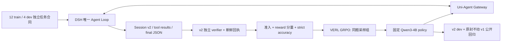

# Context online RL v2：工程证据课程与分解奖励

状态：2026-09-09 独立设计审查，尚未实现或启动 GPU。保留当前部署锁；不修改 v1 四题、v1 verifier 或已有失败证据；本任务不做 SFT。

## 目标与范围

把“读取允许的工程资料→判断权威来源→正确回答或弃答→给出精确证据”变成可审计的 online RL 任务。DSH 是唯一执行循环，Uni-Agent Gateway 捕获本次 student token，VERL 用本策略采样及新鲜奖励更新。训练输入是任务和环境，不提供教师答案或教师轨迹。

当前源码 `examples/dsh/capabilities/context_verifier.py` 的 reward 与 accuracy 均为严格二值：安全完成、所有源确实读取、最终 JSON 与全部精确引用一致才得 1。真实 v1 r2 四题完成但全 0，主要为引用身份/缺失问题。不能由此证明模型没有任何取证能力，也不能假设换成分解奖励一定产生方差。

此课程仍只测 file-evidence 能力。它不证明实际 context window 切换、ContextPilot 压缩保真、会话 A 写入→B 检索，或 RSI。那些任务保持独立合同、身份和验收。

## 最小任务合同

- 新 schema `dsh.context-file-evidence.v2`、新 task/verifier version `2`；独立 verifier ID，例如 `dsh-context-file-evidence-v2`。禁止用 v1 ID 配新评分代码。
- 固定 fixture 字节摘要、source 相对 ID 与摘要、task ID、split、结构类型、目标 project/component/key、权威规则、需要读取的来源、必要引用 `(source,line,quote)`；同时固定 verifier 完整导入闭包摘要和 SDK/runtime/策略版本。
- 模型可见全部允许 source ID、绝对 view 路径、适用范围、权威规则及 JSON 协议。不要把隐藏 oracle 的答案塞进 prompt。源目录与 verifier 合同分开；源读权限沿用明确 allowlist。
- 保持简单文本，每份文件使用明确字段行：`project=...`、`component=...`、`state=active|superseded`、`version=major.minor.patch`、目标字段。字段位置可变，加入无关字段；禁止同一文档重复关键字段。无需引入四种文件解析器。
- 规则只使用少量可组合原语：指定来源、匹配 project/component、排除 superseded、按三元整数版本比较、选定权威文档缺字段则弃答。版本优先不是文件名、日期、字典序或最大数字值优先；无明确 fallback 规则时不得取旧值。
- 每题由确定性 oracle 从源内容和公开规则重新推导结果，并校验准备器产生的 expected。规则歧义/同优先级冲突为坏 fixture，准备时拒绝，不让学生背锅。
- 最终协议沿用 `{status,value,citations}`。解析拒绝重复 JSON key、非对象、额外顶层字段、错误类型及非法 status/value 组合。引用允许部分列表，以便训练部分分；每项字段必须恰为 source/line/quote，line 必须正整数且不能是 bool。

## 12 train / 4 dev 结构清单

这是第一批工程课程，不是统计充分的数据集。各行是不同规则组合、信息组织或证据义务，绝不只是改数字或路径。

| ID | 结构 | 工程问题与证据要求 |
| --- | --- | --- |
| train-D1 | 定向单源 | 从明确指定的发布配置读取重试上限；排除另一个项目配置 |
| train-D2 | 定向组件 | 同项目两个组件同名字段；按 component 选择，引用组件身份及目标值 |
| train-D3 | 定向定位 | 清单指向目标 source ID，须先读清单再读其配置；另有同名旧文件 |
| train-C1 | 状态冲突 | active 与 superseded 值不同，状态优先于较新日期 |
| train-C2 | 范围冲突 | 同 component 不同 project；更大版本的其他项目不得获胜 |
| train-C3 | 多重冲突 | 一个适用 active 文档与两个分别范围错误/已弃用文档，须引用两种排除依据 |
| train-M1 | 权威缺失 | 指定当前文档没有字段，旧版有值，仍必须弃答 |
| train-M2 | 无适用来源 | 所有文档均范围不符；引用范围证据，不能把任意数值作答案 |
| train-M3 | 完整搜索后缺失 | 多个适用候选中选定权威项后字段缺失，无关字段存在；证明选择与缺失 |
| train-V1 | 数值版本排序 | 两份 active 配置，版本 1.9.0 与 1.10.0；以数值版本选择 |
| train-V2 | 状态再版本 | 最大版本已 superseded，选择剩余 active 中最大版本 |
| train-V3 | 范围再版本 | 多组件各有多个版本，先匹配组件再排序，禁止全局最大版本 |
| dev-D | 清单＋组件＋干扰 | 清单指向含组件身份的目标配置，加入另项目同名来源；组合定向定位和范围排除 |
| dev-C | 双排除＋版本 | 五个来源：异项目高版本、弃用高版本、两个有效版本、无关资料；组合完整裁决链 |
| dev-M | 清单＋缺失＋旧值 | 清单选定当前组件，目标字段缺失，但旧组件版本与别的项目都提供诱饵值 |
| dev-V | 组件＋状态＋三级版本 | 同组件多个 active patch 版本与 superseded minor 版本，三级数值排序；布局与来源顺序变化 |

所有规则原语均在 train 可学，dev 留出的是组合图和证据义务，而非新规则或随机重命名。准备器记录 `structure_id`、有向证据依赖图及 split，检测完整结构重复和源/答案直接复制。16 题最初都可公开审查；dev 不进入优化器、不据其成绩连续调课程。若反复用于调参，明确降级为 development，不再声称独立泛化。原 v1 四题始终是公开回归，不能重新称为封存留出集。

## 分解奖励与硬门

可信准入沿用现有边界：任务、trace、环境、fixture、回执身份/摘要不匹配或成对事件损坏必须拒绝；unsafe / unfinished 不进入更新。安全且完整结束的合法失败仍可作为零分样本。解析失败也记为失败，不能伪造模型成功。

定义集合：`S` 为本题要求完整读取的允许来源，`D` 为裁决答案必须真实读到的来源，`C` 为必要引用集合。`D` 由任务规则预先确定，例如版本比较需要全部候选的适用性/排序证据；弃答不能只读一个诱饵即获得语义分。

1. `read_coverage = |successful_full_reads ∩ S| / |S|`。仅按已配对成功工具结果和匹配文件内容计数；按 source 去重。空 S 拒绝 fixture。
2. `semantic = 1` 仅当最终 status/value 与 oracle 一致且 `D ⊆ successful_full_reads`，否则 0。正确弃答与正确值同等对待。
3. `citation_coverage = |valid_required_citations| / |C|`。每条必须 source ID、行号、原文全部精确一致，且该源确实读取。只在 semantic=1 时计入奖励。空 C 拒绝 fixture。
4. 严格 JSON 合法且可信安全完成时，`reward = 0.10 * read_coverage + 0.55 * semantic + 0.35 * semantic * citation_coverage`；否则 reward=0。运行准入失败另报拒绝原因，不将它伪装成正常零分。
5. 引用出现重复、额外非必要引用、错误 source/line/quote，**整项 citation_coverage 置 0**，可保留正确语义分。省略某些正确必要引用可以获得部分引用分；无限枚举引用不能得分。
6. `v2_task_accuracy=1` 仍要求安全完成、所有 S 读到、正确语义、精确且完整的全部 C，无多余引用。必须断言 reward=1 当且仅当该准确率为 1。

wrong final 最多拿一次 0.10 的真实取证分，重复读取或堆工具调用不会提高。该小额奖励是有意的中间行为塑形，不代表解决任务。训练可以学到“全读但答错”的局部策略，因此还要监控 semantic/accuracy，不能用总 reward 上升冒充能力提升。若此平台化出现，不在原实验中悄悄改权重；记录失败，再以新 reward 版本设计后续实验。

## 反例与 CPU 测试门

| 反例 | 预期 |
| --- | --- |
| 正确全答案、完整工具结果与全部引用 | reward=accuracy=1 |
| 所有源读到但答案错误，附上重复/正确引用 | reward≤0.10，accuracy=0 |
| 猜对答案但没有读取 D | semantic=0；不能凭 fixture 提示或偶然猜中得语义分 |
| 正确答案、只附一半正确必要引用 | 得有限部分分，accuracy=0 |
| 正确答案、把全部可能行枚举到引用列表 | citation 分量=0，accuracy=0 |
| 相同正确 view 重复 10 次 | 与一次 view 同分；耗时/token 额外记账 |
| source basename 或绝对路径替代协议相对 ID | 引用错误，不能自动修复成满分 |
| 成功结果缺页、is_error、孤立 result、伪造 call ID | 不计读取；事件完整性破坏按原硬门拒绝 |
| 猜绝对外部路径、读取合同/隐藏评分文件、修改源、其他工具 | unsafe 严门，不能保留读取分 |
| timeout/max-tokens 后已有正确文本 | unfinished 严门，不救回成训练成功 |
| 权威缺字段却采用历史值/其他组件值 | semantic=0；正确弃答才得语义分 |
| 2.9.0 错排在 2.10.0 后/以日期覆盖 active 状态 | oracle 反例验证，不容许字符串排序捷径 |
| 源文件换字节、split 互换、旧回执复用、verifier 闭包改变 | 拒绝，不输出可信奖励 |
| 修改 source 顺序、引用顺序、无关字段顺序 | 不应改变 oracle/奖励，行号引用按新 fixture 重新生成 |

先编写上述反例，再实现评分；验证 reward 边界、重复不增益、满分等价。对 v1 文件做修改前/后摘要比较，并跑其原测试，保证没有奖励迁移。先使用人工构造事件证明评分合同；这不是模型实际能产生分差的证据。

## 真正 GRPO 信号与有界训练验收

1. 冻结 16 题及 source/reward/模型/预算摘要。先用 scripted 正例走真实 DSH runtime，每种结构至少一例，确认 prompt 可执行、行号准确、独立 verifier 新鲜回执可回读。
2. 固定 base checkpoint，优先抽 4 个不同 train 结构，每题采样 n=4，temperature 固定并记录。先只诊断，不更新。CLI strict inference 当前限制 n=1，复制四行的诊断只能证明同题独立采样分布；它不是 trainer 的真实 GRPO 分组验收。
3. 按 task ID 分别报告 4 条完整 reward、各分量、strict accuracy、eligible、终止原因、唯一 token/trace 身份、组内 variance。全 0、全 0.10、全 1 都是零差异组，不能给任务奖励产生非零的组相对 advantage。
4. 建议诊断时关注4个结构中至少2组有≥2个不同合法奖励，并出现semantic=1样本；这只是工程诊断建议，不是框架硬门或收敛保证。也可在fresh strict准入通过后直接用原生两步RL收集真实n=4分组证据，避免反复dev采样。若实际reward advantage全零，不得判为有效任务学习；保留结果并检查协议/容量/可探索性，不盲目加步数。
5. 通过后原生 trainer 真实同题 n=4 采样，使用全部 12 train、4 dev 独立 validation；沿用已验收 sync/LoRA 配置、单 GPU、固定小步数与 wall-clock。训练消费审计必须看到真实组 ID、policy version、token/logprob、verifier reward、非零 reward advantage；不能拿 KL 或 weight decay 的参数变化替代任务学习信号。
6. 保存到 `/workspace/uni-agent-g1/checkpoint/<独立run-id>/...`，审计 optimizer step、实际 LoRA 参数变化及冻结 base；独立 reload 同一 checkpoint 后在相同推理预算跑 4 dev 和原 v1 四题。
7. 分开报告 `train_reward_mean`、`semantic_accuracy`、`v2_task_accuracy`、`v1_regression_accuracy`、eligible/unsafe、有效差异组比例及 token/时延。4 题 dev 与 4 题公开回归都样本过小，不能据一次波动宣称泛化提升。

## 建议实现文件与完成边界

仅建议，尚未创建代码：

- `examples/dsh/capabilities/context_tasks_v2.py`：16 题、权威规则 oracle、结构/split/源摘要。
- `examples/dsh/capabilities/context_verifier_v2.py`：独立闭包与回执、分量与严格准确率、反刷分。
- `examples/dsh/capabilities/prepare_context_training_v2.py`：复用原生准备约束，生成 train/val parquet、YAML、版本清单及训练入口需用的 manifest；不借用 v1 test metadata 冒充 train。
- `tests/uni_agent/examples/test_context_training_v2.py`：合同、结构切分、身份与反例测试；必要时分成 generator/verifier/entry 三文件。
- 当前 DSH Task strict receipt/audit 对新 verifier ID 与 train split 若有白名单限制，先最小接线及测试，不改 trainer 算法；不可仅写新脚本而遗漏 trainer 实际消费验收。

第一里程碑是“v2 奖励可信且真实 student 产生可用差异组”；第二里程碑才是“online 更新＋独立 reload＋效果对照”。文件证据课程通过后再接真正多 context/跨会话任务，避免把所有能力混成一个无法归因的分数。
