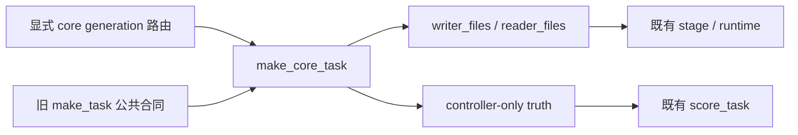

# Core memory v1：真实业务多样性生成器

## 目标与边界

在用户已批准的生成器方向下，新增独立 `make_core_task(family, variant=0, seed=0)`；既有 `make_task` 与旧任务输出不变。仅本课程路由选择新版。当前预算是 WS01/WS03/WS05 各 160 train（v0/1001..1160）、WS06 40 train（v0/1001..1040），四族各 40 dev（v1/2001..2040），合计 520/160。验收比较实际 A/B 可见正文，不把 ID、seed、nonce 计作不同任务。

## 架构与文件边界

本子任务只新增 `examples/dsh/capabilities/work_state/core_tasks.py`、`tests/uni_agent/examples/test_core_work_state_tasks.py` 和本设计。prepare/stage/audit generation 路由及真实 runtime canary 由并行任务完成；不新增 trainer、不改 scorer，不把 oracle 送入学生训练，不启动 GPU。

## API 与身份

- 支持 WS01/WS03/WS05/WS06、variant 0/1、非负整数 seed；bool 不是有效 variant/seed。
- 返回原 task schema/protocol/public goals/memory_paths/result_paths；新增 `task_generation="work-state-memory-core-v1"`。
- ID：`work-state-memory-core-v1-ws01-v0-s1001` 等；旧 ID/输出保持原样。
- truth 仅供 controller；actor 仍只接收允许的源文件与公共 schema/规则。旧 oracle_memory/oracle_outputs 可作为独立 CPU/canary 辅助，不能变为 rollout 数据。
- 路由需把新源码字节绑定 source_version；不得通过 ID 猜测 generation 或静默降级旧生成器。

## 真实变量与唯一性

共同使用 `32 + (73 * seed + 19) % 4093` 产生有界业务量。73 与素数 4093 互素，因此当前 train/dev 的各个 seed 不会在这一业务量碰撞；不声称任意无限 seed 集都无碰撞。不同 seed 还确定性改变其他业务属性与中性候选位置。这一值用于容量、协议匹配、保留期或负载，实际参与评分/可行性判断，绝非无关 nonce。

| 家族 | v0 train | v1 dev | 可确认验收 |
|---|---|---|---|
| WS01 | 3–7 项线性工作流，capacity/schema/已完成前缀变化 | 2–4 分支的 join 工作流，完成前缀及收尾长度变化 | oracle 只列未完成动作且满足依赖；拒绝漏项/重复/逆序 |
| WS03 | 中性 3–4 项数据库/cache 候选，事务标记与协议匹配变化；加入事务成立但协议不匹配的干扰项 | 中性 encoder/transport/storage 候选，format、region、minimum_retention 与边界干扰项变化 | 穷举笛卡尔积只得 1 个可行组合；不靠候选名暗示好坏 |
| WS05 | scope、operational revision、region、retention 变化，跨scope高revision与同scope旧版本诱饵 | 再增加 security bool 变化与反向 advisory 诱饵 | 来源/公共policy可独立推出预期值，旧 scorer 精确比较 |
| WS06 | peak/reserve 都变 | 两区 load/limit 独立变化，覆盖上限两侧与相等 | 全部数据公开给 B，仍允许 A 空 memory |

WS03 v0 scorer 固定要求 transactions=true，因此不假装可变化该规则；变化实际可行候选、匹配协议和干扰结构。WS05 security 覆盖 advisory 仍是同一公共规则，但 authority 的真实事实及 advisory 反向值改变；不通过改奖函数制造多样性。

## TDD 与验收

先写失败测试并记录 RED，再实现。覆盖当前精确 680 个 schedule 元组：520/160 可见内容各自唯一、两 split 无交集；所有 oracle 输出 reward=1、所有错误配置 reward=0；所有 WS03 候选组合穷举唯一解；公共文件重建 truth、工作流依赖/完成集合一致、WS06 空 memory；同输入确定性、非法参数拒绝、旧 generator 快照不变。额外测试业务量/拓扑/约束变化，不能只验证文件哈希不同。

完成后运行新测试与既有 work_state 相关回归、Ruff。该 CPU 验收只证明生成器与评分/公共合同一致；保存数据、runtime canary、真实训练/有效梯度/reload 是主线后续验收，不能提前声称 680 条已训练或能力提升。

## 实施状态

设计先交主 agent 呈现；用户已批准生成器方向及开始，本子任务据该授权继续实现，不另设重复审批。初次文档落盘时尚未实现；现已完成新增生成器和 TDD 测试。

## 本子任务验证记录

- RED：新测试导入缺失的 core_tasks 模块，collection 明确失败。
- GREEN：697 项新测试通过，覆盖固定 680 题。Ruff 两文件 check 与 format --check 通过。
- 扩展系统 Python 回归：789 passed；短课 2 项因本机系统 Python 缺 ray 失败，另 stage/verifier/consumption 初次收集缺 ray/tensordict。未将环境错误记为通过；交由现成完整测试环境继续核验。
- 独立并行 canary 已通知：四族双 variant 经真实 bundle/freeze/load 和原 scorer 八场景通过（canary 全 28 项）；该结果不等于 GPU 训练。
