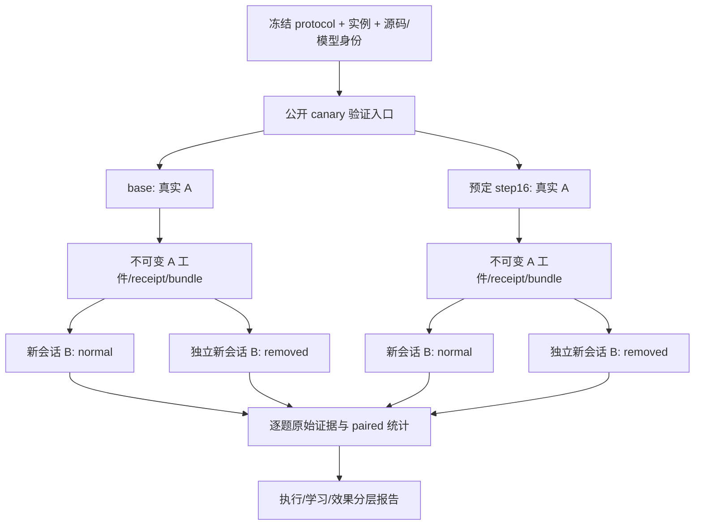

# Core memory P2：独立效果验证设计

状态：主 agent已review的设计草案，尚待新增评估入口的实施确认；未实现新入口、未生成封存测试、未启动 GPU。P1 先完成，P2 不反向增加 P1 验收门槛。本设计以当前 `core-train-r4` 为候选母实验；实际母 run 成功终态与 checkpoint 存在仍须另核，不能由名称推断。

## 1. 目标与可声明结论

在固定 DSH、Uni-Agent、VERL、模型、工具权限与预算下，比较未训练 base 和预先指定的 core step16：完整 A→冻结→B 任务成功率是否改善，以及同一份真实 A memory 对 B 是否有帮助。不保证提升；合法零收益、退步和任务失败都保留。

P1 的四族首条公开 dev reload（`work-state-memory-core-v1-ws01/ws03/ws05/ws06-v1-s2001`）用于加载、隔离、证据和实际消费检查。四题不是独立效果证据，不能据此挑 checkpoint、宣称记忆泛化，或改名为 sealed test。

r4 已开始训练，当前没有训练前冻结新测试的证据。此次新测试最多称**评估前冻结、训练过程未使用的独立实例测试**，不能回填时间声称训练前封存。严格“训练前封存”的结构/实例清单及哈希必须用于下一次训练，并在该次训练开始前完成登记。

## 2. 实验矩阵与执行顺序

主比较采用 32 个新实例：WS01/WS03/WS05/WS06 各 8 个，每族 v0/v1 各 4 个。均不在当前 520 train/160公开dev；先固定实际实例与 visible-content hash，再运行。样本规模用于有界效果诊断，不能据小样本作广泛能力承诺。

每个任务运行两个权重条件，各自产生真实 A：

| 条件 | A | B 可见输入 | 目的 |
|---|---|---|---|
| base / normal | base 实际写入 | 该次 A 原始冻结 memory + 公共源 | 训练前权重的完整任务表现 |
| step16 / normal | step16 实际写入 | 该次 A 原始冻结 memory + 公共源 | 训练后权重的完整任务表现 |
| base / removed | 引用上述 base A，禁止重新生成 | 空 memory + 同一公共源 | base 的记忆消融 |
| step16 / removed | 引用上述 step16 A，禁止重新生成 | 空 memory + 同一公共源 | step16 的记忆消融 |

removed 只对 WS01/WS03/WS05 执行，共 24×2 个 B；WS06 8题是无需持久化负例，只执行两个 normal 条件，报告成功率和不必要读写成本。总计 64 条完整 A/B + 48 条 B-only 诊断，不把后者计作新的完整 A/B 训练消费。

先用公开 dev 验证两个权重与两种输入模式的工程合同，不能用 sealed 成绩调试。主比较先完成 normal 的 base/step16，再实施消融诊断；若消融入口尚未就绪，normal paired 结果可单独交付，明确消融待办，不阻塞现有独立 reload。

每次只占当前一张 GPU，串行有界运行；不新增服务、trainer、rollout loop。进程装载/校验/清理继续复用现有独立评估方式。评估前根据公开 canary 成本登记总 GPU/时间上限，预先生成任务执行顺序；达到总预算时标记未执行项并停止，不挑容易题补齐。全样本未完成时报告部分结果，不能通过丢弃剩余项取得主要效果验收。



## 3. 同预算与配对定义

- 唯一预定后训练策略：该母实验 `global_step_16`。step8 只作为另列的工程/学习曲线检查，不能看封存结果后替换主 checkpoint。step16 不存在或来源不合法，主比较阻断；不得自动回退。
- base 使用同一固定 revision/权重文件和相同 LoRA 架构的初始状态，禁止加载 short checkpoint。现 `prepare --mode val` 可提供 base；`--mode reload` 提供 step16，母实验必须 completed/exit0。
- 正常完整链的 A/B 各保持当前实际预算：每次请求最多4096生成token；Gateway每条trajectory总序列容量16384（8192 prompt配置 + 8192 response配置，包含初始输入、生成和工具上下文），1800秒runtime、60秒verifier。task.yaml虽写max_total_tokens=8192，但当前DSH adapter未执行累计生成上限，不能将其视为已生效硬限制；见[预算审计](core-token-budget-audit.md)。模型预算、temperature/top-p/top-k、工具与采样并发完整绑定**有效配置**，不能只记录shell默认值。单条件n1，单题supervisor 3600秒；未来修预算须固定新版本另建run，不修改r4。
- normal 与 removed 比较的是 **B 的效果/成本**：A 是共享已发生的前置成本，不重复计入 removed，也不虚报消融省去了 A。两边 B 使用相同预算、模型身份、公共源、工具及提示；仅 memory 字节集合不同。normal 已发生的 B 可以作为该配对的一侧，无需再次生成 normal A。
- 每题记录 task_id、policy_id、condition、replicate=0。解码随机种子若当前引擎有可验证入口则预注册并绑定；如果没有逐 B RNG 重置合同，不能声称 common-random-number 配对，只能称**按任务配对**。不得为同种子承诺临时改动训练引擎。
- base 与 step16 的 A 内容允许不同，这是完整记忆能力改善的一部分；消融仅在各自策略内部共享其真实 A。不把 base A 交给 step16 的混合条件偷偷加入主比较。

## 4. 独立实例与结构泛化

### 4.1 本轮可执行的实例测试

新增 controller-only evaluation manifest 明确列出 32 个 recipe 与生成器版本。候选 seed 不复用 1001..1160、2001..2040；选择与哈希在查看任何模型结果前冻结。对实际生成的 A/B 正文去掉 task ID/seed 等元数据后做去重；业务量由 seed mod4093 生成，必须同时排除周期重复，不仅比较 seed 数字。

这些题仍来自当前四族/两 variant 的规则空间，只能支持**未见实例表现**。协议数、候选重命名、scope 名称、retention 数值和更长列表不是自动的新结构证据。公开生成器也意味着开发者知道规则；记录这一边界，不把“模型未看过实例”扩大为“规则完全未知”。

### 4.2 真正结构测试单列，不伪造现成能力

结构签名至少记录：WS01依赖图/合法已完成集合，WS03组件约束图/候选兼容关系，WS05权威与版本选择规则，WS06运算依赖图。候选名归一化、数值参数占位后仍同构的例子归入同结构实例测试。

现 scorer 可原样检查 WS01 一般 DAG，故下一训练前可冻结一种未训练的“多次 fork/join + 非前缀但依赖闭合的 completed 集合”作为首个结构留出。生成器仍需独立版本和 canary，不能手改旧配方；这一结构探针不混入本轮32题主统计。

WS03 scorer 只有既定二组件/三组件条件，WS05/WS06也有固定规则；仅新增 seed 或改名字不能满足新结构测试。新组件约束、权威优先级机制或运算结构要另有显式 verifier 合同及测试。为控制本轮范围，不先实现这三族的新结构；结构泛化目标保持待办，用下一训练前封存完成。

## 5. 现有入口与最小文件变更计划

当前基础已可复用：

- `prepare_memory_training.py` 支持 core 的 `--mode val/reload`、同课程母身份、单 dev ID、protected预算与源码哈希；`checkpoint_origin()` 要求母实验成功终态，绑定 checkpoint 全文件清单。
- `evaluate_work_state_tasks.py` 已有串行独立进程、每题结果、母状态复核和消费审计；但目前 TASK_IDS 是旧 v1-s303，prepare 未传 course，run ID 用固定下标解析。**不能只替换 TASK_IDS 后直接运行 core**。
- `NativeWorkStateFramework` 继承既有 `NativeMemoryFramework`，stage 已提供冻结/展开/评分，正常训练完整组准入合同保持不变。

| 文件 | 计划修改 | 范围控制 |
|---|---|---|
| `examples/dsh/capabilities/evaluate_work_state_tasks.py` | 参数化 course、base/reload、预注册protocol和任务清单；用 task_id 哈希/显式序号构造唯一run ID；增加 paired 汇总 | 扩展当前串行调度，不另写循环调度器 |
| `examples/dsh/capabilities/prepare_memory_training.py` | eval-only manifest/协议身份与实际文件绑定；支持独立测试清单，不放宽训练课程或母来源检查 | train 模式拒绝外部eval/干预参数；当前默认行为不变 |
| `examples/dsh/capabilities/work_state/evaluation_contract.py`（新增） | 严格解析预注册协议、evaluation manifest、真实A来源、消融证据schema；负责离线 paired 统计 | 纯合同/审计逻辑，无模型或trainer |
| `examples/dsh/capabilities/work_state/stage.py` | eval-only 从已验证真实A冻结工件准备独立B；normal/removed均用相同public来源，输出隔离 | 不篡改源bundle/回执；不接收任意oracle memory |
| `uni_agent/framework/memory_chain.py`、`work_state.py` | 抽取/复用现有B执行阶段，增加严格val-only B诊断分支及独立诊断证据 | 不复制rollout loop，不让B-only进入训练A/B合同 |
| `examples/dsh/capabilities/audit_memory_training.py` | 保持正常训练审计原判定；识别诊断运行应交独立B诊断审计，拒绝伪装完整消费 | 不把缺A当合法训练，不放松现有规则 |
| 对应 `tests/uni_agent/examples/` 与 `tests/uni_agent/framework/` 测试 | 路由/合同/负例/paired统计与旧行为回归 | TDD，先合同失败测试再实现 |

先实现 normal paired 所需前三项即可给出主比较；B-only干预是后续最小扩展，不将它混进现有完整A/B消费schema。具体抽取位置须实现前结合当前framework测试review，若需要新trainer或第二rollout loop，退回本设计重新收敛。

## 6. 拟新增 API 合同（尚不可执行）

独立suite拟接受：

```text
--course work-state-memory-core-v1
--evaluation-protocol /controller/p2-protocol.json
--evaluation-manifest /controller/p2-instances.json
--policy base|reload
--condition normal|removed
--mother-run <required for reload only>
--resume-from <required for reload only>
--source-a-manifest <required for removed only>
```

以上是拟新增参数，不能复制当作当前可运行命令。现有P1仍使用 `prepare --course ... --mode reload --evaluation-task-id ...`。

`evaluation-protocol` schema `dsh.work-state-paired-evaluation.v1` 至少包含：protocol_id、冻结时间/commit、母run/预定checkpoint、base文件hash、有效源码/runtime/VERL身份、两种权重合同、实例manifest哈希、预算、采样配置、执行顺序、指标/检验/失败规则。未知字段/模式/不一致hash拒绝，不默默忽略。

`evaluation-manifest` 只在 val/reload 使用，保持 course_id 与母课程一致，另有 evaluation_set_id/generation/source digest；每行确定 family/variant/seed/split=heldout 与对应task_id/visible hash。显式eval身份与原train/validation身份分离。stage必须校验recipe产生的task及当前实例hash，不允许调用者直接提供truth或任意task对象。仅扩展当前 core 的独立seed实例，结构版生成器另立版本。

`source-a-manifest` 必须绑定真实学生 A 的来源run/task/policy、fixture、trace、receipt、冻结bundle/manifest与展开文件hash、安全/finished状态。基于这些原件构造干预证据：source_bundle_hash、effective_bundle_hash、intervention=remove_all_memory、public_sources_hash、policy_identity。源A无合法冻结状态则该题干预不可执行，不能以oracle替补。

removed 不是“源A写了空包”：源hash和空的effective hash同时存在。产生新诊断receipt，明确新B session和干预；禁止把原正常B receipt复制过来、修改writer_binding后冒充原链。正常训练verifier/消费合同不变；诊断B使用同一 `score_task` 业务函数，并以独立schema审计真实性与消费/终止状态。无新optimizer更新。

## 7. 预注册统计与验收

### 主终点

固定32题，比较 `normal step16` 与 `normal base` 的逐题业务成功（原 `score_task.reward==1` 且证据可信）。四族等量，因此总体差等于族均值差。报告 a=两者成功、b=仅step16成功、c=仅base成功、d=均失败及Δ=(b−c)/32。

预注册主要改善标准：全部32题有可分类结果，Δ≥0.10，paired exact McNemar双侧检验p≤0.05，且无新增证据/安全违规。该门槛未满足时写“未证实改善”，不等于证明能力相同；不得改成挑选表现最好的家族作主结论。给出按任务族分层的paired bootstrap 95%区间（固定bootstrap seed、20,000次），说明小样本/有限任务空间限制。该区间用于不确定性呈现，不再额外筛选显著性。

### 次要终点与消融

- 每族成功率与差异；WS05权威/作用域冲突正确率；严格产物schema违规；必要事实保真与B成功检索覆盖。
- B实际tokens、成功/失败工具调用、wall time、重复读取/重做动作。性能比较需分开模型加载开销与任务执行时间；不拿文件数量代替记忆效果。
- 在24条依赖memory任务上分别报告两种策略 normal−removed 的paired结果。对A实际已丢失必要事实的例子保留在全体消融结果，并额外按“必要事实确已保存”预定义子组报告；不能事后只挑有利样本。
- WS06单列：正常无需记忆的成功率与不必要持久化成本；不要求移除memory后退步。任何WS06回归明确报告，不能被其他族均值掩盖。
- 次要终点默认描述性，不进行多个p值挑选后宣称确认性发现；若后续要确认性检验，必须在看结果前修改协议并给出多重比较策略。

“有效更新”沿用P1同run梯度/参数/optimizer证据；P2不能用随机评估差异替代学习证据。主成功率未改善但消融下降，只证明当前保存的信息有用，不证明训练提高了记忆能力。

## 8. 失败处理与停止规则

| 事件 | 处理 |
|---|---|
| 证据可信的模型错误、缺产物、质量零分 | 该condition业务失败计0，保留事实流与成本，继续其他题 |
| 有原始证据的max-tokens/预算耗尽 | 按失败计0，并单列未完成；不伪造完整A/B准入或消费 |
| A失败导致该权重normal链无B | 完整任务失败；对应消融标不可用，不补造A。报告缺失数量与理由 |
| GPU/服务/存储等明确基础设施失败 | 标infra_missing，最多一次按预登记相同配置/新run ID重试；两次原件都保留，不按第一次业务成绩决定是否重试 |
| trace/receipt/version/来源hash损坏、越权 | 阻断该作业；保存失败证据，查明后才能恢复，不记成普通低分 |
| 母文件变化、意外optimizer更新、checkpoint身份错 | 停suite，结果不通过有效性验收 |
| 总预算到达、人工中止 | 未执行项标not_run；报告部分结果，不完成主要效果验收 |

业务失败不会停止整套suite；“证据有效但失败”与“无法可信判分”分开。成功执行不能等同业务成功，业务失败也不能自动等同工程失败。

## 9. 测试与交付顺序

1. 先写CPU失败测试：旧suite默认行为保持；core唯一run ID；base/reload同预算；错误course、任意checkpoint回退、unknown heldout recipe、ID/visible hash篡改、train携带eval/干预参数均拒绝。
2. 32题正例、错误配置、source visibility、去重/seed周期交叉；truth不可进入actorprompt/metadata；oracle仅CPU canary。统计用固定2×2表验证McNemar、配对方向、全同/全零、缺失/未执行和分族统计。
3. 真实A干预负例：篡改source receipt/bundle、公私源错配、baseA冒充step16A、原件被修改、B-only冒充完整消费都拒绝；empty A合法但消融信息量为零。正常A/B原回归不变。
4. Linux真实DSH工具canary验证freeze/load、两种B目录、同public来源、独立回执与原评分；再用公开dev做小型base/reload执行canary。只确认合同，不用这些题作最终收益证据。
5. 冻结协议、32题及哈希，review后实施评估；每题独立产物可恢复，不覆盖旧run；运行后母文件/无更新核验、paired JSON/Markdown、原件索引与限制说明。
6. 完成报告分开标记：执行通过、证据可信、P1有效更新、P2效果判据、封存时点、结构泛化仍待办。收益不成立也交付完整报告，不盲目追加相同训练；下一轮严格训练前封存另行登记。
