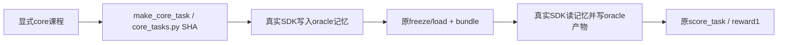

# 核心记忆课程：真实 runtime canary 增量

落实已批准的 core-memory-expanded-course-design.md；仅扩现有 canary 与测试。
不改旧任务生成器、prepare/stage/verifier，不调用 GPU 或学生模型。

目标：`--course work-state-memory-core-v1` 执行 WS01/WS03/WS05/WS06 × variant0/1，
固定 seed7，八次 controller oracle 的真实 SDK writer → freeze/load → reader → 原评分检查。
工具白名单、越权拒绝、缺失文件行为、冻结字节不可修改及业务 reward1 门复用现 scenario。

接口：scenario新增keyword-only course，默认work-state-v1；probe新增可选source_version，
默认仍为旧tasks.py SHA。core两侧probe显式使用core_tasks.py实际字节SHA；freeze/load来源
绑定task完整内容与generator SHA，报告保留generator路径/SHA及该artifact source_version。
旧work-state-v1及short-fact路径、默认来源计算与既有输出保持不变。拒绝未知course。

文件：deployment/checks/work_state_runtime_canary.py、对应test_work_state_runtime_canary.py。
测试先RED：课程CLI八次分发、四族两variant正确生成、core来源真实hash、旧来源保持，
通过临时文件模拟SDK边界但使用真实bundle/freeze/load/score；失败结果不得返回passed。
新测试明确为CPU fixture，不声称真实runtime已执行；root另在固定Linux SDK做真实canary。

验证完成：新增core CLI和未知course测试先RED（旧入口拒core/无course参数）；实现后28项canary
测试全通过，包括真实新生成器8场景、旧生成器8场景、坏oracle、跨checkout误导来源拒绝、
probe显式source/default兼容。SDK边界均为显式CPU替身，bundle/freeze/load/score未mock。
旧task/bundle/short-course/memory-artifact另131项回归通过。Ruff check/format通过。
未运行Linux真实SDK canary、未调用GPU、未提交；真实执行由root在固定部署checkout完成。
