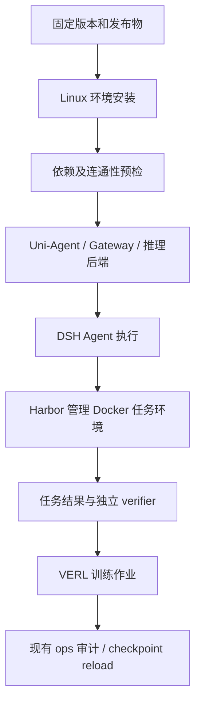

# 系统部署与安装设计

## 目标与当前状态

第一阶段交付从干净 Linux 主机到可运行训练闭环的可重复流程，而不只是 Python 单元测试。
当前已创建 deployment/README.md；下面的安装与服务脚本仍是待实现清单。
已有实验操作脚本继续放 examples/dsh/ops/，部署基础设施统一放 deployment/。

## 架构与边界

图是目标数据流，不代表新增七个独立服务。Harbor 拥有任务容器生命周期；
DSH bridge 复用环境接口，不能另建同一个 sandbox。训练框架管理的 Gateway/推理进程
由训练入口启动，部署脚本只处理它真正依赖的外部服务。Modal 后续替换环境后端，不替换 VERL。

## 文件清单与接口合同

- deployment/versions/：记录成对 Git revision、Python/CUDA/推理依赖、Harbor 与 DSH 发布身份。
  尚未恢复的 DSH 发布物必须报缺失，不填虚构 digest。
- deployment/bootstrap/：检测平台与已有环境，安装到指定隔离路径；可重复运行；失败非零退出。
- deployment/services/：start/status/stop 只管理明确记录归属的服务；启动先健康检查；不停止无关容器。
- deployment/checks/：检查版本、文件、端口和容器可用性；输出无密钥报告；默认不调用模型或创建付费资源。
- deployment/docker/、runpod/：分别保存容器资产和云主机配置；复用 bootstrap，避免两套安装逻辑。
- deployment/modal/：第三阶段根据实际吞吐需求实现。

所有命令从仓库根目录执行，接收明确的安装目录、模型目录、运行目录与配置路径。
报告包含 revision、检查项、通过/失败原因；不能仅靠进程存在判定健康。
数据、模型、运行产物不入 Git；凭据通过环境或平台 secret 注入。

## 验收顺序

1. CPU：固定版本身份，检查导入、配置、DSH runtime 和服务连通；缺失项明确失败。
2. Docker：单 Harbor task oracle，保存执行、评分、产物和限定资源清理证据。
3. 实际 Agent：DSH → Gateway → 模型 → 环境 → 新鲜 verifier 回执，审计轨迹与 token 归属。
4. GPU：VERL 真正更新权重并独立 reload，保存 loss/gradient/checkpoint 与 run identity。
5. 重建：另一干净环境按同一入口复现；失败重试不覆盖既有实验记录。

CPU 通过不等于 GPU 通过，oracle 通过不等于 DSH RL 通过。
历史项目已有真实 GPU 更新与 reload；本次验收验证升级后版本及 Harbor 增量。

## 下一批实现

先完成当前成对版本迁移回归，再实现版本清单与只读预检；恢复 DSH 发布物后完成 Linux 安装。
GPU 租赁应在安装输入、启动命令和运行验收准备就绪时开始。
