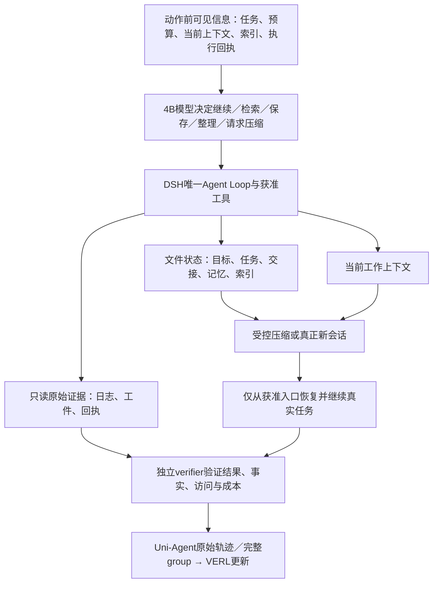

# DSH 记忆与上下文训练任务和设计

从保存文件到可靠恢复工作：面向4B模型与长周期Agent任务。

2026-09-09。根据用户最新澄清细化系统方案 v3 的 N3；本文同时记录课程设计与分阶段工程证据，不是新能力已经训练完成的报告。首批文件任务已实现，GPU 学生验证进行中；DSH/Uni-Agent/VERL pin 不因本设计自动更新。SFT、付费教师、Modal 和新增 GPU 不在本轮范围。

**状态快照：2026-09-09 12:13:55（UTC+8；04:13:55 UTC）。** 首批 WS01/03/05/06 的任务、真实多文件冻结、A0→B终态评分与训练接线已实现：核心 `6085a13`、recipe/消费 audit `801083579318ed5268cc92caf45c3ce04ef6d099` 已推送。主线程核心回归229项Python+6项Node、recipe/audit组合31项通过。固定 Linux runtime canary 的8种结构、106次真实工具请求通过，见[原始范围与结果](work-state-runtime-canary-r1-result.md)。

`work-state-val-r1` 于12:04:27 UTC+8（04:04:27 UTC）启动，**GPU基线尚未通过，W2未完成，能力门未通过**。截至12:15:03，WS01首个A原回执为finished=true/eligible=false/reward0：第2个工具动作尝试修改只读来源，75 steps/74 calls后正常completed；不是max-token失败。该阶段无B、无训练更新，整体baseline仍在核验。原失败保留，不通过改写提示追认。后续状态见[本worktree交接](../../tasks/harbor-modal-integration/handoff.md)，不以GPU占用或PID作为成功证据。操作入口：[完整RL复跑手册](work-state-rl-runbook.md) · [参数审计计划](work-state-parameter-audit-plan.md)。

## 1. 核心目标与个人建议

让 4B 模型在 DSH 内学会：判断当前信息以后是否有用，选择写入或检索的位置，在上下文压力、阶段结束或会话交接前保存必要状态；压缩或重启后能准确继续工作。训练的对象是模型使用 DSH 的决策与操作；DSH runtime 提供可靠工具和状态边界，不能期待 RL 自动补出不存在的 API。

我的建议是把“恢复后仍能正确行动”放在中心。handoff、goal、tasks、memory、索引和 compact 是协同手段，不应成为机械的文件清单。短任务无需强制五个文件；长任务也不应每轮重写所有文档。优先练可靠恢复，再练自主压缩，最后让受控 RSI 优化这些策略。

这里借鉴的是本会话可观察的工程操作：先读交接、核分支与版本、查真实日志、区分计划和已验证结果、把目录冲突写入经验。不是声称访问或复刻 Codex 内部未公开的记忆实现。本会话出现过过期状态、含糊的“上一轮”和原始 manifest 未更新，这些失败同样应成为反例。

## 2. 四层协作，而不是四套循环



四种身份分开：任务内 episode/context 段、跨会话 chain、采样/更新 training run、候选 evolution run。文件管理不会另起 MemAgent 模型循环。把文件转交新会话与同会话内真实 compact 分别验收。

## 3. 文件各自负责什么

以下是训练环境内的建议语义，文件名可在同一合同内变化；不是强迫所有项目迁目录，也不是已实现的 DSH API。

| 产物 | 应保存 | 不应混入 |
|---|---|---|
| goal | 用户目标、范围、验收条件及来源；进度另记 | 模型自行降低验收条件，把失败改成成功 |
| tasks | 可执行步骤、依赖、done/doing/blocked及依据 | 只有“继续优化”的空泛事项 |
| handoff | 当前分支/版本/run、已验证结果、失败与未决、下一命令、证据入口 | 全量聊天、凭据、未经核实的完成声明 |
| memory | 可复用约束、稳定事实、踩坑规则；来源、适用范围、版本/时效 | 将暂时的 GPU PID 当长期知识；把猜测写成事实 |
| index | 少量分层入口、主题/用途、指向文件与证据的位置 | 复制全部 memory；无限增长的摘要墙 |
| evidence | 原始日志、测试回执、文件工件等可复核材料 | 为使摘要自洽而改写或删除失败原件 |

关系是 goal→tasks→handoff 表达“做什么、进展如何、怎样接手”；index→memory→evidence 表达“去哪里找、知道什么、凭什么相信”。文件内部或伴随元数据保留项目/worktree/run身份。索引定位成功后按需读相关块，不默认读完全部历史。

写入先形成可读工件，再更新入口；中途失败不能留下指向不存在文件的索引。整理可更新索引、标记旧事实失效并保留来源，不能把旧证据静默覆盖。模型只有获准工作区权限；用户目标、评分器、封存集和控制端真值不属于可任意改写状态。

## 4. 要训练的实际决策

| 决策 | 正例触发 | 同样需要的反例 |
|---|---|---|
| 是否保存 | 新约束、昂贵调查结论、里程碑、即将交接 | 可廉价重查的临时状态、不相关内容，无需写入 |
| 存什么与哪里 | 下一步必需状态进handoff；跨任务规则进memory；大证据外置 | 不把整份日志塞进memory，不泄露控制端隐藏真值或封存答案；A实际发现的必要结果允许保存 |
| 如何索引 | 按任务/主题建立有限入口，标明版本和用途 | 检索失败后盲加文件；失效或跨项目入口 |
| 何时offload | 大工具输出和已完成子任务材料，保留摘要与原文定位 | 把当前关键约束卸载后不留入口 |
| 何时compact | 真实可见预算压力、阶段边界、重复材料挤占工作窗口 | 每轮压缩；丢失未完成步骤、最新事实或错误恢复状态 |
| 如何恢复 | 新会话先读入口，核当前状态，取相关材料并继续任务 | 重跑已完成昂贵步骤、重复提交、相信过期“running”或“done” |

“把记忆压缩写进文件”是文件整理；“减少下一次模型请求携带的历史”才改变模型上下文。两者需要显式接线，不能把写出 summary.md 就算作 compact 成功。

## 5. 对照现有实现：哪些真实可用

- 首批 work-state WS01/03/05/06 已有模板、精确权限、字节bundle、独立verifier、Stage/Framework与recipe/消费audit；固定Linux无模型canary通过。真实学生val运行中，终局任务结果、有效更新与独立reload尚未验收。见[复跑手册](work-state-rl-runbook.md)。
- 历史 resident A/B 已通过真实 val：A写→冻结→新B读取、原token/版本/回执、2个key实际消费。见 [r2报告](memory-resident-val-r2-result.md)。它没有自主判断何时写、没有训练索引管理，也没有真实同会话compact。
- 当前 NativeMemory 要求 writer reward=1 才进入 B。这适合先验工程诊断，但会排除“操作合法、记忆有遗漏”的学习样本。新版课程需独立版本化准入与评分；不能改当前评分器追认旧失败。
- 原生 MemAgent 有 token 分块→生成记忆→新 context→最终问答方法；当前仅复用其共同 Gateway/TQ/VERL 底座，未完成这一策略迁移。它适合作为方法来源，不必把整套 MemAgent loop 套在 DSH 外。见 [源码复用审计](memagent-native-memory-reuse-audit.md)。
- DSH已有 compaction service、自动compaction和引用spill设施；`/compact` 是要求idle的人工命令，不能直接当作模型工具。固定训练pin尚无ContextPilot实验模块；ABI名字出现在设计或映射里，不证明模型能调用。细节见下方来源。
- 本次只读核对：DSH主目录所查四个核心compaction/reference文件与训练pin b236969无差异。因此先用当前文件工具推进，无需因架构页面更新而再升级整套依赖。

## 6. 分批课程与可检验任务

优先顺序不是“先让模型背文档”，而是让状态管理确实影响任务结果。普通问答可以凭基座能力得满分，不足以测出恢复工作能力。

| 批次 | 任务族 | 环境变化与真实验收 |
|---|---|---|
| C1 交接恢复 | 修复小项目：已完成一半检查，剩下一个依赖问题 | A工作后中断，B只得固定入口；定位正确分支、识别已完成/待验证并通过剩余测试；不可重复有副作用步骤 |
| C1 索引检索 | 多模块调查，各自产出日志和结论 | 文件多于可直接装入上下文的预算，B从入口主动找正确证据，不直接给目标文件路径 |
| C1 更新与冲突 | 旧部署结论被新回执推翻，用户更改一项约束 | B依据适用范围与新证据选择事实；任务完成且不沿用旧配置；时间新并不自动高于可信来源 |
| C1 克制保存 | 短任务、噪声、可重查临时状态 | 不必写memory；正确完成且没有不必要持久化或隐私越界 |
| C2 offload | 阅读大量测试/检索输出后继续修复 | 大输出有可访问原件、摘要足够定位；实际请求更短，关键证据仍可取回；任务通过 |
| C2 compact | 在工作预算内多次推进后发生真实上下文收缩 | 紧接的模型请求确实变化，保留目标/关键约束/未决；恢复后完成任务，不靠完整原历史旁路 |
| C2 恢复失败 | 索引失效、文件缺失、错误摘要、部分写入 | 模型识别证据不足并重建/降级检索，不编造已完成；重新执行可验证步骤 |
| C3 联合长任务 | 调查→改动→测试→中断→新约束→恢复→交付 | 多次context段和跨会话链，最终工件通过；所有任务状态、事实和成本可追溯 |

每族同时有“应保存/不应保存”“应压缩/暂不压缩”对照。初批数量以结构覆盖为准：每族覆盖正常、信息不足和恢复边界等独立情境，再按基线失败分布扩充；重复采样单独统计。正式效果实验按模板/项目/依赖结构拆分train、开发、封存集，不只替换名字或路径。

## 7. 模型怎样从结果学习

保持在线RL：当前policy在DSH中实际选择读写/检索/请求操作，Gateway收集全部模型生成token、mask、logprob及真实权重版本；完整链经verifier后进入已有VERL末段终态GRPO。保留原阶段回执，信用分配记录与回执原分数不混淆。

能力课程的准入应区分：可信完成但记忆有遗漏/检索低效属于可训练低分；越权、篡改、证据缺失或基础设施崩溃属于拒绝/隔离。当前writer“必须满分”不应永久保留为能力学习前置；新版本须先做安全与错误事实反例，再部署新run。

评分优先级：终局任务成功和关键事实保真为主；恢复成本、重复操作、检索成本、总token和耗时为次级。成本必须包括压缩、写入和后续读回，不能只算最后一个prompt。关键事实错误时不能靠高压缩率补分。不奖励写文件数量、索引长度或声称已compact。

初批先记录各维度，不预设未经基线校准的固定加权和；冻结评分版本后再训练。组内全同分时记录零优势，调整下一版任务难度/覆盖，不能人为制造失败或更改本run奖励。外置记忆只放controller允许的来源；不向A提供隐藏评分真值、封存答案或尚未发生的后续变更。A实际获得的工作结果、必要结论和工件允许保存；B考查继续行动与新约束应用，而不是只能复述某个隐藏答案。

## 8. 工程与能力的两套验收

**工程门：**真实动作→正确工件→真实隔离/请求变化→fresh回执→完整组实际消费→有限有效梯度→参数/optimizer/checkpoint→独立reload及新任务重跑。每项单独证据；目前A/B val只覆盖其中一部分。

**能力门：**固定同一DSH/model预算和公开输入，比较无持久化对照、工程师固定交接规则、模型自主管理三种策略。没有持久化的对照用于确认任务确实依赖恢复能力；真正的提升要超过固定规则基线，而不是只超过被故意清空记忆的模型。另做完整上下文参考作为信息上界，不把它误称等预算公平对照。

主要指标：中断/compact后的任务成功率、关键事实/约束保真、引用有效率、陈旧事实误用、重复副作用、恢复总成本、非法动作。报告逐任务差值、不同随机种子的波动与回归；封存任务不能用于选提示或RSI候选。不同策略应得到相同证据可达性和工具权限。

## 9. 系统适配与文件清单

训练集成继续由本项目负责，DSH本体接口由DSH-Exp负责，ContextPilot贡献动作前观测、事实/来源合同和版本化能力。先审计实际获准工具，再决定最小扩展。

| 层面 | 计划变更 | 约束 |
|---|---|---|
| 本文及HTML | 明确N3课程和退出条件，链接总方案 | 设计与已验收状态分别标注 |
| `examples/dsh/capabilities/` | 新的工作状态任务、准备器、版本化verifier | 复用现有数据/监督/严格消费，不改旧诊断产物 |
| `uni_agent/tasks/dsh/`与现有framework | 仅补新任务证据绑定所需缺口 | 不重写trainer，不再套agent loop |
| DSH获准能力边界 | 若缺模型可见compact/context-edit，提供受控请求、生命周期检查和结果回执 | `/compact`不能直接当工具；必须在新pin上真实验证下一模型请求 |
| ContextPilot观测层 | 记录动作前request、可见预算/索引、操作后请求差异 | 动作后快照不能伪装成动作前输入；缺指标明确unknown |

建议合同字段（尚非现成API）：project/worktree/task/chain/context标识、source revision、artifact path/digest、validity/supersedes、动作前可见上下文摘要、动作后实际request摘要、读写日志、终局任务证据、总成本。采用现有schema的版本化扩展，不另建通用平台。

实现前验证：合法/非法路径、跨任务污染、索引悬空和部分提交、旧事实冲突、失败回执不能标done、低质量但合法memory准入、真实context切换及token归属、取消/重试与整组消费。随后真实CPU工具canary→少量GPU基线→有效学习组→独立reload→封存评估。先保留sync；异步与RSI候选策略优化后置。

## 10. 下一步和当前不应扩大宣称的范围

1. 已保存memory train-r2失败：initial val的A正常且安全结束但写入错误事实，原质量门拒绝；无B、n4、更新或checkpoint。见[真实失败报告](memory-resident-train-r2-result.md)。独立reload仅在后续实际产生可用checkpoint后执行；不能把反复跑这条诊断作为C1推进的硬前置。
2. C1首批“交接恢复、索引发现、事实更新、克制保存”文件任务已实现并通过真实工具canary；继续验收学生baseline、合法低分样本与同policy完整组消费，再执行有效更新与独立reload。
3. 核实并接通模型可见的context操作后进入C2；没有实际request改变证据，不标compact能力通过。
4. C3跨阶段长任务与留出效果；再做受控RSI改善记忆策略。候选只能改变获准策略，不能改用户目标或评分规则。

## 11. 长周期工作状态管理方法论

用“观测→核实→决策→执行→验证→发布最小状态→恢复”描述模型技能，不增加运行时循环。长期工作不是让模型永久记住所有token，而是持续维护一个可恢复、可查证、不过期的工作现场。

### 11.1 开始和恢复时

1. 先确认项目、worktree、目标来源及当前入口；文件内容不能越过用户指令或控制端范围。
2. 从小索引进入当前handoff，再按任务取相关记忆和证据。训练B只得到固定入口路径及原始目标；不要直接替它选好目标memory文件。
3. 对易变状态重新核验：进程、GPU占用、Git HEAD、测试结果适用的commit、未完成操作。历史“running”不是当前仍在运行的证明。
4. 将事实分为已验证、历史有效、待核实、已失效；对缺失信息明确查证，不能用流畅叙述补全。

### 11.2 工作中

- 新指令改变范围时，记录变更来源与影响，更新工作任务副本；只读原始goal与验收标准由controller维护。
- 关键决策或昂贵调查完成后，保存足以重用的结果、适用条件及证据入口；不用每轮把所有对话归档进memory。
- 工具返回大输出时，把原文留在可读取工件中，当前上下文只保留与下一步相关的材料及定位信息。
- 事实写入须遵循“看到结果后才能据此生成”。同一assistant消息预先发出read与依赖该read的write，不证明模型已观察返回值。允许草稿后纠正；最终冻结工件与声明必须与实际证据一致。
- 只有对应执行/测试回执支持，任务才标done；未验证的代码、候选方案、已启动进程不能合并为已完成。

### 11.3 压缩和交接前后

保存恢复所需最小状态：目标及约束、当前准确位置、已完成且可查证部分、失败尝试与后果、下一步、相关索引。先验证工件与索引可达，再进行获准压缩/切换。
压缩后用新的实际request/context段继续；检查模型是否仍知道关键约束并能按索引取回材料。跨会话时重新分配session并限制可见文件；“提示它假装忘记”不能代替信息隔离。

### 11.4 长期整理

把本轮临时状态与长期规则分开；将确定反复适用的经验提升到项目记忆，并带范围/来源，单次偶然失败不自动推广成绝对规则。合并重复入口、标记被取代的事实、保留证据定位；删除或归档应按任务允许的生命周期操作，不改写失败历史。
RSI后续可改进索引策略、保存时机或compact策略，但必须比较持久工件与独立任务效果，支持回滚；不能让候选修改评分器以获得更高reward。

## 12. 训练任务的完整数据合同

在线RL数据主要是初始环境、目标、可见信息、事件、预算和verifier，不是预先写好的成功对话。真实操作轨迹由当前策略运行产生。下表是计划的数据结构，尚不能直接交给现有parquet入口自动运行。

| 字段 | 说明 |
|---|---|
| task_id / family_id / template_version | 任务与生成模板身份，区分种子实例和rollout采样 |
| project_id / worktree_id / chain_id | 路径与状态隔离，禁止跨组读其他候选的记忆 |
| split / source / license | 训练、开发、封存与数据来源；公开设计样例只属开发规格 |
| controller_goal / acceptance | 原始目标与隐藏测试，模型不可修改；给模型的是合法的目标投影 |
| initial_workspace / evidence_sources | 小型可执行项目、日志、配置、历史任务工件；保留精确版本/摘要 |
| observation_policy | A、B及每个context段可以看到什么；预算信号必须真实可见，缺失标unknown |
| allowed_actions / persistent_roots | 实际runtime能力与可写目录，逻辑动作名须映射真实工具后才能执行 |
| event_schedule / environment_seed | 中断、阶段变化、新约束、文件失效；同GRPO组固定相同事件种子 |
| transition_policy | 合法写入、freeze、索引发布、实际context变化、重启隔离与错误恢复 |
| verifier_version / scalar_reward_version | 终局工件测试、事实和访问审计；训练前冻结标量合同 |
| budget | 总模型token、文件读写、工具调用、模型context容量、wall-clock；计所有A/compact/B阶段 |
| evidence_contract | pre-action request、真实tool结果、文件版本、阶段/session/权重版本、trace/receipt、消费映射 |

**信息边界矩阵：**

| 内容 | A | 新B | verifier/controller |
|---|---|---|---|
| 原始用户目标与当前已发布变更 | 可见 | 按合同可见，直接来自可信源 | 全部 |
| A合法观察到的源码/日志 | 通过获准工具取得 | 是否还能读原件由该任务提前规定 | 全部 |
| A完整对话和未批准工件 | 自己的上下文 | 不可见 | 可用于审计，不泄露给模型 |
| A发布的索引/任务状态/记忆 | 可读写获准范围 | 从固定入口主动检索 | 完整快照和访问记录 |
| 未来尚未发布的事件、隐藏测试答案 | 不可见 | 只在事件生效后看到允许内容 | 可见 |
| 其他sibling/run的产物 | 不可见 | 不可见 | 分别审计 |

中断不能永远发生在“最后一步请写handoff”之后，否则只是在训练服从直接命令。应有可见的阶段/预算信号、可选保存动作和不同中断位置；不要求模型预知不可见未来。固定组内环境种子可减少随机事件造成的虚假reward方差，组间再改变场景。

### 12.1 一个具体的交接任务样例

以下为可编译的设计规格示例，**不是已实现执行器或已验收训练样本**。`logical_capability`不是DSH API名称；后续必须通过真实能力探针映射。

```json
{
  "schema": "dsh.work-state-task-spec.v1-draft",
  "task_id": "handoff-cache-repair-dev-01",
  "family_id": "handoff_resume_after_change",
  "split": "development_spec",
  "admitted_for_training": false,
  "goal": "修复配置缓存，并让当前版本要求的测试通过；不要重复已完成的数据初始化",
  "actor_initial_observation": {
    "project_id": "cache-service-lab",
    "entry": "/work/state/index.md",
    "notice": "任务可能中断；可按需保存工作状态，完成声明必须有当前测试证据"
  },
  "logical_capabilities": ["read_file", "write_scoped_file", "search_scoped_files", "run_allowed_tests"],
  "persistent_roots": ["/work/state", "/work/src"],
  "controller_only": {
    "template_version": "1-draft",
    "workspace_recipe": "生成含缓存失效缺陷的小项目、旧测试回执、初始化ledger和只读版本目标",
    "event_policy": "在同组固定的已执行动作边界中断A；B收到新增的配置热更新要求",
    "reader_input": "原始可信目标、新生效约束、固定index入口；不提供A完整对话",
    "checks": [
      "独立缓存失效与热更新测试均通过",
      "初始化ledger仍恰好执行一次",
      "handoff中的done声明能关联对应版本的真实测试回执",
      "B从获准入口取得当前状态，没有读取兄弟组工件",
      "旧版本通过不能冒充当前新增测试通过"
    ]
  }
}
```

这个任务考查保存与恢复后的行为，而不是文件是否包含某个关键词。模板实现后应给出实际源码/测试文件、隔离规则、oracle动作canary与失败反例，才可把`admitted_for_training`置为true并编译训练调度记录。

### 12.2 首批建议的12个种子规格

这是12个目标规格，不是12条已执行数据或12个已验证独立训练任务。首批WS01/03/05/06已落地为配置/计划任务，各有2种结构变体；这不等于完成表中全部长场景。其余规格尚待实现。全部公开示例属开发设计，不能当封存测试。

| ID | 场景与扰动 | 主要验收 |
|---|---|---|
| WS01 | 小项目修复中断，B接手剩余步骤 | 正确继续且不重复初始化，done有证据 |
| WS02 | 相同交接结构，B收到新版本要求 | 旧成功状态不覆盖新目标，重新验证受影响部分 |
| WS03 | 多模块调查后仅给总索引 | 主动定位证据、按需读回并完成后续修改 |
| WS04 | 索引指向旧版本，正确文件仍在获准工作区 | 识别陈旧入口、重建定位、维护来源 |
| WS05 | 同一配置有过期事实和已生效变更 | 按可信来源/作用域/版本选事实，不机械选最新文件 |
| WS06 | 短任务夹带无关噪声 | 不必写持久记忆仍正确完成，减少无用写入 |
| WS07 | 大量测试输出占用窗口 | 原文offload可回查，摘要能支持下一步修复 |
| WS08 | 中途真正compact，保留未完成依赖 | 下一实际request收缩但关键事实不丢，最终测试通过 |
| WS09 | 工件写入成功但索引发布中断 | 不使用悬空入口，恢复后完成原子意义上的发布 |
| WS10 | 先生成错误草稿，再获得真实来源 | 主动纠正并冻结有证据的记忆，不能把占位值当事实 |
| WS11 | 同机两个worktree存在同名任务文件 | 正确范围隔离，不把另一分支结果当当前通过 |
| WS12 | 调查、工具组合、修复、测试、两次交接与新约束 | 长链终局正确、事实/状态可追溯、成本受控 |

每个模板须衍生结构不同的实例和“不需要保存/不应压缩”等对照。仅换run ID、字符串或随机名称不增加结构覆盖；正式训练量由执行成功率、reward分布、有效组比例与梯度诊断决定。

## 13. 奖励与合法失败：先冻结，再训练

为避免“设计写了多维指标，但GRPO没有可用标量”，建议第一版使用以下**待基线校准并冻结**的合同，保留所有原始分项：

- `eligible=false`：越权、篡改、原始证据不可信、基础设施错误或任务未按终止合同完成；隔离，不伪装成普通0分。
- `eligible=true`：正常完成尝试，包括记忆遗漏、错误事实、错误检索或最终任务失败。合法低质量A仍允许按原样冻结后给B尝试；controller不能补全其内容。
- `success=1`只在最终独立任务测试通过且关键约束/事实全部满足时成立。成功档暂定`reward = 1 - 0.1 × normalized_total_cost`，成本按预先冻结的总预算归一并截到[0,1]。
- 可信完成但未成功的档位暂定`reward = 0.2 × verified_progress`。`verified_progress`是预先冻结的独立子测试通过比例，不是模型自评或写文件数量；如果没有可靠的分项测试，该档直接0分。
- 失败最高0.2，成功最低0.9；不能靠省token掩盖关键事实错误。成本含A、所有compact/整理、B、检索与工具操作；不能把消耗转移到另一个阶段逃避计费。

这不是最终调参结论；真实baseline后只能发布新reward版本，不能改旧run结果。初批可先采用二值任务reward完成正确闭环，分项记录用于诊断；若所有组都同分，应改下一版课程的可学性/难度，而不是伪造差异。

冻结的chain最终分数为延迟学习信号。保留每个阶段原始verifier分项和最终credit映射，接到固定VERL多trajectory GRPO；A/B生成token和实际policy版本必须完整，train调度k对应版本k-1，val对应实际发布版本。不能用只保留成功A的方法永久筛掉恰好需要学习的错误。

## 14. 数据生成、实施与验收路线

### 14.1 数据生产流水线

任务模板与只读oracle → 结构化实例生成 → 生成前按模板/项目分split → fixture和事件种子冻结 → 真实工具canary验证可解且反例被正确评分 → 编译Uni-Agent调度数据 → 当前policy真实rollout → fresh verifier → 完整group消费审计 → 训练更新与checkpoint → 独立reload/评估。

oracle可以是确定性脚本或人工确定的正确操作，用于证明环境可解；不把其轨迹当作当前模型的on-policy样本。当前不需要付费大模型先生成一批“看起来很好的记忆对话”，也不依赖SFT数据才开始RL任务建设。

### 14.2 最小落地分层

1. **现有工程结果归档。** r2 val真实A/B与消费通过；train-r2失败无checkpoint。独立reload入口CPU实现单独保存，不假设已有母checkpoint。
2. **先做WS01/WS03/WS05/WS06和对应反例。** 用现有文件/测试能力覆盖交接、索引、事实更新与克制保存，先保证全部任务可执行可评分。可先用小型本地文件任务，避免引入Docker/Modal作为前置。
3. **新版合法低分准入与信用。** 先独立版本化writer质量、冻结和B执行合同，测试安全失败/质量失败/基础设施失败三类；不修改旧诊断门。
4. **真实学生baseline和有界RL。** 首轮记录逐题失败和组内差异。只有出现有效可学组后才扩大训练；保存初始/最终参数、optimizer及消费关系。
5. **接入真实context编辑。** 先对当前pin审计可见能力；若缺模型工具，在DSH层做最小受控适配和新pin，验证请求变化后再执行WS07/WS08。不能从实验ABI直接推断可用。
6. **长链与效果。** 扩WS09—WS12和不同结构实例，独立reload、同预算固定规则对照、封存结果；之后再做异步性能和RSI策略候选。

### 14.3 拟变更文件与合同边界

- 任务规格/设计：本MD和同专题HTML；所有公开示例明确development_spec。
- 数据与任务：首批已在`examples/dsh/capabilities/work_state/`实现模板、业务评分、bundle、权限profile、verifier、stage与recipe准备器；后续规格继续复用该链路。准确命令与路径见[复跑手册](work-state-rl-runbook.md)。
- 测试：对应`tests/uni_agent/examples/`与`tests/uni_agent/tasks/`；覆盖状态隔离、信息边界、合法低质量样本、索引/事实恢复及真实consumer映射。
- 框架：只扩所需stage/chain合同与版本化任务适配；复用Gateway、Task、TQ、VERL，保留DSH唯一执行loop。
- DSH本体：模型可见compact/context-edit若需新增，在DSH-Exp单独变更并发布固定runtime；当前训练不自动升级。
- 项目记录：active-engineering-goal、handoff和tasks/todo记C1—C3进度；实验身份、训练方法、能力标签、调度模式分别记录。

### 14.4 必须通过的验证

| 层级 | 可检验标准 |
|---|---|
| 数据/可解性 | 真值/目标隔离，schema和摘要固定；oracle真实通过，故意错误反例不能得高分 |
| 因果与观测 | 只有动作前可见信息进入模型；读后写与草稿修复可追溯；真实context切换后下一request确实不同 |
| 任务执行 | 允许动作真实可用，工件/索引可恢复；合法差记忆正常低分，不混同越权或基础设施故障 |
| 训练消费 | 同组同外部事件种子，独立sibling目录；真实token/version/receipt→完整组→唯一消费，无低分筛选作弊 |
| 数值与保存 | 有限非零有效梯度、实际参数更新、base冻结和optimizer推进；checkpoint完整保存到/workspace |
| 独立重跑 | 新进程加载真实checkpoint，新session复跑；无意外训练更新，原checkpoint不改动 |
| 能力效果 | 同预算与同工具的固定规则对照；恢复成功、事实错误、陈旧信息、重复副作用与总成本逐项报告 |

## 15. 当前验收账本与后续交接

| 项目 | 当前状态 |
|---|---|
| DSH/Uni-Agent/VERL既有最小RL与context训练/reload | 已有真实证据；不代表本课程已完成 |
| resident memory val-r2 | 真实A/B、冻结/版本与2 keys消费通过；无更新 |
| memory train-r2 | initial val writer正常完成但写错事实；无B、n4、消费或checkpoint |
| memory独立reload入口 | CPU实现与回归完成，真实GPU待可用母checkpoint |
| WS01/03/05/06首批文件任务 | 核心6085a13与recipe/audit8010835已push；229 Python+6 Node、31 recipe/audit通过 |
| 固定Linux runtime canary | 8结构、106实际工具请求通过；oracle控制脚本，无学生或RL更新 |
| work-state-val-r1 | 801083579318ed5268cc92caf45c3ce04ef6d099；12:04:27 UTC+8启动；WS01首A越权改只读source被拒，无B/更新；整体基线尚未通过 |
| W2与能力门 | W2未完成；完整组消费、有效更新、checkpoint与独立reload须逐项留证，能力未通过 |
| 其余WS规格及更长真实场景 | 仍为设计，不以首批配置/计划任务替代全部长场景 |
| 模型自主compact、索引维护、长期工作恢复提升 | 尚未验收，不能借A/B满分宣称通过 |

每次发布任务记录具体版本、run ID、UTC与面向人的时区、通过节点、失败范围及下一步。失败不覆盖成功历史，历史成功也不覆盖当前失败。工程阻断优先定位真实第一异常；例如train-r2的空TQ keys是A被拒后的二级错误，不能据此误判GPU或CUDA故障。

## 16. 本地来源

- [ContextPilot主设计](/Users/gumpm5/Documents/Code/xDAN-DSH-contextpilot/.Codex/worktrees/feat-contextpilot-capability-sft/docs/feat-contextpilot-capability-sft/design.html)：269、299、318—340；决策、动作前观测、索引A→B与扩展边界。
- [DSH侧ContextPilot设计](/Users/gumpm5/Documents/Code/xDAN-DSH-Exp/.Codex/worktrees/feat-contextpilot-capability-sft/docs/feat-contextpilot-capability-sft/design.html)：292；动作前输入。
- [人工compact命令](/Users/gumpm5/Documents/Code/xDAN-DSH-Exp/packages/compaction/command-compact/src/index.ts)：2、28、66；human-facing、idle、compactNow。
- [自动compaction](/Users/gumpm5/Documents/Code/xDAN-DSH-Exp/packages/compaction/compaction-basic/src/index.ts)：130。
- [引用spill](/Users/gumpm5/Documents/Code/xDAN-DSH-Exp/packages/context/session-reference/src/index.ts)：290、331。
- [实验ABI映射](/Users/gumpm5/Documents/Code/xDAN-DSH-Exp/.Codex/worktrees/feat-contextpilot-capability-sft/packages/experimental/contextpilot-training-source/src/index.ts)：50；映射不等执行器加载。实验worktree与训练pin不同。
- [当前总目标](../../tasks/harbor-modal-integration/active-engineering-goal.md) · [系统方案v3](uni-agent-system-plan-v3.html) · [人工复跑](native-memory-recipe-runbook.md)。

## 17. 全链路review结论与已批准工程方向

用户已明确要求以本任务目标完整跑通原生Uni-Agent/VERL RL，DSH继续承载实际工具执行。三份独立review：[任务与数据](work-state-training-review-data.md)、[运行时与冻结](work-state-training-review-runtime.md)、[训练消费与错误传播](work-state-training-review-consumer.md)。

- 首批WS01/03/05/06使用真实文件工件与控制端独立业务测试；先不开放任意shell、不依赖模型compact接口。其工程配置与计划执行任务不是完整真实代码修复，后者另扩获准命令合同。
- 多文件记忆需新版精确权限和真实字节bundle；旧拒绝消息会列出全部源路径，新索引任务不能复用这种信息泄漏方式。
- 新合同显式允许合法A0→真实B→完整group；同时处理stage和credit两处旧满分门，旧诊断合同与回执不变。
- 初版采用二值终局reward，分项/总成本独立记录。第13节加权公式保留为后续候选，未在本批启用。
- strict sync validation由本项目adapter等待原Ray任务异常，避免原失败被空TQ keys遮蔽；train继续原异步提交与sync补采行为，VERL pin不变。
- 可解性canary→真实学生baseline→同policy n4完整消费→有效梯度/参数/optimizer/checkpoint→独立reload/fresh评估。没有有效组时如实报告，不以旧context更新替代本任务学习。

这是实施依据。首批执行器/调度数据编译/recipe与消费audit已实现并通过CPU回归；固定Linux工具canary通过。GPU学生验证已启动但尚未验收本课程更新、独立reload或能力提升。后续审计按[参数审计计划](work-state-parameter-audit-plan.md)执行，具体操作见[工作状态RL手册](work-state-rl-runbook.md)。
