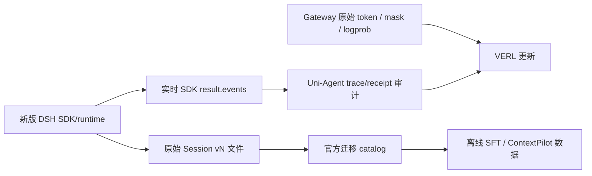

# DSH Session v2 候选升级与目标节点

2026-09-08。用户最新顺序：先对新版架构差异做适配和测试，通过后继续 M2。此顺序更新只读审计中“可先完成旧版 M2”的建议。现有 G1 仍 active。

## 目标与边界

让最新 DSH 0.1.3-alpha.2 经可追溯验证进入训练链路。候选 source 固定 b2369692ea530007075ebcd18d39fdba0bbd3982（upstream c389f96bf3a9b6807cb71ed6bdad5849be0df6d8）；已验收基线7840bced保留。候选测试不自动修改默认pin，不把旧M1结果归属于新版。

## 接口与链路

- SDK语义轨迹、原始Session文件、Gateway token分开记录。Session事件坐标不能替代token索引。
- v2成功message与失败attempt分开；离线样本只按显式接受规则进入数据。
- 原始hash绑定原字节；迁移后seq绑定逻辑版本。禁止改历史trace后复用receipt。
- flush/close持久化屏障与普通append/idle分开；fork进入Agent生命周期。
- ContextPilot三包属于DSH专题分支，不在新版根目录；core改动仍由DSH-Exp承担。本仓只做训练适配、消费验证和版本装配。

## 变更清单与测试顺序

| 步骤 | 文件/产物 | 验收 |
| --- | --- | --- |
| V1 源码影响审计 | dsh-latest-architecture-impact-audit.md | 版本、API及consumer差异可定位 |
| V2 格式/持久化专项 | dsh-session-v2-test-results.md | 官方迁移、attempt、JSONL、generation、built worker真实测试通过 |
| V3 SDK集成 | dsh-v2-sdk-boot-result.json、dsh-v2-sdk-scenarios.md | 新版built CLI boot、真实SDK事件与restart；模型替身不算训练 |
| V4 部署候选 | deployment/versions 新版候选、独立wheel/镜像 | source/wheel/镜像摘要完整；Linux部署重跑V3 |
| V5 训练接线 | harbor_dsh Task、runner上下文、Gateway独立登记及配置 | 真实token、任务身份、原始评分与receipt一致 |
| V6 M2 验收 | 独立run目录和结果报告 | 有效参数更新、独立reload、留出评估、资源清理 |

V1–V3先做最小只读/临时目录验证；有具体失败再按根因调整代码。V4–V6沿用既有G1部署与Harbor设计，避免额外执行循环。ContextPilot自定义事件迁移单独验收，不能机械删除sourceEventSeqs检查。

## 已通过目标节点（证据有版本边界）

| 节点 | 已证明 | 尚不能证明 |
| --- | --- | --- |
| 原生训练诊断 | 真实两步采样/评分/checkpoint、数值差异工具可用 | 原生样例梯度为0，不算有效学习 |
| 旧版DSH部署 | 7840 Linux runtime/wheels、keyless SDK、restart | 新版Linux部署 |
| M1有效更新 | 两步非零梯度；504 LoRA张量变化、399基础张量不变；10/10组消费审计 | 能力提升、完整记忆或RSI |
| M1独立reload | 明确加载step2；2/2留出组审计，无新优化步骤 | 留出提分（本次accuracy仍0） |
| 独立复建 | GitHub固定checkout、新venv与CUDA数值smoke | 冷机器完整重训 |
| Harbor独立评分 | 真实oracle=1/nop=0/评分伪造=0；异常产物拒绝 | 学生Harbor训练 |
| 模型方向网络 | Docker→SSH→RunPod完整session path传递 | 实际Gateway模型采样 |
| Worker合同回归 | 协议、账本、executor、HTTP等198项通过 | 真实worker→学生→VERL闭环 |

详证：m1-v3-results.md、harbor-host-archive-result.json、harbor-model-route-result.json；新版测试结果另附，不能用测试总数替代端到端验收。

## 仓库归属与远程升级

截图中的converter修复实际位于DSH-Exp/scripts/trace-training，提交3e93373，已是b236969祖先。本仓在线runner不调用它，不复制这一套离线消费者；若后续SFT使用其输出，固定导出器版本和数据合同即可。

本轮SSH只读实查GPU：/workspace/src/uni-agent=dcbd323a85667ef73a233632756f746b4a116c0b；/workspace/src/dsh-runtime=7840bced35ee07ebefbdce0106b56dbc00bdc3ef；训练venv内deepseek-harness-sdk和deepseek-harness-runtime-bin均0.1.2a1；nvidia-smi无活动计算进程。不是新版部署已完成。

远程执行顺序：

1. 新版DSH提交先成为可从GitHub拉取的固定revision；未推送状态下不能让GPU checkout一个远端不存在的commit。DSH发布仍归DSH-Exp管理，不代改其分支。
2. 本仓部署脚本与测试另行固定提交；现有build-dsh-runtime.sh明确只接受7840，必须为新版设计独立候选入口，不能直接替换常量后覆盖旧产物。
3. GPU新目录checkout新版DSH，构建Linux runtime及双wheel，记录SHA256；独立venv安装相同Uni-Agent/VERL/模型pin，仅替换DSH候选。
4. 新版Linux keyless、SDK事件/restart、trace/receipt回归通过；Harbor执行镜像也要包含同一候选wheel，不能只更新GPU。M2中DSH运行在Harbor worker容器，GPU负责Gateway和VERL。
5. 新run做有界真实采样、评分、更新、独立reload/留出验证；证明后更新默认resolved pin。旧M1环境/产物保留，不覆盖或补写历史receipt。

当前最新版built CLI+Python SDK在本机initialize/shutdown已通过。源码CLI另有FiberState导出失败，不能用dump-config成功替代SDK启动；目标Linux发行构建需要独立验证。
