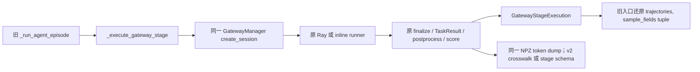

# Gateway 单阶段执行抽取

## 目标与范围

按已批准 native-memory-rl-credit-design 的 Resident backend 合同机械抽取现有单 session 执行能力，供后续 A/B 阶段复用同一个 Gateway manager。当前只增加内部 helper 与诊断 dump 区分，不实现 memory framework、跨阶段信用分配或第二套 Agent Loop，不运行 GPU。

## 文件与接口

- `uni_agent/framework/framework.py`：增加 frozen dataclass `GatewayStageExecution(session_id, context, task_result, trajectories, sample_fields, run_dir)`；抽取原方法主体；旧方法签名和tuple返回不变。
- `_execute_gateway_stage` 增加 keyword-only `stage_session_id: str | None = None`、`dump_consumption_crosswalk: bool = True`。ID仅由控制端显式提供，不读取 sample/tools_kwargs。显式ID必须 ASCII `[A-Za-z0-9][A-Za-z0-9_-]{0,127}`；空串、点、斜杠、反斜杠、空白、非字符串等在create_session之前拒绝。None保持原 UUID 命名。flag严格要求bool。
- stage返回原 TaskResult 对象与受控 runner_context；runner收到context副本，不能改写返回身份。sample_fields仍返回原对象。空轨迹也返回完整stage对象，保留旧空轨迹不dump行为。
- `dump_consumption_crosswalk=False` 时 NPZ ids/mask/logprobs不变、元数据 schema=`uni-agent.gateway-stage-dump.v1`；逐trajectory不包含`transfer_queue_key`。默认True仍为原`uni-agent.trajectory-dump.v2`和原TQ key规则。不声称stage已被TQ消费。
- `tests/uni_agent/framework/test_gateway_stage_execution.py`：CPU fake manager/runner真实经过helper，非mock整个被测方法。

## 行为不变量

创建与finalize各一次；同manager可连续运行多个独立stage。现有Ray timeout、取消、abort与评分/postprocess顺序保持；不扩大异常捕获范围，不改变原失败时机。不复制token数组、不重写reward策略、不修改外层并发信号量。stage schema故意不可冒充旧消费crosswalk。

## TDD与验收

先新增测试并证明缺少helper时RED，再抽取实现。检查一次Framework配一个manager、八stage八次create/finalize且零abort；TaskResult对象/上下文保真；采样参数副本；多轨迹token数组不变；空轨迹；runner异常及CancelledError abort一次；旧tuple兼容；合法/非法ID和bool边界；stage NPZ与v2数值一致、stage元数据无TQ key。运行全部framework CPU回归，Ruff检查新增/修改文件。GPU、TQ整链消费、训练credit仍为后续验收，不由这些测试替代。

## 本批实现与验证结果

已完成机械抽取；TDD 首轮以 `AttributeError: GatewayAgentFramework has no attribute _execute_gateway_stage` 证明 RED，新stage回归23项通过。全部 `tests/uni_agent/framework` CPU回归 **192 passed**（29.29秒，仅已有Ray state API弃用警告）；修改的两个Python文件 Ruff check / format --check 均通过。未启动GPU、未改remote源码、未改变信用分配或TQ写入。真实resident模型八session复用与后续memory onlineRL尚需独立执行验收，fake manager计数不能当GPU证据。
