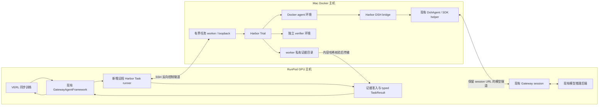

# Harbor 分布式 DSH bridge 设计草案

日期：2026-09-08。状态：**已授权分批实现；环境与模型方向网络探针通过，真实 Harbor 训练尚未完成**。
执行入口仍是当前 Uni-Agent worktree；DSH runtime 改动由 DSH-Exp 仓库承担。
本草案不改变正在执行的 M1，也不将 M1 的训练成功视为 Harbor 验收通过。

## 1. 目标与最短路线

保留 RunPod 上的 VERL、模型推理与 Uni-Agent Gateway，把 Harbor 的 CPU 任务环境
放在已有 Mac Docker Desktop。让同一个学生模型通过真实 DSH 完成任务，Harbor
提供独立验收；训练侧收到可信 TaskResult 前，必须持久化并验证全部执行证据。

**最短局部验证**：Mac 本机 Harbor + Docker + oracle。不需模型、远程服务或 GPU，
先完成一个正确结果和一个错误结果的验收与清理检查。

**满足完整训练目标的最短组合**：复用已有 DshAgent 和 Gateway，增加薄 Harbor
Agent、Harbor 环境借用适配、一个有界远程任务传输层；不再包一层 Agent 循环。
远程执行服务与模型参数更新解耦，先并发 1、同步训练，不引入 Ray 跨公网集群。

如果已有可直连 RunPod 的 Linux Docker 主机，优先将本文 Mac worker 放在那里，
可以去掉 ARM64/x86_64 差异；目前未确认这类主机存在，不据此购买资源。
Modal 可替换环境层，但不是本路线依赖，也不在本草案授权范围。

## 2. 已核实的环境和代码边界

| 项目 | 当前事实 | 设计影响 |
| --- | --- | --- |
| RunPod | 当前无 Docker daemon/socket，user namespace 禁止 | 不把 Docker-in-Docker/rootless 安装列为默认解法 |
| Mac | 只读查询 Docker 29.2.0，Linux aarch64，desktop-linux | 本地 H0 已完成 oracle=1 / nop=0；这不证明验证器防篡改隔离 |
| Harbor | 隔离安装 0.16.1；无内置 local/host/SSH 环境 | Uni-Agent LocalSandbox 不能直接作为 Harbor 环境 |
| HarborTask | `uni_agent/tasks/harbor/task.py` 为 CLI evaluation-only，拒绝 Uni-Agent sandbox | 保留既有评估行为；新增任务类型承接训练 bridge |
| Harbor Docker | 继承环境调用 docker compose，存在本机 agent/verifier/artifact bind mounts | 仅设置 DOCKER_HOST 不能解决 RunPod/Mac 路径与日志回读 |
| DshAgent | `uni_agent/agents/dsh/agent.py` 接收 sandbox，执行现有 Python SDK helper | 可借用 Harbor 环境，不重复实现 DSH loop |
| Gateway | 在 Ray 节点 IP 上启动随机端口，URL 含 `/sessions/<id>/v1` | 隧道必须保留完整 session 路径，不能转发到裸 vLLM 代替 |
| DSH 验收 | 现有 `DshArchitectureTask.run()` 自己创建环境 | 不能在 Harbor Trial 内直接调用整个 run()，否则双重环境所有权 |
| 训练证据 | Gateway token/mask/logprob + DSH receipt 已有严格审计 | 保留完整证据通路，只扩展 Harbor trial 绑定 |

证据来自本仓源码及本地 Harbor 0.16.1 安装源码。本次未声称查询了未来版本。

## 3. 架构与所有权

- VERL/Gateway 独占训练、模型调用和真实 token 轨迹；token 不从 DSH 语义事件重建。
- Harbor 独占容器创建、任务资源、执行/验收阶段切换和销毁。
- worker 独占 job 状态、超时、取消、证据导出；不得持有训练模型参数。
- DSH 独占 Agent 行为循环、工具调度和语义事件；bridge 不创建第二个规划器。
- controller/可信 verifier 独占奖励与准入；模型最终输出不作为评分回执来源。

## 4. 远程任务与 API 合同

首版选择 **Mac 主动连 RunPod 的 SSH 隧道 + 单并发 loopback worker**。
不要求公网暴露 Mac、开启 Mac SSH server、挂载远端 Docker socket或新增云服务器。
以下是待实现 API，不是现有工具。

### 4.1 启动前注册

Mac operator 启动固定版本 worker，登记 worker_id、Harbor version、平台、任务目录
allowlist、允许的 DSH runtime/image digest 和并发上限。RunPod 只接受已注册身份。
worker 不支持任意 shell 命令、任意模块路径、任意下载 URL 或临时安装依赖。

SSH 凭据由 operator 管理，不进入 repo、请求日志或 job manifest；禁止关闭 host-key
验证。控制 API 使用每次运行的短期令牌，令牌只通过私有环境/文件传递。

### 4.2 POST /v1/jobs

请求 schema `dsh.harbor-job-request.v1`：

| 字段 | 合同 |
| --- | --- |
| job_id / idempotency_key | controller生成，路径安全；同key同请求返回原job，异请求拒绝409 |
| run_id / group_uid / sample_index / partition_id | 训练侧身份，partition仅train/val/test既定值 |
| gateway_session_id | 必须等于实际Gateway会话，不由候选模型指定 |
| task_ref | 预装任务ID、版本、task目录内容digest；worker本地allowlist解析，不信任任意绝对路径 |
| dsh_release | source SHA、SDK/runtime文件digest、平台、profile、patch内容digest |
| model_route | 原始Gateway节点IP/端口、完整session路径、模型名、隧道别名；不接受任意外部目的地址 |
| budgets | deadline、CPU/memory、生成预算、最大产物字节；只能小于等于operator上限 |
| request_sha256 / nonce | canonical请求身份与单次执行nonce；重复执行创建新job和Gateway session |

响应202：job_id、accepted_request_sha256、worker_id、status。
任务prompt取冻结Harbor任务instruction；训练样本若添加提示模板，也要完整记录其hash。
发布请求前先记录Gateway身份和期望产物合同，不能结束后从worker结果反推可信身份。

### 4.3 状态、取消与结果

- `GET /v1/jobs/{id}`：queued/running/verifying/succeeded/failed/cancelled，以及阶段时间、
  分类错误；不返回凭据或未脱敏完整环境变量。
- `POST /v1/jobs/{id}/cancel`：幂等；先取消Harbor/DSH，再对本job拥有的Compose项目清理。
- `GET /v1/jobs/{id}/manifest`：只在seal后提供不可变的结果manifest与逐文件SHA256/size。
- `GET /v1/jobs/{id}/artifacts/{opaque_id}`：manifest内对象读取，限制长度和超时；不使用
  用户提供的文件路径，也不直接解包不可信tar到训练仓库。

状态succeeded仅表示执行及验收流程完整，任务reward可以是0。超时、不可达、缺日志、
无验收结果属于执行失败，不伪装成普通策略失败。连接断开不自动重复采样。
超时后先确认远端停止，再释放Gateway；结果未知的job进入人工可审计状态，不发第二份奖励。

## 5. SSH 与随机 Gateway 端口

### 5.1 控制面

Mac SSH连接RunPod，建立反向转发：RunPod某个**固定loopback端口** → Mac loopback
worker端口。RunPod runner访问该loopback端口，无需连接Mac公网地址。
开始前只读确认RunPod SSH允许TCP forwarding和reverse binding；若禁用则明确阻断，
不能通过修改服务器安全配置默默绕过。

### 5.2 模型请求

Gateway创建后，RunPod请求登记确切节点IP、随机port、session path。Mac侧建立
`local-forward → RunPod SSH → Gateway节点IP:port`，这与控制面的reverse-forward方向不同。
模型请求路径始终保持 `/sessions/<gateway_session_id>/v1`。

Docker容器不能把127.0.0.1当作Mac宿主。实现阶段二选一并先做无模型HTTP探针：

1. 宿主受控转发端点经 `host.docker.internal` 可达，监听与防火墙仅允许本机/任务容器；
   不假设SSH默认loopback监听可被容器访问，也不将裸端口开放到局域网。
2. 若宿主限制难以可靠配置，使用独立网络relay容器，经专用Docker网络暴露端点；
   relay持有隧道权限，DSH agent容器只看到session地址，不获得SSH私钥。

首选1，探针失败才采用2，不同时构建两套实现。Harbor网络策略须允许该确定目的地址；
oracle可no-network，真实Agent不可沿用完全断网配置。隧道对同一Gateway actor可复用，
按会话保留路径和凭据隔离，引用计数归零后关闭；首版并发1简化回收。

如果现有安全代理已提供可达的session Gateway地址，可复用它并省去模型隧道；当前未核实。
**只开放vLLM端口、或用教师API执行，均不满足学生Gateway训练轨迹目标。**

## 6. Harbor DSH bridge 与 runtime 平台

新增Harbor BaseAgent实现，`setup(environment)`核验匹配runtime，
`run(instruction, environment, context)`调用现有DshAgent.run。
通过Harbor支持的 `--agent module.path:ClassName` 加载，不依赖本仓Agent registry自动发现。

`BorrowedHarborSandbox`只映射exec、read/write、upload/download：

- exec保留argv、env、cwd、timeout、exit code，不能用无引用shell拼接。
- start/stop不拥有生命周期；借用对象不得销毁环境。由明确接口保证，不用隐式双层context manager。
- container artifact路径由worker配置，桥从agent环境下载SDK输出与canonical DSH事件。
- 原有DshAgent继续生成DSH session标识和trace hash；Gateway endpoint使用映射后的完整URL。

Mac Docker实际是Linux ARM64。RunPod Linux x86_64 wheel不能直接复制进去运行。
首个自有CPU任务应选已固定ARM64 Linux runtime构建；若只有当前x86_64发布物，
可明确使用linux/amd64镜像仿真作功能验证，并记录平台/镜像digest/性能，不声称原生吞吐。
每个任务镜像的Python、Node/ELF依赖与SDK/runtime必须预检；不把安装失败算模型失败。

真实benchmark若需派生镜像增加DSH runtime，应记录原task/image与overlay身份，核对其
评估规则后才称正式成绩。首轮用自有小任务，避免为跑通接口悄悄更改benchmark环境。

## 7. 评分、receipt 与训练准入

不直接调用现有DshArchitectureTask.run：它会创建另一个sandbox并运行另一套verifier。
复用其纯身份/receipt逻辑，必要时提取到单一公共模块，同时保持旧任务行为回归。

训练结果必须含三组关联证据：

1. **执行**：请求身份、task/runtime/profile/image字节、Harbor trial ID、DSH session、
   Gateway session、开始/结束时间、canonical DSH trace与agent完成状态。
2. **评分**：Harbor原始result、verifier日志、reward文件与固定评分器身份。首个严格任务
   使用独立verifier环境，复制明确allowlist产物，agent不能修改verifier、controller目录或receipt。
3. **训练**：现有Gateway真实tokens、response/loss mask、logprobs、权重版本、TQ group身份。

保留 `dsh.verifier-receipt.v1`；新增桥接sidecar `dsh.harbor-binding.v1` 绑定上面两类
receipt/trial/job/session哈希，或经评审扩展receipt版本。不能把Harbor JSON重命名为DSH receipt。
controller从冻结结果计算标量reward，typed TaskResult由RunPod runner在证据全量落盘并复核后生成。
任务普通失败可finished=true/reward=0；缺少可信结果则eligible=false，不进入更新。

artifact传输到现有DSH trace/result根目录，路径由controller根据可信session/hash重建；
不得照抄Mac绝对路径作为RunPod路径。远端字节与本地副本hash完全一致，不重写原始日志。
既有本地strict CLI仅支持dsh_architecture，要为新增task明确扩展准入，而非关闭strict。

**reward_extra_info只承载适合统计的指标。**完整嵌套receipt、manifest与Harbor结果保留在
专用extra_fields和磁盘证据，不再次把字典交给VERL求平均。M1对应修复须原样继承。

## 8. 拟变更文件（按实现批次裁剪）

以下均为设计清单，文件名不代表已创建：

| 文件 | 作用 |
| --- | --- |
| `uni_agent/tasks/harbor_dsh/task.py`、`__init__.py` | 新任务类型，远程job、证据准入、typed TaskResult；保留现有Harbor评估任务 |
| `uni_agent/tasks/harbor_dsh/protocol.py` | 请求/结果/绑定manifest校验；不引入第二种训练token格式 |
| `uni_agent/agents/harbor_dsh/agent.py`、`environment.py` | Harbor BaseAgent＋借用环境，内部复用DshAgent |
| `uni_agent/tasks/dsh/receipt.py`（按需） | 从既有task提取纯receipt构造；旧DSH路径保持同一实现 |
| `uni_agent/tasks/dsh/trajectory_audit.py` | 增加桥接身份验证，继续保留原trace/receipt/token检查 |
| `uni_agent/framework/task_runner.py`、任务注册入口 | 新类型dispatch及证据路径配置；不改VERL子模块或Agent循环 |
| `examples/harbor_dsh/task_config.yaml`、单任务目录 | 固定CPU任务、agent与独立verifier环境、schema/profile/runtime身份 |
| `deployment/services/harbor_worker.py` | loopback有界job worker，单并发、租约/取消/产物读取 |
| `deployment/services/harbor_tunnel.sh` | 仅管理本run所属SSH连接；健康检查/回收/日志脱敏 |
| `deployment/checks/harbor_bridge.py` | 无模型连接与版本预检，输出明确阻断原因 |
| `tests/uni_agent/tasks/test_harbor_dsh_*.py` | 协议、receipt、重试取消、TQ边界 |
| `tests/uni_agent/agents/test_harbor_dsh_*.py` | borrowed环境、DSH复用与生命周期所有权 |

先实现本地bridge合同和oracle，无远程worker也能验证；确认这一批后再添加网络批次，
不要为单任务首轮预先实现队列集群、多后端自动选路或动态资源采购。

## 9. 测试与验收门

- [ ] D0：读固定版本、运行环境/平台预检；零模型调用，检测Docker和SSH forwarding条件。
- [ ] D1：本地Docker oracle正确/错误双案例；真实文件/日志/reward/清理；独立验证器不能被agent篡改。
- [ ] D2：伪HTTP endpoint探针验证Docker→Mac转发→RunPod完整session路径，断线及时终止。
- [ ] D3：BaseAgent借用环境测试确保只创建/销毁一次，argv/env/timeout/文件字节不变。
- [ ] D4：协议测试重复job、nonce重放、错误session/task/image、超额产物、路径穿越、取消与未知结果。
- [ ] D5：真实学生DSH单任务，经Gateway得到非空token/mask/logprob和Harbor评分；完整receipt下载重算通过。
- [ ] D6：两个rollout形成完整GRPO组；正确/普通失败/基础设施失败区分；字典不进入数值metrics。
- [ ] D7：真实一次参数更新、独立reload；固定任务与预算的holdout，区分执行闭环和能力提升。
- [ ] D8：关闭本run worker/tunnel/容器后核对所属资源已清理，保留必要证据；不广域prune。

最关键回归：现有DSH本地训练仍通过，M1 receipt证据不丢，Harbor原评估入口不变。
CPU通过不替代D5–D7；oracle通过不等于DSH执行或RL通过。

## 10. 执行范围

用户已授权G1中的M2工程实现与现有GPU有界运行；不需要再次购买资源或重复申请该范围。此设计是适配现有RunPod无Docker这一实际限制的具体方案，须先审查API/文件清单再分批实施。任何运行仍有显式任务、时间、并发和产物预算；不扩展为无限模型调用或新增付费服务。

当前只交付设计，D0–D8不据此标记完成。H0已证明评分正反例和清理，但没有证明独立verifier防篡改隔离，D1的该子项仍待验证。

## 实测推进记录

- BorrowedHarborSandbox已实现；真实Harbor0.16.1＋Docker无网络容器验证binary roundtrip、literal argv、env/cwd和exit-code，全部通过；容器清理独立核验无残留。证据harbor-borrowed-smoke-result.json。
- 可重跑命令：`PYTHONPATH=. <Harbor venv>/bin/python deployment/checks/harbor_environment_smoke.py --task-dir examples/harbor/h0-file-write --output <全新目录>`，180秒边界。
- SSH配置只读确认allowtcpforwarding=yes、gatewayports=no。RunPod127.0.0.1:47081→SSH反向转发→Mac临时loopback HTTP探针nonce一致；专用隧道/HTTP结束后关闭。此证据只覆盖控制通路，不覆盖Docker→Gateway模型通路。
- DSH薄bridge已实现；真实Harbor setup与容器内SDK initialize/shutdown通过，尚未完成真实模型执行。

### 完整模型方向网络探针

2026-09-08：`deployment/checks/harbor_model_route_probe.py` 实测通过 Docker
`host.docker.internal` → Mac `127.0.0.1` SSH local-forward → RunPod 节点IP动态端口。
POST `/sessions/<id>/v1/chat/completions` 路径及JSON nonce原样抵达并返回。
报告：`harbor-model-route-result.json`。这里只使用短时HTTP探针，actual_gateway_used=false、model_called=false。
无需监听Mac的0.0.0.0，不需要额外relay容器；保留后续Gateway认证及任务准入。

初次探针服务器仅handle_request一次，SSH readiness空连接使其提前结束；修复为等实际POST或截止。
不能把该探针实现错误误判为Docker无法访问宿主loopback。脚本有SSH连接、服务器、容器超时及finally清理。
