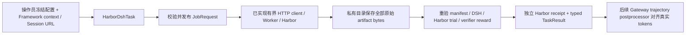

# Harbor Task 与训练证据绑定：最小实现合同

2026-09-08；已有 G1 分布式桥设计的获批细化。不更新 runtime pin，本批仅在 Task 类声明注册装饰器；registry/task_runner 由另一 agent 接线。不增加 Agent 循环或 sandbox。

## 目标与数据流

## 文件与 API

- 新增 `uni_agent/tasks/harbor_dsh/task.py`：`HarborDshTaskConfig(TaskConfig)`、严格 `RunnerContext`、`HarborDshTask.run() -> TaskResult`；类声明 `@register_task("harbor_dsh")`，lazy registry 由另一 agent 维护。
- 新增 `tests/uni_agent/tasks/test_harbor_dsh_task.py`：独立构造证据及篡改反例，替换 HTTP client 边界；真实 HTTP/worker 已由 client 测试覆盖。
- 仅必要时在同目录拆纯 receipt 验证函数；本批先保持一个实现文件。

冻结配置字段：`run_id`、`task_ref`、`policy`（含 DSH release 和每项资源上限）、`worker_url`、`worker_token`（SecretStr，禁止写入产物）、`worker_id`、绝对私有 `artifact_root`、`instruction`（从同一个冻结 task 目录读取原文）。首轮直接使用 policy 的资源上限作为预算，task_ref 必须在独立 policy allowlist。

运行时字段：`gateway_base_url` 必须来自 Framework SessionHandle，主机/端口与独立 policy 一致，路径严格等于 `/sessions/<gateway_session_id>/v1`；`runner_context` 必须由 runner 取 Framework `_runner_context` 覆盖注入，包括 partition_id、gateway_session_id、global_steps、group_uid、group_size、sample_index、session_index。两个 runtime 字段不列入 resolver 要求 YAML 必填的 operator-only 集合；由 runner 拒绝 dataset 传入并从可信 Framework 覆盖注入。单独调用 Task 的操作者同样属于可信调用边界；普通 dict 本身不是授权证明。

Task 不从 prompt/metadata 推测身份。`prompt_from_messages(prompt)` 必须与 operator `instruction` 逐字相同；非 None 的 prompt_template 一律拒绝，避免模板覆盖原始样本再伪装匹配。receipt 记录 instruction_sha256。instruction 与 task_ref 的对应关系由配置生成方从同一冻结目录建立，不能手工配置另一段文本却声称整体目录 hash 已验证该映射。job_id/idempotency_key/nonce 本地新建，实例仅执行一次，不自动重试。task 阶段不具备跨实例全局重放锁；worker ledger 承担远端会话冲突拒绝。

## 严格证据准入

1. 重新校验 typed request/manifest 与明确 worker 身份、预算、session/nonce/hash；只接收 manifest 列出的五种首轮 artifact，完整原始字节以 opaque ID 保存。
2. 私有目录 0700、文件 0600、排他创建，不覆盖既有证据；产物名称不接受服务器路径。请求与 canonical manifest 同存；异常保留调查证据但不生成 receipt。
3. DSH helper 合同复用 `_require_result`：固定容器 trace path、dsh-session 身份、trace hash、event_count、completed、sdk-minimal/no-patch、末尾 turn/end；严格 JSON 拒绝重复 key 和非有限数。
4. Harbor result 无 exception，trial id 与 manifest 相同；agent_result.metadata.dsh 内的 session/trial/trace/run hash、event_count、finished 与 helper 和原始字节一致。agent-result 独立原始文件未包含在五 artifact 中，本层不虚构对其 hash 的重新验证。
5. reward 原始 artifact 接受 Harbor 标准数值文本或单字段 JSON `{"reward": number}`；必须有限、非 bool，并与 Harbor verifier_result.rewards 精确一致。0 分是正常已完成任务，不是基础设施故障。
6. 新 receipt schema `dsh.harbor-verifier-receipt.v1`，记录 request、Framework context、manifest canonical hash、全部 artifact hash、task/release、worker/trial、reward 与 DSH 事件证据。自身 body hash 作为 receipt_id；不冒充旧 `dsh.verifier-receipt.v1`，不声明 Gateway token 审核已完成。
7. TaskResult 设置 reward==verifier_reward，finished=True；reward_info 使用独立 `harbor_dsh` 键，由 build_reward_info 验证后返回。后续 postprocessor 必须识别新 schema、重新读私有文件并绑定真实 Gateway context/token，不能直接走旧 verifier receipt 分支。

## 测试门与边界

先 RED 后实现：0/1 分、精确身份、私有字节和 receipt hash；篡改 trace/helper/Harbor/reward，session/nonce/trial错位、未完成/nonfinite/重复JSON键、未知artifact、symlink/非私有根目录、第二次 run 均拒绝。无 create_sandbox 或模型调用。

本批不完成训练准入 postprocessor，不运行 Harbor/Docker/GPU，不证明模型能力提升。HTTP token 与固定 worker 是信任边界，哈希提供一致性而非抵抗被攻陷 worker 的密码学证明。

## 本批验证结果

29 个 Task 测试通过；Task + client + protocol 组合 133 passed（0.81 秒），Ruff check / format 通过。初始缺失模块为 RED，最初基类默认 SandboxConfig 缺 provider 被测试发现；现显式 agent=None / sandbox=None，配置拒绝非 None，既不伪造本地 provider，也不创建重复环境。测试仅替换 HTTP client 边界，不能冒称这一轮真实 Harbor/GPU 训练。

## 后续接点：Harbor trajectory postprocessor（本批新增）

新增 `uni_agent/tasks/harbor_dsh/trajectory_audit.py` 与独立测试。入口 `validate_trajectories(trajectories, *, context, artifact_root, run_id, worker_id, task_ref, policy, instruction) -> list[Trajectory]`。所有额外参数来自 operator `trajectory_postprocessor_kwargs`；Framework 在 `trajectory_postprocessor_pass_context=true` 时覆盖注入真实 context，不允许 kwargs 提供 context。FQN：`uni_agent.tasks.harbor_dsh.trajectory_audit.validate_trajectories`。

审核从配置 root + 已验证 opaque job_id 重建路径，不使用 receipt_path 定位文件；但必须检查 receipt_path 的声明与重建路径一致。对私有根目录、job 目录、固定文件逐层 no-follow 打开；文件只接受 owner 私有 regular file、单 hardlink、有界读取且前后 fstat 未变化。控制 JSON 各 64KiB，artifact 总预算由独立 policy 与 manifest 限制。不会加载完整 Harbor executor 或训练 GPU 依赖。

重新验证 request 的 hash / task / release /资源与路由 policy，绑定 run_id 和 Framework 全部七字段；重读 manifest、receipt、所有 artifact，复用 Task.verify_downloaded_evidence。receipt body 必须与这些可信输入重新构造的完整字段相等，自身 canonical hash 与 TaskResult reward_info.harbor_dsh 相等。历史 request 的资源合同按其记录的执行窗口校验，不因审核发生在 deadline 后就伪称新运行，也不通过文件 mtime 猜测 freshness；独立 worker ledger 的 session/nonce 一次性规则仍是重放边界。

复用现有 DSH `_validate_token_evidence` 检查真实响应 tokens、mask 与 logprobs 对齐；严格绑定 typed finished/reward 和完整 dsh_reward_info.harbor_dsh。返回原 Trajectory 对象，不改 token/mask/logprobs、reward 或元数据。失败抛 TrajectoryAuditError，不能退化成 reward=0。测试覆盖磁盘篡改、全部 context 错位、跨 worker/run/task/policy、路径与 symlink/hardlink/非私有权限、token 证据无效，以及对象与数组保持原样。

本接点验证：新增 47 项 audit 测试通过，含真实 Framework FQN/kwargs/context 调用合同与 0 分准入；audit + Task + HTTP client + 旧 DSH audit 回归共 124 passed。新 audit 模块语句覆盖率 96%，Ruff check / format 通过。测试使用 Task 实际写出的私有文件；Task 的 HTTP 返回由受控 fixture 提供，并未运行模型、Docker 或 GPU。token 测试使用显式测试 token 数组，仅验证原样保留与非法证据拒绝，不能当成真实 Gateway rollout 证据。
