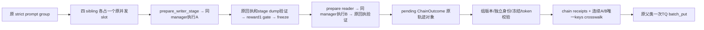

# NativeMemoryFramework：resident A/B 与整组 TQ 接线

## 已批准范围与更短实现

复用已抽取 `_execute_gateway_stage`、训练阶段准备/审计器和原 framework strict 组。新增 subclass，不另写 trainer，不调用 inference CLI 重启模型。固定 VERL 的 `compute_advantage_for_multi_trajectories` 只用每个 sibling 最大 trajectory index 的终态 reward 算 GRPO，再广播回所有段；已有 pin AST 测试用非终态99证明。因此保留原 A/B `Trajectory.reward_score` 与 `dsh_reward_info`，不制造与原回执冲突的训练副本。A所有段在前，B所有段在后，最后一段必须是B生成输出。

## 修改文件与接口

- `uni_agent/framework/memory_chain.py`：`NativeMemoryFramework(GatewayAgentFramework)`、组pending与chain receipt/crosswalk审计。
- `examples/dsh/capabilities/memory_credit.py`：最小扩展validate_credit_group，train仍必须4，val仅1，其余角色/版本/token/冻结门完全相同。
- `tests/uni_agent/framework/test_native_memory_framework.py`、原memory_credit测试：CPU真实prepare→fake模型执行→真实阶段校验/freeze→真实父TQ批写（外部队列使用fake）的集成与反例。
- 不修改正在GPU运行checkout、旧gateway helper、默认framework或VERL。

`from_config` 经现有 `framework_class_fqn=uni_agent.framework.memory_chain.NativeMemoryFramework` 入口加载。operator配置置于 `actor_rollout_ref.rollout.custom.agent_framework.memory_operator`，含root/runner_python/runtime_executable/environment_digest/checkpoint_identity/family；`memory_run_id` 独立标识此次运行。sample只提供普通uid/agent_name，不可指定operator或stage路径。

构造/配置必须严格检查：sync、GRPO、use_kl_in_reward=False、训练n4/val n1、calculate_log_probs=True、strict错误/finished/verifier/dump、所有trajectory selection=all、无reward worker覆盖。首版runner仅 `uni_agent.framework.task_runner.run_task` 的ray_task派发；原inline缓存不会按stage runner_config副本更新，故不把私有YAML误传给旧缓存runner。

## 调用与生命周期



阶段接口与wiring任务对齐：`prepare_writer_stage(operator, context, *, chain_id, gateway_session_id)`；`freeze_and_prepare_reader(writer_spec, execution, *, reader_gateway_session_id)`；`validate_stage_execution(spec, execution)`返回receipt/envelope/rescore/fixture。`StageSpec`提供可信YAML、raw_prompt、metadata及trace/result根。

每stage复制 `_RunnerConfig.runner_kwargs` 写入task_config_path/DSH trace+result根，sample复制只替换raw_prompt/tools_kwargs.task metadata，再调用同manager helper，`stage_session_id`由控制端UUID分配，`dump_consumption_crosswalk=False`。禁止sample覆盖YAML。原TaskResult/轨迹及stage回执保持不变。

覆盖方法仅 `_run_agent_episode`（A/B组织）、`_write_prompt_trajectories_to_tq`（验证/审计后调用super）、`_run_prompt_rollouts`（调用super及finally释放本组pending）。pending按partition/uid/global_steps隔离，禁止并发重复scope；一次失败保留磁盘证据但释放引用。原strict组失败状态、部分TQ写入清理、取消行为沿用，不复制父方法实现。

## 审计合同

实际版本必须每个trajectory都有complete计数、min=max且全组同版本；训练要求与提供的expected global_steps一致，验证也须实际版本完整，不能缺失时拿调度字段补齐。val n1可用唯一实际版本作为expected version，但仍拒跨度/缺失。

新chain receipt绑定A/B receipt摘要、冻结manifest/content、模型身份、实际版本、终态B reward、逐段stage/index/唯一TQ key与token摘要。crosswalk为独立`uni-agent.memory-chain-crosswalk.v1`，不冒充旧单session v2。审计重新读取原stage JSON/NPZ并检查摘要/真实token与映射，TQ一次提交前必须全部通过；receipt表示信用关系准入，不表示trainer已消费。提交后的组记录只称TQ写入返回；实际消费仍需独立读取consumed-group证据逐key核对。

## CPU测试与后续验收

TDD覆盖：n4八个真实stage、同manager八create/finalize；n1验证两个stage；B reward有0/1时A原reward1不变，TQ key连续不碰撞且终态B最后；真实stage准备/冻结/回执边界；版本缺失/混用、writer失败、任一B异常拒全组；TQ部分失败原清理及pending finally；重复scope/安全路径/operator注入；config拒非sync/非GRPO/非strict/非all/inline。框架全CPU回归与Ruff双门。GPU resident dry eval和一步n4有效学习、真实消费/独立reload不由CPU测试代替。

## 本批落地与精确配置边界

实现采用保留原stage奖励的更短路径，没有训练奖励副本：父类TQ字段中A仍为1、合法零分B仍为0，固定VERL按最大index的B奖励广播优势。`audit_memory_chain_crosswalk()` 核新的信用映射、原stage JSON/NPZ/receipt字节与ID、冻结内容和身份、版本计数，以及chain/sibling唯一、所有items恰好覆盖与A后B次序；返回始终 `consumption_verified=False`。`submission.json` 仅记录原TQ批写已返回，不宣称trainer实际消费。历史字段 `dsh.receipt_sha256` 实为不含receipt_id的规范body摘要，即receipt_id；新增 `stage_receipt_file_sha256` 单独记录整个原回执文件摘要，不混淆两者。

为避免静态postprocessor使用错误的全局artifact roots，NativeMemory构造明确拒绝配置该postprocessor，改用每stage后和组提交前必经的完整 `validate_stage_execution()`；其中原 typed trajectory_audit 使用各StageSpec私有root，不修改共享self、不跳过原reward/trace/receipt审计。新recipe需显式删除全局postprocessor FQN/kwargs，并将trajectory_postprocessor_pass_context设False；其余strict/verifier/finished/dump均必须True。

控制端关键配置（由后续独立recipe配置，不修改当前训练run）：

```yaml
actor_rollout_ref:
  rollout:
    n: 4
    calculate_log_probs: true
    val_kwargs: {n: 1}
    custom:
      agent_framework:
        framework_class_fqn: uni_agent.framework.memory_chain.NativeMemoryFramework
        memory_run_id: <new-independent-run-id>
        memory_operator:
          root: <private-stage-root>
          runner_python: <validated-venv-python>
          runtime_executable: <pinned-installed-runtime>
          environment_digest: <sha256-pinned-runtime>
          checkpoint_identity: <fixed-model-and-adapter-identity>
          family: constraints  # 或 updates；首批固定模板
        fail_on_rollout_error: true
        require_finished_episode: true
        require_verifier_reward: true
        require_trajectory_dump: true
        trajectory_postprocessor_pass_context: false
        # 不配置trajectory_postprocessor_fqn/kwargs；强制各StageSpec完整审计
        agent_runners:
          task:
            runner_fqn: uni_agent.framework.task_runner.run_task
            dispatch_mode: ray_task
            trajectory_selection: all
trainer:
  use_v1: true
  v1: {trainer_mode: sync}
algorithm: {adv_estimator: grpo, use_kl_in_reward: false}
```

NativeMemory禁止配置任何episode source复制参数或Harbor路由，防止A私有源经通用runner重新复制到B。传入prompt的global_steps必须显式非负，且所有真实Gateway generation version必须完整且恰好相等；standalone inference缺实际版本时会拒绝，不能用None或调度版本作补值。

## 验证结果与仍未完成项

TDD：先证明新module缺失与val n1被旧四组合同拒绝，再实现；root指出的重复chain可通过问题也先RED复现。当前 **276项组合CPU回归通过**（完整framework + memory_credit + 固定VERL数学 + 真实stage准备/训练verifier，39.69秒）。其中新增NativeMemory 25项、val合同1项；后补TQ实际rm_scores/ids/masks/logprob保真的零分断言单测通过。四个修改Python文件Ruff双门通过。

测试确实经过from_config→原prompt group→原stage helper→真实TaskConfigResolver/DshArchitectureTask与verifier子进程→真实freeze/重新审计→原TQ batch构建；Ray执行器、模型动作/Gateway token与外部TQ服务是CPU fake，未启动模型或GPU。故尚不能宣称真实residentbackend共享、真实策略版本就绪、训练消费、非零advantage或参数更新已验收。后续还需独立数据/部署清单、resident验证n1、真实n4一步训练与消费/reload，且全B=1组不能冒称有学习信号。
# Fixed sync 的调度 step 与权重版本

训练调度 step k 使用上次完成更新的权重 k-1；val 在初始化或本轮发布后使用当前 k。
依据固定 VERL `trainer_sync.py:on_init_end/on_step_end` 的 `update_weights(self.global_steps)`，
以及 `trainer_base.py:fit` 先递增 step、采样更新、发布权重、再验证的时序。
Framework 保留 GroupContext、TQ tag、stage context 的调度 `global_steps`，单独计算
`expected_policy_version`：train 要求 step >= 1 并取 k-1，val 要求 step >= 0 并取 k。
crosswalk 显式记录两者；credit、chain receipt 与实际 generation min/max 对照权重版本。
不修改真实 version evidence，也不把缺失版本补成推断版本。

## r1 真实注入修复：reward worker 句柄不等于奖励来源

真实 VERL 会把非空 reward_loop_worker_handles 注入 Framework；原 NativeMemory 构造器把其存在直接当作会覆盖奖励而拒绝，导致 r1 在阶段执行前失败。原 Gateway 的实际优先级是 custom+worker、已有 TaskResult.reward、worker fallback；DSH 的 reward 已由 verifier 绑定，不能因基础设施传入句柄而拒绝启动。

局部修改 `memory_chain.py` 构造器：仍拒绝 custom_reward_function_configured，并在调用 Gateway 父构造器前明确把句柄置为 None，使该 NativeMemory 实例没有 worker fallback 或覆盖通路。from_config 继续接受 VERL 标准参数，阶段要求 verifier_reward 的硬门不变，A/B 原回执与原 reward、末 B GRPO 归因均不修改。测试必须向真实 from_config 与直接构造器传非空会在任何调用时报错的 fake handles，并执行真实 CPU stage/verifier/freeze/TQ 构建（模型/Ray/TQ是测试替身）；B=0/A=1 的原奖励仍分别保留。custom reward 配置继续拒绝。

验证记录：修复前定向 RED 为 2 failed / 2 errors / 1 passed（非空句柄在构造期复现失败）；修复后 NativeMemory 38 项通过，共享 Framework + memory credit/GRPO/stage/verifier/audit 回归 316 项通过。Ruff 与 diff whitespace 检查通过。本项为 CPU 合同验证，旧 GPU r1 失败仍保留，新 GPU run 尚待重新验收。
