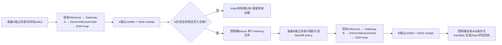

# N1 真实学生 A→freeze→B 评估薄接线

状态：可实施设计，提交主线程审阅；尚未实现学生链。前置证据为已通过的固定 Linux SDK 无模型文件策略 canary：`native-memory-policy-linux-canary-r1.json`，代码0fdcbeb、SDK/runtime0.1.3a2、exe SHA d1a467a9…、14次真实工具请求。它证明工具边界，不证明模型记忆效果。

## 1. 目标与最短路径

先做**评估链**：同一固定4B checkpoint，A真实调用DSH文件工具写记忆，控制端在A退出后冻结单文件，B以全新Gateway/DSH session仅见问题和handoff，独立评分。一次Task仍只执行一次Agent并产出一份Gateway轨迹；不改训练器、不拼接A/B token、不把B奖励回填A。训练credit另立里程碑。

控制端只编排两个完整任务的生命周期，DSH仍是唯一任务内Agent Loop。首先复用 `examples/inference/parallel_infer_verl.py` 两次独立推理调用；固定同一checkpoint与采样参数。确有两次模型加载成本，但此阶段优先利用已验收入口，之后可复用同一engine；不会为评估链提前引入全异步或新训练循环。

## 2. 已有代码边界与设计选择

- `uni_agent/tasks/dsh/task.py:DshArchitectureTask.run`只调用一次agent.run，随后生成envelope、运行独立verifier并生成fresh receipt。
- `uni_agent/agents/dsh/agent.py:DshAgent.run`从Gateway URL提取session，实际DSH身份为`dsh-{gateway_session_id}`。runner把该session_id交给harness.run。
- `uni_agent/tasks/dsh/task.py:_task_result`的reward_info仅绑定一个Gateway rollout_id和一个DSH session/trace；不能容纳“B答案奖励归因A+B两条轨迹”的训练语义。
- `memory_artifacts.py`已有单文件freeze/load；`memory_closed/profile.py`已生成角色白名单overlay，`policy.mjs`仅允许指定editor命令/路径。
- **本批不改上述Task/Agent/runner主逻辑**。每个stage一个独立task.yaml、overlay与run根目录；verifier与控制端从实际Task回执取得真实session身份。
- 当前policy config字段`sessionId`是控制端composition标签（canary报告也如此标明），不是SDK实际session。准备阶段用唯一stage标签；最终chain只接受Task回执中的真实Gateway/DSH身份，绝不能把准备标签写成训练session。未来若需policy直接绑定运行session，再在Agent创建session后注入配置，另做变更。

## 3. 文件布局与严格读取边界

每条chain使用新的私有控制端根目录，禁止复用。A/B/frozen/control分别建目录；每stage另有专属dsh_home、trace/result、配置和输出。Linux使用兑现0700/0600的本地/root/runs，归档到/workspace不改变源合同。

| 角色 | view白名单 | write白名单 | 明确禁止 |
|---|---|---|---|
| A | A来源文件、自己的memory输出 | 单个memory输出create/str_replace/insert | 改来源、读评分/控制文件、shell/cordis/PTC |
| B | 冻结memory.bin、B问题文件 | 首批无文件写入，仅最终JSON答案 | A来源/A响应/日志/manifest/控制文件，修改handoff，其他工具 |

新profile= sdk-minimal，仅加载本轮生成closed overlay，不混evolution.patch，不加载probe.mjs。每份overlay source/config hash写入stage manifest。词面/规范路径和普通文件约束沿用已验收policy；控制端在runtime执行期间不修改白名单树，没有不可信并发写者。不声称这是恶意代码OS沙盒。

B prompt只给问题与handoff路径，绝不复制A对话/答案。即使模型猜出A绝对路径，已验收policy仍拒绝。读取handoff属于独立文件动作，评分必须核对实际成功tool result，不能仅按最终答案猜对给满分。

## 4. 两个最小任务族与对照

1. **约束事实保真**：A来源包含用户部署偏好、明确不可做事项与版本号，A写小型结构化记忆；B新任务询问该偏好和禁止事项，必须引用handoff的字段/事实。奖励依赖事实正确而非压缩token数量。
2. **更新覆盖与冲突处理**：A读同一实体旧值与显式生效的新值（附版本/来源）；记忆应保留新值和冲突解决依据。B问当前有效约束，答旧值或编造缺失字段为零。

每族先一条诊断chain，固定小预算；不称heldout泛化。增加匹配no-memory B对照：同题、新session、同采样设置，只能读无目标事实的空handoff，正确行为为insufficient_evidence。需单独对照manifest，不能冒充从A冻结的原handoff。全链成功率分母包含A失败；另列A成功率、条件B成功率，避免只挑A成功样本夸大能力。

## 5. A准入与freeze条件

控制端必须验真：本次inference正常结束；唯一目标UID；真实Gateway/DSH身份；envelope/trace/receipt digest完整一致；fresh/eligible=true；finished=true；完成tool pair；verifier bundle和runtime/source/checkpoint pin一致；A任务reward=1；memory文件普通、单硬链接、预算内、内容hash与A verifier记载一致。

任一失败均记录chain `writer_failed`，不创建frozen、不启动B；零分完整尝试保留为合法失败，不能改成成功或静默丢弃。A进程已退出才freeze；不读取模型声称的任意输出路径，输出路径由可信fixture唯一指定。调用freeze_memory_artifact时writer_session_id用实际DSH A身份，source_version用本轮fixture版本/hash而非未经证实的运行时版本。

## 6. B奖励与chain回执

B独立verifier按现Task接口输出finite reward、accuracy、finished、eligible、fresh、issued_at和evidence。复用现有envelope/trace身份校验帮助函数但不修改既有M1 verifier三源码。新增verifier bundle覆盖导入闭包与自身源码。

B fixture包含chain_id、实际A Gateway/DSH身份、A receipt/trace/hash、expected frozen manifest/content SHA和source_version；其fixture hash进入Task metadata。B verifier从可信envelope取得实际B身份，调用load_memory_artifact(reader_session_id=实际B DSH身份)，拒绝B=A、错chain/manifest/源版本/篡改。B成功还要求：新会话、正确事实/引用、实际读取handoff成功、无越界调用、完成turn。合法答错reward=0且保持eligible；不完整/身份错误/越界为ineligible，不能放宽完成准入。

chain评估回执另列：chain_id；A/B Gateway与DSH身份；A/B task_id、receipt、trace SHA；frozen manifest/content SHA；checkpoint/source/runtime/verifier/policy hashes；结果和failure stage。Task B已有单session receipt保持原样，chain回执摘要作为独立证据，不强塞入旧训练reward_info schema。

`training=false`、split=test、credit_assignment=none 写入准备清单与结果。即使B Task产生verifier_reward，也只是推理评分；本控制端不调用训练脚本/optimizer。不得生成伪造A+B rollout或宣称已实现跨会话RL。

## 7. 预计文件与API

- 新 `examples/dsh/capabilities/memory_tasks.py`：两个任务族fixture/来源/问题，准备stage专用task.yaml与closed overlay。
- 新 `examples/dsh/capabilities/memory_verifier.py`：writer/reader两模式，通过fixture role分发，输出既有Task兼容的独立评分。
- 新 `examples/dsh/capabilities/memory_chain.py`：CPU控制端transition API：`admit_writer_and_freeze(...)`、`prepare_reader(...)`、`finalize_chain(...)`。输入可信manifest+实际stage回执路径；不在API里调用模型。
- 新 `examples/dsh/capabilities/prepare_memory_eval.py`：准备writer入口、同checkpoint推理参数与执行说明；B准备依赖A真实结果，不预造session/hash。
- 对应 `tests/uni_agent/examples/test_memory_{tasks,verifier,chain}.py`；本文后续更新结果。不改Task主流/原M1/DSH本体。

## 8. 测试与实施顺序

1. CPU红测试：A失败/零分/unfinished/错receipt不freeze不产生B；A成功才freeze；路径/hash/预算/硬链接篡改拒绝。
2. CPU独立verifier：两族正例、旧值/遗漏/编造零分、没真实读handoff不得满分、B重用A身份拒绝、错manifest拒绝、完整合法零分与ineligible分开。
3. 真实固定runtime无模型A/B策略canary已通过；可复用其负例作为回归，不替代学生轨迹。
4. 主线程审阅CPU设计后实现并格式化/测试/固定源码，准备新run；由主线程调度GPU学生A，确认结果后freeze并准备B。
5. B实际回执通过身份核验再报告“学生跨会话文件记忆评估链跑通”。加入no-memory对照；训练信用/数据扩展随后单列，不用初始两条诊断样本宣称能力提升。
