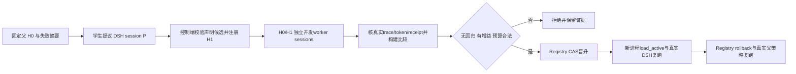

# RSI 下一阶段：真实学生提议与独立开发比较

状态：后续设计，未实施、未启动GPU；不阻塞当前context RL与memory。
目标：用现有DSH/Uni-Agent/VERL执行入口完成一个可审计的学生候选实验，先证明工程与真实行为，
再单独设计RSI RL信用归属。本阶段不新建trainer、Gateway、教师服务或SFT流程。

## 1. 已有基础与最关键缺口

| 已有资产 | 可直接复用 | 不能据此推断 |
|---|---|---|
| [Registry](../../uni_agent/tasks/dsh/rsi_candidates.py) | 固定pins、父/候选内容hash、开发比较约束、CAS晋升、历史/防重放、实际回滚 | expected receipt hash是控制端信任输入，不是自动认证；它不读取验证真实DSH episode的完整证据 |
| [renderer](../../examples/dsh/rsi_closed/profile.py)与[policy](../../examples/dsh/rsi_closed/policy.mjs) | 固定源码hash、禁shell/code、只读operator文件、单调执行deny | 当前只支持str_replace_editor与cordis_inspect_list；不是通用profile搜索或OS沙盒 |
| [固定Linux canary](native-rsi-policy-linux-c5acd30-r1.json) | 新进程加载→真实DSH权限变化→回滚恢复；固定0.1.3a2 | synthetic选择比较不是学生开发评估、生产晋升依据或RL轨迹 |
| [DshArchitectureTask](../../uni_agent/tasks/dsh/task.py)与[轨迹审计](../../uni_agent/tasks/dsh/trajectory_audit.py) | 原生envelope→verifier→fresh receipt、Gateway会话身份及真实token审计 | 现有单session结果没有自动代表跨候选开发比较，也没有自动把worker奖励赋给proposer |
| [strict inference](../../examples/inference/parallel_infer_verl.py) | 固定学生模型→DSH唯一循环→Gateway→严格轨迹准入→TQ读回 | 推理成功不是优化器更新；不生成跨阶段GRPO组信用 |

**必须先解决候选评估与晋升的循环依赖**：现build_patch仅调用Registry.load_active；未晋升候选
无法通过此入口加载。但正确顺序必须先评估候选，再决定晋升。不能用synthetic receipt提前晋升，
也不能直接改active文件或给候选造一个假active hash。

最小补口是Registry公开只读`load_registered(candidate_sha256)`，校验现有不可变对象和pins；
renderer新增明确的evaluation模式，从该候选渲染临时评估overlay，另绑定真实父active快照。
生产load_active路径不变。返回`phase=candidate-evaluation`、candidate/parent/父active/overlay hash，
不得把尚未晋升的候选标成active。此API名称是本设计建议，当前代码尚无该公开接口。

## 2. 最小实验与业务目标

固定一个模型checkpoint M0，同时充当提议者与开发任务worker；所有阶段明确角色、session、预算，
不调用更大模型。固定基础Harness H0及版本。候选仍只能提交声明式profile和允许工具组合，不允许
提交代码、路径、verifier、数据集或额外配置。

首个实验只是**受控只读工具策略修补**：父候选允许固定文件view，但禁止runtime inspection；
学生获得父配置及可信失败摘要，自行提出候选。控制端可接受的执行子集仍为view与inspect_list。
拒绝shell/code等候选；不扩大policy权限来迁就模型。

至少两个真正不同的开发任务，而非同题换UUID：

1. **运行时能力发现**：从实际inspect_list返回中，依据任务需求识别一个符合条件的Inspect Provider/
   方法声明，给出可核对的ID和证据。题目不提供标准答案；verifier从真实成功tool result及固定的
   选择规则独立求解。父若正确说明此策略下无法查询，必须根据预先合同记录“安全完成但未完成业务”，
   reward=0、eligible=true；伪造查询证据拒绝。当前v3 runtime-grounding要求后续inspect_query，
   超出本overlay子集，**不能原样套用该v3评分器假装本题已验证**。
2. **文件约束取证回归**：从独立工程文件完成一个有引用的事实裁决；可复用现context v2评分和真实
   文件读取证据。父/候选均应成功，新增inspection权限不能导致读取错源、遗漏约束或超预算。
   使用新建的RSI开发实例，或者明确将已公开dev实例用于开发；不能拿封存题选候选。

两个任务共享固定模型与解码/预算；实际任务ID、fixture/verifier版本分开，开发manifest冻结两者。
每个任务H0/H1各一次独立worker执行，至少4个真实开发episode；之后增加独立进程加载复跑与回滚
复跑。此数量仅为工程闭环：不保证候选优于父，不够统计证明。单次严格无回归+增益不满足时应记录
拒绝，无无限重试。若没有候选值得晋升，该轮“真实比较与拒绝链”可通过，但晋升成功节点仍未完成。

这个搜索空间很小，“开放更多预授权只读工具”可能总是占优。因此成功只能称策略修补闭环，
不能称广泛RSI、长期自进化或Harness最优。后续才扩大不同约束/成本/失效机制，避免学到永久全开放。

## 3. 分阶段数据流与身份



所有DSH内部动作仍由原Agent Loop执行。控制端只协调实验阶段，不自行实现消息/tool循环。

| 身份 | 绑定位置与作用 |
|---|---|
| evolution_run_id、pins_sha256 | 一次实验及固定model/runtime/base_harness/devset/verifier身份 |
| proposal_task_id、P的Gateway/DSH session、trace/receipt SHA | 唯一提议来源；student最终JSON只是候选提议 |
| parent_candidate_sha、candidate_sha、content_sha | 不可变候选谱系；不以文件名或模型自报ID代替 |
| evaluation_id、case_id、arm=parent/candidate、worker session | 配对业务比较；每个arm独立工作目录/home/trace |
| phase、父active快照、overlay/source/read-files SHA | 区分未晋升评估与真正active加载，固定实际执行策略 |
| comparison_sha、selection transition SHA | 认证后的开发比较与真实CAS晋升/拒绝/回滚证据 |
| reload_validation_id / rollback_validation_id | 新进程真实行为复跑，不用不同session字符串冒充进程隔离 |

这些可先写在operator运行manifest与Task metadata额外字段中，保持既有Task接口和fresh receipt结构。
controller二级审计核metadata与冻结manifest一致，并通过artifact/trace/receipt hash关联。
当前runner的patches_digest主要绑定**路径列表**，不足以证明文件内容；必须另外固定overlay字节与
policy源码hash，在加载前后复核，工作目录禁止学生修改这些文件。不能只比patch路径字符串。

## 4. 真实比较回执与准入

新增的应是一个小型控制端比较构建器，输入真实episode artifact路径和外部登记的run/fixture/pins，
复用现有审计，不新增另一套训练adapter。

每侧必须通过：

- DSH session/Gateway rollout身份、真实token/mask、trace与artifact摘要、fresh receipt及verifier身份；
- finished与eligible；模型安全完成但失败可以为0，基础设施失败/不完整/伪证据单列，不参与晋升比较；
- candidate/parent/phase/overlay/source与当前冻结配置一致；同题同模型同预算、外部控制的fixture；
- 原始reward数值与receipt相同，不从最终文本`promote`或自评推导；比较逐case完整且无重复episode；
- `tokens`明确使用该worker所有模型请求的真实生成token IDs总数，不能写canary假数字或用字符串长度估计。
  input tokens、时间和工具次数另记录，预算单位在dev manifest中固定。

然后才能构建Registry接受的dsh.rsi-development-comparison.v1。Registry pins只有一个verifier_sha256，
这里应固定**开发评估器组合manifest hash**，包含两个case各自verifier id/version/bundle与组合规则；
不把其中一个case的verifier hash冒充全部评估身份。各case原DSH receipts保持自身verifier身份。

控制端持有比较文件外部hash并调用promote；hash证明固定而非签名认证，生产调用权不能交给学生。
synthetic canary devset/evolution身份与数据完全排除。真实比较不可用时保持父active，不降级借用合成结果。

## 5. 先工程可跑，再讨论RSI RL

**本阶段是固定权重评估**：不创建optimizer，不产生用于训练的跨阶段reward credit。
提议合法性与开发收益分开报告；合法JSON不等于有益候选。开发worker的任务reward归它自己的episode，
先只评估，不拼接多个session token，不把H1收益复制到所有参与会话。

后续最短RL方案是“只训练proposer，冻结worker评估器”：

1. 每个GRPO样本是一次提议session P；controller为该提议运行有界独立H0/H1开发评估。
2. 一个候选获得一个冻结的外部任务收益信号，必须绑定P的rollout、candidate、comparison SHA；
   同组多个候选来自同一当前policy版本/相同问题环境，不能把不同worker case误当GRPO候选组。
3. 仅P的生成token进入对应梯度；worker evaluator轨迹作为独立证据保留，排除P的loss/mask。
   先明确成本、失败/取消、超时与无增益候选如何给分，不能在实现中临时复制worker reward。
4. 现DshArchitectureTask是单session后评分；若要支持跨worker比较，需一个明确的任务侧协调边界
   与回执关联扩展。优先复用现DshAgent/Task runner、Gateway客户端、VERL adapter和trajectory audit；
   不从头实现trainer，不通过退出strict模式来接通。
5. 能证明本策略token→正确proposal reward→实际训练消费→参数变化/reload之后，才算RSI RL工程通过。
   联合训练worker或跨任务长期信用不是本最短方案，另设里程碑。

这里还有一个不能隐去的版本缺口：现有单个共享rollout backend不会自动同时维持“正在更新的proposer”
与“永远固定M0的worker”。若坚持固定worker模型，需先验证在已有backend上受控串行加载固定快照的
可行性与成本，不在本设计中假定新服务已存在。更小的替代是**同一训练step内冻结同一policy快照**，
P和worker都用此版本，worker token仅stop-gradient、更新后下一step重建对照；这会让评估策略随step变化，
必须明确更改奖励合同并报告该限制，不能仍声称跨step固定评估模型。该决策是RSI RL前的专项设计门，
不影响本阶段固定M0的纯工程评估。

生产效果评价再用冻结测试，四格M0H0/M1H0/M0H1/M1H1区分权重学习、Harness变化及交互；
候选选择只用训练/开发集，封存测试不进入RSI自适应回路。

## 6. 后续实现范围建议与验收

建议少量新增/扩展文件：Registry只读pending loader；现renderer的evaluation模式；
examples/dsh/rsi_closed下的学生实验协调入口；runtime inspection dev任务及独立verifier；
控制端真实receipt比较构建器。每项先设计对应API/负例，再实现；当前文档未创建这些入口。

工程验收最小节点：

- [ ] 学生P真实DSH提议，严格声明式schema、来源trace和候选hash绑定。
- [ ] H1在未晋升情况下隔离评估，父active不变，phase与overlay身份明确。
- [ ] 两个不同开发任务×两侧，四份真实episode/receipt，独立认证比较；合法失败与不可用证据区分。
- [ ] 无回归且有真实收益才CAS晋升；错误/过期/伪比较保持父选择。
- [ ] 新进程加载已晋升候选并真实复跑；回滚后新进程恢复父行为与业务结果。
- [ ] 报告如实标记training=false、model_evaluation=true，synthetic_selection_comparison=false。
- [ ] 没有收益则记录拒绝；不能用预先手填候选、手填reward或反复采样到成功替代学生实验。

这个设计是后续并行工作，不暂停当前context RL或memory验收，不新增云服务、教师调用或GPU资源。

## 7. 已批准的首个 CPU 增量：未晋升候选评估

文件限定 `uni_agent/tasks/dsh/rsi_candidates.py`、`examples/dsh/rsi_closed/profile.py`
及其现有两份测试；不新增 worker、trainer、比较器或 GPU 调用。

- `Registry.load_registered(candidate_sha256, expected_parent_active_sha256)`：在同一锁内验证
  pins、不可变候选/content、真实 active 对象及候选直属父关系，只返回 evaluation 快照，不写入任何对象。
- `build_evaluation_patch(...)`：显式选择未晋升候选；固定 ESM policy 的 `activeSha256`
  表示真实父 active 快照，绝不是候选已晋升。返回 phase、候选/content、pins、父选择、policy 与 overlay hash。
  overlay SHA 定义为 `rsi_candidates._canonical(patch)` 的 UTF-8 字节（排序紧凑 JSON 加换行）。
  operator 提供的只读证据文件路径与内容 hash 单独绑定，不能由候选指定。
- 渲染完成再次验证相同父 active；这只能证明返回时快照仍有效，未来启动方仍须在 SDK 启动前重验，
  不能声称跨任意后续时间持有部署锁。当前 production `build_patch` 与默认 CLI 输出保持不变。
- CLI 使用显式 `--mode evaluation --candidate-sha256 ...`，默认 `active`；不相符的参数组合失败。
- RED/回归覆盖：只读加载无文件增删改、错 pins、候选篡改、错父/已选中候选、过期 active、
  渲染期间 active 变更、固定 policy 错误、overlay/content/父身份绑定及原 production 回归。

这一步无比较回执、无 synthetic 晋升，也不证明学生提议或实际 DSH 执行已完成。

## 8. 已批准的两项 RSI worker 开发任务 v1

新增 `examples/dsh/rsi_closed/worker_tasks.py`、`worker_verifier.py` 和
`tests/uni_agent/tasks/test_dsh_rsi_workers.py`，不改变 memory/context 的任何评分规则。
`prepare(output)` 生成两个独立 fixture、只读 source、标准 messages/Task metadata 的 tasks.jsonl
和 source/hash manifest；任务仅作 development，不构造训练 split、生产回执或完整 controller。
`score(contract, root, events, response, finished)` 纯 CPU；`verify()` 复用现 DSH envelope identity、
trace SHA、完整 call/result 配对；由现 DSH Task 生成 fresh receipt 并由 strict runner 审计。

合同固定 `schema=dsh.rsi-worker.v1`、两个 case_id（inspect-discovery/file-constraint）、kind、
`runtime_sha256=d1a467…e80cb`、sources（相对 path 和 SHA）、target。metadata 使用独立
`verifier_id=dsh-rsi-worker`、task/verifier version=1、task_id=dsh/rsi-worker/<case>、split=validation、dataset_role=development。
现 DSH Task 只接受 train/validation/test/holdout，开发比较复用 validation，不新增非法 split。
版本与 bundle 包括实际 verifier 依赖源码；环境 digest 必须等于固定 runtime SHA。

真实输出核验：2026-09-09 在独立 c5acd30 Linux checkout，以旧已验收 venv 的固定 SDK/runtime
运行一次无模型 CPU `ctx.tools.execute(cordis_inspect_list,{})`；产物
`/root/runs/dsh-rsi-inspect-shape-r1/result.json`，SHA
`8b61476c201b44241276f59c74f1c4161fa52402e8dcd8ec3a60923ad2035448`。
成功结果 isError=false，model-facing content 为 text JSON `{providers:[...]}`，每项有
platform/id/description/methods，method 有 name/description/inputSchema/outputSchema；
实际包含 host Tool → listTools。该探针只是 schema 证据，不是学生 episode/比较回执。

精确任务与奖励合同：

- inspect-discovery：只允许 `cordis_inspect_list` 的空对象参数。回答严格 JSON
  `{status,platform,provider,method}`；成功 answer 必须由实际成功 result 证明，
  route 必须存在于该 result 且为 host Tool/listTools。不得执行 query、动态定义或写文件。
  父策略正常拒绝时 `status=unavailable`、route 三字段 null；业务 reward=0、
  finished/eligible 可以为 true。没有证据可返回 unavailable；不能自报已执行。内部 call ID 由 verifier 从 trace 关联，不要求模型输出隐藏元数据。
- file-constraint：只允许完整 view 一个白名单 `sources/constraints.txt`；报告 max_attempts，
  严格 JSON `{status,value,citation}`，citation 严格 `{source,line,quote}`。
  值由固定 source 当前行推导；引用必须绑定实际成功 view 完整内容及精确行文。错误值但真实引用为业务 0。
  unavailable/null/null 是合法未解决 0；写入、未知路径、非白名单动作及伪造引用硬拒 eligible=false。
- 两者 binary reward，仅 finished completed、合法动作、真实证据和正确答案同时成立才为 1。
  malformed response 是业务 0；声称的 route/引用不存在或缺少成功结果是硬拒。
  malformed/missing trace pair 或 fixture/runtime/hash 身份不一致为 verifier integrity error，不能合成通过回执。

测试先 RED：两正例；合法 deny 与 unavailable；错误值；伪造 route/source/quote；无真实成功结果；
写/越权/未知工具；runtime/fixture 篡改；缺 pair；fresh envelope 身份错配；生成器新目录与两个唯一任务。
后续 2 case × H0/H1 还需真实学生运行及可信比较协调器；这里不声称已完成配对或 RSI RL。

CPU 使用入口：

```bash
PYTHONPATH=.:verl python -m examples.dsh.rsi_closed.worker_tasks --output /tmp/rsi-worker-dev-v1-new
```

`tasks.jsonl` 每行可交给现 DSH Task 的 messages/metadata；后续运行配置必须使用
`verifier_command=[<已固定runner_python>, "-m", "examples.dsh.rsi_closed.worker_verifier"]`、
上面的 verifier/runtime pins，以及既有唯一 DshAgent。H0 为 file-only，H1 为 file+inspect_list；
两侧均将 file-constraint 的固定 source 放入 operator `read_files`。inspection case 自身不允许读取该文件。
实际 H0/H1 的 canonical overlay bytes、候选 hash、父 active、模型版本与四份 episode 身份仍由后续
run manifest/比较器绑定，不由这个数据生成器声称已经完成。

本增量验证：初始 RED 为新模块缺失；另一次实际 `_task_identity` RED 揭示非法 development split，
修复为 validation 后，27 项 worker 测试以及 Registry/policy/context 回归共 94 项通过；Ruff check/format通过。
测试中的 trace/envelope 是隔离的单元 fixture，验证现 Task receipt 接口兼容，不能作为生产学生回执。
尚未创建 run-specific task.yaml/parquet 或启动任何学生 worker；这与“CPU 合同就绪”分开记录。

### worker v1 冻结前 API 边界修正：view_range

对照已验证的 context v2 API：文件 view 允许附带 view_range=null 或两个真正整数 [start,end]，
start≥1，end=-1 或 end≥start；上界以固定 runtime 的文本 split('\n') 计数，包含尾部空行。
未知参数、bool、非法/越界范围依旧硬拒。合法 partial view 本身不判越权；真实返回且处于请求范围内的
第 2 行可证明引用，但只有请求覆盖全部非空尾内容且实际返回完整源的调用才有 full-read credit。
因此真实 partial 引用给业务 0，而非伪造证据；未读到的引用仍硬拒。字段 matched_call_ids 与
successful_call_ids 分别记录引用证据和完整读取，不能混淆。

限定修改 worker_verifier、对应测试及本文；现固定 policy.mjs 仍只接收 command/path，未在此擅改
policy/hash。后续若真实运行也允许 view_range，必须另行版本化 policy 并重验 canary；旧 policy 合法拒绝
时仍记业务未解决，不可宣称现 runtime overlay 已支持该参数。新 bundle 随 verifier 源码自然变化。

## 9. Run-specific H0/H1 worker evaluation 准备与监督入口

新增 `prepare_worker_eval.py`、`launch_worker_eval.py` 及两者共同 CPU 测试。
不修改固定 policy ESM、不实现 proposer/比较器/晋升，不启动远端进程。

输入为已经冻结的 worker cases_root、现有 private registry、外部 pins SHA/parent active SHA/候选 SHA、
固定本地 model/runtime/runner_python、pair_id、新 preparation 根和独立新 run 根。
两侧引用同一 cases_root 的 fixture 和 prompt 字节；H0/H1 各2题、n=1，同总token/per-turn预算，
独立 run-root/{H0,H1} 和 trace/result 根。准备目录含每侧 task.yaml、eval.parquet、canonical overlay.json、
render.json，顶层 preparation-manifest.json 保存数据/源码/model/runtime/env/argv/选择身份/hash。
只生成配置，不生成任何结果或比较回执。

Registry pins 必须与本次输入相符：model_sha256 是本地 config/tokenizer/权重文件清单 canonical hash，
devset_sha256 是冻结数据 artifact 清单 canonical hash，verifier 为 worker bundle，runtime 为固定二进制，
case_ids 是两个开发任务，max_tokens 等于预算，evolution_run_id 等于 pair_id。
base_harness_sha256 用 parent spec+固定 policy SHA 的 canonical hash，避免 overlay 的 activeSHA 与
registry pins 循环依赖。提供只读 input_pins API；初始化/注册仍使用现 Registry API，不自动创建或晋升。

prepare 先验证真实 runner Python 的 SDK/runtime 0.1.3a2 与 bundle 导入来源，再渲染 H0 active 和 H1
unpromoted evaluation overlay。序列化严格复用 _canonical(patch)，记录 byte SHA 和 runner 实際报告的
patch path-list SHA（两者不同）。manifest 记录真实 git HEAD、固定 VERL SHA及源码hash。

launch 仅允许 manifest 声明的 H0/H1，先重验 frozen 文件/pins/parentactive/overlay/model/runtime/source，
使用现 parallel_infer_verl --dsh-strict-audit --require-result 和现 supervise 约束时间/进程组。
启动前查 GPU 实际进程占用；运行中 health 回调重验 active、overlay、policy 与固定 source，不重新hash大模型。
结果后核两个 expected task 身份及真实 DSH envelope 中 profile/patches_sha256，结合外部 bytehash报告
SDK patch路径绑定；这不是 policy 自签回执，也不单独等于候选有效性或真实晋升。
失败不继续、不改旧输出；zero reward 的合法任务结果可以通过工程身份验收，但不证明能力收益。

测试计划：准备两侧相同fixture/prompt/预算与不同run/overlay，registry全文件不变；错pins、数据/model/runtime/
policy篡改、active切换、目录重用、额外文件拒绝；argv实际解析和Task metadata/config解析；mock监督器只证
委托/失败传播，不伪造GPU成功。运行绑定报告测试使用明确unit fixture，不生成生产student回执。

### 实际准备与启动接口

`input_pins(cases_root, model_path, pair_id, max_tokens, parent_spec)` 返回现 Registry.initialize 所需的 pins；
必须先生成并冻结 cases，再建立此次 registry 和未晋升候选。模型清单包括 config/tokenizer/权重及
实际存在的 JSON generation/tokenizer 配置；每次 prepare/preflight 只遍历权重计算一次 SHA，运行健康检查
不反复读取大模型。真实 prepare 要求所列执行源码已提交且干净、VERL tracked 源码干净；其它文档编辑不阻塞。

配置文件是 `prepare(...)` 的 keyword JSON，字段如下（路径和 SHA 由本次部署实际值填写，不含 token）：

```json
{
  "cases_root": "/root/runs/rsi-worker-dev-v1",
  "model_path": "/workspace/models/SELECTED-FROZEN-MODEL",
  "pair_id": "rsi-worker-pair-r1",
  "registry_root": "/root/rsi-worker-pair-r1-registry",
  "pins_sha256": "EXTERNAL-REGISTRY-PINS-SHA256",
  "parent_active_sha256": "EXTERNAL-PARENT-ACTIVE-SHA256",
  "candidate_sha256": "REGISTERED-UNPROMOTED-CANDIDATE-SHA256",
  "runner_python": "/workspace/venvs/SELECTED-PINNED-ENV/bin/python",
  "runtime_executable": "ABSOLUTE-BUNDLED-RUNTIME-PATH",
  "output_dir": "/root/runs/rsi-worker-pair-r1-prepared",
  "run_root": "/root/runs/rsi-worker-pair-r1-execution",
  "max_tokens": 4096,
  "per_turn": 512,
  "wall_seconds": 1800
}
```

```bash
# 只准备，未加载 GPU。
PYTHONPATH=.:verl python -m examples.dsh.rsi_closed.prepare_worker_eval --config /root/rsi-worker-prepare.json
# SHA 为 preparation-manifest.json 的实际文件 SHA，需由控制端独立保留。
# 默认只做 CPU preflight；在固定执行 checkout 中，显式 --launch 才调用 GPU 推理。
PYTHONPATH=.:verl python -m examples.dsh.rsi_closed.launch_worker_eval \
  --manifest /root/runs/rsi-worker-pair-r1-prepared/preparation-manifest.json \
  --manifest-sha256 EXTERNAL-MANIFEST-SHA256 --side H0
# 确认该单 GPU 当前无其它计算进程后，在相同命令末尾加 --launch；H0结束后同样运行H1。
```

受监督入口对外部 manifest SHA、源码完整清单、数据/overlay/model/runtime 和 active 快照失败均立即退出。
成功退出后还要求两个明确 case、两个不同 session、canonical receipt/hash/身份、真实 readback 对应奖励一致；
zero reward 可以合法通过这些工程身份门。`runtime-binding.json` 明确
`scope=SDK patch + canonical receipt + readback consistency`、`raw_token_reaudit=false`、
`policy_self_attestation=false`、`promotion_verified=false`。真实 token 准入由固定 strict runner 内已有
trajectory_audit 执行，不能把这个文件单独称为完整训练/晋升验收；它也不是独立的新 token 审计器。
CPU 单元测试中生成的 envelope/receipt/readback 始终只是 unit fixture，不会部署到生产 runs。

本增量 CPU 验证：最初新模块缺失 RED；完成后 28 项准备/启动/结果门测试通过，连同 worker、Registry、
policy、context v1/v2 回归共 198 项通过（1 条既有 Ray import deprecation warning）；Ruff check 与 format check通过。
尚未在 Linux 部署该新入口或运行 H0/H1 学生评估；未创建实际比较/晋升回执。

## 10. 下一阶段设计：真实学生提议到受控晋升（仅设计，尚未实现）

本节只读审计基于当前源码 HEAD `bb381bf`。目标是一轮固定 4B 模型 M0 的真实学生工程实验，
`training=false`；不会在本轮更新模型参数，也不把格式奖励称作 RSI RL。
所有候选内容必须来自本轮真实 P session 的原始模型 response，不能由 root 填写 expected candidate。
候选空间仍是当前 renderer 支持的 sdk-minimal 和两个工具组合，是有限声明式策略演化；
不能据此声称任意动态代码 Harness 自进化已经完成。

### 10.1 最短执行顺序及实际缺口

1. 固定现两项 worker fixture、模型文件清单、runtime、worker verifier、预算、pair_id；
   用现 `input_pins` 和 `Registry.initialize` 初始化唯一父 H0。初始化父架构属于控制端基线配置，
   不属于学生生成候选。此时绝不 register 一个 dummy H1。
2. **真实 H0 baseline**：同一 M0 在父 policy 下执行 inspect-discovery/file-constraint 各一次。
   两题可以是合法业务 0；但缺 token/trace/回执或越权导致不能作为可信开发比较，先结束本轮。
3. 控制端从真实 H0 已验证证据生成只读诊断摘要，冻结输入后用现 DSH Task+strict inference 执行
   **唯一 proposer P**。P 必须输出自己的声明式 spec；本阶段 n=1，不循环采样到成功。
4. 验证 P 的实际输入、原始 response、token/trace、fresh receipt 与模型/父版本；合法且不同于父时
   将精确解析出的 spec 交给现 `Registry.register`，落独立来源 sidecar。失败/no-change 原样保存并结束，
   不替学生补工具、修 JSON、截取 fenced code、改成手写候选或降级审核。
5. 在 **未晋升 H1** 下用同一 M0、同两题、同预算执行各一次。复用步骤2的真实 H0 作对照，
   不把新配置路径假装成旧 H0 的实际运行路径。开发比较始终明确引用各侧自己的 manifest/hash。
6. 控制端独立重验四份 worker episode 后构造现 `dsh.rsi-development-comparison.v1`；
   每题 H1≥H0 且至少一题严格提升才尝试原子 CAS `Registry.promote`。合法无增益/回归写拒绝报告；
   证据不可信写审计失败，不能当成“候选得0分后仍可比较”。
7. 晋升后新 Python 进程 `load_active`，新固定 DSH runtime 作真实 allow/deny canary；
   调用真实 rollback 后再开新进程确认父 spec/能力恢复。没有发生晋升就没有可伪造的 rollback：
   拒绝路径仅验证 active 未变并新进程复核父策略，报告正向晋升分支尚未实证。

现代码的三个明确缺口：

- `prepare_worker_eval.prepare` 在 H0 也先 `load_registered(H1)`；必须新增显式
  `parent-baseline` 准备模式（只需 active），不能先注册硬编码 child 来运行父诊断。
- 晋升后的 H1 已不是 pending child，`build_evaluation_patch` 会正确拒绝。后续 reload 使用
  `Registry.load_active`/production `build_patch`，不能保留旧 parent SHA 冒充 pending evaluation。
- `runtime-binding.json` 目前不重新加载原始 token dump。晋升之前必须增加真实 dump 审计桥，
  不能仅凭它的路径绑定字段或两个 reward 数字构造可信生产比较。

### 10.2 父只读 policy 下，P 如何获得必要诊断

控制端创建不可变 `diagnostics.json`，其 SHA 与实际 H0 manifest/artifact/receipt/dump hashes 绑定。
只抽取明确白名单字段：公开任务目标、父 profile/allowed_tools、允许的候选工具及其公开用途、
真实 finished/eligible/reward、真实匹配动作摘要、实际 `RSI_POLICY_DENIED` 是否出现及所属工具。
不复制 verifier 源码、目标 oracle、隐藏测试答案、访问 token、完整环境变量或可执行脚本。
对于本来就是公开开发源的模型回答可保留其事实来源，不能补上模型未获得的正确答案。

**推荐最短方案：把这个固定摘要的完整 JSON 直接放入 P 的 user message**；
这是来自真实 baseline 的受控观察输入，不需要让受限父策略绕过 deny 去自查。
proposal fixture 保存完整预期 messages 与 diagnostics SHA；独立 verifier 校验实际 envelope.prompt
和 fixture 完全一致，诊断每个引用均指向本轮已验证 H0证据。框架现 strict token/trace 审计仍照常执行。
P 的 policy 保持父工具集合；若需复查文件，只允许 view 这一个 operator 诊断文件。
读取不是额外得分门：已直接注入的观察不要求再做重复文件读取，也不要求学生输出内部 call_id。
未知源、写入、define、shell 等动作拒绝；不把 Tool 全局 inventory 等同于 guard 后的实际权限。

不告诉模型“最终必须输出某个固定 allowed_tools 数组”。描述目标是改善诊断中真实暴露的限制、
保持原有任务能力，并仅列出可选工具目录；候选取舍由 M0 自己生成。
现固定 policy 对 view_range 的拒绝保留；合法只读参数导致的 deny 不赋予证据，但也不因此改 policy/hash。

### 10.3 proposal 合同与身份

提议 response 必须是单个 JSON 对象（允许普通 JSON 空白），精确 schema：

```json
{"schema":"dsh.rsi-profile.v1","profile":"sdk-minimal","allowed_tools":["由学生从公开允许目录选择"]}
```

只接受这三个字段；allowed_tools 为非空、唯一字符串数组，元素限制在当前 renderer 的
`str_replace_editor`、`cordis_inspect_list`。未知/嵌套额外字段、路径、代码、verifier/test 配置、环境变量、
promote 指令、工具名越权全部拒绝。禁止 duplicate JSON keys、NaN/Infinity 和非对象响应。
保留原始 response UTF-8 字节 SHA；用同一已固定解析器验证后，复用 Registry `_spec` 的排序规范计算
canonical content SHA，两种 hash 分开，不把 canonical 重编码冒充原始模型输出。

新增独立 `verifier_id=dsh-rsi-proposal`、task/verifier version=1、task_id=dsh/rsi-proposal/<pair_id>，
split=validation、dataset_role=development、phase=proposal。P 使用相同冻结 M0/runtime，
但 proposal verifier bundle 单独固定；**不要把 registry.pins.verifier_sha256 从 worker bundle 改成 proposal bundle**。
registry 中现有 verifier pin 只服务于 worker 开发比较；P 的独立 bundle/hash 保存在 round/proposal manifest。

proposal fixture 至少绑定：pair_id、parent active/candidate/content SHA、registry pins SHA、
model file manifest SHA、runtime SHA、worker devset SHA、diagnostics SHA、预期 messages、允许 schema/tool集合。
P 的 raw artifact/trace/receipt/TQ sample/NPZ 与这些字段精确关联；本轮预期正好一个 P session。

局部评分只用于工程诊断：合法、不同于父且观察身份正确的提议 reward=1；合法 no-change/普通 JSON
格式失败为业务0，安全且完成时 eligible可为true；越权字段/动作/伪来源拒绝 eligible=false。
源/hash/trace不匹配属于完整性错误。**这个1不是候选实际收益**，本阶段既不训练也不用于晋升。
未来 RSI RL 的 proposer reward 必须来自经过验证的 H0/H1差值，不能把这个格式奖励替代任务收益。

### 10.4 精确注册来源与竞争条件

建议 API（待实现，不是现有 CLI）：

- `build_diagnostics(parent_run_manifest, expected_sha, output)`：独立审计后产出摘要，不调用模型。
- `prepare_proposal(round_manifest, expected_sha, output, run_root)`：固定单题 Task config/Parquet/父overlay，
  委托同一 parallel_infer_verl strict入口和supervisor，不新建 Agent Loop。
- `register_verified_proposal(proposal_run, expected_manifest_sha, registry, expected_parent_active_sha)`：
  重验完整证据；只取原始 response 的验证结果注册；返回 private provenance sidecar路径/hash。

来源 sidecar `schema=dsh.rsi-student-registration.v1` 保存 proposal run/manifest/input/diagnostics SHA、
model/runtime身份、DSH session、trace/NPZ/receipt ID、原始response SHA、canonical content SHA、
父active与candidate记录SHA、新candidate记录SHA。每条都有实际来源，禁止operator传入候选JSON替代response。
下游学生 round 入口必须要求 sidecar外部SHA与candidate匹配；既有独立worker准备器仍可作手工对照诊断，
但仅凭它不能声称候选来自学生。

当前 `register(spec,parent_sha)` 不对active做CAS：调用前后都重验预期active；若注册过程中父变化，
留存 orphan候选诊断并停止，不删除历史或继续评估。候选对象本身不改变active；所有后续render/launch
仍重验父快照，最终promote仍使用已有CAS。若注册后写sidecar失败，该候选不能进入学生round下游。

### 10.5 四份实际开发证据到现 Registry 比较格式

复用现 `examples/dsh/ops/audit_qwen3_4b_online_rl.py` 的 `_audit_dump` / `_load_dump_trajectory` 与
`uni_agent/tasks/dsh/trajectory_audit.validate_trajectory`，不要重写 Gateway token或Session解析。
现 strict inference 已启用 require_trajectory_dump，数据是 `uni-agent.trajectory-dump.v2` 的
trajectory.json + trajectory.npz（allow_pickle=false）；验证NPZ SHA、mask/logprob长度/数值、trace、
artifact、receipt以及 transfer_queue_key，再逐项对照本run inference-evidence的sample/readback。
不要直接套用带M1训练manifest假设的 audit_trajectory_groups 总入口，也不能仅查NPZ文件存在。

第一轮要求每registered episode恰好一个完整trajectory；若实际出现多个则报告接口差异、停止设计外推，
不猜分段合并规则。`tokens = sum(response_mask)`，并从实际NPZ重算；len(response_ids)含interstitial
context token，不能冒充模型生成数。比较中每题每侧对应自己的唯一real receipt ID，四者不重用。

控制端比较准入逐项固定：同pair_id、父active、M0文件hash、runtime、worker bundle、fixture/prompt字节、
生成/最大context/per-turn/总token预算、执行源码与采样配置；候选spec/content及各自overlay bytehash
符合renderer。H0/H1可以来自两个不同准备manifest，使用各自真实路径，不能重新标注旧H0的patch path hash。
真实baseline已被P观察并不构成封存测试，明确这两题只是开发集，不声称泛化。

构造现有比较格式所需字段：schema、pins_sha256、parent_sha256、candidate_sha256、
cases[{case_id,parent:{finished,eligible,reward,tokens,receipt_sha256},candidate:{...}}]。
同时保存独立 comparison-evidence sidecar，绑定P来源、四run证据及两侧manifest哈希；因为现比较schema
不允许额外字段，不能偷偷把来源混入它或放宽Registry字段校验。
外部比较文件SHA只证明固定，**不是签名认证**；只有完成上述审计的私有控制端可以调用promote。
新入口绝不接收学生给出的reward、tokens、receipt路径或“已经promote”的声明作为控制指令。

### 10.6 最小 reload/rollback 验收与文件范围

最短轮次为H0两题+P一题+H1两题，共五个真实学生episode。晋升及回滚后的加载检查可复用
`deployment/checks/dsh_rsi_policy_canary.py::stage` 的新Python profile加载与新SDK真实调用，
传入**真实现有registry和实际active**；不能调用其会initialize并构造synthetic比较的完整 `run()`。
stage 的 PUBLIC-FACT/private探针文件由控制端新建，独立于开发任务，只做工具allow/deny检查。
父/候选/回滚均绑定实际candidate/content/policy/runtime SHA；canary标记model_evaluation=false，
不生成开发比较receipt、不冒充新增学生任务或能力评测。后续效果实验再安排reload/rollback各两题模型复跑。

最小实现文件：

| 文件 | 职责 |
| --- | --- |
| 新 `examples/dsh/rsi_closed/proposal.py` | 版本化proposal fixture/严格parser/独立verifier；命令prepare/verify职责显式分开 |
| 新 `examples/dsh/rsi_closed/student_round.py` | diagnostics、证据审计、register、compare、决定/受控active canary；有限阶段控制端，不是Agent Loop |
| 改 `prepare_worker_eval.py` / `launch_worker_eval.py` | parent-baseline免child入口、固定proposal单题准备/监督接线；保留当前双worker默认路径与验收规则 |
| 新两份proposal/round测试，扩现准备器测试 | 原始输出来源、拒绝/竞争、真实格式dump审计、阶段身份与无synthetic晋升 |

命令草案（**未实现，不能现在执行**）：

```text
student_round prepare-parent --round-config <operator-json>
launch_worker_eval ... --side H0 --launch                 # 既有监督入口，待parent-baseline扩展
student_round prepare-proposal --parent-run <...> --expected-sha <...>
student_round run-proposal --manifest <...> --expected-sha <...>  # 委托相同strict入口
student_round register-proposal --run <...> --expected-sha <...>
prepare_worker_eval --config <bound-worker-json>           # 既有API，candidate来自已验sidecar
launch_worker_eval ... --side H1 --launch
student_round decide --round <...> --expected-sha <...>    # 审计后真实promote或原样reject
student_round verify-active --phase promoted --expected-active <...>
student_round rollback --expected-active <...>            # 真实Registry.rollback后新进程canary
```

负例至少包含：父baseline缺证据；prompt/诊断替换；手工response覆盖、codefence/duplicate key/未知字段；
no-change被偷偷改写；旧P/receipt跨pair复用；register前后active变化；缺任一worker/重复sample/session；
只改readback或NPZ；把全部response长度冒充model tokens；不同预算/模型/fixture/overlay；
有回归但总分上涨；无增益强制promote；已晋升候选误走pending渲染；reload只读JSON未启动SDK；
把synthetic canary receipt放入真实comparison。阶段失败保留全部原始材料，不重写旧结果以通过。

先完成这轮工程实证，再讨论proposer RL信用归因、长期候选搜索和性能并行。本节未改代码、未启动GPU。

补充固定 SDK 的输出绑定核实：DSH 源码 pin `b2369692ea530007075ebcd18d39fdba0bbd3982` 中
`python/sdk/src/deepseek_harness/api.py::final_response(events)` 已按逆序读取最后一条
assistant/message，支持 data.message.content / data.content，并只拼接 text blocks。
proposal verifier 应在选定的固定 SDK 环境复用这个函数，从真实 trace 重建最后提交的文本，
要求与 envelope.response **完全一致**；assistant/attempt 不能替代成功消息。
同时冻结该 SDK api.py 的实际源码hash/发布wheel身份，不能拿本机持续更新的 DSH main 实现代替。
本节“原始 response”具体指未经修复的 SDK final_response / Task envelope.response 文本 UTF-8 字节，
不是整条 HTTP/SSE wire payload，也不把隐藏 reasoning 或 canonical spec 重编码当成原始 response。
这补上“只改artifact.response再自报候选”的负例；仍需原始trajectory审计证明模型生成来源。

### 10.1 Parent baseline 独立准备增量

仅修改 `prepare_worker_eval.py`、`launch_worker_eval.py` 与对应准备器测试。新增显式 `mode=parent-baseline`，candidate 必须省略或为 null，仅生成 H0 两题；默认 paired 仍要求已注册候选并生成 H0/H1。基线开始、监督期间和结束均核对原 active 快照，禁止注册 dummy candidate。任务、runtime、模型、预算、strict token 及 canonical receipt/result 门沿用原实现。每行 metadata 绑定 evaluation mode；准备清单的 side 集合必须与 mode 相符，拒绝跨模式产物复用。

CPU 验证覆盖无子候选准备与真实 CLI preflight、registry 字节不变、错误 mode/side、缺候选/多余候选、active 变化、paired 行伪装 baseline。默认 paired 的完整回归保留。这里仅补 H0 执行能力，不宣称已经生成学生候选或完成比较晋升。

调用准备器仍用现有 JSON `--config` 入口：共同输入字段为 cases_root、model_path、pair_id、registry_root、pins_sha256、parent_active_sha256、runner_python、runtime_executable、output_dir、run_root、max_tokens、per_turn、wall_seconds；基线额外指定 `"mode":"parent-baseline"`，省略 candidate_sha256。默认 paired 继续传 candidate_sha256。准备后先 CPU preflight：

```sh
python -m examples.dsh.rsi_closed.prepare_worker_eval --config /root/runs/NEW/baseline-config.json
python -m examples.dsh.rsi_closed.launch_worker_eval --manifest /root/runs/NEW/data/preparation-manifest.json --manifest-sha256 sha256:ACTUAL_MANIFEST_HASH --side H0
```

真正运行仅在第二条末尾添加已有 `--launch`；须用固定环境 Python、独立输出根及准确清单 SHA。此文档中的路径是占位符，不代表已准备或执行 GPU。旧清单未写 mode 时按 paired 解释；执行源码哈希变化后仍须重新准备，不绕过旧产物冻结。

本增量验证：最初 7 项新增用例因缺少 mode 实参失败；实现后准备器与 RSI worker/registry/policy canary 共 131 项 CPU 测试通过（1 项上游 Ray 弃用警告）。包括 baseline 两题 canonical receipt/result 门、错误 mode 行产物、缺题、监督失败不宣称完成；CPU 构造的结果 fixture 明确为合成测试数据，不是学生评价凭证。
