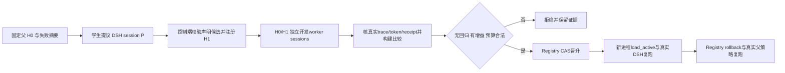

# RSI 下一阶段：真实学生提议与独立开发比较

状态：后续设计，未实施、未启动GPU；不阻塞当前context RL与memory。
目标：用现有DSH/Uni-Agent/VERL执行入口完成一个可审计的学生候选实验，先证明工程与真实行为，
再单独设计RSI RL信用归属。本阶段不新建trainer、Gateway、教师服务或SFT流程。

## 1. 已有基础与最关键缺口

| 已有资产 | 可直接复用 | 不能据此推断 |
|---|---|---|
| [Registry](../../uni_agent/tasks/dsh/rsi_candidates.py) | 固定pins、父/候选内容hash、开发比较约束、CAS晋升、历史/防重放、实际回滚 | expected receipt hash是控制端信任输入，不是自动认证；它不读取验证真实DSH episode的完整证据 |
| [renderer](../../examples/dsh/rsi_closed/profile.py)与[policy](../../examples/dsh/rsi_closed/policy.mjs) | 固定源码hash、禁shell/code、只读operator文件、单调执行deny | 当前只支持str_replace_editor与cordis_inspect_list；不是通用profile搜索或OS沙盒 |
| [固定Linux canary](native-rsi-policy-linux-c5acd30-r1.json) | 新进程加载→真实DSH权限变化→回滚恢复；固定0.1.3a2 | synthetic选择比较不是学生开发评估、生产晋升依据或RL轨迹 |
| [DshArchitectureTask](../../uni_agent/tasks/dsh/task.py)与[轨迹审计](../../uni_agent/tasks/dsh/trajectory_audit.py) | 原生envelope→verifier→fresh receipt、Gateway会话身份及真实token审计 | 现有单session结果没有自动代表跨候选开发比较，也没有自动把worker奖励赋给proposer |
| [strict inference](../../examples/inference/parallel_infer_verl.py) | 固定学生模型→DSH唯一循环→Gateway→严格轨迹准入→TQ读回 | 推理成功不是优化器更新；不生成跨阶段GRPO组信用 |

**必须先解决候选评估与晋升的循环依赖**：现build_patch仅调用Registry.load_active；未晋升候选
无法通过此入口加载。但正确顺序必须先评估候选，再决定晋升。不能用synthetic receipt提前晋升，
也不能直接改active文件或给候选造一个假active hash。

最小补口是Registry公开只读`load_registered(candidate_sha256)`，校验现有不可变对象和pins；
renderer新增明确的evaluation模式，从该候选渲染临时评估overlay，另绑定真实父active快照。
生产load_active路径不变。返回`phase=candidate-evaluation`、candidate/parent/父active/overlay hash，
不得把尚未晋升的候选标成active。此API名称是本设计建议，当前代码尚无该公开接口。

## 2. 最小实验与业务目标

固定一个模型checkpoint M0，同时充当提议者与开发任务worker；所有阶段明确角色、session、预算，
不调用更大模型。固定基础Harness H0及版本。候选仍只能提交声明式profile和允许工具组合，不允许
提交代码、路径、verifier、数据集或额外配置。

首个实验只是**受控只读工具策略修补**：父候选允许固定文件view，但禁止runtime inspection；
学生获得父配置及可信失败摘要，自行提出候选。控制端可接受的执行子集仍为view与inspect_list。
拒绝shell/code等候选；不扩大policy权限来迁就模型。

至少两个真正不同的开发任务，而非同题换UUID：

1. **运行时能力发现**：从实际inspect_list返回中，依据任务需求识别一个符合条件的Inspect Provider/
   方法声明，给出可核对的ID和证据。题目不提供标准答案；verifier从真实成功tool result及固定的
   选择规则独立求解。父若正确说明此策略下无法查询，必须根据预先合同记录“安全完成但未完成业务”，
   reward=0、eligible=true；伪造查询证据拒绝。当前v3 runtime-grounding要求后续inspect_query，
   超出本overlay子集，**不能原样套用该v3评分器假装本题已验证**。
2. **文件约束取证回归**：从独立工程文件完成一个有引用的事实裁决；可复用现context v2评分和真实
   文件读取证据。父/候选均应成功，新增inspection权限不能导致读取错源、遗漏约束或超预算。
   使用新建的RSI开发实例，或者明确将已公开dev实例用于开发；不能拿封存题选候选。

两个任务共享固定模型与解码/预算；实际任务ID、fixture/verifier版本分开，开发manifest冻结两者。
每个任务H0/H1各一次独立worker执行，至少4个真实开发episode；之后增加独立进程加载复跑与回滚
复跑。此数量仅为工程闭环：不保证候选优于父，不够统计证明。单次严格无回归+增益不满足时应记录
拒绝，无无限重试。若没有候选值得晋升，该轮“真实比较与拒绝链”可通过，但晋升成功节点仍未完成。

这个搜索空间很小，“开放更多预授权只读工具”可能总是占优。因此成功只能称策略修补闭环，
不能称广泛RSI、长期自进化或Harness最优。后续才扩大不同约束/成本/失效机制，避免学到永久全开放。

## 3. 分阶段数据流与身份



所有DSH内部动作仍由原Agent Loop执行。控制端只协调实验阶段，不自行实现消息/tool循环。

| 身份 | 绑定位置与作用 |
|---|---|
| evolution_run_id、pins_sha256 | 一次实验及固定model/runtime/base_harness/devset/verifier身份 |
| proposal_task_id、P的Gateway/DSH session、trace/receipt SHA | 唯一提议来源；student最终JSON只是候选提议 |
| parent_candidate_sha、candidate_sha、content_sha | 不可变候选谱系；不以文件名或模型自报ID代替 |
| evaluation_id、case_id、arm=parent/candidate、worker session | 配对业务比较；每个arm独立工作目录/home/trace |
| phase、父active快照、overlay/source/read-files SHA | 区分未晋升评估与真正active加载，固定实际执行策略 |
| comparison_sha、selection transition SHA | 认证后的开发比较与真实CAS晋升/拒绝/回滚证据 |
| reload_validation_id / rollback_validation_id | 新进程真实行为复跑，不用不同session字符串冒充进程隔离 |

这些可先写在operator运行manifest与Task metadata额外字段中，保持既有Task接口和fresh receipt结构。
controller二级审计核metadata与冻结manifest一致，并通过artifact/trace/receipt hash关联。
当前runner的patches_digest主要绑定**路径列表**，不足以证明文件内容；必须另外固定overlay字节与
policy源码hash，在加载前后复核，工作目录禁止学生修改这些文件。不能只比patch路径字符串。

## 4. 真实比较回执与准入

新增的应是一个小型控制端比较构建器，输入真实episode artifact路径和外部登记的run/fixture/pins，
复用现有审计，不新增另一套训练adapter。

每侧必须通过：

- DSH session/Gateway rollout身份、真实token/mask、trace与artifact摘要、fresh receipt及verifier身份；
- finished与eligible；模型安全完成但失败可以为0，基础设施失败/不完整/伪证据单列，不参与晋升比较；
- candidate/parent/phase/overlay/source与当前冻结配置一致；同题同模型同预算、外部控制的fixture；
- 原始reward数值与receipt相同，不从最终文本`promote`或自评推导；比较逐case完整且无重复episode；
- `tokens`明确使用该worker所有模型请求的真实生成token IDs总数，不能写canary假数字或用字符串长度估计。
  input tokens、时间和工具次数另记录，预算单位在dev manifest中固定。

然后才能构建Registry接受的dsh.rsi-development-comparison.v1。Registry pins只有一个verifier_sha256，
这里应固定**开发评估器组合manifest hash**，包含两个case各自verifier id/version/bundle与组合规则；
不把其中一个case的verifier hash冒充全部评估身份。各case原DSH receipts保持自身verifier身份。

控制端持有比较文件外部hash并调用promote；hash证明固定而非签名认证，生产调用权不能交给学生。
synthetic canary devset/evolution身份与数据完全排除。真实比较不可用时保持父active，不降级借用合成结果。

## 5. 先工程可跑，再讨论RSI RL

**本阶段是固定权重评估**：不创建optimizer，不产生用于训练的跨阶段reward credit。
提议合法性与开发收益分开报告；合法JSON不等于有益候选。开发worker的任务reward归它自己的episode，
先只评估，不拼接多个session token，不把H1收益复制到所有参与会话。

后续最短RL方案是“只训练proposer，冻结worker评估器”：

1. 每个GRPO样本是一次提议session P；controller为该提议运行有界独立H0/H1开发评估。
2. 一个候选获得一个冻结的外部任务收益信号，必须绑定P的rollout、candidate、comparison SHA；
   同组多个候选来自同一当前policy版本/相同问题环境，不能把不同worker case误当GRPO候选组。
3. 仅P的生成token进入对应梯度；worker evaluator轨迹作为独立证据保留，排除P的loss/mask。
   先明确成本、失败/取消、超时与无增益候选如何给分，不能在实现中临时复制worker reward。
4. 现DshArchitectureTask是单session后评分；若要支持跨worker比较，需一个明确的任务侧协调边界
   与回执关联扩展。优先复用现DshAgent/Task runner、Gateway客户端、VERL adapter和trajectory audit；
   不从头实现trainer，不通过退出strict模式来接通。
5. 能证明本策略token→正确proposal reward→实际训练消费→参数变化/reload之后，才算RSI RL工程通过。
   联合训练worker或跨任务长期信用不是本最短方案，另设里程碑。

这里还有一个不能隐去的版本缺口：现有单个共享rollout backend不会自动同时维持“正在更新的proposer”
与“永远固定M0的worker”。若坚持固定worker模型，需先验证在已有backend上受控串行加载固定快照的
可行性与成本，不在本设计中假定新服务已存在。更小的替代是**同一训练step内冻结同一policy快照**，
P和worker都用此版本，worker token仅stop-gradient、更新后下一step重建对照；这会让评估策略随step变化，
必须明确更改奖励合同并报告该限制，不能仍声称跨step固定评估模型。该决策是RSI RL前的专项设计门，
不影响本阶段固定M0的纯工程评估。

生产效果评价再用冻结测试，四格M0H0/M1H0/M0H1/M1H1区分权重学习、Harness变化及交互；
候选选择只用训练/开发集，封存测试不进入RSI自适应回路。

## 6. 后续实现范围建议与验收

建议少量新增/扩展文件：Registry只读pending loader；现renderer的evaluation模式；
examples/dsh/rsi_closed下的学生实验协调入口；runtime inspection dev任务及独立verifier；
控制端真实receipt比较构建器。每项先设计对应API/负例，再实现；当前文档未创建这些入口。

工程验收最小节点：

- [ ] 学生P真实DSH提议，严格声明式schema、来源trace和候选hash绑定。
- [ ] H1在未晋升情况下隔离评估，父active不变，phase与overlay身份明确。
- [ ] 两个不同开发任务×两侧，四份真实episode/receipt，独立认证比较；合法失败与不可用证据区分。
- [ ] 无回归且有真实收益才CAS晋升；错误/过期/伪比较保持父选择。
- [ ] 新进程加载已晋升候选并真实复跑；回滚后新进程恢复父行为与业务结果。
- [ ] 报告如实标记training=false、model_evaluation=true，synthetic_selection_comparison=false。
- [ ] 没有收益则记录拒绝；不能用预先手填候选、手填reward或反复采样到成功替代学生实验。

这个设计是后续并行工作，不暂停当前context RL或memory验收，不新增云服务、教师调用或GPU资源。

## 7. 已批准的首个 CPU 增量：未晋升候选评估

文件限定 `uni_agent/tasks/dsh/rsi_candidates.py`、`examples/dsh/rsi_closed/profile.py`
及其现有两份测试；不新增 worker、trainer、比较器或 GPU 调用。

- `Registry.load_registered(candidate_sha256, expected_parent_active_sha256)`：在同一锁内验证
  pins、不可变候选/content、真实 active 对象及候选直属父关系，只返回 evaluation 快照，不写入任何对象。
- `build_evaluation_patch(...)`：显式选择未晋升候选；固定 ESM policy 的 `activeSha256`
  表示真实父 active 快照，绝不是候选已晋升。返回 phase、候选/content、pins、父选择、policy 与 overlay hash。
  overlay SHA 定义为 `rsi_candidates._canonical(patch)` 的 UTF-8 字节（排序紧凑 JSON 加换行）。
  operator 提供的只读证据文件路径与内容 hash 单独绑定，不能由候选指定。
- 渲染完成再次验证相同父 active；这只能证明返回时快照仍有效，未来启动方仍须在 SDK 启动前重验，
  不能声称跨任意后续时间持有部署锁。当前 production `build_patch` 与默认 CLI 输出保持不变。
- CLI 使用显式 `--mode evaluation --candidate-sha256 ...`，默认 `active`；不相符的参数组合失败。
- RED/回归覆盖：只读加载无文件增删改、错 pins、候选篡改、错父/已选中候选、过期 active、
  渲染期间 active 变更、固定 policy 错误、overlay/content/父身份绑定及原 production 回归。

这一步无比较回执、无 synthetic 晋升，也不证明学生提议或实际 DSH 执行已完成。

## 8. 已批准的两项 RSI worker 开发任务 v1

新增 `examples/dsh/rsi_closed/worker_tasks.py`、`worker_verifier.py` 和
`tests/uni_agent/tasks/test_dsh_rsi_workers.py`，不改变 memory/context 的任何评分规则。
`prepare(output)` 生成两个独立 fixture、只读 source、标准 messages/Task metadata 的 tasks.jsonl
和 source/hash manifest；任务仅作 development，不构造训练 split、生产回执或完整 controller。
`score(contract, root, events, response, finished)` 纯 CPU；`verify()` 复用现 DSH envelope identity、
trace SHA、完整 call/result 配对；由现 DSH Task 生成 fresh receipt 并由 strict runner 审计。

合同固定 `schema=dsh.rsi-worker.v1`、两个 case_id（inspect-discovery/file-constraint）、kind、
`runtime_sha256=d1a467…e80cb`、sources（相对 path 和 SHA）、target。metadata 使用独立
`verifier_id=dsh-rsi-worker`、task/verifier version=1、task_id=dsh/rsi-worker/<case>、split=validation、dataset_role=development。
现 DSH Task 只接受 train/validation/test/holdout，开发比较复用 validation，不新增非法 split。
版本与 bundle 包括实际 verifier 依赖源码；环境 digest 必须等于固定 runtime SHA。

真实输出核验：2026-09-09 在独立 c5acd30 Linux checkout，以旧已验收 venv 的固定 SDK/runtime
运行一次无模型 CPU `ctx.tools.execute(cordis_inspect_list,{})`；产物
`/root/runs/dsh-rsi-inspect-shape-r1/result.json`，SHA
`8b61476c201b44241276f59c74f1c4161fa52402e8dcd8ec3a60923ad2035448`。
成功结果 isError=false，model-facing content 为 text JSON `{providers:[...]}`，每项有
platform/id/description/methods，method 有 name/description/inputSchema/outputSchema；
实际包含 host Tool → listTools。该探针只是 schema 证据，不是学生 episode/比较回执。

精确任务与奖励合同：

- inspect-discovery：只允许 `cordis_inspect_list` 的空对象参数。回答严格 JSON
  `{status,platform,provider,method}`；成功 answer 必须由实际成功 result 证明，
  route 必须存在于该 result 且为 host Tool/listTools。不得执行 query、动态定义或写文件。
  父策略正常拒绝时 `status=unavailable`、route 三字段 null；业务 reward=0、
  finished/eligible 可以为 true。没有证据可返回 unavailable；不能自报已执行。内部 call ID 由 verifier 从 trace 关联，不要求模型输出隐藏元数据。
- file-constraint：只允许完整 view 一个白名单 `sources/constraints.txt`；报告 max_attempts，
  严格 JSON `{status,value,citation}`，citation 严格 `{source,line,quote}`。
  值由固定 source 当前行推导；引用必须绑定实际成功 view 完整内容及精确行文。错误值但真实引用为业务 0。
  unavailable/null/null 是合法未解决 0；写入、未知路径、非白名单动作及伪造引用硬拒 eligible=false。
- 两者 binary reward，仅 finished completed、合法动作、真实证据和正确答案同时成立才为 1。
  malformed response 是业务 0；声称的 route/引用不存在或缺少成功结果是硬拒。
  malformed/missing trace pair 或 fixture/runtime/hash 身份不一致为 verifier integrity error，不能合成通过回执。

测试先 RED：两正例；合法 deny 与 unavailable；错误值；伪造 route/source/quote；无真实成功结果；
写/越权/未知工具；runtime/fixture 篡改；缺 pair；fresh envelope 身份错配；生成器新目录与两个唯一任务。
后续 2 case × H0/H1 还需真实学生运行及可信比较协调器；这里不声称已完成配对或 RSI RL。

CPU 使用入口：

```bash
PYTHONPATH=.:verl python -m examples.dsh.rsi_closed.worker_tasks --output /tmp/rsi-worker-dev-v1-new
```

`tasks.jsonl` 每行可交给现 DSH Task 的 messages/metadata；后续运行配置必须使用
`verifier_command=[<已固定runner_python>, "-m", "examples.dsh.rsi_closed.worker_verifier"]`、
上面的 verifier/runtime pins，以及既有唯一 DshAgent。H0 为 file-only，H1 为 file+inspect_list；
两侧均将 file-constraint 的固定 source 放入 operator `read_files`。inspection case 自身不允许读取该文件。
实际 H0/H1 的 canonical overlay bytes、候选 hash、父 active、模型版本与四份 episode 身份仍由后续
run manifest/比较器绑定，不由这个数据生成器声称已经完成。

本增量验证：初始 RED 为新模块缺失；另一次实际 `_task_identity` RED 揭示非法 development split，
修复为 validation 后，27 项 worker 测试以及 Registry/policy/context 回归共 94 项通过；Ruff check/format通过。
测试中的 trace/envelope 是隔离的单元 fixture，验证现 Task receipt 接口兼容，不能作为生产学生回执。
尚未创建 run-specific task.yaml/parquet 或启动任何学生 worker；这与“CPU 合同就绪”分开记录。

### worker v1 冻结前 API 边界修正：view_range

对照已验证的 context v2 API：文件 view 允许附带 view_range=null 或两个真正整数 [start,end]，
start≥1，end=-1 或 end≥start；上界以固定 runtime 的文本 split('\n') 计数，包含尾部空行。
未知参数、bool、非法/越界范围依旧硬拒。合法 partial view 本身不判越权；真实返回且处于请求范围内的
第 2 行可证明引用，但只有请求覆盖全部非空尾内容且实际返回完整源的调用才有 full-read credit。
因此真实 partial 引用给业务 0，而非伪造证据；未读到的引用仍硬拒。字段 matched_call_ids 与
successful_call_ids 分别记录引用证据和完整读取，不能混淆。

限定修改 worker_verifier、对应测试及本文；现固定 policy.mjs 仍只接收 command/path，未在此擅改
policy/hash。后续若真实运行也允许 view_range，必须另行版本化 policy 并重验 canary；旧 policy 合法拒绝
时仍记业务未解决，不可宣称现 runtime overlay 已支持该参数。新 bundle 随 verifier 源码自然变化。
