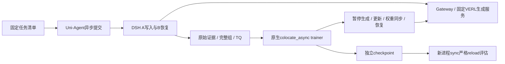

# 原生工作状态单卡异步对照

2026-09-09。用户明确要求优先性能；沿用 async-followup.md 的有界单卡异步授权。设计细化，不代表GPU验收已通过。

## 目标和范围

复用固定VERL colocate_async，DSH仍唯一任务循环。以ws-short-train-r2同步结果为控制，保持8步/n4、模型、任务、奖励、预算、DSH与VERL overlay不变。先只切trainer模式与必要adapter，再根据测量决定warmup/并发；不同时改数据难度。短课全同分可能零梯度，必须报告，异步执行成功不能替代有效更新验收。separate_async与新增资源不在本阶段。

## 已核实缺口与最小变更

基础train_qwen3_4b_online_rl.sh已支持TRAINER_MODE与NUM_WARMUP_BATCHES，不重复实现。prepare_memory_training仍锁sync，work-state仍选StrictSyncValidationRolloutAdapter，该adapter明确拒绝非sync。不可直接用环境变量绕过manifest。

拟改文件：
- examples/dsh/capabilities/prepare_memory_training.py：显式trainer-mode/warmup参数绑定清单，仅train允许colocate_async；训练无内联validation时使用原AgentFrameworkRolloutAdapter；reload继续严格sync，完整记录母训练模式。
- tests/uni_agent/examples/test_prepare_memory_training.py：默认兼容、异步透传、非法组合拒绝、不可篡改清单、sync reload来自异步母工件。
- docs/harbor-modal-integration/native-work-state-async-runbook.md：固定提交执行步骤与对照指标。
- 若源码审计发现整链版本/partial rollout不兼容，先记录并修订设计，不放宽证据约束。

## 接口合同

prepare增加 --trainer-mode {sync,colocate_async}（默认sync）及正整数--num-warmup-batches（默认1）。参数参与manifest/source身份检查，check/launch验证模式、adapter、内联eval配置一致性。异步train必须关闭初始/周期validation；reload固定sync与原strict adapter。禁止修改已准备或运行中的清单。

## 运行及验收

1. CPU回归、Ruff两门后commit/push，部署新固定checkout，复用原venv，确认GPU无其他任务。
2. 新run一次8步异步对照，checkpoint持久化到/workspace/uni-agent-g1/checkpoint/<run>，保留sync母结果。监督上限7200秒。
3. 检查实际完整组消费、任务身份、失败/拒绝/过期比例、策略版本范围、pause/resume和工具副作用去重。没有触发暂停中的长任务不能宣称该边界已验收。
4. 核梯度、参数/optimizer、checkpoint，再串行两题独立reload；零梯度如实报告，不改分制造信号。
5. 同时报告含初始化总耗时与训练阶段耗时、有效链/分钟、生成token/秒、显存峰值。单次差异仅初步观测，不宣称稳定加速；无收益则保持sync默认并分析瓶颈。

复建安装不是本次性能对照前置；四类任务数据设计保留，异步底座核验后恢复扩大任务覆盖。

## 审计发现：实施暂停并修订

NativeMemoryFramework.from_config还硬锁sync；credit._trajectory与crosswalk要求轨迹min=max=提交step-1。VERL colocate partial rollout可能跨权重恢复，A/B及兄弟组也可能跨更新。仅改prepare会失败，删除gate会损害证据合同。先完成跨版本轨迹与完整组语义设计，再实施；不放宽已有同步证据校验。ReplayBufferAsync已有失败组/过期组淘汰与补采，不能反复补采规避不兼容。当前无异步GPU运行。
