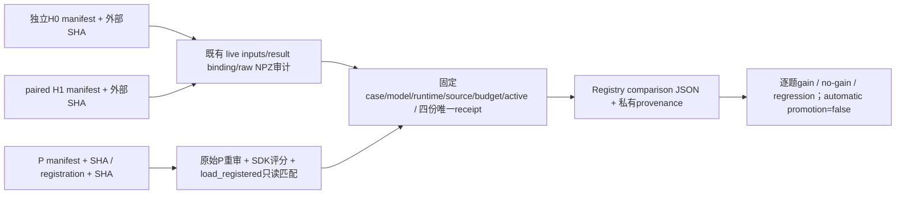

# RSI worker comparison：已批准 §4 / §10.5 的只读落地

状态：实施中的 CPU 控制端；不启动 GPU，不注册、不晋升、不回滚，不新增 trainer。

目标：绑定真实独立 parent-baseline H0 两题、paired H1 两题和真实学生 P 登记来源，
输出现 Registry 严格 comparison schema 与单独 provenance。prepared paired H0 没有执行，绝不使用。

API：`compare(parent_manifest, parent_sha256, candidate_manifest, candidate_sha256,
proposal_manifest, proposal_sha256, registration_path, registration_sha256)` 返回
`{comparison, provenance}`，不写 Registry。CLI 只将两文件写入全新 output 目录。
外部SHA均校验，不接受调用方自报reward/tokens/spec。

重用 `audit_parent`、`audit_episode`、`result_binding`、`_live_inputs`，实际生成token由NPZ
response_mask求和。P重新核精确launch/supervisor、原始输出/SDK trace一致与完整sidecar字段，
候选spec/content必须等于真实Registry pending child。H0/H1逐case比对原始prompt/fixture与
任务预算配置，允许不同准备路径和mode/overlay，不能改写旧路径hash。

源码合同：保留原执行checkout和环境；当前审计checkout单独记录。旧源码逐字核hash，
当前HEAD相对原HEAD只允许新增本controller及其测试和docs/tasks文档变化；其它源码变更拒绝。
不修改manifest checkout字段以骗过旧相等门。VERL有效源码沿用现overlay校验。

文件：新增 compare_workers.py、test_compare_rsi_workers.py、本设计；其它执行源码不改。
测试：先RED；真实NPZ审计fixture明确合成；正向gain/no-gain/regression，重复session/receipt/TQ、
错误hash、预算/源码/模型漂移、缺P/sidecar不符、未知case/不完整readback负例；Registry只读断言。
测试以CPU pytest与Ruff为准，不把合成fixture称为生产证据。

限制：hash是私有控制端绑定，不是签名；完整性失败抛错、业务无增益/回归正常返回。
无自动promote；有增益仍不自动晋升；由已授权的控制端另行执行晋升/加载/回滚验收；非泛化或学习证明。

CPU实现完成：45项比较器测试通过；上一批与proposal/registration/worker准备器/launcher/
worker verifier/Registry的组合回归233项通过，之后增加的自身源码门已在45项比较器回归中验证。
Ruff check/format通过。初始RED为缺少compare_workers模块；测试fixture只用于CPU验证。

源码准入额外要求当前controller字节与当前Git HEAD严格相等，拒dirty/untracked；docs/tasks
不要求clean。runtime.module的旧执行绝对路径与新审计导入绝对路径分别校验/记录，除该已核
源码的路径字段外SDK/runtime/bundle等必须精确相等。原始manifest没有被重写。

CLI实际参数：`--parent <H0 manifest> --parent-sha256 <SHA> --candidate <paired manifest>
--candidate-sha256 <SHA> --proposal 
 --proposal-sha256 <SHA>
--registration 
 --registration-sha256 <SHA> --output <全新目录>`。
输出comparison.json及provenance.json；CLI打印两份SHA及业务outcome，不自动改变active。
本提交不声称已对真实GPU产物完成端到端审计；部署到新的已提交审计checkout后另行运行。
