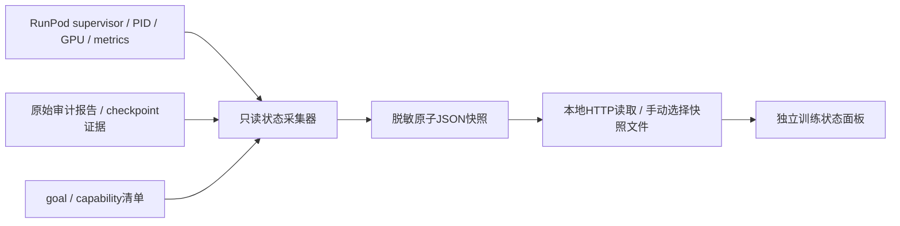

# 训练控制面板设计

> 已撤回：用户确认面板需求误发自其他会话。本稿未实施，不属于本项目训练目标。

状态：根据用户截图新增的UI设计，尚未实现或接入实时服务。沿用当前worktree；训练与能力主线继续，不以面板开发替代训练。

## 目标与页面位置

在 `docs/harbor-modal-integration/training-control-panel.html` 设置独立操作状态入口，从系统方案v3及记忆/context专题链接进入。采用截图的紧凑分层、标签页和状态条；业务栏目使用训练任务、数据课程、模型检查点，不复制交易策略或模拟盘术语。

首版只读：展示真实任务/进程/指标/验收，链接证据与现有人工命令。启动/停止/付费操作不混入首版；没有后端就明确显示未接入或历史快照。

## 布局

```text
训练工程                         RunPod / 固定版本 / 最近同步时间
[当前任务] [数据课程] [模型检查点] [总方案]
[活动] [训练] [评估] [验收与证据]
GOAL进行中 | AGENT未知 | RUN已退出 | AUDIT待完成 | GPU待刷新
当前正在做什么 / 为什么做 / 下一步 / 阻塞原因
四类能力：DSH调度 | 跨会话记忆 | 上下文管理 | 受控RSI
每类分别列：任务已设计 / 真实基线 / RL更新 / reload / 效果对照
当前实验：run-id、阶段、PID、版本、日志尾部、采样/更新进度
学习信号：独立任务数、完整组、有效更新步、奖励/梯度/验证曲线
验收：轨迹、消费、参数、checkpoint、reload、复跑各自状态
待处理事项：从真实待办来源读取；未接入不能显示“没有请求”
活动时间线与历史失败 / 报告及手工复跑命令
```

工程闭环与能力效果独立呈现，不显示一个缺少定义的“总完成百分比”。GPU为0但采集新鲜时显示空闲；采集失败显示未知，不保留绿色正常。未接入Codex线程状态时AGENT为未知，不能据聊天回复结束猜测空闲。

## 状态合同

- goal状态来自人工维护的目标清单；只有完整退出条件已验收才完成。
- job阶段来自实际监督记录+进程+日志：prepared/loading/sampling/updating/saving/evaluating/auditing/exited/error/unknown。
- exit0仅表示作业正常退出，审计passed与reward独立显示。
- training=false显著标明“评估，未更新参数”。P格式reward与H1开发收益分开。
- task实例、重复采样次数、实际消费数分别记录；显示非零梯度步数及零方差组，不把n4计成4新任务。
- 所有状态附observed_at、source、run_id、execution_sha；超期显示stale，避免中断后继续冒充实时。
- 原始失败不覆盖；新增audit报告可作为后续修复记录并链接旧失败。

## 数据流与API



计划快照 `dsh.training-monitor.v1`：`observed_at, freshness_seconds, goal, capabilities[], current_run, gpu, learning, checks[], pending, events[], sources[]`。每个值包含状态或unknown及来源。远程IP/凭据/环境变量不进入快照；日志使用白名单摘要，原日志保留私有。

网页首版不直接SSH，也不虚构Codex平台状态API。HTTP模式从同源snapshot.json只读刷新；file模式通过用户选择JSON或明确标注的内嵌历史快照展示，不用伪实时计时。暂停刷新只停止页面读取，不停止GPU。

## 计划文件

| 文件 | 用途 |
|---|---|
| deployment/monitoring/collect_training_status.py | 只读采集已登记run，不扫描任意私有目录；原子写脱敏JSON |
| deployment/monitoring/run_registry.json | 显式登记允许观察的run及能力/阶段，区分执行与审计源码 |
| docs/harbor-modal-integration/training-control-panel.html | 紧凑状态面板、标签页、事件筛选、证据入口 |
| docs/harbor-modal-integration/training-control-panel-runbook.md | 采集、刷新、手动加载、状态定义与故障处理 |
| tests/uni_agent/deployment/test_training_monitor.py | 状态与数据合同测试 |
| 现有系统方案/专题HTML | 增加面板导航入口 |

## 验收

CPU测试覆盖：活PID与终态冲突、exit0但审计失败、GPU0与查询失败、日志/快照过期、无权限、缺文件、评估不计更新、重复采样不计新任务、脱敏、原子写。不能为显示绿色放宽现有训练准入。

真实验证：以现有short训练、reload、H0/P/H1历史记录回放；一次当前GPU实查进入快照。使用gstack browse检查320/390/768/1440宽度、Tab/键盘、状态文字、空/错/过期场景、无溢出/console错误及有效证据链接，实际查看截图。

完成标准：人类能在一分钟内回答“GPU在做什么、这一轮是否训练、消费哪些任务、是否真的更新、哪里未验收、下一步是什么”。面板通过不代表训练充分，四能力退出条件保持不变。
