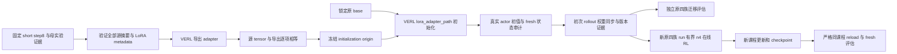

# 从短课程显式初始化原多文件课程

状态：设计已完成，待实施确认；本初始化入口尚未实现或运行。2026-09-09。RSI有独立GPU作业，与本设计验收无关。

依据：[warm-start 审计](work-state-curriculum-warm-start-audit.md)、[当前目标](../../tasks/harbor-modal-integration/active-engineering-goal.md)、[完整记忆/context 方案](dsh-memory-context-skills-plan.md)。本设计不能当作已可执行 runbook。

## 1. 目标与不可变项

把 `ws-short-train-r1/global_step_8` 已训练 LoRA 显式加载到锁定 Qwen3-4B base，在原 `work-state-v1` WS01/WS03/WS05/WS06 上进行独立迁移评估和有界在线训练。新 optimizer/scheduler、step=0、新目标 dataloader；父实验 optimizer、RNG 和游标不恢复。

保持原任务、split、预算、二值评分、数据/任务 verifier、DSH 唯一 Agent Loop、sync VERL trainer 和模型身份。不开新 GPU，不调提示选 dev，不增加 teacher/SFT。short 成功不追认原 r4 有效更新；跨课程更新也不代表 C2 offload/compact 或 C3 长任务完成。



## 2. CLI 与 Python 合同

### 2.1 导出准备器（新增）

模块 `examples.dsh.capabilities.prepare_memory_initialization`：

```text
export --mother-run ABS --checkpoint ABS/global_step_8
       --output-dir ABS_NEW --source-course work-state-short-fact-v1
       --target-course work-state-v1
check ABS/initialization-origin.json
```

Python API：`export_initialization(*, mother_run: Path, checkpoint: Path, output_dir: Path, source_course: str, target_course: str) -> dict`；`check_initialization(path: Path) -> dict`。仅首批精确允许 short→work-state-v1，未知转换拒绝。所有目录必须新建、绝对规范路径、无 symlink、与母 checkpoint/run 不重叠。

先复用 `checkpoint_origin(..., course_id=source_course)` 验证真实已完成的母实验，不改变该函数的同 course 保护。然后调用固定 VERL `python -m verl.model_merger merge --backend fsdp --local_dir <checkpoint>/actor --target_dir <output>/export`。初版复用普通导出，不另写 tensor 转换器；它会另存 HF base，运行前检查 CPU 内存/磁盘，使用后不自动删父工件。训练仍用原锁定 MODEL_PATH，不改成导出的 HF base。

### 2.2 现有准备器（扩展）

新增可选 `prepare --initialize-from ABS/initialization-origin.json`，对应 Python `prepare(..., initialize_from: Path | None = None)`。

| 模式 | 允许的来源 | 必须行为 |
| --- | --- | --- |
| train | 无来源或 initialize-from | 有初始化时加载 adapter；resume disable；VAL_ONLY False；关闭内联评估 |
| val | 无来源或 initialize-from | 同一初始化模型独立目标评估，step0，无训练 |
| reload | 仅既有 resume-from + mother-run | 保留同 course/全 checkpoint/val-only 保护；禁止 initialize-from |

init 与 resume/mother 任意混用、目标 course 与初始化合同不一致、初始化来源文件漂移均拒绝。旧无初始化入口行为完全保留。

生成命令增加 `actor_rollout_ref.model.lora_adapter_path=<export>/lora_adapter`，保持 `trainer.resume_mode=disable`、空 RESUME_FROM_PATH。保持 LORA_RANK=16、LORA_ALPHA=16，显式核 exported target_modules 与原训练配置匹配。新 `memory_operator.checkpoint_identity` 绑定 initialization identity，不能退回 base revision。

当前工作树暂无上述 CLI。批准并完成实现后，原 prepare 命令追加 `--course work-state-v1 --mode train --initialize-from <origin>` 才是计划中的项目入口。

## 3. 工件与身份

新增 `dsh.memory-initialization-origin.v1`，至少含：

```text
source: {course_id, mother_run, source_head, checkpoint_path, checkpoint_step,
         checkpoint_origin_identity, checkpoint_files_sha256}
target: {family: work-state-v1, course_id: work-state-v1}
base: {model_revision, config_sha256, tokenizer_config_sha256, frozen_base_evidence}
runtime: {dsh_binary_sha256, dsh_version, verl_base_sha, effective_source_identity}
export: {command, tool_source_sha256, adapter_files_sha256, lora_metadata,
         tensor_comparison_sha256, source_unchanged_after_export}
semantics: {kind: adapter_initialization, optimizer: fresh, scheduler: fresh,
            trainer_step: 0, dataloader: fresh, resume_mode: disable}
identity: sha256(canonical JSON of preceding fields)
```

在目标 launch plan 中同时保存 initialization origin 的完整内容和摘要，目标任务清单/源码/model/runtime 的现有绑定继续存在。source course 描述来源，target course 描述消费任务，两者不能互相替换。新母实验以后被 reload 时，校验其 initialization lineage，但 reload 只加载这个新母 checkpoint，不再次加载 short adapter 叠加权重。

checkpoint-origin 的后续扩展只能增加谱系字段和相应校验，旧 v1 母实验保持可读；不得为了兼容初始化关闭原保护。

## 4. 逐 tensor 导出与真实加载

### 4.1 导出前后（CPU）

本阶段只支持现有 world_size=1 格式。母 actor model 含 504 个 LoRA tensor；要求集合精确相等，不接受“至少一个非零”。按 VERL 的 `.default.weight`→`.weight` 规则生成一对一映射，检测碰撞、缺失和多余键；逐项记录源/目标 key、shape、dtype、finite、数值 equality 和 digest。导出不允许隐式降精度；与母 tensor 必须精确相等。

强制 `lora_train_meta.json` 存在、可解析，r=16、alpha=16、task_type 合法，target modules 与父 resolved config/权重匹配。VERL 缺 alpha 的回落 0 不准通过。父目录全部文件导出前后摘要必须不变。

### 4.2 实际 actor 初始化（首个 rollout 前）

从**当前 worker 保存的真实 step0 checkpoint**读取已加载的 504 个 tensor，与导出 adapter 逐项比对。dtype 若因锁定训练精度发生显式转换，则同时记录源 dtype、实际 dtype、预先定义的 cast 后精确 equality；不得用随意 tolerance 掩盖错载。核 base 初值与母冻结 base 一致、optimizer 参数集合为预定 LoRA 集合；requires_grad 行为由固定 PEFT/VERL 源码、optimizer 参数集合与后续 base 不变证据共同支持，不假称 checkpoint 保存了 requires_grad 标记。

optimizer 新建后 state 为空或所有 step/moments 为初始化值；参数组匹配当前配置，scheduler 初态匹配新建策略。driver 记录 global_steps=0、目标 dataset digest、初始 dataloader cursor，并证明未调用 checkpoint load。val 可以无训练 optimizer 更新，但不能捏造 optimizer 状态观测。

单独在 CPU 建一个 PeftModel 只能证明加载 API 可用，不能替代本 worker 实测。启动日志打印 adapter 路径同样不足。

### 4.3 项目薄 TaskRunner 与固定源码

复用 VERL 官方 recipe 扩展点 `verl/trainer/main_ppo.py:38` 的 `run_ppo(config, task_runner_class)`。项目新增薄 TaskRunner，使用原 `get_trainer_cls("sync")` 和原生命周期，仅在 `trainer.init()` 后、`fit()` 前插入初始保存/审计；不新增 trainer、不继承或改写其优化循环、不使用 Ray 私有 metadata 解包已有 remote class。固定 `_build_lora_module` 继续负责真实初始化。

顺序：

1. 原 trainer 初始化完成，断言 resume disable、global_steps=0，冻结目标 dataset digest 与初始 dataloader state。
2. 暂停 rollout replicas，调用原 `trainer._save_checkpoint()`，在本次目标 run 的 checkpoint 根保存 `global_step_0`，包含 model/optimizer/extra/data。该固定版本内部方法有现成完整保存逻辑，项目适配针对 pin 做回归；无需新增 upstream API。
3. 对真实 worker 保存的 model、optim、extra、data 做上述逐 tensor/fresh 状态校验；证据完成前不调用 fit 或执行任务采样。step0 保留且不计训练步、消费或有效更新，checkpoint retention 不得删除它。
4. 用既有 `checkpoint_manager.update_weights(0)` 重新同步并恢复 rollout，等待完成；写入 run/source/step0 identity 与同步回执，随后初始化现有 agent loop manager 并调用原 fit。
5. 复用原 tracking/TransferQueue 的 finally 清理语义，保留失败工件。新增启动模块只在 initialize-from 启用；无初始化与严格 reload 继续原入口。

`checkpoint_callback_class` 只有保存后的 `on_save`，可用于审计/归档但不能自行触发初始保存；初始 val 也不自动保存。初版直接由薄 TaskRunner 调用审计即可，无需额外 callback 抽象。step0 空 optimizer 保存、暂停后保存与再次同步的生命周期必须做一次有界真实验证，尚未实测前不称可用。step0 只证明本次进程初始化，不能拿一个独立 canary 的初值冒充另一训练进程的初值。

**保持当前固定 VERL 基线和 `preserve-finish-reason-v1` 有效源码身份，不新增观测补丁、不改补丁允许列表。** 父 short、目标 train 和目标 reload 都校验同一既有有效身份；只变化项目集成 commit，依现有规则明确绑定。原严格同课程 reload 合同保留。

## 5. Rollout 权重与版本

固定 sync trainer 的 `on_init_end()` 已在初始化后执行 `update_weights(0)`。薄 TaskRunner 审计 step0 后再次调用它，以覆盖保存过程的 sleep/offload 生命周期；不采样两次、不把同步当训练。naive 后端的 manager 等待 `ray.get(actor_wg.update_weights(...))` 完成，项目记录调用前后、run/initialization/step0 identity、global_step=0 和成功返回。结合固定同步源码、Gateway 实际策略版本和新鲜 A/B 回执，构成首版权重发布证据；同步异常必须在任务采样前传播。

本设计不新增接收端逐 tensor hash。只有成功返回加固定同步路径及后续版本一致性证据时才报告“同步完成”；不能把这夸大为独立测得每个 rollout tensor 的摘要。若真实出现版本/权重不一致，再基于故障证据补诊断，不预先加第二 VERL 补丁。

init 的“来源 step8”不是新 run 的“策略版本8”。目标 train 调度 k 对应新 run 版本 k-1，val 对应当前实际发布版本。Gateway token/logprob/version、A/B receipt、完整 group 消费全部绑定目标 run 与 initialization identity。还需做负例：漏发初始 adapter、actor/rollout 版本不一致、旧 run 回执复用必须失败。只有 server 启动不算初始 adapter 已同步。

## 6. 文件变更清单

| 文件 | 计划变更 |
| --- | --- |
| `examples/dsh/capabilities/prepare_memory_initialization.py`（新增） | 源验证、调用官方导出、manifest/check |
| `examples/dsh/capabilities/memory_initialization_audit.py`（新增） | tensor 映射比对、worker 初值/fresh 状态证据和复核 |
| `examples/dsh/capabilities/memory_initialized_ppo.py`（新增） | 薄 TaskRunner/Hydra 入口，复用原 trainer；init 后 step0 保存/审计/重同步，随后原 fit |
| `examples/dsh/capabilities/prepare_memory_training.py` | initialize-from、互斥和谱系检查、配置、after-run 来源不变校验 |
| `examples/dsh/train_qwen3_4b_online_rl.sh` 与必要 ops wrapper | 增加受约束的项目入口选择；默认原入口，initialize-from 才使用薄 TaskRunner，不接受任意模块注入 |
| 既有 launch/manifest 来源集合 | 将初始化 helper/origin/adapter、入口与step0证据纳入 SHA；只在必要文件调整 |
| `tests/uni_agent/examples/test_prepare_memory_training.py` | 新参数合同与旧路径回归 |
| `tests/uni_agent/examples/test_memory_initialization.py`（新增） | 导出/初值/状态/谱系与攻击负例 |
| `docs/harbor-modal-integration/` 与 `tasks/harbor-modal-integration/` | 操作手册、证据索引、goal/handoff 真实状态 |

代码实施前固定最终变更文件；如新增位置超出设计，应先补充设计说明。VERL 源码、补丁允许列表及任务/评分文件不在变更列表。

## 7. CPU 验收

- 用非零可区分的小 tensor 验证官方导出映射、round-trip 值、缺键/多键/碰撞/shape/dtype/NaN/Inf/值漂移均拒绝。
- 缺失或错误 rank/alpha/task_type/target_modules/base revision、未完成母 run、错 checkpoint step、source course 冒充 target 均拒绝。
- symlink、父子输出目录覆盖、adapter/config/origin 摘要漂移、变更源码、未登记 overlay 均拒绝。
- init+resume/init+mother、reload+init、错目标 course、手改 manifest command、resume auto、非零初始 step、继承 optimizer moments/cursor 均拒绝。
- 薄 TaskRunner 生命周期验证：init→保存step0→审计→同步完成→fit 顺序固定；保存/审计/同步失败不得 fit；清理仍执行；step0 retention 与路径冲突拒绝；无初始化/reload 不误入新入口。
- actor 漏加载/加载另一 adapter、rollout 发布版本不一致、receipt 来自另一 run 均拒绝；“路径正确”不能掩盖 tensor 错误。
- 旧 base train、同 course reload、short reload、原四族严格消费/回执评分回归全部保留。
- 实施批次执行 build/语法检查→Ruff check/format-check→相关测试；变更逻辑覆盖率目标≥80%，关注上列负例而非复制实现断言。

## 8. GPU 有界实验与退出条件

不能与当前 RSI H0 占用的 GPU 并发；只复用现有 GPU 空闲窗口和固定环境。启动前按现有 launch 检查 owner 与空闲，所有作业有墙钟/step/token 上限。

1. **迁移基线**：在冻结同预算、同原四族公开目标、同随机种子规则下比较 base 与 short 初始化策略，逐题独立 run。先报告可评分成功/合法低分/拒绝，保留 WS06 截断。公开 dev 不作封存泛化，也不据此筛 checkpoint 或反复调提示。
2. **新原四族训练**：初始化逐 tensor/fresh/rollout 门通过后，使用既有固定 8步、n4、step4/8 保存、无内联评估。有界执行内合法零奖励不主动停；安全、证据或基础设施异常停止并归档。
3. **更新核验**：保存训练前 adapter fingerprint 和 fresh optimizer 状态，以目标任务非零优势→有限非零梯度→相对初值的真实更新为完整证据。short 原有非零 LoRA_B 不算新更新；AdamW 动量/decay 导致后续变化不算每步新增任务学习。逐步报告零梯度和实际覆盖，base 不变、optimizer finite/推进。
4. **新母 reload**：训练保存后新进程使用原四族 course 的既有严格 reload 合同加载新母 checkpoint，原 short adapter 不再通过 initialize-from 加载；四族独立 fresh 评估，母全部文件 before/after 不变。任务失败按现有标准如实记录，不追认 all_verified。
5. **能力结论**：对比固定目标的训练前后逐题差异和预算；无提升如实报告。全零时保留本 run，下一版根据索引/多文件/更新冲突失败设计结构递进课程，目标四族仍保留；不改本 run reward、不无限重复同配置。

工程加载通过、目标有效更新通过、业务迁移/改善通过分别记账。任一层证据缺失不能靠另一层代替。首批迁移实验完成后再推进长期 C1 覆盖、真实 C2 接口和 C3；本设计不收缩用户完整目标。

## 9. 交付与当前停点

实现交付需包括脚本、CPU 结果、固定源码/补丁身份、源与目标谱系、初始化逐 tensor 回执、实际 rollout 版本、消费与更新审计、新母 checkpoint/reload、手工执行命令和 handoff。commit/push 前执行两条 Ruff 门禁及相关回归。

当前只有审计和本设计。由主 agent 呈现“显式初始化入口 + 项目薄 TaskRunner 的真实 step0 保存审计”的修订范围后，再决定实施；保持原 VERL 有效源码。当前总体授权支持继续只读审计和既有 RSI 运行，不因本设计待呈现而暂停那些已授权工作，也不因它们在运行而自动开始这里的实现。
