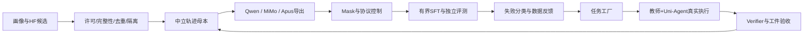

# Agent SFT 数据工厂与协议迁移：可执行设计

2026-09-24。当前交付为研究/设计，未运行付费生成、下载MiMo权重、修改训练代码。用户已确认继承MiMo权重，模板名apus-chat-v1；采用中立轨迹，首版优先保留MiMo已学序列化与独立tool角色，对外API单独适配。Qwen原生模板作为对照，暂不默认全面迁移。

## 目标

继承MiMo多领域任务示范理念，复用用户数据画像中的合格资产，用强教师真实执行补齐中文办公、研究、状态操作与纠错；交付可追溯SFT release，而不是不可执行的模拟日志。报告权威入口：[HTML](mimo-agent-sft-9b-report.html#synthetic-production)。

## 架构

## 拟实施文件范围（尚未创建实现）

- 数据工具模块：data_agent_sft/schema.py、normalize.py、render.py、quality.py、build_release.py；实际路径实施前对照现有data模块，能复用不新建。
- 版本化任务/环境/评分manifest；原始生成与拒绝证据单独保存。
- 测试：协议往返、loss mask、split/dedup、预算与重试、环境reset、grader控制。
- 报告追加起点对照、协议迁移、未见harness结果，不覆盖历史OPD结果。

## 接口合同

TaskRelease: task_id, split_group, initial_artifacts, environment_hash, tools, grader_revision, budgets。
Trajectory: task/session/trajectory IDs、教师和harness版本、messages结构化role/content/reasoning/tool_calls/tool_call_id、observations、artifacts、终止原因、token/费用。
GradeReceipt: status(scored/infra/unknown), outcome, deterministic_checks, rubric, evidence_refs。infra不能写成合法0奖励。
DataRelease: sources/revisions/licenses、hash、dedup_clusters、splits、accepted/rejected/disputed、loss_policy、按域有效监督token。
Renderer只改变表示；不能补造工具观察。序列化后须语义roundtrip验证。

## 生产步骤

1. 候选原文件抽查→冻结来源和排除表；画像S/A不直接放行。
2. GPT6-sol provider/正式model ID/计费/字段核验；当前API参考未覆盖该别名。
3. 20任务种子，初始最多每题2次、每次20轮；先正确/错误/空工件控制。金额/token/wall cap在实跑前补齐，不能按时间过了当批准。
4. 实测成本与有效率后扩100任务（5类各20，工程验收用），再考虑1000合格任务SFT。
5. 以有效监督token冻结训练混合；按任务族/来源去重并隔离dev/sealed。
6. 模板原生基线→适配层→迁移SFT独立对照；一个未见harness检验迁移。

## 测试与验收

- Unicode/JSON转义、字符串与对象参数、多工具、失败响应、截断、重复/缺调用ID。
- 原生模板stop/thinking正确；loss mask位置与目标token统计一致；环境输出不误当assistant目标。
- train/dev/sealed按repo/session/任务族无已知泄漏；同一前缀族不跨split。
- 正确/错误/空结果、依赖错误与沙箱故障评分区分；生成教师不能做唯一裁判。
- 超额不重试复活、并发幂等、暂停后停止新增请求；保留真实失败证据。
- 20任务仅验证产线，100任务仅开发画像，不据此宣称全面能力提升。

## 实施门

用户已要求完成本设计并更新HTML；尚未完成GPT6-sol端点与成本确认，未指定Apus协议。正式代码按项目AGENTS设计审阅门实施；付费生成前须冻结可审阅配置及预算。

## apus-chat-v1 最新决定

用户允许继承MiMo权重，明确名称apus-chat-v1。首版不增加特殊token，定义中立数据合同与API适配，保留模型原生可工作的结构；真实模板和parser实现仍须设计验收。模型来源如实记录，不能将模板改名宣称来源消除。详见HTML #apus-chat-v1。

## 主线执行入口更新

用户确认回到数据与教师执行主线。20任务细化为办公/数据处理/翻译/写作/代码五类各4题，详见[seed20](agent-sft-seed20-plan.md)。这是工程配额更新，不覆盖原版1K OPD合同，不冒充已就绪数据。Tool-call迁移按专项作为独立小实验；先中立母本、后模板迁移。
