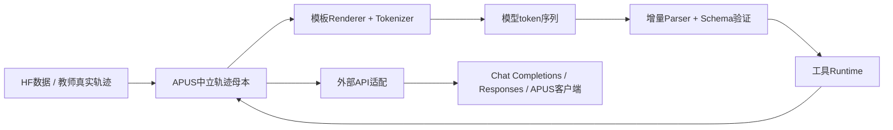

# apus-chat-v1：Tool Call 协议专项

更新：2026-09-24。状态：**设计草案，尚未实现 parser / renderer 或开展模板迁移训练**。

用户已确定：允许继承 MiMo Agent SFT 9B 权重；自有模板命名为 `apus-chat-v1`。本专项是工具协议的权威设计；[MiMo 专题 HTML](mimo-agent-sft-9b-report.html#apus-chat-v1)提供概览，[数据生产设计](agent-sft-data-production-design.md)负责上游轨迹生产。

## 1. 目标与范围

建立适合 APUS 本地办公、数据处理、翻译、写作、软件维护的工具协议，实现：

- 模型可以可靠发出工具调用，runtime 能确定调用对象、参数和结果关联。
- 多来源教师轨迹进入同一数据母本，再导出不同模型模板。
- 训练、推理和评测的模板、parser、工具 schema、停止条件可追溯。
- 逐步形成 APUS 自有行为与能力，同时保留上游许可及来源信息。

首版优先继承 MiMo 已学会的序列化，建立 APUS 合同和 API 适配；不为品牌更名新增特殊 token。改模板不消除模型谱系，也不证明能力已迁移。视觉、音频、并行工具、任意 custom/freeform 工具均不随文本函数调用自动放行。

## 2. 必须区分的三层



1. **数据层**：保存角色、调用 ID、对象参数、真实观察、工件和来源，不绑定某种 XML 文本。
2. **模型序列层**：chat template 将数据转换为实际 token 序列；空白、历史 reasoning 和角色包装都可能影响模型。
3. **API 层**：给客户端提供结构化调用和结果；API 兼容不等于底层模型模板相同。

`template_id`、hash、成本、grader 证据属于控制/数据元信息，默认不注入模型 prompt。参考答案、隐藏测试和 verifier 内部内容不进入可见历史。

## 3. MiMo / Qwen / OpenAI / APUS 横向对照

以下 MiMo/Qwen 是本轮所查版本，不能概括所有版本；APUS 是提案。

| 维度 | MiMo Agent SFT 9B | Qwen3.5-9B | OpenAI 公开接口 | apus-chat-v1 提案 |
|---|---|---|---|---|
| 消息边界 | `im_start / im_end` | 同类标记 | JSON messages 或 items | 复用现有 token ID |
| 调用表达 | XML式 `tool_call/function/parameter` | 同类标签，空白和提示不同 | 结构化 function call | 首版保留已学结构 |
| 工具结果 | 独立 `tool` 角色 | `user` 内 `tool_response` | tool消息或function_call_output | 保留独立tool角色 |
| 参数输入 | 模板兼容字符串/对象及custom分支 | 所查模板按mapping遍历 | 函数参数常用JSON编码字符串 | 母本统一对象，边界显式转换 |
| 调用ID | 所查模板未显式渲染 | 所查模板未显式渲染 | 显式ID关联 | 母本/runtime必存，顺序调用映射 |
| 历史reasoning | 每条assistant读取reasoning_content | 按最后用户问题位置选择性保留 | 依端点的reasoning项目，不等于完整内部思考 | 历史策略版本化，不擅自删改 |
| SFT mask | 存在generation区块 | 所查模板无同样区块 | API不定义我们的训练mask | 预处理与训练器联合验收 |

OpenAI 一列描述公开 API，不描述 ChatGPT 内部训练格式；不把外部 `role` JSON 与实际模型 token 一一等同。

### 3.1 工具返回的关键区别

以下仅为可读示意，**不是字节级 golden fixture**；正式测试必须保存真实模板渲染及 token IDs。

MiMo：

```text
<|im_start|>tool
{"sum":42}
<|im_end|>
```

Qwen3.5：

```text
<|im_start|>user
<tool_response>
{"sum":42}
</tool_response>
<|im_end|>
```

不能仅将 `tool` 替换成 `user` 就认为已经迁移；连续结果聚合、reasoning保留、EOS和解析器都需要一致。

## 4. APUS 中立数据结构

示例为**拟议内部 schema**，不是直接的 OpenAI API 请求，也不是模型原生字符串：

```json
{
  "schema_version": "apus-trajectory-v1",
  "template_id": "apus-chat-v1",
  "task_id": "office-sum-0001",
  "session_id": "session-0001",
  "messages": [
    {"role": "user", "content": "统计 sales.csv 中 amount 的总和。"},
    {
      "role": "assistant",
      "content": "",
      "tool_calls": [
        {
          "id": "call_001",
          "name": "sum_column",
          "arguments": {"file": "sales.csv", "column": "amount"}
        }
      ]
    },
    {
      "role": "tool",
      "tool_call_id": "call_001",
      "content": "{\"sum\":42}"
    },
    {"role": "assistant", "content": "amount 列合计为 42。"}
  ]
}
```

### 4.1 字段合同

| 字段 | 规则 |
|---|---|
| `role` | v1文本任务允许system/user/assistant/tool；其他角色须显式映射，不静默丢弃 |
| `content` | v1文本字符串；多模态保留原始content blocks，未验收前不强转为文本 |
| `reasoning_content` | 可选；仅存真实可取得内容，缺失不伪造、不将服务摘要冒充完整thinking |
| `tool_calls[].id` | session内唯一且稳定；模型不输出ID时由runtime分配 |
| `name` | 必须存在于该任务授权的工具注册表 |
| `arguments` | 规范化后的JSON对象；类型与必需字段按工具schema验证 |
| `tool_call_id` | 指向已登记且未完成的调用；不接受孤立或重复完成结果 |
| `raw_payload_ref` | 母本外侧保存原始请求/响应引用，支持审计与重建 |
| `outcome/infra_status` | 执行与评分元信息，和模型可见content分离 |

`tools` 注册表至少包含 name、description、parameters schema 和工具版本。名称相同不代表语义相同：相对路径、单位、默认值、超时和副作用必须核验。

### 4.2 字符串参数的归一化

- 上游 `arguments` 为JSON字符串时，严格解析为对象一次；解析失败保留原文并标记invalid。
- 不能用猜测补全缺失参数，也不能把 `{}` 自动修成“可能正确的调用”。
- JSON重复键、NaN/Infinity、schema类型错误须显式拒绝或隔离；不要依赖不同解析器的隐式行为。
- `"001"` 与 `1`、空字符串与null、空对象与缺失必须保留区别。
- 原始轨迹与规范化结果并存；任何修复形成新revision及修复原因。

## 5. 模型序列与 Parser 合同

### 5.1 v1保守方案

- 复用现有 `im_start / im_end`、thinking 和工具标签及 token ID。
- 保留 MiMo 风格独立 `tool` 结果；对外 API 可以转换成标准字段。
- APUS身份由明确system策略和经过审核的训练样本建立；不全文替换引用、文件内容中的品牌名称。
- 保留已学空白及历史处理作为基线；任何改变都作为一个独立干预测试。
- 暂不在模型文本里新增call ID标签，runtime根据完整调用分配ID。首版限定单个待执行调用；多调用/并行要单独验收。

### 5.2 状态机与流式边界

```text
assistant generation
  → partial tool block（只缓冲，不执行）
  → complete call
  → parse + schema + authorization checks
  → register call ID
  → execute once
  → record real observation
  → render next model turn
```

必须处理：跨chunk标签/参数、Unicode、嵌套JSON、引号和换行、空参数、截断、重复块、参数中出现类似标签的文本。XML式标记不意味着可以直接交给通用XML解析器；这些function/parameter语法和转义需要专用规范。

字符串中包含结束标签等歧义时，v1不能靠正则猜测执行：拒绝/隔离并记录兼容缺口，必要时另立转义协议实验。工具结果中的标签是数据，不能递归解释为新调用。

模型生成结束与工具调用完成是两个事件。`im_end`可能是assistant工具动作轮结束，不代表整个任务结束。必须联合解析结果和停止原因判定；不能见EOS就向用户返回“任务完成”。

### 5.3 重试与失败

- 语法/schema失败不执行工具，保留错误分类；若反馈给模型修正，反馈策略和重试预算应固定。
- 工具业务错误返回真实错误；基础设施错误单独记录，不生成虚假成功结果。
- 不盲目重试具有副作用的调用。runtime记录idempotency key、attempt和执行回执；超时后先查实际状态。
- 不执行未授权工具或越出任务范围的路径；schema验证不能代替权限验证。

## 6. API 适配

### 6.1 Chat Completions风格导出

内部 `name/arguments` 转为 `tool_calls[].function`，参数对象在API边界JSON编码：

```json
{
  "role": "assistant",
  "content": null,
  "tool_calls": [
    {
      "id": "call_001",
      "type": "function",
      "function": {
        "name": "sum_column",
        "arguments": "{\"file\":\"sales.csv\",\"column\":\"amount\"}"
      }
    }
  ]
}
```

返回消息：

```json
{"role":"tool","tool_call_id":"call_001","content":"{\"sum\":42}"}
```

### 6.2 Responses风格导出

调用映射为 `function_call` item（name/arguments/call_id），结果映射为 `function_call_output`（call_id/output）。不要将 Chat Completions 的tool消息原样当成Responses请求。

上述为字段设计，非已实现的API兼容承诺。完整streaming事件、finish_reason、并发、错误码和reasoning状态，需要按部署端点当前文档独立验收。

## 7. 训练数据与 Loss Mask

- 结构化母本是唯一转换起点；不从拼接后的标签文本猜角色。
- assistant内容与工具调用可作为监督目标；system/user/真实工具输出默认只作上下文。
- reasoning监督策略独立配置；缺失reasoning不得填补“假思考”。
- tool call已截断、参数未知、工具结果缺失、观察与动作不匹配的轨迹，不作为完整成功示范。
- 不能修改某一步动作却沿用原动作的结果；修复动作必须重新执行并产生新轨迹分支。
- 记录每域的上下文token、loss token、动作token、最终回答token及截断率。
- generation模板区块只是实现线索，不证明训练器正确应用mask；需保存真实token/mask，并验证非目标区梯度。
- 历史合并/压缩也是数据变换；保持原始trace和变换版本，不混入未声明训练配置。

## 8. 迁移实验：一次只改变一个因素

| 实验 | 改变 | 不改变 | 目的 |
|---|---|---|---|
| E0 原生基线 | 无 | MiMo权重与原生模板 | 建立工具/任务/预算基线 |
| E1 API适配 | 外部消息映射 | 模型可见token序列 | 验证客户端兼容不改变模型行为 |
| E2 APUS模板 | 身份与明确列出的格式差异 | 权重、任务、预算 | 测无训练迁移造成的损失 |
| E3 迁移SFT | 用APUS渲染轨迹做有界训练 | 起点与固定评测协议 | 验证格式与任务能力恢复/提升 |
| E4 未见harness | 执行外壳 | 同checkpoint和测试任务 | 检查工具接口泛化 |

先以种子任务测吞吐与错误分布，再冻结训练量及成本。不要为了改变格式默认上大规模SFT；E1足够满足产品需求时可先交付。

## 9. 验收矩阵与观察指标

| 层次 | 必测内容 | 完成标准 |
|---|---|---|
| 静态数据 | schema、调用关联、许可/来源、split、近重复 | 有效集无已知违规；拒绝项有原因 |
| 解析渲染 | roundtrip语义、golden token、参数边界、流式分片 | 支持范围内控制样例全部通过 |
| runtime | 真实调用、错误反馈、超时后状态、重复执行 | 正确执行且状态可追溯；副作用不因重试重复 |
| 训练 | 目标token、mask、有限loss/grad、权重更新/reload | 真实更新与独立重载证据 |
| 模型效果 | 工具解析率、schema合法率、调用成功率、最终完成率 | 四种指标分开报告，不能互相代替 |
| 产品能力 | 办公文件/数据计算/翻译约束/写作事实/代码测试 | 工件与任务检查支持结论 |
| 回归 | 中文、数学、指令、预算、未见harness | 同预算配对，阈值预注册，保留置信区间 |

关键负例：空调用、未知工具、错误参数类型、孤立结果、重复ID、工具结果中的伪标签、生成截断、超时但实际已执行、重复chunk、无reasoning、thinking不闭合。

观测必须串联 `run → task → session → turn → call_id → execution_receipt → grade`。模型错误、parser错误、工具业务错误、infra失败分别统计；不能统一归为0分或成功。

## 10. 实施文件与阶段

尚未创建以下实现；路径应先复用已有模块，而非另建并行框架：

- `schema`：中立messages/call/result、版本与验证。
- `normalize`：上游字段与JSON参数转换，原始引用、拒绝原因。
- `renderer`：固定版本Jinja、tokenizer hash、历史策略。
- `parser`：流式状态机、参数校验、结果识别。
- `runtime adapter`：ID关联、幂等/超时、API导出。
- `tests/fixtures`：正负样例、golden文本/token、roundtrip、真实工具测试。

推进清单：

- [x] 用户确定继承MiMo权重及名称apus-chat-v1。
- [x] 对照现有MiMo/Qwen模板，形成专项合同。
- [ ] 冻结v1支持范围、完整样例和相对MiMo的精确diff。
- [ ] 先实现E1适配与控制测试，验证模型输入不变。
- [ ] E0/E1真实同任务对照，按需求决定是否进入E2/E3。
- [ ] 若迁移SFT：先2–4步有界smoke，再按结果确定规模。
- [ ] 独立模型/数据/模板/工具版本报告与发布说明。

## 11. 证据与来源

- [MiMo固定revision文件](https://huggingface.co/XiaomiMiMo/MiMo-V2.6-Distill-Qwen-9B/tree/2367e865d009c13ac81713a2878291d33ab28177)：本地[元数据与模板快照](mimo-agent-sft-evidence/model-metadata.json)。
- Qwen对照：本轮只读远端 `/workspace/models/Qwen3.5-9B/chat_template.jinja`；正式测试前需记录模型revision、文件SHA与tokenizer SHA，当前不是新发布包的完整锁定。
- [OpenAI函数调用文档](https://developers.openai.com/api/docs/guides/function-calling)：公开API字段，不推断内部训练模板。
- [MiMo报告](mimo-agent-sft-9b-report.html)、[数据工厂设计](agent-sft-data-production-design.md)、[Thinking三层验收](thinking-acceptance.md)。
