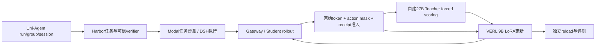

# Uni-Agent + Harbor + Modal + VERL + OPD 衔接设计

2026-09-15：实施已授权，正在成对升级及CPU回归；GPU独立环境构建进行中，尚无训练通过证据。

## 目标与发现

目标是由Uni-Agent维护运行身份与准入，Harbor提供任务环境和评分，Modal承担远程沙盒，VERL在自有GPU训练9B，27B Teacher为Student原始轨迹提供逐token评分，统一完成RL/OPD/hybrid及恢复验收。

最新Tinker云端P0已完成OPD有效更新与独立推理reload。不能继续用旧结论说所有Harbor格式任务训练均未打通；但这也不是Uni-Agent/DSH/VERL主线验收。

## 来源清单

| 工作目录 | HEAD | 可复用内容 | 缺口 |
| --- | --- | --- | --- |
| harbor-modal-integration | 9075dfa | Uni-Agent/DSH身份、轨迹准入、VERL主线、Harbor远程执行器 | 最新原生canary尚在初始化的历史记录；需重新查运行状态 |
| harbor-online-rl | 2512817 | 官方Harbor任务包、独立verifier、容器清理与监督器 | 有未提交文件；无有效Harbor训练更新/reload验收 |
| tinker-harbor-opd-rl | daf011a | 当前云P0证据和设计 | 此目录主要保存Uni-Agent侧文档 |
| tinker-cookbook-opd-rl | 5d9abba | harbor_opd_rl.py、原始token评分、RL/OPD/hybrid模式、Modal生命周期和checkpoint审计 | 独立Cookbook仓库；计算后端为Tinker |
| tinker-cookbook-harbor-opd-rl | 485726f | 早期实现参考 | 有未跟踪测试；不能误认为最新实现 |
| docs-modal-route-reset | 0e3d790 | Modal生成与fixed-sequence scoring边界 | 现有生成Endpoint未证明strict scoring可用 |

实际目录均位于仓库的.Codex/worktrees下；两个Cookbook目录是独立仓库，并非本仓git worktree list中的分支。

## 证据核验

读取tinker-harbor-opd-rl的p0-closed-loop-evidence.json，并逐项对比Cookbook outputs中的9个原始文件：SHA256全部匹配。

P0为Qwen3.5-9B / Qwen3.8-27B：1batch、2条同题轨迹、1179动作token、1138非零OPD位置；249个LoRA张量变化；独立推理reload成功。reward=[1,1]，RL信号为0。前评估2/2，后1/2且采样记录不齐，不能归因为能力退化或提升。optimizer resume、正式TB、非零RL与top-k评分未验收。

## 目标架构

Modal任务沙盒与Teacher推理服务是独立职责；Teacher可放自有8×A100，不依赖当前Modal生成Endpoint增加评分接口。

## 文件与接口计划

已以harbor-modal-integration固定SHA创建独立集成worktree。先比较harbor-online-rl的唯一代码提交，再按模块迁移；不整支合并、不覆盖未提交工作。Cookbook作为对照实现，迁移算法和合同，不复制第二套Agent loop。

- uni_agent/tasks/harbor_dsh/：明确Docker→Modal执行后端接口、任务资源、取消/清理及可信结果提取；现有Harbor支持Modal不等于自定义DSH执行器已支持。
- uni_agent/framework/及Gateway接线：保存student_version、prompt/target token IDs、action mask和完整组身份。
- Teacher评分适配：输入model/tokenizer revision、原始前缀token IDs；输出同位置Teacher logprob及可选top-k IDs/logprobs；禁止decode/reencode后默默错位。
- 配对VERL原生distillation loss：优先复用现有sampled/top-k配置和组合目标，不预设手写RL advantage与Teacher log-ratio相加。
- examples/集成入口：同一数据和执行链切换rl、opd、hybrid；明确checkpoint与optimizer恢复路径。

## 实施与验收

- [ ] G0 固定源码/依赖/模型与8卡规格；Teacher评分、tokenizer、上下文和mask合约测试。
- [ ] G1 真实Modal单任务经DSH/Gateway返回可信reward和轨迹；超时取消后无残留。
- [ ] G2 真实完整组同时进入Teacher scoring与VERL；证明目标token位置和奖励身份一致。
- [ ] G3 分别运行RL、OPD、hybrid；hybrid必须观察真实非零RL和OPD信号。不得人为修改reward造方差。
- [ ] G4 有限梯度、参数变化、采样权重同步、独立推理reload及optimizer续训分别验收。
- [ ] G5 固定独立评测与预算，报告成功率、成本、失败原文；正式Terminal-Bench题与开发训练题隔离。

用户已明确授权实施及新提供服务器的完整集成验证。其他会话的远程进程仍不得修改。CPU测试正在本worktree独立重跑，不继承历史测试通过数。

## Uni-Agent主线确认与源码定位

新分支verl-uni-agent-harbor-opd-rl已从9075dfa隔离创建；正在解决上游合并冲突。主线不是Tinker Cookbook，也不默认增加VeRL-Tinker API层。

现有主调用链为VERL trainer → AgentFrameworkRolloutAdapter → AgentFrameworkWorker / GatewayAgentFramework → task runner / DSH → Gateway trajectories → reward / trajectory audit → TransferQueue → VERL训练与权重同步。

关键断点：uni_agent/framework/entry.py:129明确拒绝非空teacher_client；framework.py:190的TQ序列字段集合已有teacher_logprobs/teacher_ids，但字段预留不代表生成或消费接通。配对verl的trainer_base.py已初始化MultiTeacherModelManager并提供get_teacher_client。这说明应补Uni-Agent adapter和framework内的Teacher评分及传递，不能切换到另一套AgentLoopManager绕过Uni-Agent。

Harbor隔离执行器isolated_trial.py仍有docker compose、docker cp依赖；不能仅设置harbor_env=modal完成可信DSH沙盒迁移。harbor-online-rl与候选基线在harbor_dsh下有4文件差异、反向比较涉及446行删除，需要逐功能挑选保留其output_contract/清理修复。

metarsi-m0相对当前基线的uni_agent差异以缺少新memory_chain等内容为主；不整体合并旧框架。dsh-capability-curriculum在该目录比较没有差异，但课程文件应单独审核。Tinker的harbor_opd_rl.py已有三模式和评分实现，仅迁移合同测试、信号审计思路；不替换DSH或TQ。

下一阶段代码前设计必须明确Teacher字段形状、序列分段、原始prefix评分、模型版本及完整组提交的原子性；明确配对VERL现有distillation loss可直接复用的范围后再决定是否新增loss。

## Teacher桥接实施合同（2026-09-15）

复用固定VERL的AsyncTeacherLLMServerManager与原生distillation loss。Adapter按distillation.enabled核对teacher_client，传入worker/from_config；仅配置开启时实例化Teacher manager。普通RL自定义framework不强制接收新参数。

评分在postprocessor准入和reward之后、trajectory dump与TQ提交之前发生，对每条存活chain评分；验证分区不评分。输入严格使用prompt_ids+response_ids，不decode/reencode；传递多模态数据与样本teacher_key。返回[S,K]整数IDs和有限logprobs，检查shape和序列长度。VERL已将next-token分布左移并尾补dummy，Uni-Agent不得再次shift；第一个response使用prompt_length-1行。

Teacher字段为TQ顶层nested [batch,jagged_sequence,K]，显式ragged_idx=1；不得作为普通metadata传输。完整batch的Teacher列必须成对齐全，否则fail-closed，禁止shared_keys自动丢弃。保留response_mask/action mask、版本证据和Harbor reward。Teacher异常走现有strict整组拒绝路径。先验收原生sampled/top-k loss合同，再单独设置use_task_rewards/use_policy_gradient等目标开关，不自行叠加另一份OPD advantage。

测试包括：原始tokens/路由透传、多chain与工具mask、validation跳过、错shape/非有限值拒绝、不等长TQ序列、首个response因果位置、strict group评分失败零提交。GPU阶段复跑固定依赖，验证真实Teacher评分、有效token、梯度、参数变化与同步/reload/resume。

## 全异步与OPD：独立的执行与学习合同

用户明确要求Student在真实Harbor/Modal交互中自主生成命令、犯错与修复，然后Teacher在这些原始上下文上评分。工具输出是上下文，不作为Student动作训练；verifier reward独立保留，不能被Teacher likelihood覆盖。纯OPD、纯RL、组合目标分别报告信号。

固定VERL V1支持colocate_async（当前Uni-Agent quickstart默认）与separate_async。前者共置actor/rollout，在更新时pause/abort generation再同步恢复，支持partial rollout；不能称为训练与推理GPU同时并行。后者分离资源，才实现持续rollout与优化并行。两者都用Gateway/TQ，不需要换Agent loop。

全异步与OPD可组合，但Student采样版本可能滞后：必须保留rollout_log_probs、min/max_global_steps、版本跨度与staleness，沿用ReplayBuffer阈值/drop或wait策略，并核验原生loss的策略修正。Teacher对旧Student轨迹评分不会消除off-policy偏差。先低滞后正确性验收，再测吞吐；不为了异步启动而复用错误版本轨迹。

当前实际服务器单卡96GB，只能分段验证。原生colocate_async+OPD至少actor/rollout池1卡+teacher池1卡；separate_async+OPD至少actor、rollout、teacher各1卡（角色调度下限，不保证目标9B/27B显存足够）。不伪造Ray GPU数，不将分段结果写为完整异步通过。

参考核对：[Tinker官方OPD](https://thinkingmachines.ai/blog/on-policy-distillation/)描述Student采样与Teacher逐token reverse-KL信号；[VERL V1官方文档](https://github.com/verl-project/verl/blob/main/docs/advance/v1_async_trainer.md)解释separate_async与非naive权重同步后端。实现以本worktree固定源码为准，不将浮动main文档当pin。

三种原生训练入口已落盘，使用说明见[训练recipes](training-recipes.md)。配置组合/原生Teacher dataclass共15例通过；无真实多卡更新验收。

Teacher评分增加每条轨迹可配置deadline（agent_framework.teacher_timeout_seconds，默认300秒）；超时取消评分协程、整组失败且不写trajectory。它独立于runner的session timeout，避免Teacher服务挂起让异步TQ永久停留running。Memory/Work-state只补Teacher转发，原有同步、完整组和verifier约束保留，不宣称该专用路线已全异步化。

### Gateway 版本证据准入

新增 `agent_framework.require_version_evidence`，默认 `false` 保留旧 RL 调用兼容；Harbor OPD/RL recipe 显式设 `true`，且必须与 `fail_on_rollout_error=true` 同用。每条轨迹进入 TQ payload 前验证 Gateway-owned `generation_count` 为正整数，`versioned_generation_count` 为相同整数，`version_evidence_complete is True`，`min/max_global_steps` 均为非 bool 的非负整数且 min≤max。缺失或部分证据令整组失败、零轨迹写入，不能回退到调度器 global_steps 冒充采样版本。允许真实跨版本跨度，不在此层强制同步版本或异步滞后阈值；固定 VERL ReplayBuffer 当前按 prompt 调度版本计算 staleness，并不直接约束每个 token 的实际 min/max 跨度；真实 min/max 保留为证据与训练指标，GPU 验收需独立对比两者。Harbor 已复用 `_validate_token_evidence` 验证 response logprobs 长度和有限值，不重复实现该检查。
