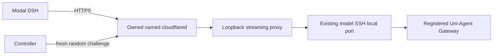

# Modal public Gateway transport

## Goal
Connect the existing controller-owned SSH Gateway mapping to a frozen public HTTPS
origin usable by Modal. Preserve Uni-Agent sessions, private registration, receipts,
budgets and the existing worker. No new training or agent loop.

## Contract
Add optional `RunSpec.modal_ingress` (Docker default remains absent):
`origin` (public HTTPS, default TLS port), `tunnel_id` (UUID),
`credentials_file` (private absolute file outside repo), `listen_port` (distinct
loopback port). Presence selects `environment_backend=modal`; Docker behavior and
old serialized RunSpec digests must remain unchanged when absent (exclude new null
field during canonical serialization, or explicit compatibility serialization).

Use a locally managed, pre-provisioned Cloudflare named tunnel. The operator
supplies its DNS hostname and credentials; implementation does not create accounts,
change DNS, or print secrets. Root-owned config fixes hostname -> loopback ingress
port, with catch-all 404. The controller starts/stops the cloudflared child itself.

The loopback proxy forwards only `/sessions/<id>/v1/...` model requests to the fixed
SSH origin. It preserves streaming, status and query/path semantics, strips
hop-by-hop headers and never follows redirects. It has no arbitrary upstream URL.
A fresh unpredictable probe path returns a nonce from this proxy: public readiness
must retrieve that exact nonce with TLS verification and redirects disabled. This
proves DNS/tunnel reaches this process; an alive cloudflared PID alone does not.
The SSH mapping proves the final target through its existing registered-port
contract. Keep a bounded startup/probe deadline and normal lifecycle health.

## Files and API
- New `deployment/services/harbor_modal_ingress.py`: typed ingress config, fixed
  subprocess, streaming proxy, nonce readiness, close idempotency.
- `harbor_run_controller.py`: own ingress lifecycle after model SSH is ready and
  before worker/receipt; failures close it; health includes it; forward backend/origin.
- `harbor_worker.py`: explicit `--environment-backend`, default Docker; standalone
  operator is responsible for its owned origin. Cannot fake readiness via CLI.
- Corresponding deployment tests: real local HTTP streaming/proxy, mocked provider
  process and public probe; preserve all Docker/controller regressions.

## Image/task preparation
Existing local-only task image IDs cannot be used as registry manifest digests.
Modal preparation must accept explicit digest-pinned registry references, match
agent digest to release, remove Compose files, allow only the frozen origin host,
and retain separate no-network verifier and original runtime binary identity.
An image reference is preparation input, not evidence of publication or pull.

## Verification and limits
Test rejected URLs/ports/private credential files, wrong public nonce, redirects,
upstream errors/SSE/disconnect, failed launch and cleanup, frozen origin/backend
forwarding, and Docker digest compatibility. No cloud allocation in CPU tests.
Real acceptance requires actual named-tunnel credentials/DNS, a registry image,
Modal task execution, authentic verifier results and independent resource cleanup.

## Implemented and verified, 2026-09-15

Controller optional `modal_ingress` now selects the backend and owns the streaming
proxy and named-tunnel child. Docker serialization omits the absent new field, so
existing canonical run digests stay unchanged. Credentials are snapshotted privately
outside both worktree and main repository; symlink-resolved private paths are checked.
Only the actual Gateway POST routes `chat/completions` and `messages` are forwarded.
Startup validates the public random nonce before emitting the registration receipt.
SSE first chunks arrive before upstream finishes; redirects are returned, never followed;
upstream disconnection is not converted into a successful completed stream.

`prepare_t2_task` accepts `--modal-origin`, `--agent-image-ref`, `--parent-image-ref`
and optional `--verifier-image-ref`, together with the existing final
`--agent-image-digest`. It removes Compose, pins agent origin allowlist and separate
no-network verifier, rebuilds the frozen task hash, and explicitly records that image
publication/pull and registry-parent provenance are **not yet verified**. The existing
training preparer validates this contract using the frozen RunSpec origin and release.

Combined ingress/controller/SSH/task-package/training-preparation/executor regression:
**217 passed**, 1 Ray deprecation warning, 19.88 seconds. Log:
`/private/tmp/uni-agent-modal-controller-preparation-integrated.log`.
The installed real cloudflared CLI also accepted the generated JSON config via
`tunnel --config ... ingress validate` (exit 0, OK); this is syntax evidence only.

Sources: [Cloudflare named tunnel configuration](https://developers.cloudflare.com/cloudflare-one/networks/connectors/cloudflare-tunnel/do-more-with-tunnels/local-management/configuration-file/)
was opened with gstack browse. It documents fixed credentials/hostname/service rules,
catch-all rules and preservation of the entire path. Context7 library resolution
succeeded, but both document retrieval attempts failed with `fetch failed`; no claim
is based on a successful Context7 document response.

Pending real acceptance: project-specific tunnel/DNS selection, registry publication
and runtime verification, authenticated Modal execution and cleanup. Existing local
Cloudflare credentials were only inventoried by filename/permissions; no other
project's tunnel was started or repurposed.
