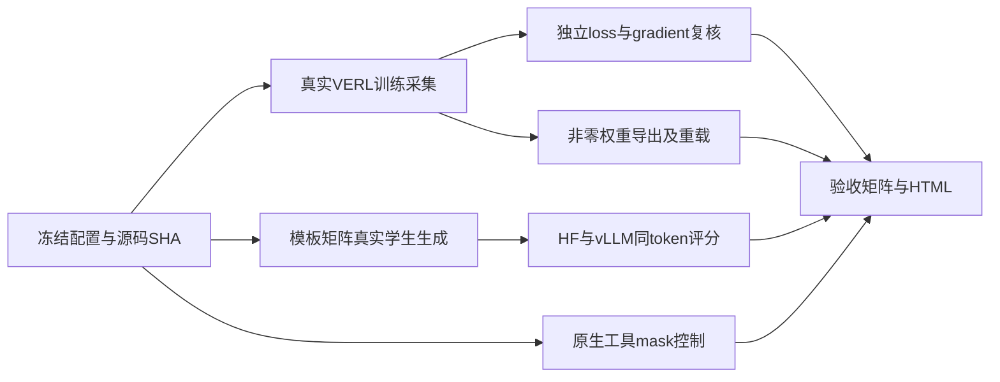

# OPD 完整验收执行合同

用户在有限兼容测试之后明确要求继续直到完整验收。沿用现有专用worktree、两卡服务器及uv环境，不修改已完成训练，不扩大外部沙箱费用。

## 验收目标与范围

确认这两份本地模型在明确配置下的token接口、教师评分、loss/gradient、实际参数更新和导出重载正确。能力提升仍是独立评价，不能用兼容性通过替代。

1. **真实训练批次**：通过仅验收run启用的instrumentation，在VERL实际loss调用处保存raw token IDs、mask、teacher IDs/logprob、student/old logprob、loss、gradient、温度与归一化。独立重算，与原函数输出比较；证明发生非零权重更新和独立重载。不能把文本重编码重放算作此项通过。
2. **模板模式与长度**：单轮thinking on/off、多轮历史、工具历史及长prompt控制；真实学生生成记录raw IDs，HF/vLLM同序列评分与原生parser逐ID核对。先限定总长度4096以内，逐条记录EOS/截断/思考闭合；未测更长范围明确不认证。
3. **工具mask边界**：调用真实VERL工具结果处理路径，验证工具输出不参与assistant loss、后续assistant恢复计分；纯本地工具，不产生沙箱费。若mock生成传输，明确它只认证mask逻辑，不认证模型自主工具能力。
4. **结论与交付**：门禁矩阵、来源SHA、失败修复、完整脚本与JSON证据；更新统一HTML和handoff。任何未通过项显示原因；不能将“流程结束”自动标记所有能力通过。

## 结构

新增产物集中本目录live-audit/、mode-audit/、tool-audit/。instrumentation只对新run有效，不修改原VERL部署树。GPU任务串行调度，禁止相互占用导致OOM。

## 门禁

- 有效response teacher IDs与学生目标IDs逐项相同，prompt/pad/tool位置不泄漏入loss。
- HF/vLLM各案例mean abs误差<0.1、P95<0.5；报告max与错位负控制，不只报总体均值。
- 独立损失与梯度按实际dtype和缩放比较，容差事先记录，超限不放宽而解释/修复。
- 实际训练权重非零变化且checkpoint可重载；空结果、只启动、只有梯度日志均不算完成。
- thinking/tool模式通过的范围按实际证据细分；未认证多模态及超过4096上下文，不能泛称“所有模式完全适配”。
