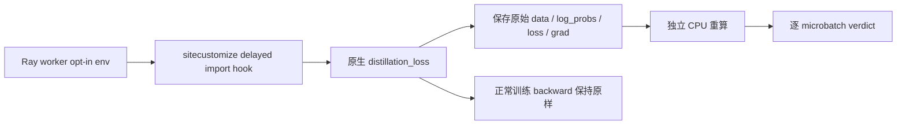

# 实际 OPD 批次数值验收

目标：补齐“重放文本/合成数值控制”与“正在训练的真实批次”之间的证据缺口。用户已授权继续完整测试验收。

## 架构与边界



不改生产 VERL 源码。未设置 OPD_LIVE_AUDIT_DIR 时没有 hook。设置后，importlib 在原模块执行完成后替换其全局 distillation_loss 函数；原生 distillation_ppo_loss 从模块 globals 获取函数，因此真实路径经过 wrapper。wrapper 先调用原函数，再 autograd.grad(loss, model_output.log_probs, retain_graph=True)，不累加 parameter.grad，不消耗后续 backward 图。异常直接使本次审计训练失败，禁止静默跳过。

捕获接口：每个 worker 安装 marker；每次 microbatch 原子写 micro-PID-N.pt，含原始 TensorDict 字段、nested tensor 各行、模型 log_probs、actual loss、actual gradient、loss config、global normalization info、源码与捕获脚本 SHA。标量和 None 保留；未知对象显式写类型/repr，不能误称已可重放。MAX_CALLS 默认64，仅用于有界1步验收（必须检查实际microbatch总数不超过上限）。

CPU verifier 只依赖 PyTorch，不调用 VERL：独立 causal response 切片、teacher IDs 对齐、k1 difference clamp、advantage detach、PPO ratio clamp、PPO/dual clip、importance weights、global aggregation、全部 raw logprob 梯度；支持当前 k1/kl + vanilla 路径，其他模式硬失败。非response位置梯度必须为0。允许浮点误差 atol2e-6/rtol2e-5。

## 文件

- sitecustomize.py：延迟 opt-in import hook。
- capture.py：训练路径原始张量和梯度捕获。
- replay.py：独立 CPU 重算和 JSON verdict。
- test_capture.py：dense/nested合成 CPU 集成测试（不冒充真实训练证据）。

## 接入

把四个 Python 文件复制至独立 remote `$ROOT/runs/opd-live-audit-code/`，产物指向新目录 `$ROOT/runs/opd-live-audit-evidence/`，不得混用合成fixture路径。

训练启动 shell **以及 Ray runtime_env.env_vars** 必须显式包含：

```
PYTHONPATH=$ROOT/runs/opd-live-audit-code:$ROOT/src/uni-agent:$ROOT/src/uni-agent/verl
OPD_LIVE_AUDIT_DIR=$ROOT/runs/opd-live-audit-evidence
OPD_LIVE_AUDIT_MAX_CALLS=64
VIRTUAL_ENV=$ROOT/envs/ua-verl-py312-vllm023-ws1
```

继续保留原训练所需的 sampler/PYTHONNOUSERSITE/其余PYTHONPATH。注意 train.sh 可能覆盖 PYTHONPATH，必须在其赋值处加前缀，不仅在外层export。Ray runtime_env.py_executable使用同一专用uv Python。

CPU验收：

```
$VIRTUAL_ENV/bin/python $ROOT/runs/opd-live-audit-code/replay.py $ROOT/runs/opd-live-audit-evidence
```

## 验收证据

1. 正确 worker 的 installed marker（仅此不足）。
2. 本次真实模型更新的全部 microbatch .pt，无遗漏；有效ID与响应一致。
3. 原生loss/梯度与独立重算一致；mask外梯度0。
4. 原始训练正常 backward/save 非零更新完成。
5. 保留真实 captured IDs，后续 HF/vLLM scoring 对比直接使用这些 IDs，不能重新tokenize文本替代。

本方案不自行启动训练，也不扩大数据或付费预算。温度字段只记录实际data中的actor温度；教师温度由该轮实际配置另行锁定，不能从词表一致推断。

## 真实1步覆盖门禁补充

`coverage.py capture --exit-file ../exit-code.txt --checkpoint ../checkpoints/global_step_1`
读取实际 command.txt（按shell解析且后置override优先），要求 batch8/n1/ppo_epochs1/totalsteps1/warmup0；所有capture恰好8行，每行mask有效token>0；每worker序号从1连续且未达64上限；actor实际temperature数值0.8；真实exit0，step1模型shard存在，全部独立数值重算通过。不能以“有一个pt文件”当作全批验收。

`extract_samples.py capture` 直接保存未重新tokenize的 prompt/response IDs及实际历史teacher/student/old logprobs，输出real-capture-samples.json，供其他模式样本统一HF/vLLM评分。`compare_live.py`为独立HF-vs-live teacher比较辅助；最终多模式统一门禁使用另一个专项的validate_scores.py，避免多个最终标准漂移。
