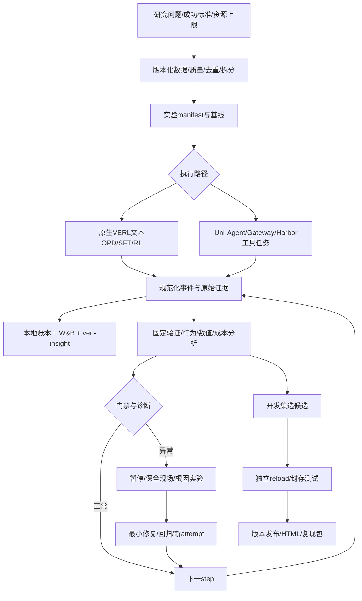

# 科学大模型训练产线：项目总纲与观测诊断合同

更新：2026-09-24。状态：目标与实施设计；不是全组件上线声明。

## 1. 核心目标与权威入口

用户目标是建立可复现、可观测、可分析、可发现问题并受控修复的科学大模型训练产线，最终支持全面高性能9B。约1000条多领域单教师OPD是首个产线验收实验，不取代长期MOPD、SFT、mid-training与RL研究。

- 唯一导航：[training-production.html](training-production.html)。
- 当前总纲：本文；组件合同：[training-system-v2-design.md](training-system-v2-design.md)。
- 首个实验：[training-pilot-1k-plan.md](training-pilot-1k-plan.md)。
- 索引：[project-index.md](project-index.md)。
- 最新真实实验：[overnight/index.html](overnight/index.html)；运行状态以handoff和带时间戳证据为准。

科学性不是面板数量，而是每项结论有对照、每个指标有定义、每次变更有版本、每个失败能回溯，且允许实验否定原假设。

## 2. 架构与职责

| 层 | 组件与责任 | 本轮真实边界 |
|---|---|---|
| 数据与实验 | source revision、逐题来源、质量裁决、分组去重、split manifest、实验注册 | 三套HF归档不等于高质量准入；122/30小集只作既有回归资产 |
| 训练执行 | VERL优化器/FSDP/LoRA、vLLM生成与教师评分、checkpoint与resume | 9B+27B文本OPD真实更新、导出/reload已验收；优化器完整恢复需另验 |
| Agent执行 | Uni-Agent任务/会话/Gateway/原始token/准入/TQ；Harbor环境与verifier | 旧工具路线与本轮单轮文本OPD不同，不强行让文本题经过付费sandbox |
| 事实层 | append-only事件、原始trace、指标/版本/证据索引 | 现有证据分散；统一collector与schema需要补齐 |
| W&B | 训练与验证曲线、配置、artifact引用；在线/离线状态可见 | 当前新run为offline；已有pull修复部分val键，非全量指标闭环 |
| verl-insight | step/rollout/teacher/update/checkpoint时间线、版本滞后和等待原因 | 有facade/adapter及合同测试；真实后端端到端接通不能假定 |
| 系统观测 | GPU/NVML、Ray/vLLM队列、磁盘、心跳、Prometheus/Grafana等投影 | GPU瞬时0%不能当空闲；导出器缺失必须显式显示 |
| 分析与控制 | 确定性统计、故障分类、policy engine、安全暂停、分析skill | 自动质量止损、PAUSED防重启与完整诊断自动化仍待实现验收 |
| 评测与交付 | 独立grader、配对统计、best/final/base、成本、HTML与复现包 | 已有评测骨架；代码执行与聊天可靠评分仍是硬缺口 |

## 3. 一次实验必须具备的合同

启动前冻结：假设、主指标/护栏、学生起点、teacher、算法与奖励是否实际参与更新、数据/模板/tokenizer/EOS、学习率实际生效时序、LoRA、预算、种子、评测频率、checkpoint选择规则、停止规则与资源上限。

run_id + attempt_id + step贯穿全链；sample_id/domain/source_id/rollout_id/group_uid/teacher_id/policy_version/checkpoint_sha定位具体样本与模型。domain不是来源名，也不是teacher身份。

事件最小字段：schema_version、event_id、UTC/单调时钟、run/attempt/step、stage、sample/rollout/policy身份、status、metric_name/value/unit、numerator/denominator、valid、missing_reason、source、evidence_uri与hash。幂等去重；迟到事件可重放；禁止混合不同attempt、模型或数据版本。

本地证据账本是可离线回放的事实源，W&B/HTML/verl-insight消费同一身份合同；云端写入失败不能吞掉证据。可选面板掉线可降级，训练准入/验证/预算等必需证据丢失则停止放行，不把缺失填成0。

全量保存token IDs、mask和样本元数据的存储量启动前估算；logprob/梯度采用固定审计抽样+异常保留，记录抽样规则，不能宣称每步都完成全张量独立复算。checkpoint保留策略与审计数据保留分别配置。

## 4. 核心指标与观测入口

| 问题 | 指标与定义 | 证据入口 / 动作 |
|---|---|---|
| 数据是否可信 | 唯一题目数、题族/近重复、来源与许可、质量通过/拒绝/待裁决、领域/语言/难度、prompt/target token分布 | 数据manifest、排除清单、污染审计；缺证据不准入 |
| 训练是否真实发生 | 实际optimizer LR、有限loss/grad、非零参数delta、update次数、权重版本同步 | 原始trainer事件、参数抽检、独立reload；scheduler下一步LR不能冒充本步LR |
| OPD监督是否正确 | 有效评分token/应评分token、teacher-ID错位、mask泄漏、teacher/student/old概率、clamp占比、分域loss | 原始token审计、独立HF评分；缺评分/错位/非有限值立即拒绝batch |
| RL是否有学习信号 | expected/valid/admitted/effective组数量；逐组reward差异、实际非零advantage、补采与短组 | group账本与准入trace；纯OPD n=1标N/A，不触发GRPO零方差暂停 |
| 模型是否变好 | 同预算分域dev成绩、配对差值与CI、任务数、已评分覆盖、退步任务、best/final | 固定验证输出+独立grader；训练reward和OPD loss不是最终效果 |
| 是否变啰嗦 | 输出token P50/P95、截断/超时、thinking闭合、最终答案、turn/tool调用、单位成功成本 | trajectory与行为报告；区分更高预算收益与同预算收益 |
| rollout是否过期 | policy版本跨度、staleness、rollout/actor概率差、IS权重/裁剪 | Gateway/TQ/VERL事件；适用性按同步/异步配置声明 |
| 是否基础设施污染 | task failure vs infra failure、verifier缺失/超时、parse错误、重试/eviction | session/receipt/verifier原始日志；infra缺口单独补，不能改判模型0分 |
| 卡在哪里 | 各阶段时长、cold start、prefill/decode、teacher scoring、update、eval、checkpoint、等待与队列 | verl-insight时间线+系统指标；GPU利用率结合队列、显存和进程解释 |
| 是否值得成本 | wall/GPU小时、teacher与student token、sandbox时间/费用、每有效更新/每成功任务成本 | 成本账本；未取到账单标估计，不声称真实费用 |
| 观测本身可靠吗 | 指标覆盖、事件延迟、丢失/重复、W&B本地一致性、trace可定位比例 | collector自检；分析skill不得据不完整曲线直接下结论 |

没有跨模型通用的grad_norm或clipfrac健康常数；按算法、启用项和预注册基线解释。指标0、未启用、未计算和缺失是四种状态。

## 5. 如何发现问题、定位与修复

固定顺序：身份核对 → 完整性 → 机制 → 数值与学习信号 → 行为与成本 → 独立效果。先排除读错run/数据/预算，再解释模型行为。

| 症状 | 优先定位 | 最小验证与受控处置 |
|---|---|---|
| loss下降但能力退步 | 教师领域优势、标签质量、长度膨胀、评测预算、训练验证重叠 | 逐题配对与失败trace，独立确认集；暂停，保留best，不直接加步数 |
| 零梯度 | loss mask、RL组内advantage或OPD概率差、detach/计算图、梯度累积与记录时机 | 原始微批独立复算；LR=0本身不会使反向梯度为0 |
| 梯度非零但参数不更新 | 实际LR/warmup、optimizer.step、冻结参数、更新溢出跳过、参数差异测量精度 | 核对本步optimizer状态与实际delta，不将下一步scheduler LR当本步值 |
| thinking截断 | prompt/template、EOS/stop、预算、重复修订 | 保留原失败，在新版本预算下做单变量诊断；不事后改原分数 |
| GPU闲置/step变慢 | 冷启动、teacher队列、环境等待、CPU/disk、验证/同步阶段 | 时间线定位最长阻塞，单点修复，不全局kill其他run |
| reward骤降 | 难度构成、grader/infra变化、真实模型回退 | 固定集复测；检查failed session而非只看batch均值 |
| W&B缺验证曲线 | key映射、offline/sync、run ID、step轴 | 与本地JSONL逐步对账；不能报告“没做验证” |
| resume结果漂移 | 模型/优化器/scheduler/RNG、数据游标、policy版本 | 与连续运行对照；新attempt记录恢复点，保留原事故 |

每个incident输出：触发指标/窗口/分母、证据URI、事实与假设、根因实验、修复diff、回归结果、是否允许恢复。分析skill负责证据解释与建议，不直接绕过停止策略改LR、数据、预算或自动扩容。

## 6. 控制与止损

状态机：DRAFT → PREFLIGHT → BASELINED → SMOKE → RUNNING → VALIDATING → COMPLETED；异常进入PAUSING/PAUSED或FAILED。PAUSED是持久状态，supervisor不得自动拉起；恢复建立新attempt，记录批准与配置差异。

- 数值/身份/评分硬错误：停止新rollout与更新，保全现场；不把坏权重发布为best。
- 质量与行为：监控集只预警；按事前固定规则做独立确认，再暂停。禁止把两次波动直接称统计显著。
- 资源：达到预注册硬cap停止新工作，必要时完成安全保存；不得自动加预算。
- 报告缺失与infra错误：分别处理，不与正常任务失败混为reward0。
- 控制器先shadow/replay、再故障注入、再2–4步真实集成测试，验证安全停与supervisor不重启，之后才放行正式pilot。
- 正常不自动回滚继续训练，避免掩盖事故。best保留，回滚/恢复要有明确attempt记录。

## 7. 统计、实验与发布纪律

train/monitor/dev/sealed按题族/来源分组隔离；历史30题已反复看过，只作回归集。sealed先封存，训练/选模型过程不可使用其结果。CI按题/题族聚类，不把同题多采样当独立题；多域主指标与护栏预注册，频繁验证不反复宣称显著。

teacher先与base做同预算分域对照。OPD相对base是否有效、相对其他方案是否划算分开验证；单种子只作探索，成功候选需复验。未评分领域不计“综合提升”；聊天盲评与代码执行器均须单独校准，不让训练teacher成为唯一裁判。

发布包：模型/adapter和基础模型身份、数据与排除记录、命令/环境lock、所有checkpoint评测、best选择依据、sealed结果、行为/成本、事故与修复、限制与复现说明。无法取得可靠效果证据时，产线验收可以完成，模型发布结论仍应为未证明有效。

## 8. 实施优先级及验收

1. P0 数据/指标合同与旧run回放：W&B、本地日志、验证输出step与关键指标一致；缺失状态正确。
2. P1 分域grader与实验集：代码隔离执行、数学/IF确定性检查、知识依据、聊天校准；正负与超时控制通过。
3. P2 观测闭环：统一identity、OPD/RL分型、有效token/组/行为/成本、raw trace定位；证明一个step能定位真实rollout、评分、更新和ckpt。
4. P3 控制闭环：缺指标/NaN/infra/成本/确认回退注入触发正确动作；PAUSED不会被守护程序重启。
5. P4 真实infra验收：W&B在线或明确offline同步策略、verl-insight后端真实trace、系统指标与本地账本可对账；不是只有mock单测。
6. P5 约1000题pilot：基线→小跑→有界学习曲线→best/final独立reload→封存测试→一份HTML报告。

P0–P4的必需控制证据通过后才放行P5；可选展示后端失败允许显式降级运行pilot，本地关键观测不可缺失。但若声明完整infra验收完成，P4各承诺后端必须提供真实接通与对账证据，不能用降级或mock代替。新组件设计审核、实现与真实运行状态分别记录，不能把本总纲当已建成。
