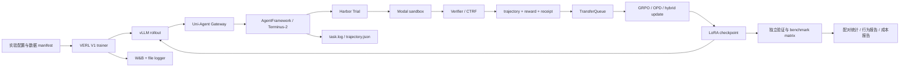
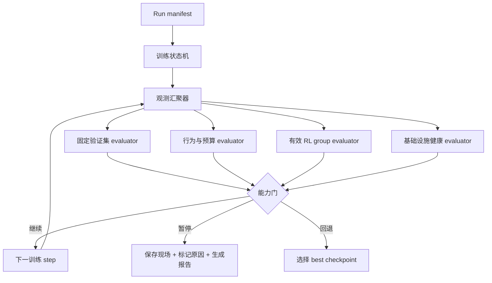

> 当前统一入口：[我们的科学训练产线](training-production.html)。下文旧architecture.html为历史拓扑，最新状态与阶段目标见新入口。

# VERL + Uni-Agent 训练体系 v2 设计

状态：v2组件设计与历史审计；部分执行链已验收，统一控制面尚待实现。
日期：2026-09-23  
适用 worktree：`verl-uni-agent-harbor-opd-rl`

> **2026-09-24 当前生效入口**：[科学训练产线总纲](training-production-charter.md)、[1000条受控实验](training-pilot-1k-plan.md)、[项目索引](project-index.md)。用户核心目标是完整可观测/可分析/可诊断修复的专业产线，OPD pilot为首个验收载体。本文§9纯RL首轮提案保留历史，但不再决定本轮算法；当前为多领域单教师OPD。真实已完成范围见[最新报告](overnight/index.html)，不能把本文待建组件当已上线。

## 1. 目标

Thinking 专项采用 [三层验收协议](thinking-acceptance.md)：token/上下文对齐 → 教师监督可靠性 → 同预算独立效果。当前为已批准合同，尚未宣称自动采集或真实对照完成。

把一次训练从“能启动、能产生 checkpoint”升级为可观测、可比较、可止损的闭环：

1. 每个训练 step 都能关联到数据版本、模型版本、rollout、verifier、reward、梯度和 checkpoint。
2. 固定验证集独立于训练 batch，并在 W&B 与本地证据中使用同一套命名和统计口径。
3. 记录有效 RL 组比例、短组、基础设施失败、超时、预算消耗和 off-policy staleness。
4. 在能力回退、有效学习信号耗尽、基础设施污染或预算越界时自动暂停，而不是继续消耗 GPU 和沙箱费用。
5. 训练结束后自动生成可复核的 base / checkpoint / held-out 配对报告，并支持独立 reload。

## 2. 当前系统实况

现有组件已经覆盖了大部分执行链：

- `run_tb21_pipeline.sh` 编排 `env → data → oracle → rollout → train → delta → resume → summary → acceptance → cost`。
- VERL V1、FSDP LoRA、vLLM、TransferQueue 和 Uni-Agent AgentFramework 负责采样与更新。
- Gateway 保留原始 token、mask、logprob 和 policy version，避免重新 tokenize 造成错位。
- Harbor / Modal 负责任务环境和 verifier，`registration.validate_registered_trajectories` 负责训练准入。
- W&B、VERL file logger、`train.log`、每个 session 的 `task.log`/`trajectory.json` 和 checkpoint 目录已经形成多源证据。
- `eval_checkpoint_matrix.py`、`eval_pair_report.py`、`eval_behavior_report.py` 已形成离线评测骨架。

## 3. 本轮审计发现

### 3.1 固定验证集存在，但分析层没有接上

S2 W&B 中确实写入了固定 validation 数据：

- OPD12：`val-core/tasks-validation/acc/mean@4 = 0.40625`。
- RL20：`0.50000`。
- RL40：`0.40625`。
- RL60：`0.50000`。
- OPD run 还写入了 step 0 的基线 `0.4375`。

但 `.claude/skills/rl-training-analyst/scripts/wandb_pull.py` 只读取 `val/test_score`，`report.py` 把 held-out 写成 `N/A (val disabled in smoke)`。因此验证结果已经产生，却没有进入标准报告、告警或停止逻辑。

### 3.2 训练准入允许基础设施失败污染 batch

RL W&B / 日志显示：

- 59 个 rollout batch 中 57 个出现至少一个失败 session。
- 累计成功 1,592、失败 96 个 session，约 5.7% session 失败。
- 7 个 group 被标记为 failed UID 并重新补采。
- 当前配置是 `fail_on_rollout_error=false`、`min_valid_sessions_per_group=2`，所以 3/4 或 2/4 的短组仍可能进入训练。

这类样本不能和正常任务失败放在同一个 reward=0 桶里。系统必须记录 `infra_failure`、`task_failure`、`timeout`、`parse_error`、`verifier_missing` 等原因，并决定哪些可以训练、哪些必须补采或暂停。

### 3.3 验收门检查“曾经有学习信号”，没有检查“正在变好”

`stages/80_acceptance.sh` 当前把以下内容作为主要动态门：

- 至少一个非零 `actor/grad_norm`。
- 至少一个有 reward variance 的 step。
- loss 和 gradient 有限。

这些条件只能说明训练机制曾经更新过，不能说明能力提升。当前验收没有把以下指标作为硬门：

- 固定验证集相对起点的回退。
- 有效组比例和有效样本比例。
- 训练/验证的超时和 token budget 使用。
- infrastructure failure rate。
- 训练成本和每个有效 update 的成本。
- best checkpoint 选择和回退。

### 3.4 W&B 已有更丰富的指标，但标准工具丢失了它们

S2 W&B 中已经有：

- `training/off_policy/trajectory_staleness/*`。
- `training/rollout_failure/evicted_samples`。
- `training/num_turns/*`。
- `training/rollout_probs_diff_*` 与 `rollout_corr/*`。
- `perf/throughput`、显存、生成时间、更新时间。
- validation 的 `val-core/*`、`val-aux/*`。

现有 pull/report 工具只抽取少量通用键，导致面板和自动分析之间存在信息断层。`actor/ppo_kl=0`、`actor/pg_clipfrac=0` 也被直接展示，但没有标注它们在当前配置中是否未启用、未计算或确实为零。

## 4. 目标控制面

### 4.1 Run manifest

每个 run 固化以下身份：

- git commit、VERL commit、Uni-Agent commit、环境 lane 和依赖 lock hash。
- base model / teacher model 的路径、文件 hash、tokenizer hash 和 renderer 设置。
- train / validation / sealed holdout 的 parquet hash、task revision、任务 ID 清单。
- reward contract、verifier 版本、工具配置、temperature、top-p、turn/token/time budget。
- trainer topology、GPU UUID、LoRA、学习率、warmup、batch、group size、n、DAPO/OPD/KL 配置。
- W&B run ID、本地 `PIPE_ROOT`、checkpoint identity 和评测 manifest。

### 4.2 固定验证集

验证集分为三层：

1. **step validation**：8–16 个固定任务，低成本、每个 checkpoint 评估 4 次，用于预警；小样本单独不能证明能力下降。
2. **development holdout**：不参与训练，用于选择 best checkpoint。
3. **sealed benchmark**：训练过程中不可读，只在最终候选上运行，用于最终结论。

每次验证必须输出 `mean@4`、任务级 paired 差值、置信区间、超时、token、turn、基础设施失败数，并把这些字段写入 W&B 和本地 JSON。验证失败或不完整时不能写成 0 分。

### 4.3 行为预算

每个 session 和每个 step 都要记录并门禁：

- completion tokens、prompt tokens、总 tokens。
- turns、工具调用次数、主动完成比例、max-turn 比例。
- timeout、abort、parse error、verifier timeout。
- 单个任务 wall time、Modal sandbox 时间、GPU 生成时间。
- 预算使用率和超过阈值的任务比例。

预算门不是单纯限制最大长度，而是检测模型是否用越来越高的成本维持相同或更低的通过率。

### 4.4 有效 RL 组比例

按 `(step, group_uid)` 统计：

- `group_size_expected`、`group_size_valid`。
- 正常 task outcome 数、infra failure 数、timeout 数。
- reward 的 distinct value 数、`max-min`、std。
- `mixed_group = distinct reward > 1`。
- 产生非零 advantage 的 token/session/group 数。
- 被拒绝、补采、重试和最终进入 TQ 的数量。

建议把 `effective_group_fraction` 和 `effective_session_fraction` 写入 W&B。低于阈值时自动暂停或切换到补采/难度调整策略，不能仅依靠 `grad_norm > 0`。

### 4.5 自动止损

止损规则分为三类：

| 类别 | 默认触发条件 | 动作 |
|---|---|---|
| 质量回退 | 固定集超过预设回退 margin 时告警；独立确认评测支持回退后暂停，禁止仅用连续两次下降判定 | 暂停，保留 best checkpoint |
| 学习信号不足 | 有效组比例连续两步低于阈值，或 reward variance 为零 | 暂停并要求换题/增加 n/启用过滤 |
| 运行污染 | infra failure、短组、缺失 receipt 或 verifier failure 超过阈值 | 拒绝当前 batch；连续超阈值暂停 |
| 成本失控 | step cost、sandbox cost 或预算使用率超过 run cap | 立即停止新 rollout，保存现场 |
| 数值不稳定 | NaN、非有限梯度、KL/概率差异尖峰 | 立即停止并冻结 checkpoint |

所有止损都需要写出 machine-readable `stop_reason.json`，同时在 W&B 记录 `control/decision`、`control/threshold` 和 `control/evidence_uri`。

## 5. 组件建设清单

### 数据生产层（与 P0–P4 并行）

训练体系不能只有“消费数据”的脚本，还需要可回溯的合成数据工厂。参考 MiMo V2.6 专题中对 mid-training、任务合成、scaffold、rollout、verifier/rubric 和 sample mixer 的拆分，本项目新增四类可独立版本化的资产：

- `MT-v1`：Agent/代码/研究轨迹、工具反馈、失败恢复和长上下文压缩，目标是扩大 9B 的可探索行为状态。
- `SFT-v1`：多能力冷启动示范、反例、安全和 thinking/no-thinking 对照，目标是建立稳定格式与基础能力。
- `OPD-v1`：同一 student prefix 上的 teacher token 概率和 mask，目标是能力迁移；不能把 teacher 完整答案混称为 OPD。
- `RL-v1`：带 scaffold、环境、verifier、reward contract、novelty 和 hack-resistance 证据的在线任务，目标是可验证改进。

合成候选必须经过许可证/来源登记、结构校验、teacher agreement 或 verifier、精确与语义去重、benchmark 污染审计和人工抽样；失败样本与反例保留为质量资产，但不能未经分类直接进入正向 SFT。MiMo V2-Flash 曾披露特定阶段约 5% 合成推理数据，这个数字不作为本项目固定比例；本项目按有效 token、能力覆盖和独立验证结果调节。

### P0：观测合同和报告修复

- 扩展 `wandb_pull.py`：支持 `val-core/*`、`val-aux/*`、failure、staleness、turn、budget、throughput 和配置快照。
- 扩展 `report.py`：输出验证集、有效组、短组、基础设施失败和成本行；不再把已有 validation 写成 N/A。
- 统一本地 `metrics.jsonl`、W&B history、`pipeline-summary.jsonl` 的 step identity。
- 给每个指标增加 `source`、`valid`、`missing_reason`，区分未计算、零值和数据缺失。

### P1：训练过程控制器

- 新增只读观测器，按 step 汇聚 W&B、train log、agent logs、validation JSONL 和 cost evidence。
- 新增 policy engine，计算继续/暂停/回退决策。
- 训练脚本在每次 checkpoint 后调用控制器；暂停时优雅停止当前 rollout，保存 `stop_reason.json`。
- 保留现有 supervisor 的进程边界，不使用全局 `ray stop` 或跨 run kill。

### P2：Uni-Agent / VERL 训练合同增强

- 为每个 session 统一生成 `run_id / step / group_uid / sample_id / rollout_id / policy_version / checkpoint_id`。
- 将 infra failure 与 task failure 分开编码，失败样本默认不进入 reward 训练。
- 对短组显式记录权重和补采次数；禁止静默按少量有效样本完成更新。
- 把 group variance、effective group fraction、trajectory staleness 和 rollout failure 直接作为 trainer metrics。

### P3：verl-insight / Prometheus / W&B 面板

- W&B：训练信号、验证能力、行为预算、系统健康、成本五个 panel。
- Prometheus：GPU、Ray、vLLM、Gateway、Modal controller、队列长度和失败率。
- 仓库已有 `uni_agent/rl_insight/` facade、task/generation trace adapter，以及 router emitter；P3 要把训练 step、group 准入、verifier、预算和 checkpoint sync 接入同一 trace identity，并确认远端 `VERL_RL_INSIGHT_ENABLE=1` 后端真实可用。
- `verl-insight`：在现有 adapter 上补 step timeline、rollout/update overlap、off-policy lag、checkpoint sync 和 GPU idle reason，不另造第二套 trace API。
- 每个 run 生成一份静态 HTML 报告，内嵌 run manifest、指标曲线、停止理由和证据链接。

### P4：独立评测与 benchmark matrix

- 固定 base / OPD / RL / hybrid 版本清单和同一任务配置。
- 统一 TB2.1、SWE-bench Verified 及后续 benchmark 的任务版本、工具预算和 verifier。
- 评测结果只接受完整任务数、完整样本数和 checkpoint reload 成功的 manifest。
- 输出 task-level paired diff、行为差异、成本差异和多 checkpoint 选择偏差说明。

## 6. 现有 HTML 的继承关系

已有文档各自解决不同层次：

- [`architecture.html`](architecture.html)：当前训练拓扑和 rollout 时序，适合作为组件图底稿；内容停留在 2026-09-16，缺少固定验证、预算、有效组和自动止损。
- [`uni-agent-system-plan.html`](../dsh-v3-live-smoke/uni-agent-system-plan.html)：更完整的 Uni-Agent / Harbor / Modal 分工和长期 RSI 目标；它是跨 worktree 的总方案，不应复制成第二套训练事实源。
- [`harbor-agent-rl-guide.html`](../dsh-v3-live-smoke/harbor-agent-rl-guide.html)：Harbor 与 Agent RL 的入门和集成边界，适合保留为背景材料。
- [`checkpoint-full-eval-design.md`](checkpoint-full-eval-design.md)：已有严格的 checkpoint、完整性和 paired eval 合同，可直接纳入 P4。
- [`.claude/skills/rl-training-analyst/SKILL.md`](../../.claude/skills/rl-training-analyst/SKILL.md)：已经定义了不少指标，但指标采集脚本和自动控制还没有跟上。

批准后，权威内容建议收敛为：

1. 本目录的 `architecture.html`：训练控制面和组件拓扑。
2. 本目录的 `training-system-v2-design.md`：实现合同、门禁和测试计划。
3. `tasks/verl-uni-agent-harbor-opd-rl/handoff.md`：当前运行状态与冷启动顺序。
4. sibling HTML 只保留跨仓系统和 Harbor 背景，不复制训练指标和当前 run 状态。

## 7. 测试计划

### 单元和合同测试

- W&B key normalization：`val-core/*`、`val-aux/*`、缺失、零值和 numpy scalar。
- group accounting：完整组、短组、基础设施失败、补采、全同 reward、混合 reward。
- budget accounting：token/turn/time 超限、主动完成、timeout、verifier timeout。
- stop policy：质量回退、信号不足、成本越界、NaN 和恢复到 best checkpoint。
- manifest identity：数据、模型、配置和 checkpoint hash 不匹配时拒绝汇总。

### 小规模真实验证

1. 复用已完成的 S2 W&B run，离线重建 step validation 和 group fraction，结果与日志逐步对齐。
2. 以 2–4 步、固定 8 个任务运行 control-only training，验证停止器不改变训练参数，只控制继续/暂停。
3. 注入一个 infra failure 和一个正常 task failure，确认两者分别进入报告和准入决策。
4. 对一个 checkpoint 做 reload + fixed validation，确认报告可独立复现。

## 8. 实施顺序与退出条件

先完成 P0，再做 P1。P0 的退出条件是：W&B history、train.log、validation JSONL 和本地报告的 step 数与关键指标逐步一致，且 RL60 的现有 validation 不再显示为 N/A。P1 的退出条件是：模拟回退和失败污染能自动暂停，并保留完整现场。通过后再接入 Prometheus/verl-insight 与新版 architecture.html，避免先做展示层。

## 9. 重训执行协议（2026-09-23 新增）

本节是下一轮提案，未启动远程训练。流程通过与模型提升分别验收，不预设算法一定有效。

### 9.1 实验问题与对照

首轮从同一原版权重开始做纯 RL，先回答“健康数据、有效学习信号、固定行为预算下，RL 能否改善独立任务表现”。不从已退步的 OPD12 初始化。通过机制与观测验收后，再分别从同一 base 做 OPD 和 OPD→RL 对照；各臂独立优化器、明确随机种子，记录训练样本暴露量、tokens、更新次数与费用，不能把等步数等同等预算。条件允许时多训练种子复验；单种子结论明确局限。

### 9.2 逐门放行

| 门 | 操作 | 必须产物与放行条件 |
|---|---|---|
| G0 实验冻结 | 核实 GPU/进程/现有评测归属、额度；数据去重；固定配置 | manifest、split audit、资源排期；不得覆盖旧 runs |
| G1 观测回放 | 用已有 S2 本地日志和 W&B 对账 | 逐步差异报告；missing 不伪装成 0；采样组与训练准入组分母分别记录 |
| G2 工程冒烟 | 固定 2–4 步纯 RL，保存后重启恢复 | 真实 rollout/update/save/reload/resume 证据；模型、优化器、scheduler、RNG 身份核对 |
| G3 控制验收 | 离线注入缺指标、infra failure、NaN、额度越界 | 停止决策、现场证据；监督器尊重 PAUSED，不自动重启被止损的 run |
| G4 有界试训 | 从 base 全新启动；预注册步数/成本上限与评测频率 | 完整 W&B/本地指标、有效组/行为曲线、每个保留 checkpoint 的 dev 全量结果 |
| G5 独立结论 | 选择 best，再独立 reload；最终同预算评测 | base/best/final 配对结果、CI、行为、成本、失败清单、完整报告 |

正式配置生成前必须填齐：训练步数、GPU小时、沙箱费用上限、n、任务预算、评测频率、告警 margin、有效组阈值、最大补采次数。旧交接提及的 900 美元共享上限及 856.04 美元账单是历史记录，不能当成当前可用额度或新的消费授权。

### 9.3 统计与止损的严谨边界

- train / monitor / dev / sealed 按任务身份和仓库来源审计重叠。按难度选训练任务只用训练侧试采结果，不能用 sealed 调参。
- monitor 是频繁观察集；低分触发确认评测。预先冻结确认规则，避免逐步反复检验造成误报。sealed 只在最终候选确定后同时评 base 与候选，结果不反向用于选 checkpoint。
- n=4 是每题采样次数，不代表四个独立任务。置信区间按任务聚类；相同 seed 不保证轨迹严格配对。完整性、基础设施失败及重试规则必须预先固定，不挑高分 attempt。
- mixed reward 是有效信号代理，必须再核对实际非零 advantage 与准入分母。比例上升不等于能力提高；全对组增加也可能使比例降低。
- timeout 按发生阶段区分：预注册任务预算耗尽可属正常任务失败；沙箱启动、传输或 verifier 故障属基础设施。短组不自动等同错误，但首轮采用完整组准入、有限补采，并记录丢弃造成的分布变化。
- 自动止损先 shadow/replay 验证，再在 G4 生效。质量暂停保留 best，不静默回滚继续训练；任何恢复都创建 attempt 并保存原判定。

### 9.4 专项与文件范围

| 专项 | 文件范围 | 验收 |
|---|---|---|
| P0 采集报告 | `.claude/skills/rl-training-analyst/scripts/wandb_pull.py`、`report.py` | 真实 S2 关键字段逐步对账 |
| P1 控制 | 拟新增 `examples/harbor_opd_rl/control/`；训练 stage 与 supervisor 边界 | 决策幂等、PAUSED 不重启、仅操作本 run |
| P2 准入 | Uni-Agent rollout/group accounting；训练 identity | expected/valid/admitted/effective 四级守恒 |
| P3 可观测 | 现有 `uni_agent/rl_insight/`、W&B 分析 skill | 从 step 可定位 trajectory/verifier/checkpoint |
| P4 评测 | 既有 matrix/result_check/pair/behavior 脚本 | reload 证明、完整样本、同配置配对 |

P0/P1 代码实施前按项目 Human Gate 确认本方案；重训使用已通过的代码版本。HTML 是导航入口，本文是实现合同，handoff 是带时间戳的状态源。

### 9.5 两张 RTX 6000 的资源结论

这里的“RTX 6000”必须先区分显存型号。当前 SSH 节点实测是 **2 × NVIDIA RTX PRO 6000 Blackwell Server Edition，每张 97,887 MiB（约 96 GiB）**；GPU0 仍被 2026-09-20 启动的旧 checkpoint 评测进程占用约 79.8 GiB，GPU1 当前空闲。正式重训前必须先由运行负责人确认旧评测归属并按其交接流程收尾，不能直接清理或抢占。

| 路线 | 2 × 96 GiB RTX PRO 6000 | 2 × 48 GiB RTX 6000 | 资源安排 |
|---|---|---|---|
| 纯 RL（9B student） | **可行**，单卡 actor+rollout；另一卡可做独立评测 | 通常可行但需降低 context/concurrency 并先做 probe | GPU0 训练，GPU1 评测/备用；也可轮换 |
| OPD（9B + 27B teacher） | **可行但需实测余量**；student 与 teacher 分卡，teacher 需降低 `gpu_memory_utilization` 并限制 prompt batch | **不建议作为正式方案**；27B teacher 单卡通常不足，不能用 Ray 虚报 GPU 数 | GPU0 student/rollout，GPU1 teacher；teacher 先做单题 logprob probe |
| OPD→RL 两阶段 | **可行**；阶段 A 双卡，阶段 B 释放 teacher 后单卡 | 阶段 A 不稳，阶段 B 可行 | 每阶段独立 run、独立 manifest，不复用未核实状态 |
| 全量 checkpoint 评测 | **可行**，单卡串行，另一卡可并行但需独立 Ray/temp/log 目录 | 可行但吞吐降低 | 每个版本独立目录、显式 GPU UUID、失败只补基础设施缺口 |

依据不是“角色数量”，而是实际显存峰值：9B student 的 FSDP、vLLM KV cache、merged LoRA buffer 和长上下文同时存在；27B teacher 还要为 prompt logprob 留余量。历史 pipe-r4 在 96 GiB 卡上曾因 teacher 配置过高 OOM，降低 teacher 显存比例和 token batch 后才完成。因此 2 卡足以复现**纯 RL 与受限 OPD**，但不等于能以任意上下文、并发和吞吐运行。

重训前的硬性资源探针：记录 `nvidia-smi` 的 GPU UUID/显存、student 单步、teacher 单题 logprob、两进程并存 10 分钟峰值、checkpoint 保存和 reload；探针不计入正式指标。任何一项失败都先降 context/concurrency 或改为纯 RL，不把“启动成功”写成完整复现。
