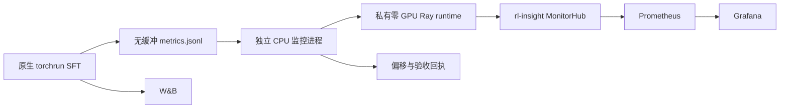

# SFT 观测和环境重建补齐设计

状态：设计待确认，未修改训练运行方式、未部署新进程。基于2026-09-28实际源码和云端审计。

## 目标

保留已经完成的20K SFT成果；补齐下一次同脚本运行的rl-insight实时scalar观测与可复现安装。W&B/JSONL仍是逐step曲线的权威来源。

## 现有证据

- 正式run 10000步全部指标与W&B一致，90020值对账通过。
- 当前环境156个固定版本与已保存freeze完全一致；2个editable源码路径、TransferQueue git来源需另行核验，包版本不能证明源码一致。
- bootstrap仍有未固定依赖，不能将版本快照直接等同于严格冷重建成功。
- rl-insight 0.3.0只有内置Ray客户端，torchrun未初始化Ray；原生logger无条件设置初始化标记，不能作为后端成功证据。

## 最小文件改动范围

1. `examples/performance_9b/sft_insight_sidecar.py`：读取JSONL，上报scalar，保存偏移与错误回执。
2. `examples/performance_9b/run_verl_sft.sh`：可选启动/收尾sidecar；独立监控日志和退出状态，保留原训练退出码。
3. `deployment/bootstrap/setup-performance-9b-sft-cu128.sh`：使用已审计版本约束；此文件存在此前未提交修改，实施时必须保留并审查原diff。
4. 对应CPU单测与本目录证据；训练器/FSDP算法不变。

## 输入输出契约

- 输入：每行 `{"step": int, "data": {metric: finite number}}`。同一步训练和验证可有两行；按文件偏移处理，不能只按step去重。
- 只读训练日志，处理半行、重启、截断/替换；发现不一致明确失败，不静默跳过。
- 只允许run白名单scalar，增加global_step和last_update；不使用step作为高基数label。
- 私有Ray runtime声明零GPU；不得自动连接其他集群或停止其他Ray进程。CPU/内存上限根据已安装Ray API核实后固定。
- 监控失败单独输出状态，不改写训练成功/失败。期望启用但连接失败须在总验收中标记未通过。
- 历史回放独立命名replay，不能覆盖原run，不代表历史trace恢复。Prometheus采样gauge可能合并多次更新，完整step序列继续查W&B/JSONL。

## 验收顺序

1. CPU测试：半行、同step两条、重启偏移、截断、非有限值与传输失败。
2. 独立CPU传输验收：init确实enabled；实际Prometheus target UP；间隔超过scrape interval发送两个不同值，range query查到两次变化；保留返回值和请求范围。
3. Grafana能选择对应experiment；不能只以进程存活算通过。
4. 在空闲资源上用同启动脚本做有界真实SFT，证明运行期间train/val/global_step进入后端。不得中断当前模型评测；无需重跑20K。
5. 环境在新workspace目录冷重建、pip check和必要CUDA forward通过；不得覆盖现有训练/评测venv。
6. 代码lint/test及用户规定ruff双门禁通过后独立提交；目标仍以完整验收为准。

不新增SFT不存在的rollout/tool trace。若需要性能阶段trace，应另行明确实际forward/backward/checkpoint span，而非伪装RL轨迹。
