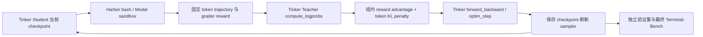

# Tinker + Harbor + Modal OPD/RL 实施设计
2026-09-15。Teacher Qwen/Qwen3.8-27B，Student Qwen/Qwen3.5-9B。
目标：独立 Terminal-Bench 提升，研究能否超过同口径 Opus 4.6。尚无超越证据。

## 工作区
本仓库 tinker-harbor-opd-rl 保存项目文档。
上游 clone 是 ../tinker-cookbook-harbor-opd-rl（此前误称 worktree）。
真正 Cookbook 实施 worktree 是 ../tinker-cookbook-opd-rl，分支 feat-harbor-opd-rl，
上游基线 485726f55d3b2b5abe5fcb4a0d2f3e18e4599dfe。参考 skills/research 官方 skill。

## 架构

## 文件和接口
新增 Cookbook harbor_opd_rl.py、harbor_opd_preflight.py、tests 和运行说明。
复用官方 train_on_policy、HarborDatasetBuilder、HarborReward 和 checkpoint。
不修改官方 zero_reward recipe，不引入第二个训练器。
配置模式 opd/rl/hybrid；显式 manifest 的 train/validation 任务列表必须独立。
默认指令版 9B（具备工具使用基础）；Base 另需 SFT/能力验证。

## 验收
- 本地：数据隔离、模式切换、无效配置拒绝、真实官方 advantage+KL 数值与 mask。
- 账户：capabilities、tokenizer/token ID、Student 采样、Teacher 固定评分。
- Sandbox：oracle/nop、真实多轮交互、grader 失败与任务失败分开、cleanup。
- 更新：一个 batch、有限非零 update、新 sampler、新进程 checkpoint reload。
- 效果：base/RL-only/OPD-only/hybrid，同任务和预算；最终测试不参与训练。

## 限制
当前Tinker凭据由云Secret注入，P0单批更新与独立reload工程验收已通过；结果见p0-cloud-closed-loop.md，能力目标未验证。
scoring 使用 Student 的精确上下文，不能悄悄换 Teacher template。
sampled reverse-KL 是 Monte Carlo 估计，不要求完整 logits，样本可为负。
4 个 probe 只证明基础设施。大 Teacher 与优质训练不能保证超越 Opus。
控制进程现已部署Modal CPU App；GPU工作都交Tinker。
