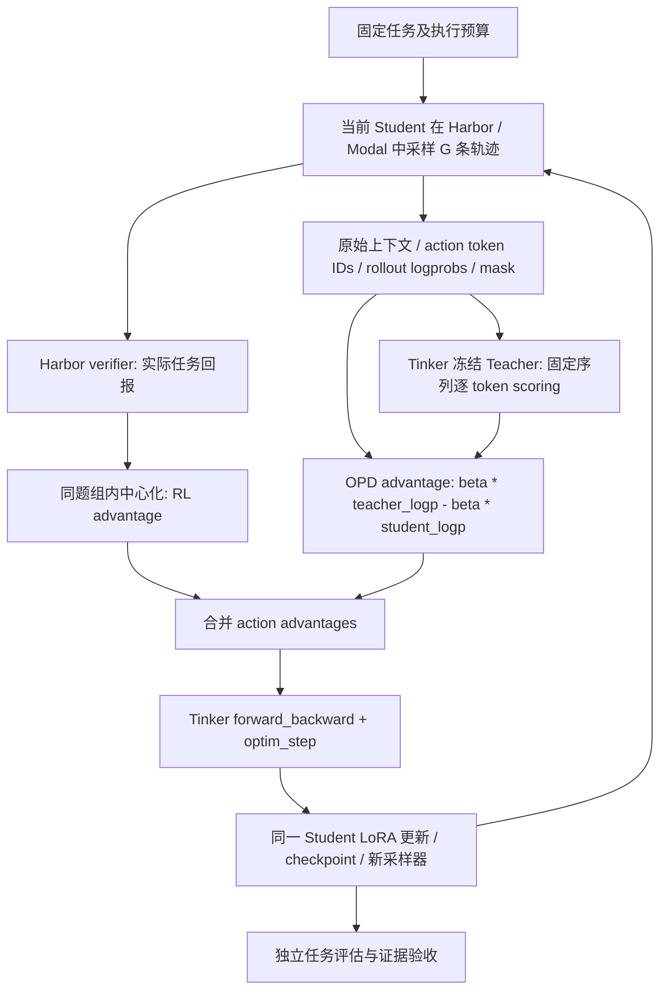

# Harbor + Tinker：OPD 与任务奖励 RL 联合更新参考

2026-09-15。面向接手会话或另一个训练项目；可整份交接。本文描述**当前代码与已验证行为**，不把拟议功能算作完成。

## 1. 目标与结论

目标是提升 Qwen3.5-9B 在独立终端任务、最终同口径 Terminal-Bench 上的成功率。Qwen3.8-27B 为冻结 Teacher，Tinker 提供模型采样/评分/LoRA 更新，Harbor 定义任务与评分，Modal 执行控制进程及终端沙箱。

**当前已有联合更新路径：同一批 Student 轨迹同时产生 OPD 与 reward RL 信号，先合并再更新同一套 Student LoRA。** 这不是先 OPD 后 RL 的两阶段流程。

但真实 P0 批次的两条轨迹都成功，组内 RL advantage=0。该批只有非零 OPD 信号；**非零 OPD 与非零 reward RL 共同参与的真实云更新仍待验收**。独立 Terminal-Bench 提升也未证实。

相比另一个会话截图中“OPD/GRPO 互斥”的实现，我们增加了保留 verifier reward 的 hybrid 组合入口。未读取对方仓库，不能根据截图断言其完整代码状态。

## 2. 三个概念分别负责什么

| 概念 | 本项目含义 |
|---|---|
| LoRA | 可训练参数的形式；不是训练目标 |
| OPD | Student 自己探索，Teacher 对 Student 已采样 token 在相同前缀下评分 |
| reward RL | 用真实任务评分形成同题组内优势，强化相对成功的轨迹 |
| hybrid | 两项信号在同一批数据中合并，通过一个训练 client 更新同一套 LoRA |

## 3. 运行架构



Teacher 不生成替代轨迹；模型状态、工具输出、失败尝试均来自 Student 的真实交互。环境输出参与后续推理上下文，但不作为预测动作训练。

## 4. 当前算法的精确含义

以当前默认 `kl_discount_factor=0` 为例。对同一任务的 G 条轨迹，先计算完整回报 R（包括逐步奖励与最终奖励；框架惩罚须单独记录）：

```text
A_RL[i] = R[i] - mean(R[0:G])
A_OPD[i,t] = beta * (log q_teacher(a[i,t] | h[i,t])
                       - log p_rollout(a[i,t] | h[i,t]))
A_combined[i,t] = mask[i,t] * (A_RL[i] + A_OPD[i,t])
```

- 当前 RL 优势只减组均值，**不除以组标准差**。不应不加区分地称为某个完整 GRPO/PPO 配方。
- `q_teacher` 是冻结 Teacher 对固定 Student token 的概率；`p_rollout` 是生成这条轨迹时保存的 Student 概率。
- 当前是 **sampled token-level reverse-KL 信号**，不是全词表精确 KL，也不是 top-k GKD。单个 sampled log-ratio 可以为负。
- `kl_discount_factor>0` 会加入未来 OPD 信号的折扣累计；本文的简单公式及 P0 实测针对 0。
- `beta` 对应 `kl_penalty_coef`。当前没有独立的 `rl_loss_coef` 配置，不能在对方项目里假装已存在。

默认 `loss_fn=importance_sampling`。损失的核心形式为：

```text
L ∝ -sum(mask * exp(log p_current - log p_rollout) * stop_gradient(A_combined))
```

官方 importance_sampling 示例使用负加权优势之和；本轮已通过 Context7 核对[官方损失文档](https://tinker-docs.thinkingmachines.ai/tinker/losses/importance-sampling)。实际返回字段遵循 Tinker loss 实现。代码最终先移除仅供客户端审计的 mask 字段；环境位置的 advantage 已为 0，作用仍保留。`num_substeps=1` 时每批提交一对 forward_backward/optim_step；大于 1 时每个子批一对。不是先调用一次 OPD optimizer，再调用一次 RL optimizer。

例如 R=[1,0] 得到 A_RL=[0.5,-0.5]。若两个动作位置的 OPD 增量均为 1，则合并为 [1.5,0.5]。失败轨迹某个动作仍可能被提高概率，因为 Teacher 的指导超过负 RL 信号；这不是合并错误，但说明需要监测系数和两项方向，不能假设 hybrid 一定优于单项。

## 5. 代码入口与可移植改动

实现仓库本机位置：
`/Users/gumpm5/Documents/Code/xDAN-DSH-uni-agent/.Codex/worktrees/tinker-cookbook-opd-rl`

分支 `feat-harbor-opd-rl`；本文审核的实现 commit `2ef293b6a173f28154a21f5c5df143ac280f5967`。真实 P0 部署为更早的 `b06728a`；文档更新不等于云部署。

以下路径均相对该实现仓库根目录：

| 文件 / 符号 | 作用 |
|---|---|
| `tinker_cookbook/recipes/distillation/harbor_opd_rl.py` | 本项目组合入口；CLIConfig、build_dataset_builder、cli_main |
| `tinker_cookbook/rl/data_processing.py:compute_advantages` | 从真实组回报计算中心化优势 |
| `tinker_cookbook/distillation/train_on_policy.py:prepare_minibatch` | 先组装 RL datum，保留 before_kl，再加入 Teacher 信号 |
| 同文件 `incorporate_kl_penalty` | 固定序列评分、shift/mask 校验、将 KL 增量加到已有优势上 |
| 同文件 `do_train_step_and_get_sampling_client` | 将合并后的 data 交给一次训练阶段，再刷新采样器 |
| `tinker_cookbook/rl/train.py:train_step` | 真正调用 forward_backward_async 与 optim_step_async |
| `tinker_cookbook/distillation/signal_metrics.py` | 分别记录 RL、OPD、combined 的幅度和非零位置 |
| `tinker_cookbook/recipes/distillation/harbor_training_evidence.py` | 独立重算 token/scoring/advantage 与调用证据 |

三个模式的行为：

| mode | 任务 reward | Teacher KL |
|---|---|---|
| opd | 关闭任务评分回报；框架惩罚另核对 | beta>0 |
| rl | 保留 verifier 回报 | beta=0 |
| hybrid（默认） | 保留 verifier 回报 | beta>0 |

注意：`rl` 模式训练 KL 阶段不评分 Teacher，但当前 CLI 的启动 probe 仍会检查 Student/Teacher；不能声称整次 rl 命令零 Teacher 请求。

最关键的组合逻辑是：

```python
# 结构示意；不是可独立运行的完整脚本
advantages = compute_advantages(trajectory_groups)
data, metadata = assemble_training_data(trajectory_groups, advantages)
rl_before = clone_action_advantages(data)
await incorporate_kl_penalty(data, teacher_clients, dataset_indices, beta, 0.0)
# incorporate 内部执行 +=，保留已有 RL 优势，而不是覆盖为 OPD
log_signal_metrics(data, rl_before, trajectory_groups)
await train_step(data, same_training_client, ...)
```

对方项目无需为联合训练新增一套模型部署。若已经支持固定序列评分和 RL trainer，优先增加 hybrid 配置、优势合并及证据审计；具体损失实现须结合其 trainer，不要机械复制 Tinker 类型。

## 6. 对齐与评分契约

1. 输入为 Student rollout 的原始 token ID 序列；不能 decode 后重新套 Teacher chat template。
2. Teacher 评分完整序列 `model_input + 最后一个 target token`；去掉首 token 对应的不可评分 `None` 占位后与 shifted targets 对齐。
3. 不仅检查长度，还检查 tokenizer 映射/特殊 token、上下文、每个动作位置；同一家族名称不能代替验证。
4. 只在有效 action 位置要求概率有限；先选 action 再做运算，避免环境位置 None/NaN 乘 0 污染结果。
5. 可解析的 Student thinking 和 tool-call 都是动作；工具/环境返回 mask=0；解析错误按 renderer/harness 的掩码规则独立记录。
6. grader 崩溃、reward 缺失/非有限/截断不得伪装为模型正常得 0 分。先清理旧 reward 文件。
7. rollout 与被评分分布一致。当前约束 temperature=1，并记录实际 top_p/top_k/seed/stop；特殊采样截断需重新检查估计目标。
8. 不默认丢弃全同奖励组：它们的 RL 分量为 0，但仍可能提供有用 OPD 信号。禁止加随机 reward 制造“非零 RL”。

## 7. 是否真正生效：2026-09-15 复核

| 验证层 | 结论 | 边界 |
|---|---|---|
| 配置和代码路径 | hybrid 同时保留任务 reward 和 beta>0 | 只是支持能力 |
| 本地非零组合 | 真实 prepare_minibatch 正确合并两项 | Teacher/轨迹为模拟输入 |
| 训练调用边界 | 真实 train_step 把 combined 优势送到 forward_backward，再提交 optim_step | recording client，无远端参数更新 |
| 历史真实云 OPD | 已有逐 token scoring、非零 OPD 和参数更新证据 | 该批 RL 全 0 |
| 真实云非零 RL+OPD | **尚未验收** | 需要有真实成败差异的新鲜轨迹 |
| Terminal-Bench 得分提升 | **尚未验收** | 当前 4 道原创工程题不代表正式 TB |

本次针对联合路径重跑 **131 项离线回归通过**。另检查四种输入沿实际 prepare_minibatch→train_step 到本地 recording client 的行为：hybrid 混合奖励、纯 OPD、纯 RL、hybrid 全同奖励；均检查收到的优势、action mask 和调用顺序。后者不创建任何 Tinker/Modal 网络请求，不作为云训练成功证据。

历史真实 run：`hybrid-p0-20260915-02`。
- 每条轨迹逐步奖励为 [0,0,1]，额外 final reward=0；同组总回报 [1,1]，RL advantage=[0,0]。
- 6 个 datums；1,179 个动作 token，3,595 个屏蔽位置。
- OPD 非零动作位置 1,138（365 正 / 773 负），RL 非零位置 0。
- 1,179 个动作位置按 `after = before + beta * (teacher_logp - student_logp)` 独立重算，float32 误差 0；3,595 个屏蔽位置的优势均为 0。
- 真实 optimizer 完成；同源 initial/final 对比 53,520,850 个 LoRA 元素发生变化，独立 reload 成功。
- 原创两题评估：训练前 2/2、后 1/2。无配对 seed、小样本，不能证明提高或因果退化。

原始审计入口：`outputs/p0-trained-cloud-run/hybrid-p0-20260915-02/training/` 中 config.json、iteration_000000/before_kl_datums.jsonl、after_kl_datums.jsonl、train_scoring.jsonl、train_rollout_summaries.jsonl，以及 capture/sample.jsonl、capture/train_op.jsonl。参数与 reload 记录在 `outputs/p0-verification-cloud-run/`。这些 outputs 是本地/云证据缓存，非源码仓库必带文件。

本轮复核边界：
- `before_kl/after_kl` 是加入 OPD 优势前后，不是模型更新前后；P0 的 `compute_post_kl=false`，不能据此声称训练后 KL 下降。
- 历史 `train_op` capture 记录调用状态/数量/损失，但没有完整提交 payload、服务端 forward logprobs 或梯度；不能离线精确重算服务端 loss 或分离两项梯度。
- 参数变化来自历史同源权重对比；本轮重新聚合逐张量报告并校验 checkpoint 来源，没有重新下载读取原始权重。
- 新的本地调用验证报告为 `outputs/joint-update-verification-20260915/local-payload-check.json`；模拟 Teacher/轨迹/客户端，不将其计作真实云更新。

### RL 为零是否因为题目太简单？

本次 CSV 汇总任务两次都成功，支持“该题对当前 Student 偏简单”的判断，但两次采样不足以可靠估计成功率。严格可证的是该批回报全同。全部失败 [0,0] 也会产生零中心化优势。

选题应覆盖真实终端技能，并有一定学习空间；可先关注基线成功率处于中间区间、Teacher 能稳定指导的候选，而不是只找最难任务或无限重采直到出现差异。同一批全同回报是正常可能性，不应为制造训练信号改变评分。

## 8. 下一次“有效联合更新”的验收

- 固定有学习空间的任务、采样次数和预算；先通过环境/负例/可信参考解验收，再筛查 Student 与 Teacher。
- 一组真实新鲜 rollout 出现成败差异；独立重算 reward→组均值→RL advantage。框架惩罚与 verifier 回报分开。
- 在 action 位置同时观察非零 RL 和非零 OPD，并验证 combined 公式与实际训练请求一致。
- 完成真实 forward_backward/optim_step、同源 checkpoint 对比与独立 reload；这些证明更新链路，不证明某项带来能力收益。
- 用同初始化、任务分布和可比预算做 baseline/OPD/RL/hybrid 对照；独立开发集成功率决定是否继续，最后再做同口径 Terminal-Bench。
- 报告同时保留 job/infra/evidence 状态、任务成功率、费用、截断/错误；两项非零、loss 下降均不能代替能力提升。

若需更强的信号归因，应另外比较固定数据与初始化下关闭 RL 或 OPD 后的结果；Adam 更新通常不能简单拆成两份参数差值相加。当前 signal_metrics 的点积是优势向量点积，**不是参数梯度冲突测量**。

## 9. 给另一个会话的复制说明

> 请先读取本文及实现仓库列出的函数。目标是同一批 Student 轨迹上的 OPD 密集指导与 verifier reward RL 联合更新同一套 LoRA。当前本项目已实现 combined advantage 路径，真实 P0 只证明非零 OPD 更新，RL 因组奖励 [1,1] 为零。请检查你方是否把两者做成互斥模式；如是，先提交 hybrid 接入设计与测试计划，再实现，不能仅改模式名称。保留 before/after 优势、原始 scoring、mask、实际训练 payload、optimizer 与 checkpoint 证据；最终以独立终端任务/TB 成功率验收。

相关：[历史真实 P0](p0-cloud-closed-loop.md) · [评估证据补强](eval-evidence-validation.md) · [Top-k 与当前 OPD 的区别](topk-opd-review.md)。
