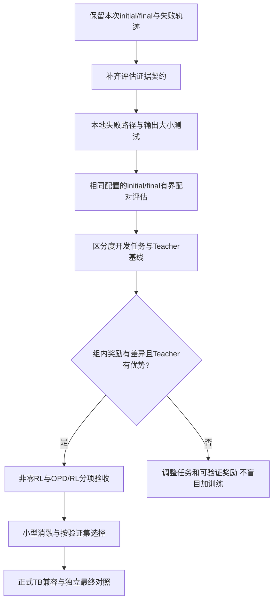

# P0之后：评估证据与有效学习信号

2026-09-15。前置证据见[p0-cloud-closed-loop.md](p0-cloud-closed-loop.md)。本文件细化既有F/G里程碑；目前仅方案，尚未执行新训练或新评估。

## 目标

把下一次实验变成能解释成功与失败、能检验学习收益的实验。当前参数更新与reload已过关；2/2→1/2的单次观察、RL信号0和评估记录缺项是下一步真正要解决的问题。不要先增加训练steps或更换更大Teacher。



## 最小文件变更设计

| 位置（Cookbook worktree） | 计划改动 | 验收 |
|---|---|---|
| recipes/distillation/harbor_smoke.py | 显式保存解析后的sampling/预算/harness配置，区分工程状态与task score；复用官方capture而不新建第二套采样器 | 参数不静默丢失；base/checkpoint同配置；seed不支持时明确标未知 |
| recipes/harbor_rl/harbor_tools.py、harbor_env.py | 在可选观测回调中保留grader执行退出码、stdout/stderr、reward文件原文和最后一次工具输出 | 不改变reward语义；缺失/非有限/超时仍分类为infra错误 |
| distillation/observability.py | 终态/截断/耗时与官方Store关联，保留task、trajectory和sandbox身份 | 0秒占位不可当耗时；max_turns和统计num_truncated语义明确 |
| 上述对应测试 | 正常及失败路径、字段缺失、长输出截断/分文件、取消后资源回收 | 原始数据可复核；大输出不会无限占内存；不泄露凭据 |
| docs、tasks及控制状态摘要 | 同一run分开显示job、infra、任务分数、参数、reload、RL信号 | 正常执行而0分不能全绿；未知不是失败或成功 |

保持现有训练入口、Tinker SDK futures、官方日志与云职责；优先可选回调/已有capture，不重写训练器。修改实现前对照实际SDK和Cookbook源码；部署仍需新wheel/hash与最终Linux bootstrap，不能把本次b06728a证据追认给新代码。

## 评估产物接口（拟定）

```json
{
  "schema_version": 2,
  "run_id": "unique-evaluation-run",
  "checkpoint_identity": {"base_model": "Qwen/Qwen3.5-9B", "sampler_path_sha256": "..."},
  "sampling": {"temperature": 1.0, "top_p": 1.0, "top_k": -1, "seed": null},
  "seed_status": "not_paired",
  "infrastructure_passed": true,
  "task_solved": false,
  "score": 0.0,
  "termination": {"reason": "max_turns", "turns": 3},
  "grader": {"exit_code": 1, "stdout_artifact": "grader.stdout", "stderr_artifact": "grader.stderr", "reward_raw_artifact": "reward.txt"}
}
```

上述是接口示例，不是本次已有报告或实际grader退出码。原文按任务隔离落盘；给出hash、字节数及截断标志，不能只保留LLM可读摘要。若环境发生基础设施故障，保留明确error，不能伪装成模型解题失败。

## 顺序与停止条件

1. 离线实现与审查评估记录；用现成失败轨迹确认遗漏字段，不能改宽grader使失败题通过。
2. 有界配对评估先统一checkpoint、任务bytes、工具、并发、采样、轮数、token上限和重试规则。无法做到seed配对时，明确采用多次独立采样比较；样本数在提交前固定，禁止看到成绩再无限重跑。
3. 选择独立开发任务，避免现有两道简单题充当提升指标；先看Teacher成功而Student失败的任务，记录组内全好/全坏/混合分布。
4. 非零RL须同时有真实奖励差异、非零RL advantage、实际update和同源参数证据。不能往奖励中加人为随机噪声来“通过测试”。
5. 官方TB兼容用固定任务做oracle/nop和Student重复运行，保留版本、资源/网络/工作目录契约。被用来排错的任务从最终盲测排除。
6. state+optimizer resume单独测试：步数和优化器状态来源真实恢复，拒绝仅加载weights重建optimizer冒充续训。
7. 先做只读Control Panel展示上述产物，再接提交/取消/预算锁；取消请求与资源已清理是两个状态。

仍限制付费范围。当前USD10充值不是实时余额，下一次提交前估算完整采样+Teacher评分+训练+评估+Modal成本；不得因P0通过自动扩成完整Terminal-Bench训练或大规模消融。
