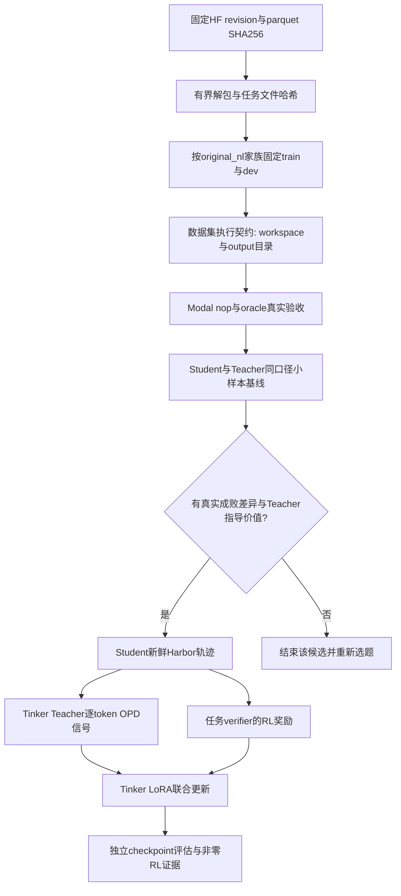

# OpenThoughts-Agent-v1-RL 固定版本接入方案

2026-09-15。用户建议引入该数据集，现已下载并完成静态结构检查；尚未执行归档中的任何脚本、Docker构建、云任务或模型调用。曾将它作为优先候选；用户进一步明确以Terminal-Bench能力提升为主，当前采用它作为**Shell基础补充池**，不是正式 Terminal-Bench 测试集。

## 固定来源与核验

- 数据集：[open-thoughts/OpenThoughts-Agent-v1-RL 固定版本](https://huggingface.co/datasets/open-thoughts/OpenThoughts-Agent-v1-RL/tree/39ab71434e90d8f87d2cd69c13b6d8a0cb2c238f)。
- Revision：`39ab71434e90d8f87d2cd69c13b6d8a0cb2c238f`。
- `tasks.parquet`：728行，10,187,380 bytes；字段为path:string、task_binary:binary，后者是gzip tar。
- SHA256：`35decc7d89d852b80f2787f77ae5786d6065b4343d6ad90151fdd56f6f59092c`。
- 728个唯一任务路径、728条无完全重复的instruction；按task_manifest.original_nl聚合只有**616个原始问题家族**。112条为额外同源变体。
- 全部包含instruction.md、task.toml、task_manifest.json、environment/Dockerfile、tests/test.sh和solution/solve.sh。
- 728个Dockerfile相同，728个verifier脚本也相同；verifier实际用cmp核对预期输出文件，不能根据README概述称为pytest测试。
- 归档内容合计173,293,246 bytes；最大文件20MiB，最大任务约68MiB。10.2MB下载体积不是展开或运行的资源预算。
- 固定版本README和文件列表没有数据集license声明；不能把链接代码仓库的Apache-2.0自动归给数据集，正式使用范围需补上游来源许可核验。

数据卡声明来源为nl2bash verified，主要用于Shell任务。静态源关键字扫描未发现Terminal-Bench来源，但没有与正式TB语料逐题比对，因此**不能宣称已排除评测污染**。

## 与当前系统的真实兼容差异

| 环节 | 数据集事实 | 当前实现 | 接入动作 |
|---|---|---|---|
| 工作目录 | oracle均cd到/workspace，seed文件使用相对路径 | HarborBashTool每次从/执行，shell之间不保留cd | 为此数据集显式配置tool_workdir=/workspace，并写进执行契约；不能仅先运行一次cd |
| 输出目录 | 所有任务要求/output/command_capture.txt，Dockerfile没有mkdir /output | 当前沙箱没有该目录准备步骤 | agent和oracle使用相同的目录初始化，记录退出码；不改测试标准 |
| verifier | 使用绝对输出/reward路径和脚本相对expected_output | grader从/root执行 | 可以保留grader工作目录；严格检查reward原文 |
| 资源 | 无environment段；agent/verifier均600秒，restart_environment=false | P0用自定义CPU/内存与recipe超时 | 明确选择和记录资源；不能声称自动兑现task.toml所有语义 |
| 镜像 | Ubuntu24.04、apt构建依赖联网 | Modal从environment目录构建镜像 | 分别验证构建网络与运行网络；固定构建来源和镜像身份 |
| 答案隔离 | task_manifest含原始/变体解题命令 | controller可持有全部任务，sandbox只应含environment | 禁止把task_manifest、tests、solution目录打包进Student初始环境或prompt |
| oracle | 内部命令可能吞非零退出码 | 现有audit会继续读取grader分数 | 必须oracle reward=1；solve.sh退出0不足以通过 |
| 数据划分 | 官方仅train split | 当前入口要求train与validation路径列表 | 按original_nl家族固定划分；同源变体不得跨集合 |

## 目标、架构与流程

归档中是任务，不是本次Student轨迹；训练时仍须重新on-policy采样。先沿用已经验证的sampled reverse-KL和真实任务奖励，top-k留作后续对照，不阻塞首轮有效实验。

## 文件变化设计与接口

以下为下一批实现设计，当前未落地，不应将候选集计入已经可跑的4道工程题。

| 文件 | 计划职责 |
|---|---|
| recipes/distillation/harbor_dataset_import.py及测试 | 固定revision/hash、逐行有界解包、完整性/重复检查、家族划分和manifest输出；不执行归档脚本 |
| recipes/distillation/harbor_resources.py | 将显式tool工作目录和输出目录初始化纳入任务执行契约，保留资源上限 |
| recipes/harbor_rl/harbor_env.py、harbor_tools.py | 传入工具工作目录，默认保持原4道任务行为；初始化回执进入现有事件记录 |
| harbor_smoke.py、modal_controller配置/预算 | 接受经过审计的固定候选manifest和数据集执行profile，避免继续读取旧csv-first manifest |
| 文档和tests | train/dev同源隔离、答案不进入sandbox、nop/oracle/失败/资源清理与混合奖励验收 |

导入结果至少包含dataset_id、revision、parquet_sha256、每题archive_sha256/files_sha256、source_family_id、split、执行profile和排除原因。任务路径保留相对位置，输入源不覆盖；提取失败必须失败或明确排除，不静默少题后当全量成功。

上游extract脚本没有extractall，限制常规文件/目录，但默认覆盖旧目录、改写dotdot路径、对行失败继续、没有解包体积上限。因此不能原样默认执行。固定数据已静态检查无链接或越界路径，接入器仍需独占输出、有界文件/任务大小并核对实际完成数。

## 最小推进顺序与停止条件

1. 先生成候选清单并固定按家族划分，只导入一个小子集，不直接启动728题训练。
2. 首批1–2题在Modal做nop/oracle，要求nop=0、oracle=1、正确目录、有效grader和cleanup；基础设施失败则停止模型调用。
3. 在通过的候选上做固定次数Student/Teacher筛查。题目太简单/太难、Teacher无指导价值则结束该候选，不能无限补采凑成功率。
4. 先一批新鲜rollout验证非零RL与OPD分项，再扩大开发任务。新的group_size、评估次数和token预算需要与controller上限一致。
5. 保留独立开发评测；正式Terminal-Bench另锁版本、harness和预算。用于排错的TB题不再作最终盲测。

目前仅完成公开下载与静态审查，没有新模型费用或任务运行记录。10美元充值不是实时余额；选择云子集前仍需按完整输入/输出/scoring/训练/评估和Modal资源核算。

## 证据位置

实现worktree：`outputs/datasets/openthoughts-agent-v1-rl/39ab71434e90d8f87d2cd69c13b6d8a0cb2c238f/`。
包含固定原始README、parquet、extract脚本、source.json及static-audit.json；属于ignored本地缓存，不随代码提交。

与本轮已经完成的评估代码关卡分开看：[评估证据实现与验证](eval-evidence-validation.md)。代码提交2ef293b已完成465项本地回归与wheel验证，新版本尚未云复验。

当前跨领域任务策略见[公开数据接入设计](terminal-training-data-strategy.md)。本文件保留NL2Bash固定版本审查与兼容细节。
