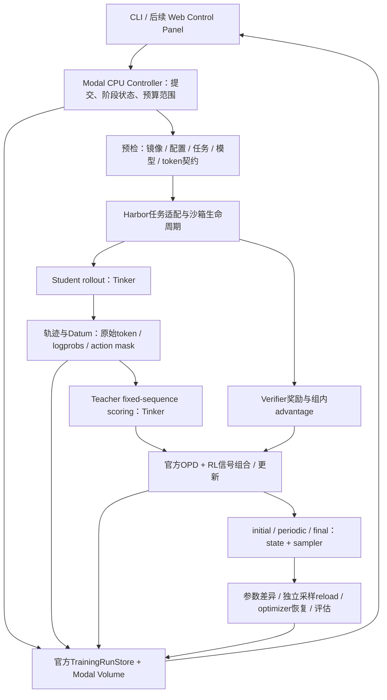

# Tinker 训练系统集成复核与验收方案

更新：2026-09-15。用户已明确继续。A–D本地集成286项相关测试通过；新核心模块覆盖率91%。下一关为最终Linux镜像与cloud audit，尚未提交新训练。下文保留原始问题与实施依据。

## 1. 结论与真实状态

采用一个 Modal CPU Controller、一份运行 Volume、Tinker Secret，以及官方 Cookbook 训练/记录/评估组件，构成完整实验系统。Web Control Panel 是这个系统的操作入口；当前 HTML 是方案说明，尚未连接运行服务。

不能把“官方存在某功能”当成“当前蒸馏入口已启用该功能”。也不能把“进程退出成功”当成“参数更新、独立恢复、能力提升都成功”。

已实测：
- 4 个原创任务共 8 次 nop/oracle：奖励分别为 0/1，沙箱均确认清理。
- 9B Student / 27B Teacher 在 2 个原创验证任务上均为 2/2；不是官方 Terminal-Bench 分数。
- Student 6 次真实交互：1,602 个动作 token 评分有效，4,482 个 prompt/环境位置的 advantage 为零；采样 reverse-KL 均值 0.16305654。
- Modal CPU App 已部署，云端 audit_p0 完成一项任务的 nop/oracle，证实容器内动态构建镜像、创建子沙箱、评分和清理可行。
- 首次 hybrid-p0-20260915-01 在日志初始化时失败：镜像缺 git，code_state() 抛 FileNotFoundError；未进入优化器更新。该入口此前仍执行过付费采样/评分预检，不能说整次尝试没有 Tinker 调用。
- 失败 status、config 和 trainer.log 已从 Volume 取回。远端运行代码 71176ee；本地 76d8ac4 补 git 和 code_state 构建检查，尚未重新部署验收。
- 仍无训练 checkpoint、非零参数变化或独立 reload 的真实证据。
- 最新整合回归：117 项通过。首次整合出现的测试时序假设问题已修复；这不替代云端训练验收。

## 2. 官方 skills 如何参与

| Skill | 本项目用途 | 当前安排 |
|---|---|---|
| research | 研究假设、数据、评估先行、官方训练代码、实验监控、checkpoint与复现 | 已读取并使用 |
| debug | 镜像/依赖、SDK生命周期、renderer、数值偏差、日志/性能定位 | 已读取并用于本次复核 |
| inkling | Thinking Machines Inkling 模型专用要求 | 当前 Qwen 主线不启用 |

Skills 是工作方法；Cookbook 是可复用实现；SDK 是服务接口。安装 skills 不会自动安装所有 Python extras 或开启所有记录功能。参考示例必须与已安装 SDK 的真实签名核对，尤其 async futures、checkpoint恢复方式和 tracing 默认值。

## 3. 目标架构



控制层负责运行与验收；Cookbook 负责训练、数据结构和记录；Tinker 负责模型计算；Modal Sandbox 负责命令执行。保留这些边界，不让页面直接持有服务密钥或拼接训练 shell 命令。

## 4. 集成矩阵：首训前不能遗漏的能力

| 能力 | 官方实现 / 当前实际接入 | 要补的验收 |
|---|---|---|
| 环境与bootstrap | 核心SDK已pin；wheel+镜像部署成功；完整日志初始化漏测 | 最终Linux镜像中导入训练模块、解析真实配置、调用ml_log.setup_logging并关闭；写读config/metrics/code.diff；记录git、Python、全量依赖与镜像ID |
| 配置与来源 | chz、ml_log、code_state；controller已有wheel/manifest hash | 记录最终解析配置、controller源码hash、完整任务树/verifier/seed hash、模型ID、renderer、tokenizer与版本、部署call ID。路径列表hash不能代替任务内容hash |
| 指标与实验存储 | JsonLogger / TrainingRunStore已由trainer接入 | 验证文件真实落盘、可增量读取；保留loss/优化器/奖励/KL/token/耗时。先用Volume挂载路径，当前trainer对Path(log_path)的处理不保证直接s3://兼容 |
| 完整训练轨迹 | rl/train.py有logtree scope、rollout summaries和HTML/JSON导出；当前distillation主循环未完整接入 | 在蒸馏入口复用官方能力，保留任务/轨迹关联、工具调用/返回、终止原因；P0记录全部两条训练轨迹。额外保存原始ID/logprob/mask契约，不只保存可读文本 |
| 原始调用 capture | 官方 CaptureExporter / JsonlFileSink / capture scope 可复用，当前未接入 | P0用JSONL sink，标记run/attempt/batch/group/trajectory/purpose；记录队列dropped与export_failures，正确drain/关闭。自动SDK instrumentation不含compute_logprobs，Teacher分数/targets/mask仍需显式审计文件 |
| 评估记录 | 官方RL evaluator支持导出；当前distillation直接调用evaluator(sampler)，不自动生成完整评估报告 | 为训练前/后和独立reload分别导出逐任务结果和轨迹；从同一产物读取对比，不另造一套指标含义 |
| tracing | Config有enable_trace、span_chart_every；当前CLI未透传，默认关闭 | 透传并验证timing_spans；开启Gantt时安装plotly并验证文件真的生成。Plotly当前是可选依赖，缺失会跳过图表 |
| Tinker session生命周期 | preflight和distillation主入口创建ServiceClient后缺统一close；logger仅成功尾部close | try/finally覆盖success/errored/interrupted，await close future，关闭失败留证据且不覆盖原始异常；不加模型请求超时/自动重试包装 |
| 沙箱生命周期 | rollout有finally cleanup；Harbor cleanup当前会吞清理异常并清空列表 | 保存本run的sandbox ID、资源参数和cleanup结果；失败不宣称全部回收。异常路径/取消后必须能查明资源状态 |
| checkpoint | 官方CheckpointManager已接入periodic/final双路径 | 保存同一个Student client的initial state+sampler；记录base/rank/renderer/optimizer/step/来源链；保存失败中止。不能训练后补一个“初始”模型 |
| 非零参数更新 | 尚无真实更新 | 用官方weights.download取initial/final adapter；safetensors key/shape/dtype/config一致，全finite，逐张量changed count/max diff/L2差非零。无需下载9B base，也不先做模型合并 |
| 更新与信号数值 | 批次token/target/mask/logprob防护已补；KL会进入已有reward advantage | 分开记录RL advantage、OPD项、混合项、尺度与相反符号比例；记录有限loss及优化器指标。同组奖励全相同时RL项为0，不能称为已经验证非零RL学习 |
| 运行状态与持久化 | run_id防覆盖、stdout tee、30秒commit、finally commit、返回checkpoint索引已有 | 分开记录job终态与验收结果；OOM/硬kill时以FunctionCall与持久文件核对。state写着running不证明进程存活；保存路径存在不证明reload成功 |
| 费用与并发 | 当前固定一批、group2、两validation；无美元硬上限 | 明确预检+训练前评估+rollout+Teacher评分+更新+checkpoint+后评估总范围；记录用量/估算，API账单延迟不可冒充余额；正式扩展前补评估并发和预算预留 |

W&B / Neptune / Trackio 是官方可选记录出口，不是恢复或正确性所必需的权威存储。首版优先保留官方JSON与轨迹报告；选用外部记录器时须显式安装对应extra、配置Secret、验证确实启用，不能接受“缺依赖已跳过”后仍显示同步成功。

## 5. Teacher、GKD与token验收的精确定义

当前算法：Student on-policy rollout；Teacher 对完全相同的 Student 原始 token 前缀评分；使用 sampled reverse-KL 信号，结合组内奖励 advantage，通过官方 importance_sampling loss 更新 LoRA。它不是全词表KL枚举，也不是直接采用ms-swift GKD trainer。

- 必须验证 Teacher 对 Student 实际token的条件logprob；top-k本身既不充分，也不是这条估计器的必需项。
- SDK0.29确有topk_prompt_logprobs和topk_sample_logprobs字段；Qwen3.8-27B的实际服务返回能力尚未单独验证，可列为扩展能力探针。不得把Python参数存在写成服务验收通过。
- 若未来采用top-k分布GKD，必须另定义候选token集合、截断尾部处理、Student对应分数及损失；不要直接把top-k改成当前KL的替代品。
- 不重新渲染Teacher上下文。记录Student实际输入ID、目标shift、所有特殊/思考/工具token，以及Teacher收到的ID摘要。
- Student生成的思考、文本、tool-call均属于动作；prompt、工具返回与环境内容mask=0。不能把tool-call一概mask掉。
- vocab/ID映射、特殊token、tokenizer规则和边界探针都要记录；已通过的短序列与六轮轨迹不等于所有模板、长上下文都已覆盖。
- sample/rescore差异需按相同精度/上下文/重复评分分析，保留当前0.09~0.21短探针最大偏差；不得以任意容差自动消除问题。
- loss有限只是最低门槛。OPD项与reward项相反可能是合理正则化，也可能抵消；尺度/符号记录是诊断，不等于完整梯度冲突证明。

## 6. Harbor与官方Terminal-Bench的兼容边界

当前接的是官方Cookbook中的Harbor格式任务与轻量bash harness，不等于完整Harbor CLI执行器或排行榜Agent。

真实缺口：task.toml被解析到HarborTask.config，但当前工厂未使用它配置CPU/内存/GPU/网络/挂载或任务级超时；主要执行参数来自CLI全局值。当前bash命令从 / 运行，不能假定继承任意镜像WORKDIR。原创任务通过不证明任意官方任务可运行。

官方单任务验收步骤：
1. 锁定Terminal-Bench数据集版本/来源commit、任务ID、完整任务树、镜像digest、harness版本。
2. 审查该任务依赖、网络、资源、超时、workdir、文件上传/下载和verifier约定；支持的字段落实配置，不支持的需求在启动前拒绝。
3. 同一任务用独立新沙箱至少运行两次；记录逐次grader结果、退出码、调用/token/时间预算与cleanup。环境/oracle可重复不代表随机Student输出逐字相同。
4. 模型侧用固定模型/checkpoint、renderer和采样设置，记录服务支持的seed及限制；重复运行报告保留成功和失败。
5. 将该任务标记为兼容性开发任务，不再作为未触碰的最终盲测证据。正式比较Opus时必须同harness、工具、预算与重试设置。

## 7. checkpoint三种验收不能混用

| 验收 | 证据 |
|---|---|
| 参数真的更新 | 同一训练链initial/final adapter逐张量差异；非零gradient norm不能单独替代参数比较 |
| 模型可独立推理 | 新进程、新ServiceClient，从sampler_path加载，核对base/renderer并跑真实任务 |
| 训练可断点续训 | 从state_path恢复optimizer与步数，再验证后续步骤；只加载权重并重建optimizer不是resume |

当前官方trainer在同log_path有checkpoint索引时可恢复状态和optimizer；显式load_checkpoint_path分支加载权重并新建optimizer。当前controller拒绝已有目录，尚无resume入口。

周期checkpoint默认TTL为7天；final使用不设过期的保存方式。记录实际TTL并验证checkpoint仍可访问。Volume内留有URI不代表远端权重永久存在。

## 8. 统一产物与控制台契约（目标，尚未全部实现）

每个run以官方TrainingRunStore产物为核心，不复制第二套训练数据格式：

```text
runs/<run_id>/
  status.json                  # job状态，不包办各阶段验收
  provenance.json              # code/image/tasks/tokenizer/SDK、调用范围、来源链
  resources.jsonl              # 本run沙箱创建与清理记录
  events.jsonl                 # 阶段变迁和错误分类
  trainer.log                  # 运行日志，密钥不入文件
  checks/                      # 环境、token、参数变化、reload、TB重复运行报告
  training/
    config.json / code.diff / metrics.jsonl / checkpoints.jsonl
    timing_spans.jsonl / trace_events.jsonl
    iteration_000000/          # 官方train/eval HTML、logtree、rollout summaries
  evaluation/                  # 独立checkpoint与baseline的逐任务结果
```

官方RunRegistry与TrainingRunStore可用于训练运行发现和读取；EvalStore可用于跨checkpoint评估组织。优先核对并复用这些接口。capture/store提供SQLite/查询/SSE能力，可作为后续实时轨迹视图候选，但P0不必启动额外daemon；capture/proxy可作为外部Agent harness桥接候选，接入前须核查原始token与任务口径。

Control Panel第一版四个入口：实验列表与状态；配置/证据预检与有界提交；指标/轨迹/错误查看；checkpoint与评估对比。

后端契约：提交只接受校验后的配置和幂等run_id，返回function_call_id；读取返回job状态与各验收状态；取消返回取消请求状态及仍在回收的资源，不能立即声称Tinker请求/所有sandbox都停止。credentials仅服务端Secret持有。

单App+Volume足以验证顺序P0，不必立即引入Redis/Kubernetes/多微服务。扩大并发时再引入真正的实验锁、状态协调和预算预留；Volume目录创建不应宣称为跨Function分布式锁。

## 9. 实施顺序与重新提交训练的门槛

- [ ] A：Linux bootstrap、完整来源记录、session/logger关闭、sandbox清理记录，全部无更新验证。
- [ ] B：接入官方轨迹/评估导出、capture及显式Teacher审计；保留基础timing，完整tracing按需开启；产生可读与机器可读产物并由store读回。
- [ ] C：同client initial checkpoint、参数差异比较器、独立reload流程；先用本地合成权重测试拒绝条件。
- [ ] D：原始ID/工具mask契约与OPD/RL分项指标；明确非零RL信号门槛。
- [ ] E：通过A-D后重新运行一次有界训练，下载真实initial/final，完成参数与独立推理验收。
- [ ] F：官方Terminal-Bench单任务兼容与重复运行；state+optimizer恢复；扩展有区分度的开发任务。
- [ ] G：接入最小Control Panel；再做baseline/OPD/RL/hybrid消融和最终同口径评测。

当前操作状态：用户已批准继续，A–D本地集成与286项回归通过（新核心模块覆盖率91%），源码b06728a；最终Linux镜像正在构建验收，尚未提交新训练。下一步严格按云端bootstrap、同资源cloud audit、单批更新、参数比较、独立reload顺序推进。

## 10. 源码与官方依据

实际检查的Cookbook：上游基线485726f，当前实现分支feat-harbor-opd-rl；关键文件：
- tinker_cookbook/utils/ml_log.py、code_state.py、logtree.py、trace.py
- tinker_cookbook/stores/training_store.py、eval_store.py、registry.py
- tinker_cookbook/capture/README.md、instrument.py、exporter.py
- tinker_cookbook/rl/train.py、metric_util.py、rollouts.py
- tinker_cookbook/distillation/train_on_policy.py
- tinker_cookbook/checkpoint_utils.py、weights/_download.py
- tinker_cookbook/recipes/distillation/harbor_opd_rl.py、harbor_opd_preflight.py
- tinker_cookbook/recipes/harbor_rl/harbor_env.py、harbor_tools.py
- examples/harbor-opd-smoke/modal_controller.py

官方说明：[research](https://github.com/thinking-machines-lab/tinker-cookbook/blob/main/skills/research/SKILL.md)、[debug](https://github.com/thinking-machines-lab/tinker-cookbook/blob/main/skills/debug/SKILL.md)、[实验运行参考](https://github.com/thinking-machines-lab/tinker-cookbook/blob/main/skills/research/references/ops.md)、[Modal Volume持久化](https://modal.com/docs/guide/volumes)、[Modal后台调用](https://modal.com/docs/guide/trigger-deployed-functions)。在线文档通过Context7核对，运行行为以本地实际版本源码与实测为准。
