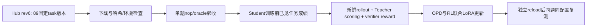

# Terminal-Bench 2.1 已见任务训练

用户于2026-09-15明确授权：全部89题用于训练，目标是提高这批固定任务的通过率。替代此前“TaskTrove主训练、TB2.1独立测试”的决定。TaskTrove保留作补充。

## 接入与流程

- 模型仍为Tinker Qwen3.5-9B Student和Qwen3.8-27B Teacher。
- manifest分开记录train与seen_eval；允许按明确seen-task协议复测同题，不伪造独立validation，不破坏旧manifest默认防重叠。
- 先固定89个task_version_id及各自revision，数据集rev6不等于每道task都rev6。旧registry的2.0不能替代本数据。
- 下载/格式/环境/已采样/已更新按题登记；不支持的镜像、GPU、compose、资源和超时单列，不静默丢弃。
- 首次更新只用已验收的小批，group_size=4、一个batch起步；模型请求量、sandbox资源和是否存在非零RL单独记录，不承诺10美元覆盖全部89题。
- 模块：数据清单与导入、显式seen-eval split配置、controller运行配置；复用现有Harbor环境与Tinker蒸馏trainer。
- 验证：固定来源89唯一ID、文件hash、原始测试nop/oracle、Teacher token/mask、reward与故障区分、真实参数更新、reload、同预算复测。
- 参考解只用于环境验收，不给Student初始环境。结果标记已见任务训练成绩，不称独立Terminal-Bench泛化成绩。

## 下载接口核验

本机原Harbor0.1.45默认registry仅提供terminal-bench@2.0，不能用@2.1下载用户指定Hub数据。用户已授权通过uv升级CLI，升级后将以实际Hub下载接口再次验证。Hub rev6 API返回89个唯一task_version_id及各题revision，已保存清单；目前不能把清单保存声称完整题目下载。

CLI已通过uv tool upgrade harbor升级0.1.45 → 0.23.0；harbor --version实测确认。Tinker训练venv仍为tinker0.29.0/modal1.5.5。下载命令：`harbor datasets download terminal-bench/terminal-bench-2-1@6 --output-dir outputs/datasets/terminal-bench-2.1-rev6`。此操作仅下载任务，不分配模型训练资源。

2026-09-15更新：Harbor CLI已由uv升级0.1.45→0.23.0；固定Hub rev6全部89题下载成功，名称集合精确一致；逐文件SHA已记录。89题核心文件齐全，声明gpus均0，最大4CPU/8192MiB。尚未针对这89题启动训练。下一步以派生runtime配置兼容新版task.toml，再做单题环境验收和小批OPD+RL。
