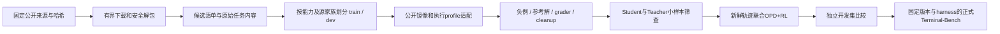

# 以 Terminal-Bench 能力提升为目标的公开任务接入

2026-09-15。目标仍是 Tinker Qwen3.5-9B / Qwen3.8-27B Teacher，Harbor + Modal 执行，OPD + reward RL 联合更新。本文是当前候选策略与有界接入设计；下载/静态通过/云运行/能力提升分别记录。

## 选择结论

优先审查 **open-thoughts/TaskTrove 的确定性终端/代码任务子集**；NVIDIA Nemotron-Terminal-Synthetic-Tasks 用于后续扩展数据处理、调试、系统操作等技能。原 OpenThoughts-Agent-v1-RL 的728道NL2Bash任务保留作Shell基础候选，不能担任唯一训练分布。

这是依据领域覆盖和接入成本给出的工程选择，尚无本项目的训练效果对照，不称为已证明最优数据集。

| 候选 | 用途 | 已知边界 |
|---|---|---|
| TaskTrove active 确定性子集 | CLI、pytest、多文件、Git等主要候选 | 来源混杂，须逐来源检查；不导入deprecated，不将模型judge当作真实终端成功 |
| Nemotron-Terminal-Synthetic-Tasks | 多领域终端合成任务扩展 | 抽查包缺oracle、task.toml有内部镜像引用；须基于公开Dockerfile验证环境与可信参考解 |
| SWE-bench/SWE-smith-py | 仓库修复专项补充 | 有官方Harbor adapter，但环境较重、部分oracle可能失败；不等于整体TB能力 |
| OpenThoughts-Agent-v1-RL | 轻量Shell基础 | 固定版本728题仅616源问题家族，任务域窄 |
| Nemotron-Terminal-Corpus / Pivot-v1 | 可选离线示范或后续单步研究 | 前者为SFT轨迹，后者为参考动作judge样本；不能直接替代在线可执行任务环境 |

用户已确认：公开Harbor任务用于训练，Terminal-Bench 2.1用于独立评测。官方Hub目前显示89题、rev.6；2.1修订了2.0中的26题，不能直接比较不同版本榜单分数。正式运行仍需锁定数据/任务revision、harness和预算。[用户指定官方页](https://hub.harborframework.com/datasets/terminal-bench/terminal-bench-2-1?tab=tasks)。

## 固定来源

TaskTrove revision：`96567362fa3c41208e0954317c53767023b420eb`。官方v5.1报告78个active来源、1,604,128任务；这是上游统计，未在本机下载全量独立重算。数据卡标记Apache-2.0，实际使用仍保留各上游代码/镜像来源。

候选source：
- `DCAgent__exp_rpt_curriculum-medium-v2`：官方过滤审计489题。
- `DCAgent__exp_rpt_stack-pytest-v2`：499题。
- `DCAgent__exp_rpt_multifile-v3`：4,842题。
- `DCAgent__exp_rpt_e2egit-v2`：487题，后续扩展候选。

计数来自固定版本过滤/淘汰审计，不替代我们的环境验收。先限量下载前三个来源，单次总下载上限30MB；如超限只报大小，不自动扩大。归档脚本先静态阅读，不直接执行上游默认覆盖式解包命令。

NVIDIA revision：`7e53648e183cee7bcb0aed623cc91a121d37fa38`，CC-BY-4.0。已静态检查 `skill_based/mixed/data_processing.tar.gz`：
- 3,426,312 bytes，SHA256 `c063d69b65b39f7c26667d65c18e2c553291d1755514936eaca8c8bc48c7da0a`。
- 1,000题均有instruction、task.toml、Dockerfile、test.sh、test_outputs.py；0题有solution/solve.sh。
- 1,000份task.toml都引用内部GitLab镜像；Dockerfile均基于公开标识 `ghcr.io/laude-institute/t-bench/ubuntu-24-04:latest`。公开标识不代表已成功拉取；未构建或执行。
- 抽查WORKDIR=/app、verifier运行时安装pytest等依赖。当前P0资源检查还不接受其全部environment字段，不能直接宣称兼容。
- 官方论文的训练结果来自SFT，不是本项目9B/27B OPD+RL的效果证明；论文对SFT做过14-gram去污染，也不能据此保证全部原始任务与最终TB无重叠。

## 阶段与架构

首批先建立6个跨来源候选目录做接入验收，再逐步扩至24–32个候选，**候选不自动成为训练集**。来源名称不能代替逐题能力标注；至少区分命令与文件操作、代码定位/修复、多文件工作、数据处理及配置排错。不是所有训练题都必须很难。

原始归档保持不变；按源问题/仓库/模板家族去重和分组，避免变体跨train/dev。明确检查目标评测重叠。若用正式TB题做harness排错，记录其开发暴露状态；自定义排除后的子集分数不得冒称官方完整TB分数。

## 文件与接口设计

| 文件/位置（实现worktree） | 职责 |
|---|---|
| `outputs/datasets/tasktrove/<revision>/` | ignored原始parquet、source SHA256、静态审计及有界候选任务目录 |
| `docs/<worktree>/public-dataset-status.json` | 可提交的候选数量、来源、哈希、格式/资源检查状态；不含答案和凭据 |
| `tinker_cookbook/recipes/distillation/harbor_dataset_import.py`（后续实现） | 可复用导入器：禁止路径穿越/链接/覆盖、有大小上限，输出任务文件哈希与来源家族；不执行脚本 |
| `harbor_resources.py` / `harbor_env.py` / `harbor_tools.py`（后续实现） | 显式工作目录、环境初始化、资源/网络及额外文件契约；保留旧四题默认行为 |
| `harbor_smoke.py` / controller（后续实现） | 接受经过审计的新manifest及运行profile，避免继续固定csv-first和旧预算 |

候选登记字段：dataset_id、revision、source_id、source_sha256、archive_sha256、original_task_path、local_task_path、file_hashes、source_family_id（未知写null）、scope=candidate、runtime_status、exclusion_reason。

导入仅接受常规文件/目录，独占新输出；单任务展开上限80MiB、单文件24MiB、成员上限4096，整个候选集展开上限256MiB。异常必须明确失败或排除；不能少导入后仍报告全数成功。

答案/测试可见性：只有environment及任务契约明确声明的agent可见文件进入Student初始环境。此次curriculum和multifile指令明确允许读取/setup_files公开测试，必须原样提供；这些测试与verifier相同，不能称为隐藏测试。其余隐藏tests、solution、含答案metadata留在controller，不把完整task根目录复制到sandbox。

## 验证与停止条件

1. 固定源码/数据SHA；用既有loader检查任务文件，但资源契约须另验，loader通过不等于云兼容。
2. 对每来源至少一个候选验证镜像、工作目录/seed、nop=0、可信参考解=1和错误解=0；没有参考解的任务先补审查，不能盲目将Teacher回答当oracle。
3. verifier基础设施错误独立记录；不能当0分训练，也不能修改测试来让参考解通过。
4. 小批Student/Teacher筛查使用预定次数/预算；中等成功率只作学习空间线索，不无限采样直到凑混合奖励。
5. 联合更新须从真实reward重算非零RL与OPD，检查实际update/reload；独立开发集成绩提升才是继续扩大训练的依据。
6. 验证记录不覆盖历史P0；原始公开数据引入不意味着已经部署或开始付费模型训练。

## 官方参考

- [TaskTrove固定数据卡](https://huggingface.co/datasets/open-thoughts/TaskTrove/blob/96567362fa3c41208e0954317c53767023b420eb/README.md)
- [TaskTrove过滤审计](https://huggingface.co/datasets/open-thoughts/TaskTrove/blob/96567362fa3c41208e0954317c53767023b420eb/v5.0-filtration-audit.json)
- [TaskTrove来源淘汰审计](https://huggingface.co/datasets/open-thoughts/TaskTrove/blob/96567362fa3c41208e0954317c53767023b420eb/v5.1-source-retirement-audit.json)
- [NVIDIA可执行任务](https://huggingface.co/datasets/nvidia/Nemotron-Terminal-Synthetic-Tasks) / [原论文](https://arxiv.org/html/2602.21193v1)
- [SWE-smith Python](https://huggingface.co/datasets/SWE-bench/SWE-smith-py) / [官方Harbor adapter](https://github.com/harbor-framework/harbor/tree/main/adapters/swesmith)
- [Nemotron静态SFT轨迹](https://huggingface.co/datasets/nvidia/Nemotron-Terminal-Corpus) / [Pivot动作评分数据](https://huggingface.co/datasets/nvidia/Nemotron-RL-Agentic-Terminal-Pivot-v1)

## 当前下载进展
前三源已下载，Parquet实际行数489/499/4,842，合计5,830题；下载总量28,671,002字节，已与官方LFS SHA核对。这不是5,830个已验收环境。首批6候选的实际落盘和兼容状态见public-dataset-status.json。

首批6题已原样有界解包，展开合计71,381字节；逐文件哈希与独立静态审查一致，bash -n、Python AST、既有load_manifest和资源字段检查通过。candidate-manifest暂列3 train/3 validation用于格式检查，**不是训练准入**，尚未云运行。

运行缺口已具体化：工具默认/而任务要求/app；curriculum与multifile需要挂载明确公开的/setup_files；六题均无现成oracle，需补可信参考解；stack-pytest运行时安装依赖失败会落成reward0，需区分依赖故障与模型失败。三源完整5,830归档静态检查均有核心文件，但都没有solution目录。

初选排除了stack-pytest-0007和multifile-0001的题意/测试冲突。6候选无已知metadata家族交叉，不代表完成跨全集语义去重。公开测试训练可用，但不能以通过已见测试替代独立能力评估。
