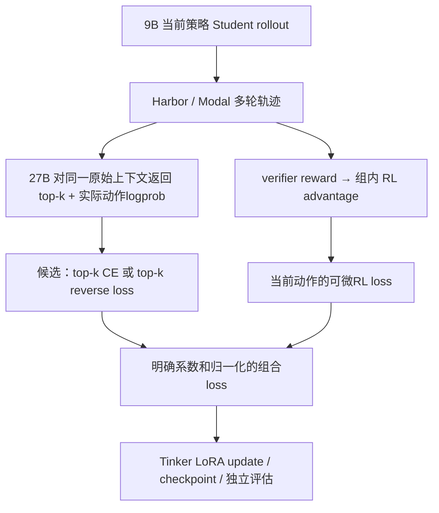

# Harbor OPD 与 top-k 蒸馏：选型复核

2026-09-15。用户追问“为何不是最好的OPD”“top-k logprobs + scores”后补查。本文只记录官方源码/文档审查与修订设计；本轮没有新模型调用、训练、部署或评估代码修改。

## 当前实际跑的是什么

与官方 `on_policy_distillation_harbor_multi_turn` 同一条 Harbor 多轮 OPD 路线，共用 `distillation/train_on_policy.py`。项目入口 `harbor_opd_rl.py` 增加独立任务清单、opd/rl/hybrid模式、严格grader、资源/记录/验收。

| 参数/行为 | 用户贴的官方示例 | 已完成P0 |
|---|---|---|
| Student / Teacher | Kimi-K2.6 / Kimi-K2.6 | Qwen3.5-9B / Qwen3.8-27B |
| 任务 | Terminal-Bench Harbor任务入口 | 4个原创工程任务；实际训练其中1题 |
| Teacher评分 | Student实际token的logprob | 相同方式，1179动作位置已验证 |
| 损失 | sampled reverse-KL → importance_sampling | 相同主路径，mode=hybrid另保留真实任务奖励 |
| 任务奖励 | zero_reward，任务正确性主奖励为0 | verifier真实打分；本批[1,1]导致RL advantage为0 |
| group_size / groups_per_batch | 4 / 8 | 2 / 1 |
| max_turns / max_tokens | 10 / 2048 | 3 / 4096 |
| LoRA rank / learning_rate | 8 / 1e-4 | 32 / 1e-4 |
| top-k蒸馏 | 未使用 | 未使用 |

此前选择P0实现是复用明确的Harbor训练入口、验证工程链路；不是已经比较后选出的最佳训练算法。漏查官方SDFT的top-k路线，使之前的算法比较不完整，现予纠正。

## 官方实际支持的另一条路线

[Tinker cross-entropy文档](https://tinker-docs.thinkingmachines.ai/tinker/losses/cross-entropy)明确支持每位置多个targets：`target_tokens`与`weights`形状为[N,K]。Teacher的`topk_prompt_logprobs`可提供固定序列上逐位置的候选token ID与logprob；Student端对这些targets训练。

[官方sdft.py](https://github.com/thinking-machines-lab/tinker-cookbook/blob/main/tinker_cookbook/distillation/sdft.py)已有：
- `build_topk_distillation_datums`：top-k Teacher软目标，cross_entropy训练。
- `build_reverse_kl_datums`与`reverse_kl_custom_loss`：候选集合上的reverse KL、自定义梯度训练。
- 默认K=20。在SDFT这个配方内，topk=0的IS路径注释为deprecated，建议新SDFT工作使用top-k。官方Harbor多轮OPD仍使用sampled reverse-KL，不能将此局部注释扩大成所有OPD被弃用。

本机SDK0.29.0的`forward_backward_custom`确实支持[N,K]训练logprobs：forward返回按shape恢复为可微tensor，本地求导，再以`weights=-dL/dlogp`请求服务端CE反向传播。custom loss输入keys限定target_tokens/weights；RL reward、old logprobs、额外mask应经闭包或旁路数据提供，不能任意塞进loss_fn_inputs。[官方custom loss说明](https://tinker-docs.thinkingmachines.ai/tinker/losses/custom)。

`topk_prompt_logprobs=20`是返回候选分布；`SamplingParams.top_k=20`是采样过滤，不能混为同一个开关。官方文档的top-k示例从Teacher生成completion；要满足本项目on-policy要求，必须改用Student rollout的原始序列。

## 为什么不能直接说top-k就是“最优严格reverse KL”

令p为Student分布，q为Teacher分布，S为Teacher top-k集合：

| 方法 | 实际目标/信息 | 需要注意 |
|---|---|---|
| 当前sampled reverse KL | Student实际采样a上的log p(a)-log q(a) | 每位置只观测一个动作，估计方差；有限批不等于全词表精确求和 |
| top-k软目标CE | Teacher在S内归一化q，再对Student原始log p做加权CE | 增加候选监督；截断Teacher尾部，目标相当于截断分布的forward KL加常数 |
| 官方top-k reverse | Student和Teacher都在S内重新归一化，KL(p(.∣S)∥q(.∣S)) | 不直接惩罚S外Student概率质量；不是原始全词表reverse KL |

最后一项的集合外问题来自源码中的Student log_softmax，是数学上的性质：K=1时两边条件分布都是1，此reverse项恒为0。记录Teacher和Student落在S内的原始概率质量，才能评估截断有多严重。不能直接给Teacher top-k之外的token概率填0，再称为严格全词表reverse KL。

[官方SDFT README](https://github.com/thinking-machines-lab/tinker-cookbook/tree/main/tinker_cookbook/recipes/sdft)有Qwen2.5-7B工具使用及Qwen3.5-35B-A3B持续学习的top-k实验支持；没有27B→9B、Harbor任务奖励、Terminal-Bench的同条件最优证据。README也提醒旧Qwen2.5 demonstrations可能不适合Qwen3.5/3.6长思考模型。

SDFT原配方通常给同模型Teacher额外golden demonstration；本项目是更强27B Teacher对9B的相同原始上下文评分。应复用top-k API和损失数学，不能整体照搬Teacher prompt重写或默认跳过前三个token的规则。SDFT连续completion提取/索引映射也不能直接套在含工具观察mask空洞的合并多轮Datum上。

## 修订后的优先候选

若scores指Harbor verifier任务分数，候选组合为：

这是待实验的建议，不是已验证最优结果。优先将官方top-k CE+RL加入比较，并保留当前sampled reverse-KL作为baseline；top-k reverse+RL单独列候选，明示其条件分布目标。OPD是Student产生轨迹的方式，不限定只能用reverse KL。

组合实现可请求Teacher top-k与Student实际动作的并集，以便同一个custom loss获得所需Student训练logprobs。实际动作不在Teacher top-k也必须有自己的RL target；蒸馏集合mask和RL动作mask分开，防止重复计数或错位。组合系数、loss按token/trajectory的归一化、梯度尺度必须显式测试。

## 分阶段验证，不跳过基础设施

- [ ] T0：27B对一个已有Student真实序列返回K=20；核对每个动作位置、token ID、finite、候选唯一性、Teacher累计质量及缺失字段拒绝。当前尚未实测top-k，旧actual-token通过不替代它。
- [ ] T1：9B训练端[N,K] forward/custom loss形状与可微性；小合成词表对照解析梯度，验证mask、重复target、实际动作在K外、K=1与尾部处理。
- [ ] T2：沿用Harbor原始上下文、多轮mask和shift，Teacher/Student同一prefix；不加入golden answer或重排工具消息。保留raw top-k、采样参数、scores、loss各分项。
- [ ] T3：有界一次真实top-k更新、同源initial/final差异、独立reload；分别验收task score和工程状态。没有真实reward差异不能称非零RL通过。
- [ ] T4：同起点、开发集、harness和预算对照sampled OPD、top-k CE、top-k reverse及各自+RL；先检验Student自身收益，最终再做未触碰Terminal-Bench与Opus对照。

已完成P0仍是有效工程baseline；不为新算法选择丢弃其checkpoint和失败轨迹。评估证据补齐仍必要，但现在将top-k能力探针和选型复核加入下一阶段，不再将sampled baseline当作已选定的最终最优方案。

## 来源与审查范围

2026-09-15通过Context7 library解析及两次docs查询、gstack browse访问官方losses/cross-entropy和线上sdft.py（HTTP200），并核对本地SDK实际实现。官方sdft.py在本地历史归属于493063d发布提交，非本项目新增。独立代码审查确认多目标custom loss、截断边界和Harbor映射风险。本轮仅源码/文档审查；没有调用Qwen模型或验证27B实际top-k响应。
