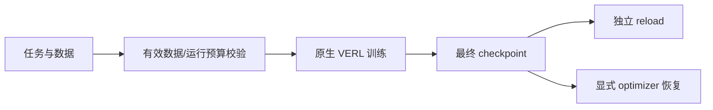

# 原生训练闭环独立验收

2026-09-15。来源：verl-uni-agent-harbor-opd-rl / 3eebf20，配对 VERL a9f2985。

## 结果

- Teacher 评分、轨迹和原生 loss：51 passed。
- recipe、旧 M2 入口和训练监督器：92 passed。
- 来源工作区的 Modal 文件正在被另一会话持续修改；本分支只做独立验证。
- native loss 测试尚未提交，因此 143 项结果不能全部归属已提交 HEAD。

命令前缀：`PYTHONPATH=.:verl PYTHONDONTWRITEBYTECODE=1 /private/tmp/uni-agent-opd-upgrade-cpu/bin/python -m pytest -q -p no:cacheprovider`。
第一组：tests/uni_agent/framework 下 test_teacher_scoring_on_cpu.py、test_teacher_rollout_on_cpu.py、test_teacher_loss_on_cpu.py。
第二组：tests/uni_agent/examples 下 test_harbor_opd_rl_recipe.py、test_harbor_m2_training_entry.py，以及 tests/uni_agent/deployment/test_harbor_training_supervisor.py。
首次未设置 PYTHONPATH 出现 3 项 collection error，使用仓库既有路径配置后通过；无产品修改。

## 确定性阻断

准备器 examples/harbor/prepare_m2_training.py 默认2行、允许1—16行。base.yaml 配置 batch=2、epochs=1、steps=10、save_freq=5。配对 VERL 的 trainer/ppo/v1/trainer_base.py 在 epoch 耗尽时没有最终保存。

| 训练行数 | 外层步数 | 保存步 |
| ---: | ---: | --- |
| 1 | ZeroDivisionError | 无 |
| 2 | 1 | 无 |
| 8 | 4 | 无 |
| 10 | 5 | 5 |
| 16 | 8 | 5，最后3步未保存 |
| 20 | 10 | 5、10 |

复现脚本 `/private/tmp/uni-agent-native-recipe-readonly-audit.py` 使用真实 Hydra 配置和从原生 PPOTrainer.fit 提取的 AST；GPU、rollout、日志以 stub 替代。它证明真实循环和保存分支，不证明 optimizer/GPU 更新。主代理已独立复跑并得到上表。separate_async 的外层步与 optimizer 子步不混计。

## 恢复入口缺口

原生 VERL 支持恢复，但当前 launcher 只有 mode/launch/print-config，recipe 固定 resume_mode=disable。设置 RESUME_MODE、RESUME_FROM_PATH、TOTAL_TRAINING_STEPS、SAVE_FREQ 环境变量不影响配置。这些变量尚未声明为支持的 API，属于功能缺口，不是已有 API 回归。

## 修复设计

目标：小数据实验也必须留下可 reload 的最终 checkpoint；有效数据不足应在模型资源分配前拒绝。

- 文件范围：launch.py、base.yaml、对应 recipe 测试与文档；优先本地入口合同，不盲改配对 VERL。
- 明确请求步数与 epoch 上限的关系，保证最终保存。只改 save_freq=1 不证明达到目标步数。
- 校验过滤后的有效行数；只看 parquet 原始行数不足以排除零 batch。
- 提供显式步数、恢复参数，复用原生 model/optimizer/extra/TQ 恢复。
- 测试：1/2/8/16行、总步数上限、过滤后不足batch、恢复继续、print-config无副作用。
- GPU 验收仍需真实非零信号、参数变化、采样同步、checkpoint、独立reload和optimizer恢复。

## 远端快照

10:39:53 UTC：单张 RTX PRO 6000，97887 MiB，使用3 MiB/利用率0%；独立环境依赖安装日志持续增长。严格使用既有主机密钥校验。未启动模型或训练、未增资源、未停止进程。此时间快照不代表后续实时状态。

## Review

配置测试通过不足以保证训练产物可交付。先由唯一实施会话收敛数据—预算—最终保存合同，再投入GPU。
