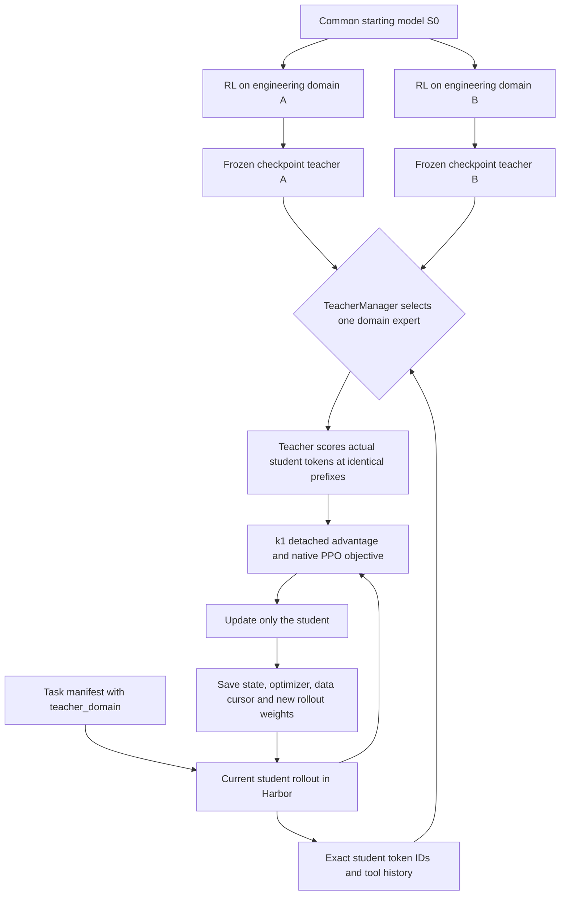

# Harbor MOPD on VERL: implementation and acceptance design

Date: 2026-09-22. User selected VERL for easier algorithm debugging and modification.
Outer base: 7897cad825019a284fe98a881d415d7b9a36d4a2. VERL: a9f2985159536a607211dcac730d3f5d55028950.

## Goal and boundary
Run a real, isolated Harbor multi-teacher distillation update, save, reload and optimizer resume. Reuse native TeacherManager and actor loss; do not introduce another trainer. Separately validate whether qualified RL experts transfer useful capability. A successful engineering smoke is not a capability result.

MOPD is a training method, not a new model architecture. It does not merge weight matrices or require deploying multiple teachers with the resulting student. The deployed output remains a single 9B or 27B model.

## Architecture


Run parallel conceptual lines S0_9→RL experts_9→student_9 and S0_27→RL experts_27→student_27. Cross-scale expert_27→student_9 is an additional experiment, not a replacement for delivering 27B.

## Data and identity contracts
Preserve existing `data_source`: production Harbor data currently uses tasks-train/tasks-validation, with Harbor dispatch under `extra_info.tools_kwargs.task.name`. Add a top-level `teacher_domain`; configure `distillation.teacher_key=teacher_domain`. The existing dataset/collate/framework already carries arbitrary fields to teacher scoring.

Each task binds: task_id, original source, repository/family, revision, split, fingerprint, teacher_domain and ordered index. Domain labels are explicit from the approved task manifest, not guessed from path substrings. Preserve original task/reward configuration. Unknown or missing teacher domains fail before allocating training services.

Each teacher binds: named registry key, exact model/checkpoint revision or digest, tokenizer/renderer contract, declared domain, qualification evidence and inference configuration. A checkpoint existing on disk is not proof it is a complementary expert. Record actual scoring identity along with domain and prefix hash.

Student trajectories contain actual generated reasoning/actions and environment observations. Only assistant response tokens receive the distillation loss; tool outputs and prompts are masked. Keep exact token IDs and next-token alignment; do not decode/re-tokenize or re-render the sequence during scoring.

## Native algorithm to retain
Choose one domain teacher q_d for a task. Let p_theta be the current actor probability, p_old the old-policy anchor and m the assistant mask.

For native sampled-token `k1`:

```
d_t = log p_theta(y_t | h_t) - log q_d(y_t | h_t)
A_t = -stop_gradient(clip(d_t, -c, c))
r_t = exp(clamp(log p_theta - log p_old, -20, 20))
u_t = max(-r_t A_t, -clip(r_t, 1-epsilon_low, 1+epsilon_high) A_t)
ell_t = min(-dual_clip * A_t, u_t) if A_t < 0 else u_t
L = sum(m_t * ell_t) / sum(m_t)
```

Current native `vanilla` policy loss includes PPO ratio clipping and default dual clip 3. This is not the simple IS objective used in the Tinker candidate. Native k1 uses current actor logprobs to form a detached advantage; it does not freeze the rollout logprob difference across repeated actor updates. The old-policy anchor is normally recomputed; rollout correction/bypass settings must be explicit.

First engineering recipe: `loss_mode=k1`, `use_policy_gradient=true`, `use_task_rewards=false`, `policy_loss_mode=vanilla`, explicit `loss_max_clamp=5`, explicit PPO/dual-clip settings, `loss_agg_mode=token-mean`, `ppo_epochs=1`, one optimizer minibatch spanning the rollout batch. Temperature 1, no top-p/top-k truncation. N=1 is a candidate for pure OPD engineering smoke; it is valid without a group-relative task reward. Fix the final N and batching contract before a real run.

`use_task_rewards=false` removes task-reward PPO from the final gradient; keep verifier results as diagnostics. In this native pure-OPD mode, `distillation_loss_coef` is effectively 1; it is not a usable strength knob. Real gradient tests must verify that task-reward changes do not change pure OPD gradients.

The token denominator is global across the current optimizer minibatch and data parallel ranks, not automatically across an entire multi-update rollout batch. Do not independently average each domain or microbatch. Report both task proportions and effective-token proportions.

`forward_kl_topk` is a separate teacher-weighted objective, available natively. It must not be labeled as full-vocabulary reverse KL or the MOPD paper's corrected top-k reverse objective. Add it only as a separately named experiment after the PG path is accepted.

## Files and APIs
- NEW `examples/harbor_mopd/prepare.py`: authoritative domain join; validate task identities and train/eval separation; preserve Harbor fields.
- NEW `examples/harbor_mopd/mopd.yaml`: native multi-teacher recipe; explicit algorithm and resource settings.
- NEW `examples/harbor_mopd/launch.py`: validated teacher registry, immutable run contract, unique output directory, resume checks and bounded invocation of existing training entry.
- `uni_agent/framework/framework.py`: narrow change to carry teacher_domain and verified teacher identity into persisted trajectory evidence; preserve existing routing/scoring calls.
- NEW matching tests, with extensions to existing `tests/uni_agent/framework/test_teacher_loss_on_cpu.py` where appropriate.
- Avoid changes to the VERL loss or distributed engine unless a verified defect requires them.

Teacher registry schema will contain version, domain→teacher identity mapping, model paths and inference topology. An acceptance manifest will bind registry/data/source/config hashes, exact loss parameters, initial weights, update count, limits, owner, GPU IDs, budget and resource schedule. Resume rejects semantic changes and uncertain update replay.

Native config requires retaining its default `teacher_model` placeholder and adding two separately named entries, e.g. teacher_swe and teacher_terminal. The default placeholder is removed when multiple teachers are present; it must not be counted as one actual expert. Total teacher GPU pool size must equal the configured replicas' TP×DP×PP sum.

## Tests and acceptance
1. CPU: missing/unknown domain, preserved data_source/Harbor dispatch, two-domain route sentinel, exact teacher identity and no silent fallback.
2. CPU: exact k1 sign/current-prob semantics/detach, advantage clamp, PPO and dual-clip boundaries; changed task rewards leave pure OPD gradients unchanged; prompt/tool gradients zero.
3. CPU: global token mean is invariant to microbatch partition; variable-length domains and tail coverage; complete registry/state/dataset contract on resume.
4. Integration: student rollout→both real teachers→one actual update→new rollout weights→save→optimizer restore→second update without task replay.
5. Verify actual teacher responses, sampled/old/current probability meanings, loss/gradient receipts, finite results, model/checkpoint identity and cleanup. Confirm genuine tool interactions; do not require a short smoke to prove task success or capability gain.
6. Capability phase: independently qualified domain experts and held-out paired comparisons against the common initial model and continued RL; per-domain success, forgetting, length, errors and cost.

## Resources and current evidence
At 2026-09-22 11:05–11:07 Singapore time, the existing pod had two RTX PRO 6000 Blackwell Server Edition GPUs (~96 GB each); GPU0 was occupied, GPU1 was empty at that instant. Existing evaluation scheduling remains authoritative. Do not reuse its GPU or Modal allocation merely because a snapshot is idle.

Existing OPD12/RL20/RL60 FSDP weight+optimizer files are present; OPD12/RL60 have complete three-task reload/evaluation probes. These are sequential training checkpoints, not certified complementary experts, and their direct teacher-server HF export has not yet been verified. Base 9B and 27B weights exist locally.

No new VERL training or deployment has been submitted. New MOPD resource/budget allocation remains to be frozen; the superseded Tinker $20 candidate is not VERL authorization. Do not terminate the existing checkpoint matrix or cross-benchmark work.

## Sources
- https://github.com/verl-project/verl/blob/main/docs/algo/opd.md (current documentation verified with Context7)
- Local pinned `verl/verl/trainer/distillation/losses.py`, `verl/verl/trainer/ppo/core_algos.py`, `verl/verl/experimental/teacher_loop/teacher_manager.py`.
- Native examples: `verl/examples/on_policy_distillation_trainer/run_qwen3_8b_mopd_fsdp.sh` and its VeOmni counterpart.
