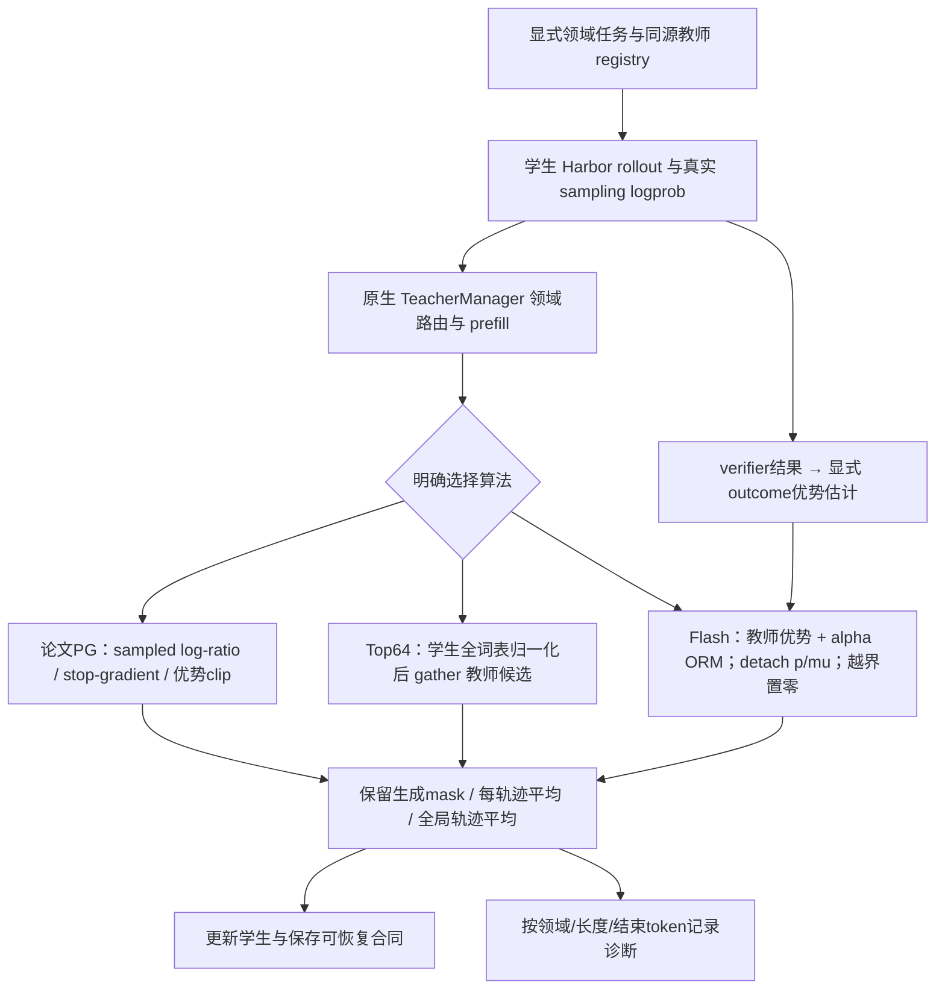

# MiMo 对齐扩展：轨迹平均、修正 Top-64 reverse、Flash ORM 与采样校正

日期：2026-09-22。基线 `7f835fe`，VERL `a9f2985159536a607211dcac730d3f5d55028950`。
用户请求推进两项缺失算法，并将长轨迹权重问题纳入。当前阶段：2026-09-22 用户明确要求回归本设计并推进完整实现、训练和真实验证，具体设计获准实施。GPU 运行仍须落实资源与预算，尚未启动。

## 目标与命名

为已有 PG-MOPD 增加可独立选择、可比较且精确定义的配方。目标是验证 MiMo 已公开数学形式，不宣称复原未公开的生产超参数、训练数据或调度。三项工作：

1. 轨迹内有效 token 平均，再对轨迹平均；保持当前 token-mean 基线不变。
2. 教师 Top-64 集合上的修正 reverse 目标，直接梯度更新。
3. Flash 公开公式的 sampled-token 教师优势 + ORM 优势 + detached 训练/采样 IS 权重，越界置零。

默认顺序：归约与诊断 → 论文PG对齐基线 → Top64纯蒸馏 → Flash联合。Top64与Flash各自正确之前不叠加；未来若组合，单独命名为研究变体，不标MiMo原式。

## 架构

## A. 长轨迹归约合同

设 m_it 为原始 assistant 生成mask，包括 reasoning/action/结束token，排除 prompt/tool observation/padding。T_i=sum_t m_it，B为全局 optimizer minibatch 有效轨迹数。

- 旧 token-mean：L=sum_i,t m_it*l_it / sum_i T_i。
- 新 sequence-mean：L=(1/B)*sum_i [sum_t m_it*l_it / T_i]。
- 1000与10000token示例中，旧归约系数约9.09%/90.91%，新归约系数50%/50%；不能把它说成实际参数梯度的固定百分比。
- 复用原生 actor.loss_agg_mode=seq-mean-token-mean；CPU数值测试确认不是seq-mean-token-sum。
- 全局B在microbatch切分之前确定；跨DP缩放正确。空mask合成padding不算有效样本，不得在每个microbatch重新平均。
- 一条完整任务轨迹跨多个工具轮次，不能每轮单独算一条样本。继续使用现有单admitted-chain检查，遇到多链保留失败而不是选最长或丢弃。
- Flash越界token使用权重0，保留原始m和T_i作分母；不得把拒绝token从分母删去后重新放大剩余token。

这修复的是长度带来的总权重偏置，不是长度惩罚、超长截断或自动止损，不保证模型变短。不会新增任意长度罚分。

## B. 修正 Top-64 reverse 目标

教师对学生历史h_it给出原始全词表概率q_d，T_it=Top64(q_d)。学生p_theta在同一历史评分：

L_top64 = (1/B) sum_i (1/T_i) sum_t m_it sum_{v in T_it}
            [p_theta(v)*(log p_theta(v)-log q_d(v)) - p_theta(v) + q_d(v)]。

合同：
- 教师候选集合/概率冻结。学生logp=对应logit−全词表logsumexp，保留反向图；p本身不能detach。
- 不对64候选重新softmax，不用教师权重的forward KL，不将有限Top64说成完整词表reverse KL。
- 不继承PG ±5优势裁剪；use_policy_gradient=false，任务奖励默认关闭；loss_max_clamp与log_prob_min_clamp显式null，不复用forward wrapper的clamp_min(0)掩盖误差。
- 在fp32进行logsumexp与差值/exp计算。按token分块避免额外[B,T,V] logsoftmax张量；基础student logits仍有其内存成本，不能宣称内存与V无关。
- 教师返回每有效位置恰好64个唯一、词表内合法候选及有限logprob。原生vLLM extract_prompt_logprobs已按rank剔除Top64之外额外sampled token，保持原始logprob。末尾dummy行含重复ID0；仅对有效对齐位置做候选检查，并证明dummy无损失，不将合法padding误判成坏数据。
- 固定TP=1/FSDP、序列并行=1、use_fused_kernels=false作为首个支持范围；THD/BSHD与去padding对齐分别测试，拒绝native不支持的pad_to_length组合。未实现后端显式报错，不能默默走forward KL。
- 报告teacher_top64_mass、student_on_teacher_top64_mass、outside_mass、按长度/领域的loss与梯度。截断外未逐项匹配的尾部分布限制必须写明。

已核实接点：verl/trainer/distillation/losses.py:compute_topk_loss目前按后端硬编码调用forward KL；只注册一个新loss名字不能完成该目标。需要新增按loss_mode的显式分派与FSDP kernel。

## C. Flash ORM联合与训练/采样校正

使用Flash §4.4公式7–9的公开形式：

A_it = stopgrad(log p_teacher(y_it|h_it) − log p_current(y_it|h_it)) + alpha*A_ORM_i
rho_it = exp(log p_current(y_it|h_it) − log mu_rollout(y_it|h_it))
w_it = stopgrad(rho_it) if epsilon_low <= rho_it <= epsilon_high else 0
L_flash = −(1/B) sum_i (1/T_i) sum_t m_it*w_it*stopgrad(A_it)*log p_current(y_it|h_it)。

合同：
- p_current、mu_rollout、p_old(PPO anchor)是三个不同概率。此配方校正前两者，不将teacher/student比值用作IS。
- 精确公开代理式不额外叠加PPO ratio/dual-clip；现有VERL hybrid分别计算两个PPO loss再相加，不等价于本式。
- 现有rollout_corr支持token IcePop零越界权重，但trainer通常用old anchor而非当前p计算；多次更新下不能直接称等价。首个Flash配方在loss里用当前p显式计算一次，禁止上游重复IS/rejection。
- alpha和epsilon_low/high在Flash原文未给可直接复现值，必须由本地配方显式填写并记录为实验参数；alpha有限且>=0，0<low<=1<=high<infinity。不能编造“官方默认值”。
- 不自动继承专题PG的优势±5裁剪；若增加clip须成为单独命名变体。
- ORM是outcome reward/advantage来源，不必部署另一个神经奖励模型。首轮复用Harbor真实verifier，使用GRPO同prompt分组优势，alpha对OPD信号强弱独立可查。
- GRPO联合验收采用N>=2，建议工程N=4；N=1在当前VERL实现是singleton特殊路径，不当作有组内对照的GRPO。真实全对/全错组允许ORM优势为零，不造假奖励或删除这些组；蒸馏仍有效。
- `ppo_mini_batch_size`由prompt数计，native乘N得到轨迹数；需要验证多rollout UID分组、单任务单链以及实际全批一次更新。
- 同步采样温度1且无top-p/top-k截断，真实rollout logprob不可缺失。采样链出现多个policy版本必须报出并在首轮同步合同中拒绝，避免跨版本校正被误认为同一mu。
- 缺失或非有限概率、无有效assistant token属于输入失败；正常越界置零属于算法内token权重，不是基于模型效果自动取消训练。

## D. 轨迹过长的诊断

首轮记录，不先引入新的长度reward：
- 各领域生成token数p50/p90/p99、工具轮数、完成/超时/轮数上限、解析错误。
- reasoning/action/结束思考/EOS/工具调用结束等类别需依据实际tokenizer与renderer解析；不凭ID猜测特殊token。
- sampled位置教师logratio，以及实际生成结束标记时的信号；未生成EOS时“是否压低EOS”需要额外获取同位置EOS候选概率，不能从sampled-only日志推断。
- Top64覆盖EOS与否，token被IS拒绝的比例，原始mask计数和归约系数，分域OPD/ORM优势幅度与符号分歧。
- CPU可测分量参数梯度范数/夹角；真实训练仅在有实际分量梯度证据时报告，不以优势相关性冒充梯度相关性。
- A/B比较在相同初始化、任务、mask、更新预算下变更归约。长度与成功率/每次成功成本一起看，短输出不是独立能力目标。

## 文件改动与API

保留当前baseline不动，所有变体配置独立命名：
- `examples/harbor_mopd/launch.py`：显式--recipe，按recipe校验N、mask、原生模式/校正互斥、超参，合同绑定所有选择。
- `examples/harbor_mopd/recipes/{pg-sequence,top64-reverse,flash-orm}.yaml`：分别表达目标；pg-sequence先固定论文PG代理与轨迹平均，另保留旧native-PPO baseline。
- `uni_agent/training/mopd_objectives.py`（新）：可直接测试的fp32目标/分量/IS/诊断基础函数，避免混入Harbor任务执行。
- `patches/verl/0002-mopd-objectives.patch`（新，拟定）：窄幅连接原生loss注册/TopK分派/config字段/Flash最终目标；必要时补全全局有效sequence分母。复用现有受版本约束的patch应用流程，拒绝不匹配源码，不使用隐藏monkeypatch。
- patch预计触及：`verl/trainer/distillation/losses.py`、`verl/trainer/distillation/fsdp/losses.py`、`verl/workers/config/distillation.py`；若全局有效sequence计数现有元数据不足，增加明确engine计数补丁并单独测试。
- `uni_agent/framework/framework.py`：只补实际需要的topk形状/候选/版本证据；不得改变原有单教师行为。
- tests对应上述模块与native接线，涵盖多worker独立import/patch加载；文档/acceptance区分数学实现、CPU数值、GPU运行和能力四层。

未经具体实现核查，不承诺上述文件数量绝对不变。新增代码不能只停留在一个孤立Python函数：验收必须从原生TeacherManager payload一路进入FSDP logits hook和最终反向loss。

## 验证计划与里程碑

M1：归约与PG对齐
- 相同token损失复制成长轨迹后，sequence平均不变；tokenmean对照按长度变化。
- 1k/10k系数、tool/prompt/padding零梯度、全mask、microbatch/DP模拟划分不变；一条轨迹多轮仍一项。
- 论文PG独立参考公式与autograd一致，旧native-PPO回归不变。

M2：Top64
- 小词表K=V时修正项求和抵消，值与梯度等于完整reverse KL。
- p=q时值/梯度零；K<V时与手写float64公式/有限差分一致。
- K=1下不因候选重归一化错误变成恒零；非候选logit通过全词表normalizer仍有正确梯度。
- 重复/越界ID、非有限logprob、错shape拒绝；去padding/THD/BSHD位置一致；teacher无梯度。
- 原生配置→teacher top64→logits分派→真实loss.backward接线测试；内存profile另记GPU待验。

M3：Flash
- alpha0退化为纯教师PG，teacher信号0退化为alpha倍ORM；stopgrad权重/优势不产生额外导数。
- rho位于上下边界与界外时精确值/梯度正确；不重复乘PPO ratio；非有限值拒绝。
- 拒绝部分token后分母保持原T_i；全部拒绝得到有限0 loss/0 gradient而非nan。
- N4 prompt分组、变长轨迹、真实有效mask、ORM全同/不同的数值验收。
- 保存/恢复拒绝目标、alpha、阈值、归约、patch版本变化；同合同续跑与连续CPU更新一致。

M4：资源落实后的真实验收
- 单机3GPU角色是当前原生布局下限，现有2GPU节点不能原样执行。部署、实际教师加载/token兼容、独立预算仍是前提。
- 每个配方各完成真实rollout/scoring/update/save/reload/resume，随后才比较held-out成功率、长度、遗忘和成本。
- 若GPU尚未落实，M1–M3仍可完成；不得把CPU数学测试或mock transport计为M4。

## 一手依据

- MOPD专题§3.2式1–5与Appendix A：https://arxiv.org/html/2606.30406v1#S3.SS2
- Flash§4.4式7–9：https://arxiv.org/html/2601.02780v2#S4.SS4
- VERL rollout correction：https://github.com/verl-project/verl/blob/main/docs/algo/rollout_corr.md
- 原生归约说明：https://github.com/verl-project/verl/blob/main/docs/algo/dapo.md
- 2026-09-22重新用Context7核对官方接口；具体实现以固定a9f2985源码为准。论文已通过gstack browse读取，本设计不推断未公开超参数。

## Review

可行性结论：三项均可推进，不需要更换训练框架。轨迹平均已有原生入口；Top64有现成teacher张量与logits入口但缺reverse kernel分派；Flash须显式新目标避免与native hybrid混淆。现有严格tokenizer合同、数据审计与恢复机制继续复用。

该扩展引入新优化目标与原生补丁，已先呈现设计；2026-09-22用户明确要求回归本设计并推进完整实现，实施授权已取得。

独立只读审查已确认：现有teacher TopK张量可复用；主要缺口为native logits分派和精确反向目标。已把fused callback绕过、dummy尾行、默认clamp等真实边界纳入设计。

## 实施边界更新

2026-09-22：已实现三个数学目标与原生接线、独立recipes/启动合同，CPU整合551项回归通过。当前工程配置沿用LoRA rank16，不等同于MiMo私有数据或全参数生产训练复现。领域专家、正式训练/held-out数据及GPU/预算缺口见replication-plan.md与resource-readiness.md；最终测试/源码摘要以mimo-objectives-acceptance.json为准。
