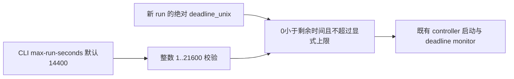

# 显式五小时 controller 窗口

用户授权总窗口从 2026-09-29 08:16:41 UTC 起五小时，到 13:16:41 UTC（新加坡 21:16:41）结束。修改仅供新 run 使用；运行中的 r8 内存 deadline/supervisor 不热更新，不修改冻结源码或 RunSpec。



## API 与文件

- `deployment/services/harbor_run_controller.py`：`main(path, max_run_seconds=14400)`；增加 `cli(argv=None)` 解析入口与 `--max-run-seconds`。整数秒数，默认14400兼容，最高21600；直接调用 main 同样校验，bool/float/无穷/负数拒绝。
- `tests/uni_agent/deployment/test_harbor_controller_run_window.py`：真实 RunSpec，替换外部网络/服务启动边界；固定时钟验证五小时、默认四小时、上下边界、参数错误及不创建服务。
- 本设计文档。测试仅在独立云端 snapshot，既有环境复用，不在 Mac 执行。

新 run 使用 `--max-run-seconds 18000`，RunSpec 仍写用户授权的固定绝对截止，不因重启重新获得五小时；driver/supervisor 使用绝对截止减当前时间的剩余秒数。CLI 参数只是可接受 deadline 的上限，不会修改 spec 或自动延长窗口。

## 验证计划

- [x] 云端 RED：新接口/CLI 尚不存在时21 failed、3个兼容性用例passed。
- [x] GREEN：五小时明确允许；默认四小时不变；21600可选，21601/0/负数/bool/float拒绝；过期及超过所选上限拒绝。
- [x] 新24例与既有controller22例合计46 passed / 2.27s；全文件branch-inclusive coverage88%，新增main/CLI逻辑均覆盖（模块直接执行的最后一行不在coverage内）；scoped Ruff check/format通过。
- [x] 已将来源 SHA 和日志交主 agent；未独立启动 GPU 或真实 controller 服务。

## 云端证据与调用

独立snapshot：`/workspace/mimo-dsh-rl-20260928/integration-check/effective-update-review`；固定venv：`/workspace/verl-uni-agent-harbor-opd-rl/envs/ua-verl-py312-vllm023-ws1/bin/python`。测试禁用GPU、使用fresh `PYTHONPYCACHEPREFIX=/tmp/controller-window-green`，只替换网络与外部服务边界，真实RunSpec/时限验证/main/CLI均执行。

- controller SHA256：`e6b859e8bc4fb0c4379e28b3f82eb27a0d43592e0f697ec52e89bb8500e7ebe1`。
- tests SHA256：`274dd233f364c62a9254974985fc78b327ba4141c75ac16a37a36d96e97f8435`。本地与云端一致。
- `integration-check/controller-window-green.log` SHA256：`53ee746246503a44a9b49a251a5231d8c0b664d844c97403f7667f8e8fe764ca`。
- `integration-check/controller-window-coverage.json` SHA256：`256f6209ce5cad02bdbd96dbec80dbb766331fe2aa9a75ddde8f4369964ca69e`。

```bash
python -m deployment.services.harbor_run_controller \
  --run-spec <new-run-absolute-deadline-spec.json> --max-run-seconds 18000
```

controller内的`start_worker`直接构造HarborWorker，未调用独立`harbor_worker.py`的四小时CLI，因此此运行路径不需要额外扩展worker参数。运行中的r8继续遵循其原始4800秒上限，只有新run应用上述参数；新run实际剩余时长不得超过用户固定截止。
