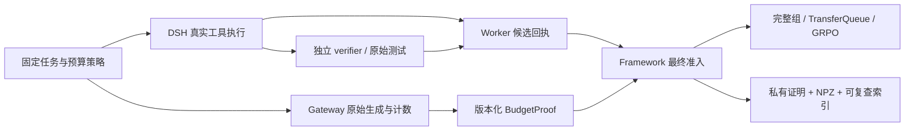

# 固定预算 RL 终态准入：设计已批准

## 问题与目标

r6 的前三条自然完成轨迹获得真实奖励0/1/0，但第四条达到14336累计生成额度，整组被严格拒绝。r7将生成额度提高到20480后，首条生成16611时达到32768总上下文，仍整组拒绝。扩大一个预算只把终止点移向另一个预算，不能保证随机策略的所有样本自然结束。

目标仍是可信任务反馈驱动有效GRPO更新、保存及独立重载续训。本设计允许**明确、可证明的预算终止**成为有限预算任务的合法终态，保留 `finished=false`，不把它伪装成自然完成，不减少验证和证据要求。当前默认 completed-only 契约保持。

## 两种方案

| 方案 | 收益 | 代价/限制 |
|---|---|---|
| 保持completed-only，扩大到48K/64K | 准入语义保持，可继续寻找全部自然完成的组 | 仍可能撞预算；SDPA下双卡FSDP不自动分摊单序列激活；双rank checkpoint审计还需补齐 |
| 版本化budget-terminal契约（建议） | 有限预算成为任务定义；保留成功、错误及预算终止样本，适合长期在线RL | 必须新增可信预算证明及线上/离线一致审计，不能只关闭require_finished_episode |

## 架构

Worker只验证预算终态候选的DSH/Harbor/工作区/独立verifier证据；最终预算结论由Framework结合Gateway原始计数判定。Worker或agent不能自行声明额度已耗尽。

## 提议接口契约（尚未实现）

- `termination_policy`：版本化、由可信operator固定。旧模式为completed-only；新模式明确允许 `max_generated_tokens` / `max_trajectory_length`。绑定run-spec、任务/组/预算，不能通过任务文本或普通metadata覆盖。
- `BudgetProof v1`：绑定run、Gateway session、policy version、预算配置摘要；记录原始生成计数、累计额度、总上下文容量、chain身份、最终token序列摘要和可信exhaustion reason。包含所有被截断分支，不能挑选最终链隐藏早期截断。
- `termination_kind`：`completed` 或 `budget_exhausted`。自然完成仍 `finished=true`；预算终止始终 `finished=false`。取消、超时、网络错误、进程崩溃、工具/评分基础设施故障不能进入这两个成功准入分支。
- 预算终态必须同时满足：DSH原始trace与helper结果一致、终态max-tokens；Gateway能证明实际累计额度或总上下文耗尽；独立verifier已完成；receipt、manifest、workspace、token/mask/logprob与session全部一致。单次4096被截断但尚有累计/context额度不能冒充预算终止。
- 新字段必须保留旧run-spec序列化/摘要兼容性；不能因为添加默认字段导致已有v1回执摘要改变。新契约显式选择和版本化。
- 最终证明由可信Framework保存到agent不可访问的私有证据根，绑定Harbor receipt与原始NPZ摘要；离线审计完整回读，不能只信一个自由metadata字符串。
- 同一GRPO组必须使用相同termination policy与预算；任何成员证据无效则拒绝整组，不挑选成功成员、不用基础设施错误伪造reward0。

## 损失与报告语义

固定版本GRPO使用组内reward归一化后乘response_mask，没有由finished驱动的critic bootstrap。`mask_unfinished_episode=false`保留原动作mask，工具观测仍为0；true会把整条动作mask清零，但其reward仍可能影响组均值，因此不能用这个开关替代严格准入。

仅通过新契约的budget-terminal样本可保留真实动作监督；其他unfinished样本仍拒绝。独立verifier评分原样使用，不能因为预算耗尽自动改成0或1。分别报告自然完成率、预算终止率、任务测试通过率、基础设施失败率及完整尝试分母。

## 最小改动范围

- `uni_agent/gateway/session/session.py`：生成版本化可信预算证明，原始计数不从DSH日志重算。
- `uni_agent/tasks/harbor_dsh/protocol.py`、`task.py`、`registration.py`：版本化策略、候选结果及最终证明绑定；旧contract默认保持。
- `uni_agent/tasks/harbor_dsh/executor.py`、`trajectory_audit.py`：区分自然完成与预算终态候选，保留既有原图验证及cleanup门。
- `uni_agent/framework/framework.py`：在选择轨迹前联合验证Gateway与Worker证据；持久化证明、保留finished=false、同组严格准入。
- `examples/dsh/ops/audit_qwen3_4b_online_rl.py`、`examples/harbor/audit_m2_training.py`：恢复并核验预算/版本extra fields，确保线上与离线接受集合一致。
- `examples/mimo_dsh_rl/`：新模式专用配置，不静默改变其他DSH或terminus任务。
- 对应Gateway、Worker、postprocessor、Framework、离线audit测试；精确文件范围在实施时据已有contract细化。

## 测试与最终验收

1. RED用例复现已确认的14336累计额度及32768context终止；新模式分别验证正例，旧模式仍拒绝。
2. 拒绝伪造/缺失预算证明、单次max_tokens假终止、session错绑、旧policy证明、漏掉截断分支、篡改NPZ/receipt、invalid logprob、工具观测mask错误。
3. 网络/工具/评分故障、强制取消、deadline、无verifier回执均失败；混合策略组、缺成员不得训练。
4. 自然完成路径及所有旧合同回归保持；预算样本finished=false，实际动作mask非零，工具mask仍0；合法评分0/1都保留。
5. 云端真实n4采样，分别记录两类合法终态。必须同一步有reward差异、正负advantage、有限非零梯度，checkpoint参数变化，base保持不变。
6. 新run/controller/Ray/session重载checkpoint，再完成有效更新；保留所有原始证据与资源清理结果。仅有预算样本准入并不代表整个目标完成。

## 审批状态

用户于2026-09-29明确回复“批准 开始”，实施已启动。现有r6/r7证据与冻结源码保持原语义，不追认先前被拒绝样本为已训练数据。
