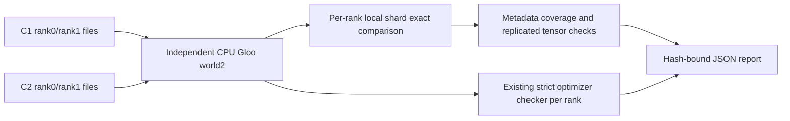

# Two-rank checkpoint audit

Goal: inspect the current dual-colocate run's own completed C1/C2 checkpoints on cloud CPU, without changing its frozen training source, Python environment or GPUs. Parent approved this validation approach on 2026-09-29 UTC. R13 failed its CPU admission gate before training; R14 is the next intended audit target. This is parameter/state inspection; a real checkpoint-resume run and task learning evidence remain separate gates.



Files: `deployment/checks/sharded_checkpoint_delta.py`, `tests/uni_agent/deployment/test_sharded_checkpoint_delta.py`, this note and small evidence under this worktree's docs directory. Existing checkers and training code remain unchanged.

CLI accepts two actor checkpoint directories and a new output JSON path. Require both ranks' model/optimizer/extra files and fsdp_config world_size=2. Separate CPU processes initialize Gloo with a private file rendezvous and load only their matching rank. Trusted model/extra pickle loading is explicit, limited to this project's own hash-bound files; there are no global Torch patches or deserializer registration changes. Optimizer loading retains weights_only=True and existing strict comparison criteria.

Model invariants: identical keys, global metadata, dtype and local shard positions across checkpoints; all floating values finite; base values exactly unchanged in original dtype; at least one adapter value changed across both ranks. Check shard bounds, exact nonoverlapping global coverage and rank ownership. Plain tensors are replicated and must agree across ranks. Scan large local tensors in bounded chunks. Unknown tensor layouts/types fail explicitly.

Optimizer invariants remain those of the existing checker per rank: valid finite nonnegative moments, consistent positive advancing steps, unchanged parameter IDs/order and state topology. A zero-moment C1 or unsupported rank layout fails that gate honestly. Extra state is checked for scheduler/RNG presence, not presented as proof that a trainer restored it.

Verification: cloud-only native two-rank ShardedTensor save/load fixture; success, changed base, NaN, missing rank, mismatched metadata/coverage and optimizer strict-failure cases. OMP/MKL/Torch threads are limited to two, CUDA is hidden, owned process groups are cleaned on failure. The audit has a 1200-second bound and never stops unrelated processes. Actual R14 C1/C2 inspection is pending until those files exist.

Run from a separately staged audit source directory with the fixed cloud Python environment:

```sh
CUDA_VISIBLE_DEVICES='' OMP_NUM_THREADS=2 MKL_NUM_THREADS=2 OPENBLAS_NUM_THREADS=2 \
  "$FIXED_PYTHON" -m deployment.checks.sharded_checkpoint_delta \
  "$CHECKPOINT_C1/actor" "$CHECKPOINT_C2/actor" --output "$NEW_REPORT"
```

The report binds model, optimizer, extra-state and FSDP configuration bytes plus the checker and unchanged optimizer checker sources. Loading two snapshots of two 9B shards can use tens of GB of CPU memory: check available cloud RAM before the real audit. No checkpoint is downloaded to the Mac.
