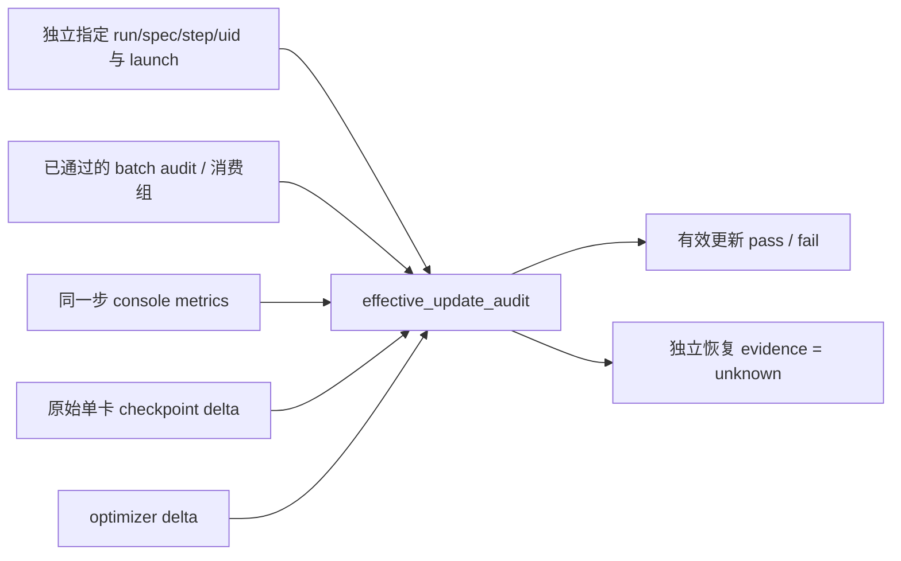

# r8 → r9 有效更新与独立恢复验收

## 目标与边界

用户已批准完整 RL 闭环及最终验收实现。本次新增独立只读报告合并工具；不改运行中的 `run-src-r8`、不操作 GPU、不在 Mac 加载模型。检查的是指定训练步的有效更新，不能代替独立恢复或能力提升评测。



文件：`deployment/checks/effective_update_audit.py`、`tests/uni_agent/deployment/test_effective_update_audit.py`、本文。纯标准库，不加载模型或 optimizer 张量；实际 delta 由现有两个 CPU checker 产生。合并报告信任 operator 提供的 checker 报告，不把公开摘要当认证签名。

## API 合同

`audit_effective_update(*, run_id, run_spec_sha256, step, group_uid, launch, launch_sha256, batch_audit, metrics_rows, model_delta, optimizer_delta, before_checkpoint, after_checkpoint) -> dict`

- launch 原始字节 SHA 必须与 batch audit 的 `launch_sha256` 一致；run/spec 必须匹配 launch 的 postprocessor。
- 指定 step 必须只有一个完整、已实际消费的 train group，uid 必须匹配；本方案只支持固定单组 n=4，四条 reward、四条唯一 TQ key、session indexes 0..3，不能用 prefetch/unconsumed group 验收。
- 该 group 的 reward 必须有限且有差异；同一步 metrics 的 score min/max 必须与该组一致，advantage min<0<max，grad_norm 有限且>0，pg_loss 有限（允许0）。拒绝重复/缺失 step metrics。
- delta 的 before/after 必须绑定 operator 指定的相邻 `global_step_N/actor` 文件；after 必须位于本次 launch RUN_ROOT 的 rl-training/checkpoints 下。检查输入 SHA 格式、raw single-rank FSDP 模型全部有限、base 存在且不变、adapter 实际变化，不能比较 merged HF 导出物。
- optimizer 状态 step 必须为 `[s-1]→[s]`，active topology 不变，moments 有限且有变化。现有 checker 因全零 moment 保守失败时，本工具仍 fail，并输出 `needs_fresh_after_check=true`，不推断零 moment 究竟在 before 还是 after。
- 输出 `effective_update_verified`；`restore_evidence.status=unknown`、`resume_verified=false`。不把学习更新、重新加载或能力提升混为一个 verdict。

## 实际执行顺序

1. 等 r8 C1/C2 完整保存、latest iteration=2、step 2 metrics 和 rollout JSONL 落盘；保存发生在 metrics/dump 前，只有目录不足。
2. `audit_m2_training --train-n 4 --no-validation` 验真实消费组。保留 launch/registered policy、receipt/proof/private admission、NPZ/metadata、源码及依赖 manifest。
3. 云端运行现有 `checkpoint_delta.py C1/model... C2/model... --output ...` 和 `optimizer_delta.py C1/optim... C2/optim... --output ...`；内存必须足够同时读两份9B checkpoint，限制 CPU threads。不要在 Mac 执行。
4. 使用本工具对 step 2 与实际 group uid 合并验收。
5. r9 新 run/controller/worker/registration/secret/session，保留模型、DSH release、TaskRef、预算/训练合同及冻结源码。原生 launcher 显式 `--resume-from-path <r8 C2> --total-training-steps 3 --save-freq 1`，先 CPU preflight。旧 r5 wrapper 硬编码 r4 C2，不可复用。
6. 收齐 r9 的 Loaded model/optimizer/rng/lr_scheduler 与 absolute step=3；`data.pt` 必须存在且摘要绑定。源码没有 Loaded dataloader 成功日志，不要求不存在的日志行。
7. r9 首个实际消费组的 Gateway generation version 应为2，而 training/global_step 为3。恢复后 `on_init_end` 先同步 C2 权重，随后 fit 才加到 step3。
8. 对 r9 step3执行相同 batch audit 与 r8 C2→r9 C3 delta/有效更新验收。当前 TQ 无 checkpoint API，不宣称 in-flight rollout 精确续接。

## CLI 用法（CPU，实际路径/uid由operator提供）

在独立审计 snapshot 内执行新增模块；运行中的冻结 `run-src-r8` 不包含本次新文件，不向其覆盖代码。先用同一份 launch 生成 batch audit，并保留非零退出码：

```bash
python -m examples.harbor.audit_m2_training \
  --launch-path <private-launch.json> \
  --agent-log-dir <r8/rl-training/agent> \
  --rollout-data-dir <r8/rl-training/rollout> \
  --train-n 4 --no-validation > <new-r8-batches.json>

OMP_NUM_THREADS=2 MKL_NUM_THREADS=2 python -m deployment.checks.checkpoint_delta \
  <r8/rl-training/checkpoints/global_step_1/actor/model_world_size_1_rank_0.pt> \
  <r8/rl-training/checkpoints/global_step_2/actor/model_world_size_1_rank_0.pt> \
  --output <new-r8-model-1-2.json>

OMP_NUM_THREADS=2 MKL_NUM_THREADS=2 python -m deployment.checks.optimizer_delta \
  <r8/rl-training/checkpoints/global_step_1/actor/optim_world_size_1_rank_0.pt> \
  <r8/rl-training/checkpoints/global_step_2/actor/optim_world_size_1_rank_0.pt> \
  --output <new-r8-optimizer-1-2.json>
```

```bash
python -m deployment.checks.effective_update_audit \
  --run-id <actual-run-id> --run-spec-sha256 sha256:<actual-spec> \
  --step 2 --group-uid <actually-consumed-group-uid> \
  --launch <private-launch.json> --batch-audit <r8-batches.json> \
  --console-metrics <r8-train.log> \
  --model-delta <r8-model-1-2.json> --optimizer-delta <r8-optimizer-1-2.json> \
  --before-checkpoint <r8/rl-training/checkpoints/global_step_1> \
  --after-checkpoint <r8/rl-training/checkpoints/global_step_2>
```

CLI 仅输出 JSON，成功退出0、缺证据/不一致退出1。为每个输入小文件记录 SHA，不重算巨大 checkpoint 文件。保留原始报告供独立复查。

## 测试计划

云端 RED→GREEN：有效 step2/step3（不同run的C2→C3）、pg_loss=0 合法；run/spec/launch/step/uid错配；跨步拼凑；prefetch冒充消费；少成员/重复key；无reward差异；单侧advantage；NaN/Inf/零gradient；base变更/adapter不变；optimizer无moment变化/跳步/未恢复；before零moment保守失败；checkpoint路径替换；重复metrics；console解析及CLI退出码。使用独立snapshot和fresh pycacheprefix，覆盖率≥80%。

## 已完成的 CPU 验证

- 独立云端 snapshot：`/workspace/mimo-dsh-rl-20260928/integration-check/effective-update-review`；使用既有 `ua-verl-py312-vllm023-ws1/bin/python`，无 GPU、无共享环境变更。
- 首轮 RED：模块不存在时33例失败。新增 SHA 前缀别名攻击 RED：1 failed / 36 deselected；修复后37 passed / 0.77s。
- 最终 branch-inclusive coverage：97%（169 executable statements，4 missing，34 branches）；CLI 子进程与直接 main 两种入口均验证，原始输入文件不变。
- 日志：`integration-check/effective-update-green-v2.log`，SHA256 `c78c7d5716b53460899d6a0f480b5a0ec0ee13ecfced02612ed671b6056dee7b`。
- 覆盖报告：`integration-check/effective-update-coverage-v2.json`，SHA256 `5d0dd0e402ac990939471bcdf0ee8f3ddf301466e668e73143bb9491d956f44a`。
- 审计代码 SHA256：`3b7d17a5dc25c1008be10f6f76360a3f85e704cd086d600deccb3558ad0e5579`；测试 SHA256：`4c1afacfe08fb9127f87a9f3fe0375fcde7e6a751e0cc1eeb7773b969a773d81`；本地与云端一致。scoped Ruff check/format 通过。

测试通过仅证明审计规则与失败关闭行为；真实 r8/r9 训练产物尚需按上述流程验收，不在本文声明已完成有效更新或独立恢复。
