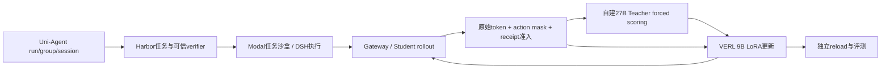

# Uni-Agent + Harbor + Modal + VERL + OPD 衔接设计

2026-09-15：实施已授权，正在成对升级及CPU回归；GPU独立环境构建进行中，尚无训练通过证据。

## 目标与发现

目标是由Uni-Agent维护运行身份与准入，Harbor提供任务环境和评分，Modal承担远程沙盒，VERL在自有GPU训练9B，27B Teacher为Student原始轨迹提供逐token评分，统一完成RL/OPD/hybrid及恢复验收。

最新Tinker云端P0已完成OPD有效更新与独立推理reload。不能继续用旧结论说所有Harbor格式任务训练均未打通；但这也不是Uni-Agent/DSH/VERL主线验收。

## 来源清单

| 工作目录 | HEAD | 可复用内容 | 缺口 |
| --- | --- | --- | --- |
| harbor-modal-integration | 9075dfa | Uni-Agent/DSH身份、轨迹准入、VERL主线、Harbor远程执行器 | 最新原生canary尚在初始化的历史记录；需重新查运行状态 |
| harbor-online-rl | 2512817 | 官方Harbor任务包、独立verifier、容器清理与监督器 | 有未提交文件；无有效Harbor训练更新/reload验收 |
| tinker-harbor-opd-rl | daf011a | 当前云P0证据和设计 | 此目录主要保存Uni-Agent侧文档 |
| tinker-cookbook-opd-rl | 5d9abba | harbor_opd_rl.py、原始token评分、RL/OPD/hybrid模式、Modal生命周期和checkpoint审计 | 独立Cookbook仓库；计算后端为Tinker |
| tinker-cookbook-harbor-opd-rl | 485726f | 早期实现参考 | 有未跟踪测试；不能误认为最新实现 |
| docs-modal-route-reset | 0e3d790 | Modal生成与fixed-sequence scoring边界 | 现有生成Endpoint未证明strict scoring可用 |

实际目录均位于仓库的.Codex/worktrees下；两个Cookbook目录是独立仓库，并非本仓git worktree list中的分支。

## 证据核验

读取tinker-harbor-opd-rl的p0-closed-loop-evidence.json，并逐项对比Cookbook outputs中的9个原始文件：SHA256全部匹配。

P0为Qwen3.5-9B / Qwen3.8-27B：1batch、2条同题轨迹、1179动作token、1138非零OPD位置；249个LoRA张量变化；独立推理reload成功。reward=[1,1]，RL信号为0。前评估2/2，后1/2且采样记录不齐，不能归因为能力退化或提升。optimizer resume、正式TB、非零RL与top-k评分未验收。

## 目标架构

Modal任务沙盒与Teacher推理服务是独立职责；Teacher可放自有8×A100，不依赖当前Modal生成Endpoint增加评分接口。

## 文件与接口计划

已以harbor-modal-integration固定SHA创建独立集成worktree。先比较harbor-online-rl的唯一代码提交，再按模块迁移；不整支合并、不覆盖未提交工作。Cookbook作为对照实现，迁移算法和合同，不复制第二套Agent loop。

- uni_agent/tasks/harbor_dsh/：明确Docker→Modal执行后端接口、任务资源、取消/清理及可信结果提取；现有Harbor支持Modal不等于自定义DSH执行器已支持。
- uni_agent/framework/及Gateway接线：保存student_version、prompt/target token IDs、action mask和完整组身份。
- Teacher评分适配：输入model/tokenizer revision、原始前缀token IDs；输出同位置Teacher logprob及可选top-k IDs/logprobs；禁止decode/reencode后默默错位。
- 配对VERL原生distillation loss：优先复用现有sampled/top-k配置和组合目标，不预设手写RL advantage与Teacher log-ratio相加。
- examples/集成入口：同一数据和执行链切换rl、opd、hybrid；明确checkpoint与optimizer恢复路径。

## 实施与验收

- [ ] G0 固定源码/依赖/模型与8卡规格；Teacher评分、tokenizer、上下文和mask合约测试。
- [ ] G1 真实Modal单任务经DSH/Gateway返回可信reward和轨迹；超时取消后无残留。
- [ ] G2 真实完整组同时进入Teacher scoring与VERL；证明目标token位置和奖励身份一致。
- [ ] G3 分别运行RL、OPD、hybrid；hybrid必须观察真实非零RL和OPD信号。不得人为修改reward造方差。
- [ ] G4 有限梯度、参数变化、采样权重同步、独立推理reload及optimizer续训分别验收。
- [ ] G5 固定独立评测与预算，报告成功率、成本、失败原文；正式Terminal-Bench题与开发训练题隔离。

用户已明确授权实施及新提供服务器的完整集成验证。其他会话的远程进程仍不得修改。CPU测试正在本worktree独立重跑，不继承历史测试通过数。

## Uni-Agent主线确认与源码定位

新分支verl-uni-agent-harbor-opd-rl已从9075dfa隔离创建；正在解决上游合并冲突。主线不是Tinker Cookbook，也不默认增加VeRL-Tinker API层。

现有主调用链为VERL trainer → AgentFrameworkRolloutAdapter → AgentFrameworkWorker / GatewayAgentFramework → task runner / DSH → Gateway trajectories → reward / trajectory audit → TransferQueue → VERL训练与权重同步。

关键断点：uni_agent/framework/entry.py:129明确拒绝非空teacher_client；framework.py:190的TQ序列字段集合已有teacher_logprobs/teacher_ids，但字段预留不代表生成或消费接通。配对verl的trainer_base.py已初始化MultiTeacherModelManager并提供get_teacher_client。这说明应补Uni-Agent adapter和framework内的Teacher评分及传递，不能切换到另一套AgentLoopManager绕过Uni-Agent。

Harbor隔离执行器isolated_trial.py仍有docker compose、docker cp依赖；不能仅设置harbor_env=modal完成可信DSH沙盒迁移。harbor-online-rl与候选基线在harbor_dsh下有4文件差异、反向比较涉及446行删除，需要逐功能挑选保留其output_contract/清理修复。

metarsi-m0相对当前基线的uni_agent差异以缺少新memory_chain等内容为主；不整体合并旧框架。dsh-capability-curriculum在该目录比较没有差异，但课程文件应单独审核。Tinker的harbor_opd_rl.py已有三模式和评分实现，仅迁移合同测试、信号审计思路；不替换DSH或TQ。

下一阶段代码前设计必须明确Teacher字段形状、序列分段、原始prefix评分、模型版本及完整组提交的原子性；明确配对VERL现有distillation loss可直接复用的范围后再决定是否新增loss。
