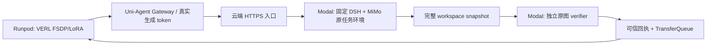

# MiMo 9B + DSH 云端 RL 操作入口

当前工程提交：`7e48aaa`（基础集成）、`cc372a3`（history、MiMo token及预算）、`67a5948`（后端预检/单卡原生同步）、`0f4f6f2`（uv复用/真实MiMo预检证据）。真实状态以同目录证据和最新 handoff 为准，尚未证明本轮 RL 更新或能力提升。

Mac 只承担编辑、Git、SSH 和小型证据回读。镜像、数据、依赖、测试、推理和训练在云端执行。



## 固定输入

- 数据：`XiaomiMiMo/MiMo-V2.6-RL-oss@639865fd3374018d6cb29b9fb82dd531406fcf5f`，Code 2698条；全量格式合同审计已通过，镜像/评分需逐题真实验证。
- 模型：`XiaomiMiMo/MiMo-V2.6-Distill-Qwen-9B`；已有缓存 revision `2367e865d009c13ac81713a2878291d33ab28177`。实际架构为 `qwen3_5`，使用其固定MiMo模板；工具解析器 `qwen3_coder`。
- DSH：源码 `b2369692ea530007075ebcd18d39fdba0bbd3982`，SDK/runtime `0.1.3a2`，`sdk-minimal`，无T2 patch。完整wheel/binary摘要见 `deployment/harbor/mimo/dsh-release-lock.json`。
- 单题：`format-code-task-001661`；原图及私有派生图见 `evidence/mimo-image/image-binding.json`。原图有Python3.12.13，独立verifier无需再安装运行环境。
- 现用云端依赖：Torch2.11.0、vLLM0.23.0、Ray2.54.1、Transformers5.8.0、Harbor0.16.1、Modal1.5.5。未修改共享训练venv。
- 已复用 `envs/ua-verl-py312-vllm023-ws1`，273项freeze约束全部匹配，详见evidence/uv-lane-reuse-20260928.json。该lane本来没有FA2/CuPy；不能用另一条SFT cu128环境或VERL的另一版uv.lock直接替换。显式调用venv Python，不依赖shell恰巧已activate。

## 准备与运行

1. 云端CPU运行 `deployment.harbor.mimo.prepare_context`，从精确Git对象及已校验release资产生成offline context；`remote_builder build/verify` 使用有TTL的Modal CPU VM构建、私有推送和冷拉取验收。不要在Mac调用Docker。
2. 云端运行 `examples.mimo_dsh_rl.prepare_tasks`，输入固定原始行、image mapping、已验image binding及确切Gateway HTTPS origin。输出任务/manifest，隐藏test patch只在 `task/tests`，不加入模型题面。
3. operator生成 `RunSpec`：固定TaskRef、DSH release、GPU实际Gateway节点IP、模型名、预算、独立controller/worker凭据、SSH目标与公钥、专属HTTPS隧道和 `registry_secret`。凭据必须在仓库和共享源码目录之外，0600。controller与GPU各持自己的私有副本。
4. 用既有 `deployment.services.harbor_run_controller --run-spec ...` 在云端CPU启动controller；确认authenticated health为unregistered/healthy。该状态只证明控制通路，不能代替模型路由登记。
5. GPU主机用 `examples.harbor.prepare_m2_training` 加 `--mimo-binding <task>/mimo-binding.json --max-concurrent-sessions 1` 生成私有launch。首轮train/heldout是同题工程行，不是独立泛化集。
6. 将launch中的训练输出 `environment.RUN_ROOT` 显式设为独立网络卷目录，保留task.yaml、worker token与准入工件根在支持0600/0700的本地私有目录。checkpoint必须在网络卷，不能因删除Pod而丢失。
7. 使用既有launcher，先preflight再真实运行：

```bash
export STUDENT_MODEL_PATH=/workspace/models/MiMo-V2.6-Distill-Qwen-9B
export TOOL_PARSER=qwen3_coder
export VLLM_USE_FLASHINFER_SAMPLER=0
python -m examples.harbor_opd_rl.launch --mode rl \
  --launch /root/mimo-private/launch-rN/launch.json \
  --recipe-config examples/mimo_dsh_rl/mimo-9b-smoke.yaml \
  --preflight-only
# 通过所有真实环境/协议门后，以相同参数去掉 --preflight-only。
```

`mimo-9b-smoke.yaml` 为单卡colocate_async、1题×4采样、2步、每步保存。LoRA优化后传输merged权重；不能称adapter增量同步。正式运行应由现有 `harbor_training_supervisor.supervise` 管理进程组和controller健康，并在云端detached运行，避免SSH断线结束工作。

## 验收与恢复

- 原始test command负例、独立workspace还原等价和public-only正例已实测通过：reward0/0/1，正例9tests通过。三个CPU沙箱均终止；详见mimo-history-policy.md。
- 在模型接触仓库前实施上游要求的Git history防泄漏；生产capture/restore均按冻结binding的显式strip执行。实测首图82个未来commit清为0，HEAD/tree/工作树完全保持。默认reject，绝不删校准assert迁就生产缺门。
- 真实MiMo tokenizer及AutoProcessor两轮token/mask/logprob一致性已通过，相关234项CPU回归通过；episode总生成预算14336与每次调用4096限制分开，截断轨迹拒绝准入。
- 验证DSH工具事件、Gateway真实生成、独立verifier reward、TQ消费、有限梯度及LoRA参数差异。全零奖励组不是有效学习证据。
- 原生checkpoint路径 `global_step_N`；独立reload须用新run/controller/session身份，然后 `--resume-from-path ... --total-training-steps N+1`，不得重用旧route receipt。
- 对新建专属GPU设独立云端清理期限；结束后确认Pod消失、Modal resources终止。保留网络卷checkpoint与无凭据的验收工件。不能只退出训练进程而继续计GPU费。

## 本轮已发生的云端操作

- 独立域名 `mimo9b-rl.xdan.work` 和named tunnel，云端fresh nonce HTTPS探针通过，未在Mac运行代理。
- Modal builder的4个CPU VM全部确认终止；私有镜像已发布并验收。
- 专属GPU `pbpxdvlt9uruc8`，96GB，查询价$2.09/h；不占用既有评测GPU。远端清理守护按2小时期限运行，状态应实时检查。
- 真实native tokenizer/dataset preflight已通过；该结果不表示trainer、optimizer或checkpoint验收完成。
- r2任务hash为sha256:603c1f65f95a2e6b89716a618713f683b1fc9072386002eb014fb9b0ccb878e2；runspec为sha256:eb712f88a6dd2e6b6d62fd3107ff18929bb880176e569ff405367e1cfeccf087。CPU/GPU独立准备结果一致，见evidence/mimo-prepared-r2.json。
- 10:57UTC启动r2 GPU operator driver，PID4713 / supervisor4714，wall budget2101秒；真实终态查网络卷runs/r2/operator/status.json。native supervisor wrapper位于audit-code/mimo-supervised-native.py，复用既有认证、进程组及超时行为，28项CPU检查通过。
- r2 在 actor 模型加载时缺 FlashAttention2 失败；改为原生 SDPA + `use_remove_padding=false`，35项配置/预检回归通过。r3 成功加载760个权重项后，在 actor checkpoint backend 初始化因缺 CuPy 失败。两轮均未注册Gateway、未产生模型rollout/reward/更新；详见evidence/mimo-training-attempt-r2.json及mimo-training-attempt-r3.json。
- 固定 VERL 的 colocated manager 本来选择 `naive`，并通过 PyTorch CUDA IPC + ZMQ 同步真实 merged 权重、清理KV cache及推进global_steps；本smoke须让actor配置与该原生路径一致。`separate_async`仍需支持独立传输的后端，不能改全局默认或把naive当不更新权重的占位实现。
- 原GPU在11:24:54UTC提前删除并回读确认，未延长11:38UTC期限；失败日志、固定源码和缓存模型留在网络卷，没有训练checkpoint。估计该GPU窗口约$3.70，不是账单金额且不包含Modal。
- 下一窗口先通过CPU attention依赖/ABI与checkpoint registry预检，再在新GPU运行原生CUDA IPC小张量测试。只有该真实传输门通过后才再次加载9B；新窗口、controller和所有运行凭据均重新绑定，已有失败身份不复用。
- r4新GPU为gqgtsz3pfov6tl，SSH157.157.221.30:51176，硬截止13:26:54UTC。平台RUNNING曾掩盖宿主端口冲突，同Pod stop/start已恢复，期限不变。源码run-src-r4中的VERL是真实复制包，不链接回共享可变源码。
- 原生IPC首跑180秒超时；只增加父进程等待到300秒、外层720秒后，同一测试1passed/0skipped，203.53秒且无残留GPU进程。诊断probe中CUDA算术通过，但周期trace采样时出现core，原因未建立，不能把该probe计作通过；独立原生测试的完整结果才是IPC准入证据。
- r4于12:19:39UTC启动driver995/supervisor996，40分钟上限；CPU controller80823。12:26:13UTC进入worker初始化、GPU559MiB，尚无rollout/更新。真实日志在GPU/root/mimo-private/launch-r4/train.log，结束后脱敏归档至网络卷runs/r4/operator。
- 恢复验收不能依赖旧MECHANICS_ONLY退出码：同一步须reward有差异、advantage最小值<0<最大值、当前grad_norm有限且>0、对应checkpoint参数改变。当前TQ0.1.9.dev0缺snapshot API，原生resume新建队列；仍需验证新run的实际消费轨迹/receipt及恢复后的policy版本。
