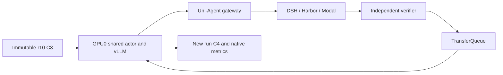

# MiMo colocate_async comparison: source audit

Read-only architecture review, 2026-09-29 UTC. This document proposes a controlled comparison; it does not authorize or claim a new GPU run. Source inspected at worktree HEAD `b09c2cd`. Existing unrelated worktree changes were left intact.

## Exact modes in this fork

| Mode | GPU ownership | Sampling/update behavior |
| --- | --- | --- |
| `sync` | Actor and rollout share a resource pool | Synchronous sampling; no partial rollout. Rollout sleeps before update, then receives weights. |
| `colocate_async` | Actor and rollout share a resource pool | Asynchronous/partial rollout; unfinished requests are aborted/paused at the training boundary, replicas sleep, then receive weights and resume. It does not imply simultaneous generation and optimizer execution on the same GPU. |
| `separate_async` | Actor pool plus standalone rollout pool | Dedicated rollout can continue while actor updates. Optional hybrid switching lends actor resources to rollout; r12 had switching disabled. |

Sources: `verl/verl/trainer/config/ppo_trainer.yaml:233`, `verl/verl/trainer/ppo/v1/trainer_sync.py:24`, `verl/verl/trainer/ppo/v1/trainer_colocate_async.py:19`, `verl/verl/trainer/ppo/v1/trainer_separate_async.py:43`.

## Single versus dual GPU colocate

- Single GPU: actor world size 1 and one TP=1 rollout replica share the same GPU. This preserves C3/C4 checkpoint topology and matches the earlier r9 topology, although r9 itself is not a controlled timing baseline because its starting weights and observability differed.
- Dual GPU: `trainer.nnodes=1`, `trainer.n_gpus_per_node=2` creates actor world size 2. With rollout TP=1, DP=1, PP=1, the shared pool produces two rollout replicas. Both GPUs alternate between generation and training; this is not the r12 actor1+rollout1 partition.
- Replica count is `worker_group.world_size // (TP * DP * PP)` in `verl/verl/workers/rollout/llm_server.py:409`. A colocated manager uses the actor worker group rather than allocating the separate rollout pool.
- Colocated checkpoint transfer uses native `naive` sharing: `trainer_base.py:365` sets the effective backend to `naive`. Keeping an inherited `nccl` label would misdescribe runtime behavior; an explicit colocate recipe should state `naive`.
- Prompt batch 1 with `n=4` produces four trajectories. Actor minibatch is multiplied by `n` in `trainer_base.py:1771`; four samples are divisible across two actor ranks. This arithmetic alone does not prove the full two-rank runtime works.

## Checkpoint topology is a real gate

The current C3 and C4 are actor world-size-1 checkpoints. Native FSDP loading constructs the filenames using the **current** world size and rank:

`model_world_size_{world_size}_rank_{rank}.pt`, `optim_world_size_{world_size}_rank_{rank}.pt`, and `extra_state_world_size_{world_size}_rank_{rank}.pt`.

See `verl/verl/utils/checkpoint/fsdp_checkpoint_manager.py:213`, `:233`, and `:247`. There is no automatic world-size-1 to world-size-2 reshard path here. Directly pointing a dual-GPU colocate run at C3/C4 will request absent two-rank files. Renaming/copying files would not establish optimizer, RNG, scheduler, or shard correctness.

An HF/LoRA model export can initialize weights for a fresh two-rank experiment, but that is not an exact training resume. Native model merger output alone does not preserve the optimizer/RNG continuation. A genuine cross-topology continuation needs a separately verified conversion mechanism; it is outside a minimal mode comparison.

## Lowest-risk controlled experiment

1. Compare **single-GPU colocate_async C3→C4** against r12's **two-GPU separate_async C3→C4**. Use the same immutable C3, task 001661, DSH revision, model, seeds, n=4, 32K context, 20,480 generation budget, learning rate, verifier, dataset, and observability. Give the new run a unique identity and output directory.
2. Preserve all state restoration: model, optimizer, scheduler, RNG and dataloader. Rebuild the sampling queue as in r12; exact restoration of in-flight TransferQueue contents is not supported or claimed. Do not use C4→C5 and call it a strict r12 comparison: starting weights and data state would differ.
3. Compare startup time separately from native step time, generation time, actor update time, GPU-seconds, successful verifier results, nonconstant rewards, finite/nonzero gradient, checkpoint delta, and actual W&B/RL-Insight receipts. One group is a functional/performance smoke, not a capability or statistical speedup claim.
4. If the user specifically requires **dual-GPU colocate**, run a separate topology experiment after resolving checkpoint conversion, or compare both topologies from the same fresh SFT initialization. Do not silently substitute a weights-only warm start for an exact resume.

## Concurrency can hide any second-GPU benefit

r12 has `max_num_seqs=1`, `agent.num_workers=1`, and runner `max_concurrent_sessions=1`. The session cap is an `asyncio.Semaphore` held across the complete episode in each framework instance (`uni_agent/framework/framework.py:988–1030`); it is not a global cluster-wide limit. With too few active sessions, two rollout replicas can be underfed. Replica count alone cannot prove useful parallelism.

Keep these limits unchanged for the first comparison so topology is the deliberate change. Then measure actual active episodes, outstanding model requests, per-replica routing, token throughput, tool wait time and GPU utilization before separately increasing concurrency. Raising `max_num_seqs` without increasing eligible requests may do nothing; increasing session concurrency also increases simultaneous Modal work.

r12's native step was 1258.08 seconds, including 1135.06 seconds generation (90.22%), 59.72 seconds actor update, 29.63 seconds old-log-prob, 22.89 seconds checkpoint save and 10.54 seconds weight sync. These measurements justify examining sampling utilization first. They do not prove hardware-level inefficiency because generation includes tool/environment waiting.

Evidence: `evidence/r12-wandb-final-20260929.json` contains the complete 89-metric W&B/console match. No new runtime claims are made here.

## Proposed execution contract (pending task identification)

User requested a colocate_async test, but “A5 安全终端” has no matching task definition in the inspected project. Task identity is required before launching dependent work. No A5 task, reward, image or test command may be invented. The following is the existing MiMo task comparison, applicable only if that is the intended task; a different A5 task requires its own task manifest and verifier contract.

Proposed files: a new observed colocate recipe in `examples/mimo_dsh_rl/`; r13 preparation and preflight helpers in this docs directory; corresponding recipe and preparation tests under `tests/uni_agent/`. No VERL kernel, DSH, Harbor or general launcher change is needed.

API contracts: retain existing launch/registration/receipt and budget-terminal-v1 schemas, private Hydra output, unique run/spec/session/W&B identity and source manifest. Select trainer_mode=colocate_async, one actor GPU, no standalone rollout pool, native naive transfer. Preserve original task hash and C3 resume paths; never reuse r12 output identity. Keep existing fixed deadline 2026-09-29 19:16:41 UTC and leave GPU Pod running after owned-process cleanup.

Verification: cloud CPU compose/preparation tests, incorrect topology rejection, full source/dependency/checkpoint validation, real native IPC preflight, then actual rollout/reward/update/checkpoint checks plus W&B and RL-Insight cross-checks. Separate timings from effective-update evidence. If rewards are constant, report the missing learning signal instead of treating optimizer momentum as a fresh effective update. Compare GPU allocation time separately from measured hardware utilization and actual billing.
