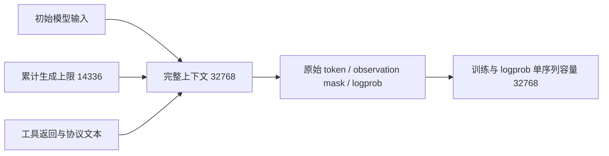

# MiMo r4 上下文截断修复

## 目标与实证

r4 的前两条 DSH 轨迹未完成。最后一次模型调用分别为 input 15761 + output 623、input 16346 + output 38，均精确达到 16384。实际工具调用/返回成对存在，不能将该现象归因于未加载 uv 或工具解析器未工作。独立 verifier 缺 `/tests/test.sh` 是另一问题，分别修复。

目标是给完整工具交互留出上下文空间，同时维持原先的生成预算和严格准入；不把截断轨迹计作 reward=0，不制造奖励方差。

## 配置合同

- `data.max_prompt_length=2048` 保留任务数据预处理设置；不将它误称为 DSH 实际首轮 system+tools 输入长度。
- `data.max_response_length=30720`，rollout 最大上下文为 32768，与两者之和一致。这是总容量加项，不是独立的 response 长度硬门；实际 response_ids 可使用未用完的 prompt 空间，且包含 mask 为 0 的工具返回。r4 实际初始 prompt 均为1499，追加长度14885，不应另加30720截断改变现有语义。
- actor 和 rollout logprob 的动态 batch token 容量同步为 32768；单序列并发仍为 1，prefill chunk 仍为 8192。
- `max_generated_tokens_per_episode=14336`、每次输出上限4096保持；上下文与生成预算任一耗尽仍拒绝完整轨迹准入。
- 不修改冻结的 `run-src-r4`。下一次运行必须固定新源码/配置摘要。

## 文件与验证

修改 `examples/mimo_dsh_rl/mimo-9b-smoke.yaml` 和对应 recipe 合同测试。回归须证明 r4 的两个末轮输入在新配置下均能容纳完整4096输出请求，同时总长度预算、动态 batch 容量和独立生成预算一致；既有 token/mask/logprob/截断拒绝测试保持。

CPU配置回归并不证明32K训练显存足够。下一GPU窗口先检查真实预检及内存容量，再完成实际rollout、反向传播、有效更新和保存；若OOM则依据实际峰值调整计算布局，不宣称单卡已全链路通过。

## CPU验证结果

两个真实末轮输入的回归先在16K配置下失败；修复后recipe/launcher/生成预算52项通过，Ruff双检查通过。首次组合测试漏加载pytest-asyncio，18项异步用例未执行成功；显式加载插件后52项全部通过，失败日志保留。真实MiMo tokenizer/processor与1+1数据行预检也通过，CUDA未初始化，2步/2epoch计划不变。见`evidence/mimo-context32k-green-v2-status.json`及`preflight-context32k-result.json`。
