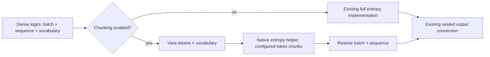

# MiMo r9: dense entropy token chunking

## Goal and boundary

The r8 32K dense FSDP path exhausted GPU memory while computing the full
vocabulary-sized `softmax(logits) * logits` temporary. The engine already exposes
an entropy chunking switch, but its dense output path ignores it. Honor that
switch without disabling entropy or changing the default path.

This is an explicit MiMo source overlay against the frozen r8 source. Do not
modify the VERL submodule, shared environment, frozen r8 source, or running jobs.
GPU memory and training acceptance remain a separate real-run gate.

## Contract and files

- `deployment/patches/verl/a9f2985-dense-entropy-chunking.patch`: a minimal dense
  branch change. Bind chunk size before invoking optional native checkpointing.
  Native chunking computes fp32 entropy, including for bf16 logits; retain this
  existing numerical contract and gradient flow.
- `deployment/patches/verl/mimo-dense-entropy-manifest.json`: exact gitlink,
  frozen r8 file hash, patched file hash, patch hash, and application contract.
  A mismatched input must fail; a matching patched file is already applied.
- `examples/mimo_dsh_rl/mimo-9b-budget-terminal.yaml`: explicitly opt in with
  `actor_rollout_ref.actor.fsdp_config.entropy_from_logits_with_chunking=true`
  and `entropy_from_logits_chunk_size=256`.
- `tests/uni_agent/deployment/test_mimo_dense_entropy.py`: invoke the real engine
  method in an independent CPU source snapshot; no model loading or GPU required.

## Verification

1. On the untouched r8 snapshot, tests must expose the missing chunk helper call.
2. Apply the patch to the isolated snapshot after checking the input hash.
3. Test fp32 and bf16 outputs and gradients against unchunked fp32 entropy;
   checkpointing on/off; uneven token lengths and chunks; no-grad old-log-prob
   computation; unchanged disabled behavior; entropy-disabled behavior.
4. Compose the actual recipe through the real launcher and OmegaConf conversion;
   assert the resulting native FSDP engine config has the intended two values.
5. Run focused CPU tests and Ruff remotely, record source/log hashes, and hand
   the exact overlay to the r9 preparer. Do not claim GPU OOM resolution before
   the parent performs real training acceptance.

## Verified CPU behavior (2026-09-29)

- Local upstream and the frozen r8 source both hash to
  `fb8ea0cb0eab38bb746fd386bdc6866b389cf7b5deee6ebf267d71b9cca51c04`.
  The patch produces
  `713666208d1caad05c440d0ddb49fe0e4eeeca5e33726e59c60fb708b75bdeef`.
- The initial direct production-path RED run had 15 failures and 6 passes:
  enabled dense entropy never called the configured helper, and the recipe did
  not enable chunking. The first patched direct run passed all 21 tests.
- The test suite now defaults to a hash-checked temporary copy of the real engine
  source. It uses `git apply`, loads the resulting real module with package-relative
  imports, and temporarily isolates import-time engine registrations. It never
  changes the installed module or gitlink. Starting from the original source,
  this mode passed all 21 tests and left its original source hash unchanged.
- `MIMO_DENSE_ENTROPY_DIRECT=1` selects the real imported engine instead, and
  fails unless its file hash equals the manifest's exact patched hash. This mode
  is the separate acceptance gate for a newly frozen run source.
- Native recipe composition is tested through `launch.compose_config`, conversion
  to the actual actor dataclass, and `actor.engine is actor.fsdp_config` with
  the values `true` and `256`. Entropy remains enabled when requested by VERL.

All runtime tests execute on the CPU host using the existing fixed Python lane,
`CUDA_VISIBLE_DEVICES=''`, fresh cache paths, and no package installation. The
existing isolated coverage tool is used without changing the lane. The early
`--cov` CLI attempt failed because pytest-cov is absent; it is not counted as a
validation run.

The default native checkpoint mode is retained. The no-grad old-log-prob path
no longer needs a full vocabulary-sized entropy intermediate, but chunked
entropy with gradients can retain multiple chunk graphs. CPU numerical and
source verification does not prove the later actor backward will fit GPU memory.
Actual GPU training, a nonzero effective update, saved checkpoint, and independent
resume remain the acceptance requirements.

Final direct-mode regression: **43 passed / 0 skipped** (21 entropy cases and 22
existing recipe cases). The patch's **9/9 added executable lines and 6/6 branch
outcomes** were covered; this is patch coverage, not whole upstream engine
coverage. Machine-readable source/test/evidence hashes and raw logs are in
`evidence/dense-entropy-20260929/validation.json` and its sibling files.
