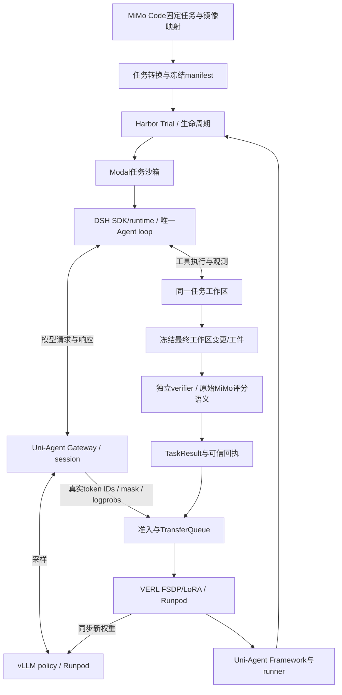

# MiMo RL 任务接入 DSH / Harbor / Modal：审计与设计

核查日期：2026-09-28。状态：用户已明确批准“开始真实推进”，进入实现与真实云端验收；尚未完成本方案新训练。

## 1. 结论与本轮决定

- 在当前训练主仓集成，复用 Uni-Agent / VERL / TransferQueue / Harbor / Modal；不整体搬迁 XiaomiMiMo 的 VERL fork。
- 用户最终选择 **DSH-first**：第一阶段只用 DSH 执行 harness；后续同一 policy 可加入 terminus-2 在线采样。中途提出的 terminus-first 建议已被此决定替代。
- 首个适配领域为 MiMo Code。成功标准先是公开任务、真实工具、可信评分、参数更新与恢复，然后才是留出任务收益。
- 这是“MiMo 公开任务在 DSH 云端栈上的迁移实验”；更换 harness/backend 后，不能宣称严格复现 MiMo 原实验分数。
- 不重跑已完成的 20K 编程 SFT，不把 OPD、多教师或五领域同时上线作为此集成的前置条件。

## 2. 工作现场与命名

仓库工作目录：`/Users/gumpm5/Documents/Code/xDAN-DSH-uni-agent/.Codex/worktrees/verl-uni-agent-harbor-opd-rl`。

用户要求保留目录，并将本地分支改成同名：`performance-9b` → `verl-uni-agent-harbor-opd-rl`。改名前后 HEAD 均为 `c51f6fc7dad24fd03fdc090741bc30d07488b574`，未移动目录或嵌套 worktree。

原同名分支在 `2a3f595`，为当前 HEAD 的祖先，落后 66 个提交且无 worktree 占用；已保留为 `archive/verl-uni-agent-harbor-opd-rl-20260928-2a3f595`。已fetch核实远端，并将upstream改为`origin/verl-uni-agent-harbor-opd-rl`；`@{upstream}`与`@{push}`均解析为该同名远端。当前本地比该远端领先66个既有提交（不计本轮文档提交），未推送；旧远端`performance-9b`保留。

历史文档保留 `docs/performance-9b/`；本轮新增交付放 `docs/verl-uni-agent-harbor-opd-rl/`，交接放同名 `tasks/` 子目录。现有未提交修改独立保留。

## 3. 当前项目完成了什么

| 层级 | 已核证据 | 边界 |
|---|---|---|
| Harbor / Modal / Gateway / TQ / VERL | `../performance-9b/pipe-r11/report.md`、同目录 `acceptance-acceptance.json`：20步训练、恢复到21步、验收 PASS；496/716 adapter 张量改变，760个 base 张量不变 | harness 为 terminus-2；训练/推理用 Runpod，Modal 是任务沙箱 |
| 后续 RL60 | `../performance-9b/checkpoint-full-eval/evidence-20260921/rl60-pair.json`：78题×4，base64.10%、RL60为46.15%，差−17.95pp | 工程成功不等于能力提升；历史对照呈退步 |
| 20K/64K 编程 SFT | 本目录 `sft-completion-audit.md`：10000连续步、20验证点、末次val/loss0.412975；256配对样本loss1.053641→0.457085 | 20K全为code，GPT5.6 15589 + Qwen3.8 4411；不是全能混合SFT，也不是MiMo任务RL |
| 观测/复建 | W&B 90020指标与本地对账；包版本已核对 | rl-insight未接正式SFT，冷重建未验；本轮未查询当前远端GPU运行状态 |
| DSH | 已有 DshHarborAgent、SDK runner、借用Harbor沙箱、专用worker/回执/Modal清理代码及历史原生DSH实验 | 未发现 MiMo + DSH + Modal 的新端到端验收 |

实跑主启动器 `examples/harbor_opd_rl/train_tb21_lora_smoke.sh` 使用 VERL V1、GRPO、FSDP/LoRA、vLLM、TQ；默认 `colocate_async`，不能扩写为 separate_async 分卡并行训练已验收。

本轮只读重核了 SFT 原始指标哈希、连续步数、有限数值和非零梯度，以及既存 pipe-r11 验收产物；没有重跑 GPU/Modal 训练。

## 4. 与另一个项目的关系

`xDAN-Train-Performance-Verl` 是 XiaomiMiMo/verl fork，HEAD `433076c0`，基线 `a2ad9f6160b03ff2d47e59832bfb6b289f37c917`。自有提交主要为格式修复与研究文档；其 handoff 明确未训练，三个子模块尚未初始化。

MiMo Code 使用的 XiaomiMiMo/uni-agent 也来自 verl-project/uni-agent。两套方案的共同点是实际框架血缘，而不只是图相似。

| 角色 | MiMo Code | 当前主仓 |
|---|---|---|
| policy rollout | SGLang | vLLM |
| 网关和轨迹 | uni-agent fork + TransferQueue | Uni-Agent + TransferQueue |
| harness | mimoagent，另有四harness混合recipe | 历史terminus-2；本方案DSH |
| 执行环境 | K8s task pod | Harbor管理Modal sandbox |
| 参数更新 | VERL / Megatron | VERL / FSDP / LoRA |

**确定的接口不兼容：** MiMo `recipes/code/mimoagent_runner.py:365–407` 访问 `session.reward_info_url`、POST奖励并返回None；本项目 `SessionHandle` 已移除该字段，`run_task` 返回 typed `TaskResult`，Framework统一挂接奖励。不能直接复制runner。两边VERL也分别为0.9.0.dev与本项目固定0.10.0.dev/a9f2985。

Code以外，MiMo Cyber/General/Visual使用VERL AgentLoop直接驱动mimoagent，Music有独立路径；Code架构图不能代表五域已同构。

## 5. MiMo 数据实查

数据仓库固定版本：`639865fd3374018d6cb29b9fb82dd531406fcf5f`。官方卡片声明 Apache-2.0，开放非gated。在线 viewer size 返回 partial=false、pending/failed为空；这是行数核查，不是全量可运行验收。

| 子集 | train行数 | 主要额外依赖 |
|---|---:|---|
| code | 2698 | 原始仓库镜像、隐藏测试patch、test_command |
| cyber | 1000 | 漏洞任务镜像和规则评分环境 |
| general | 989 | envs资产、业务工具/状态、rubric judge |
| webdev | 2093 | 浏览器渲染、视觉评分、分组奖励 |
| music | 1000 | ABC生成、转换与CPU评分 |
| 合计 | 7780 | 不是7780条教师回答或完整SFT轨迹 |

本轮检查 Code viewer 前2行，均为六个顶层字段：`data_source/ability/agent_name/prompt/reward_model/extra_info`。`extra_info.instance_json`含八字段：

`dataset_type, docker_image, cwd, instance_id, problem_statement, test_patch, test_command, verifier_timeout_sec`。

两例cwd分别为`/testbed`、`/workspace/repo`，验证超时1800秒。没有可直接用作oracle的solution字段；不能承诺每题自带已知正确解。

镜像必须通过固定版 `image-mapping.jsonl` 映射后解析digest，不能只给原tag加registry前缀。两个样本能找到映射，不代表2698行全部覆盖或镜像已实际拉取。

官方 verifier 已逐行阅读固定 MiMo-Agent `467f0a19016f0ac4d63b8d17a1f0da9ba07f232c` 的 `opensource_code.py`：捕获base ref；只重置test_patch涉及的路径；应用完整patch；执行原始test_command；exit0得1，其余任务失败得0。reset/apply失败带testbed错误分类，不能混成模型答错。隐藏测试仅在评分时注入；镜像须保持原始任务状态且不能泄露参考修复。

## 6. 目标架构：单一 DSH loop

Harbor负责任务环境及验证生命周期，DSH负责模型/工具交互循环，Modal是执行地点；三者不是互相替代的harness。不要让terminus-2包住DSH，也不在Harbor之外创建第二个任务沙箱。

DSH runner在任务容器内运行，因此它需要可达、绑定session的Gateway地址。历史terminus-2在GPU宿主运行且可用loopback；该网络配置不能直接复用到DSH容器。

当前DSH路线要求独立verifier。必须将最终代码/新增文件/删除/必要工件完整转移至原镜像对应的验证环境，再复现MiMo reset/apply/test过程；不能仅传文本答案或默认只传git diff。需要对比原地评分与独立评分的一致性。需要服务、非文件状态或多容器的任务先标记不支持，不能静默改变评分。

## 7. 可复用实现和必须补齐的契约

| 现有实现 | 复用内容 | 缺口 |
|---|---|---|
| `uni_agent/agents/dsh/harbor_agent.py` | DshHarborAgent→DshAgent；无新增loop | 显式gateway_base_url；固定profile/patch，不支持随意MCP/skills注入 |
| `uni_agent/agents/dsh/runner.py` | DeepSeekHarness.run、trace/result | 用已有固定release，不能把最新版SDK视为已验收 |
| `uni_agent/sandbox/harbor.py` | BorrowedHarborSandbox借用exec/file | 保持Harbor资源所有权 |
| `uni_agent/tasks/harbor_dsh/worker.py` | ledger、session级endpoint、可信回执 | 当前固定task_dir且单job；需任务registry与有界worker调度 |
| `uni_agent/tasks/harbor_dsh/environment_backend.py` | Modal网络/镜像/独立verifier/清理合同 | 当前任务release单镜像绑定；MiMo每任务镜像需独立固定和验收 |
| `uni_agent/tasks/harbor_dsh/executor.py` | 真实Trial和verifier执行 | 当前/app及冻结任务策略需推广至manifest声明cwd/工件合同 |
| `uni_agent/tasks/harbor_dsh/registration.py` | 轨迹证据验证 | 当前固定task_ref/instruction，需逐任务可信注册 |
| `uni_agent/framework/framework.py` | runner registry、group采样、typed结果与TQ | 混合harness时需逐lane审计分发；不重写trainer/loss |

通用HarborTask只将模型endpoint放进进程环境；DshHarborAgent要求显式参数且禁止环境回退。把配置里的`name`从terminus-2换为DSH不构成接通。优先推广已经正确传递session路由的harbor_dsh路径。

### 任务与训练合同（拟新增，非现有API声明）

- `TaskManifest`：source_repo、source_revision、source_row_hash、task_id、task_revision、task_digest、cwd、original_image、resolved_image_digest、dsh_derived_image_digest、verifier_revision、test_patch_sha256、test_command、timeout、artifact_contract、split。运行前由可信executor冻结base_ref/base tree、测试patch原始字节及路径集合、snapshot digest；不得在学生执行后重新读取HEAD当成原始base。
- `HarnessSpec`：harness_id、harness_revision、runtime_digest、profile、tools_digest、prompt_template_digest、context_policy、budget_contract。首轮只有DSH；system prompt、工具和上下文规则全部冻结。预算分别记录单次max_tokens、episode累计生成、context总序列、max_turns、wallclock；现executor的max_tokens对应per-turn，不得误称累计上限。
- `RolloutIdentity`：task_id + harness_id/revision + budget_contract + verifier_revision + group_uid + gateway_session_id + policy_version。group_uid不能只使用题目ID。
- 保持现有 `TaskResult(reward, finished, verifier_reward, reward_info)`；reward_info只放有界严格JSON和证据引用。infra/评分故障独立分类，不能伪造成合法reward0。
- token IDs、response_mask、行为logprob、policy版本来自真实Gateway采样；工具观测不当模型动作监督。不得从DSH文本日志重新tokenize冒充原采样证据。
- 原始test_patch及其他隐藏评分资产不进入模型题面或训练前可读工作区。
- 预算耗尽与infra错误分开。现strict DSH lane只准入completed；第一阶段保留该门，显式记录截断和拒绝组、全部尝试的评估分母。若后续允许截断后评分/训练，独立设计版本化终止合同，不静默丢弃或伪装completed。

### 拟修改文件清单

| 路径 | 计划改动 |
|---|---|
| 新增 `examples/mimo_dsh_rl/prepare_tasks.py` | 固定源→严格解析→镜像映射→Harbor任务/manifest；拒绝缺失或冲突 |
| 新增 `examples/mimo_dsh_rl/` 配置和README | 单题、小批、一步更新、reload、固定holdout入口；初期GRPO-only |
| 新增 `uni_agent/tasks/harbor_dsh/task_registry.py` | 可信task identity→路径/镜像/cwd/预算，禁止请求任意覆盖 |
| 修改 `harbor_dsh/worker.py`、`protocol.py`、`executor.py` | 首个纵向切片保留单任务固定worker/policy，增加显式MiMo执行/工件策略；单题真实通过后再注册任务和有界并发 |
| 修改 `harbor_dsh/registration.py`、必要时`task.py` | task/session/verifier/轨迹逐条绑定与准入 |
| 修改 `harbor_dsh/environment_backend.py`、`isolated_trial.py` | 原始任务镜像＋DSH派生镜像身份，cwd及独立验证工件合同 |
| 新增 `deployment/harbor/mimo/` | 每任务原始镜像派生DSH runtime的可复建定义；不覆盖上游依赖 |
| 新增 `tests/uni_agent/tasks/harbor_dsh/test_mimo_*.py` | 任务映射、评分等价、证据/路由、隔离、group合同回归 |

不修改DSH内部能力逻辑；确需新增runtime工具/记忆行为时在DSH本体仓库实现，本仓仅固定release并验证兼容。实施前还须读取LLM模型层API-REFERENCE，并复核现有SDK/端点实际字段。

## 8. 后续 DSH + terminus-2 同模型训练

框架已按`sample_fields.agent_name`选runner，同一uid的n条rollout沿用同一sample_fields，可支持多harness。

- 同一policy共享参数；分别由DSH和terminus-2在独立环境/session执行，不在单个episode内同时运行两个loop。
- 每个GRPO group固定同一任务、harness、verifier及预算；跨groups/batches混合更新。跨harness的绝对奖励不直接当同组advantage。
- 使用注册manifest选择runner及相应轨迹验证器，不关闭DSH证据验证来容纳其他harness。
- 混合比例是实验变量，按有效groups、动作token和成本一起报告；不未经实验直接承诺50/50最优。
- terminus-2是一种harness，不是一种数据集。旧静态轨迹若复用，应走明确SFT/offline用途，不能冒充当前policy的在线GRPO rollout。
- 留出集按任务/仓库/近重复组在harness扩展前划分，同一题不能DSH进train、terminus-2进test。

## 9. 阶段与测试计划

| 阶段 | 交付 | 通过门槛 |
|---|---|---|
| M0 资产冻结 | 全部Code行结构/重复/镜像映射覆盖率、任务依赖和数据split | 报真实覆盖与拒绝原因；任务镜像可拉取、原始资产有hash；未验资产不能标ready |
| M1 单题DSH/Modal | 一个已校准Code任务、DSH动作、Gateway轨迹、独立评分 | 原始与迁移verifier对同一产物一致；已知错误解失败；可得正确解时正例通过；无解则保留校准缺口 |
| M2 小池闭环 | 4–8个可用任务，n=4的初始受限采样，1–2个optimizer steps | infra单独统计；有效完整组、非零有限梯度、实际权重差异、保存/独立reload/续训成功；全同reward不冒称学会 |
| M3 能力验收 | 同起点、同DSH、同预算的训练前后配对留出评估 | 逐题结果及不确定性，检查通用/工具能力回退；无提升如实报告 |
| M4 多harness | 加terminus-2 runner/审计分发 | DSH-only vs DSH+terminus两个训练条件，分别在两harness评测，区分harness收益与权重收益 |
| M5 扩领域 | General→Webdev等按需求推进 | 每域独立环境、工具、judge与reward合同；不能将Code成功外推五域 |

CPU回归重点：JSON/八字段缺失；cwd差异；镜像映射冲突；任务注册越界；终止清理；session/reward错绑；test_patch失败与合法测试失败区分；工件新增/删除/权限保真；同group同harness；无跨harness数据泄漏。

集成验收重点：真实Modal容器调用Gateway、完整工具交互、trusted reward/原始token轨迹匹配、TQ被trainer消费、更新后下一轮使用新policy版本。低成本fixture可以验证转换器，但不能代替真实MiMo任务验收。

建议首轮模型为固定revision的`XiaomiMiMo/MiMo-V2.6-Distill-Qwen-9B`以贴近公开起点；现有本地SFT产物可作为后续独立实验起点，不能混成同一baseline。此处为建议，不表示已下载/部署该模型用于本方案。

硬件、窗口和采样预算先以现场GPU和单题长度测量确定。MiMo官方Code默认8×8 GPU、N16、262144窗口是参考配置，不是已验证最低要求；缩配打通不能称同等规模复现。保留当前验证过的vLLM/FSDP路径，首轮不切SGLang/Megatron。

## 10. 审慎挑战与开放边界

1. 目标若是让DSH更会做真实工作，DSH-first有部署一致性；代价是先推广已有单任务接口和环境镜像。这个代价是真实工程工作，不能说只换数据路径。
2. 目标若变成复刻论文原数字，应另开保真对照：固定原始SFT、mimoagent、算法/预算/评测口径。当前DSH路线不承担这项未经证明的承诺。
3. 固定harness下训练模型，不等于训练或自动改进DSH程序本体。记忆/压缩策略学习与RSI应有专门动作、任务、奖励及隔离协议，不能仅因接上DSH就称已学会。
4. 已有历史训练退步，必须先固定可校准奖励与留出评估，再扩训练量。工具格式一致性和长任务动作token覆盖比堆步数更优先。
5. RL-oss不是完整蒸馏数据；公开任务可迁移，不代表能重建完整SFT阶段或所有内部benchmark。

## 11. 来源与核查范围

- [MiMo RL官方数据卡](https://huggingface.co/datasets/XiaomiMiMo/MiMo-V2.6-RL-oss/tree/639865fd3374018d6cb29b9fb82dd531406fcf5f)
- [HF viewer size API](https://datasets-server.huggingface.co/size?dataset=XiaomiMiMo%2FMiMo-V2.6-RL-oss)：在线读取，未绑定revision的viewer响应与固定源分开记录。
- [固定MiMo Code verifier源码](https://github.com/XiaomiMiMo/MiMo-Agent/blob/467f0a19016f0ac4d63b8d17a1f0da9ba07f232c/src/mimoagent/environments/datasets/opensource_code.py)
- [MiMo VERL固定基线](https://github.com/XiaomiMiMo/verl/tree/a2ad9f6160b03ff2d47e59832bfb6b289f37c917)
- [VERL官方扩展说明](https://github.com/verl-project/verl/blob/main/docs/extend_guide.rst)：Context7核查AgentLoop/Manager及TransferQueue合同；具体本地ABI以固定源码为准。
- 本轮证据摘要：`mimo-dsh-integration-evidence.json`。未下载全套任务资产或镜像，未做新GPU训练；2行样本核查不等于全量质量结论。
- 用户给定页面：`/Users/gumpm5/Documents/Code/xDAN-Train-Performance-Verl/docs/feat-project-bootstrap/index.html`。它是研究与实施路线文档，不是已完成训练的验收记录。
